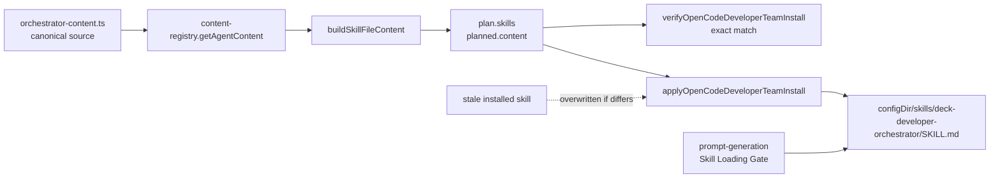

# Design: Sincronizar skills OpenCode desde el instalador

## Source

- Proposal: `installer-sync-opencode-skills` proposal artifact
- Capabilities affected: `opencode-developer-team-install`, `opencode-skill-sync-validation`
- Spec status: not yet available (Spec corre en paralelo)

## Current Architecture Context

- Fuente core:
  - `packages/core/src/teams/developer/orchestrator-content.ts` declara explícitamente que es la fuente canónica del contenido del orquestador.
  - Expone `ORCHESTRATOR_SYSTEM_PROMPT`, variantes por personalidad, `ORCHESTRATOR_AGENT_BODY` y `ORCHESTRATOR_SKILL_BODY`.
  - `packages/core/src/teams/developer/content-registry.ts` compone contenido real por agente en `REAL_CONTENT`; para `deck-developer-orchestrator`, agrega `VISUAL_EXPLANATIONS_SKILL_FRAGMENT`, invariants y `Context Authority` vía `getAgentContent()`.
- Catálogo:
  - `packages/core/src/teams/developer/catalog.ts` define `DEVELOPER_TEAM_AGENTS`, con `id` y `skillId` iguales para `deck-developer-orchestrator`.
- Instalador OpenCode:
  - `packages/adapter-opencode/src/developer-team-install.ts` construye `plan.skills[]` con `buildSkillFileContent(agent, ...)`, que obtiene `content.skillBody` desde `getAgentContent()` y genera frontmatter OpenCode.
  - `applyOpenCodeDeveloperTeamInstall()` escribe `plan.skills` en `${configDir}/skills/${skillId}/SKILL.md`; si existe y difiere, sobrescribe y reporta `status: "updated"`.
  - También escribe prompts en `${configDir}/prompts/deck-developer/${agent.id}.md` desde `buildPromptGenerationPlan()`.
  - `verifyOpenCodeDeveloperTeamInstall()` hoy valida existencia, frontmatter, heading e invariants del skill, pero no exige igualdad exacta con `planned.content`.
- Prompt OpenCode:
  - `packages/adapter-opencode/src/prompt-generation.ts` genera prompts con Skill Loading Gate apuntando al `SKILL.md` instalado.
- Estado instalado/local:
  - `.opencode/skills/deck-developer-orchestrator/SKILL.md` y `~/.config/opencode/skills/...` son artefactos materializados/managed output, no la fuente lógica del contenido.

## Proposed Architecture

Usar una única cadena canónica: `orchestrator-content.ts` → `content-registry.getAgentContent()` → `buildSkillFileContent()` → `plan.skills[]` → `applyOpenCodeDeveloperTeamInstall()` → `~/.config/opencode/skills/.../SKILL.md`.

Decisiones:

- **Fuente de verdad**: `packages/core/src/teams/developer/orchestrator-content.ts`, consumida por `content-registry.ts` y materializada por el instalador.
- **No fuente de verdad**:
  - `.opencode/skills/.../SKILL.md`: salida instalada/local para este repo; puede servir como fixture/smoke reference, pero no debe alimentar el instalador.
  - `~/.config/opencode/...`: estado de usuario; siempre derivado y sobrescribible para skills administrados por Deck.
  - Bundle generado/package artifact: transporta el código compilado, pero el contrato de contenido sigue siendo el registry core.
- **Sincronización determinística**:
  - El plan debe contener el contenido completo esperado del skill.
  - Apply debe sobrescribir cualquier archivo instalado cuyo contenido difiera byte-a-byte de `planned.content`.
  - Verify debe fallar si el archivo instalado no es exactamente igual a `planned.content`, además de checks estructurales existentes.
- **Drift prompt/skill**:
  - El prompt debe seguir apuntando al path del skill instalado.
  - Los tests deben validar que el prompt del orquestador referencia el mismo `absolutePath` que `plan.skills` para `deck-developer-orchestrator`, y que el skill instalado coincide con `planned.content`.

### Component / Module Boundaries

| Component | Responsibility | Change Type |
|---|---|---|
| `packages/core/src/teams/developer/orchestrator-content.ts` | Contenido canónico del orquestador | unchanged |
| `packages/core/src/teams/developer/content-registry.ts` | Composición runner-neutral de agent/skill content | unchanged |
| `packages/adapter-opencode/src/developer-team-install.ts` | Plan/apply/verify de instalación OpenCode | modified |
| `packages/adapter-opencode/src/prompt-generation.ts` | Prompt + Skill Loading Gate con path del skill | unchanged or minor validation-only |
| `packages/adapter-opencode/src/developer-team-install.test.ts` | Tests de plan/apply/verify/idempotencia/drift | modified |
| `packages/adapter-opencode/src/prompt-generation.test.ts` | Tests del vínculo prompt → skill path | modified if coverage not already sufficient |

### Data Flow

1. `DEVELOPER_TEAM_AGENTS` selecciona `deck-developer-orchestrator`.
2. `buildOpenCodeDeveloperTeamInstallPlan(projectRoot, { configDir, ... })` resuelve personalidad/memory/capability instructions.
3. `buildSkillFileContent()` llama `getAgentContent(agent.id, ...)`.
4. `content-registry.ts` compone `ORCHESTRATOR_SKILL_BODY` + fragmentos + invariants + authority/capability/memory layers.
5. El plan produce:
   - `skills/deck-developer-orchestrator/SKILL.md` con `content = planned.content`.
   - `prompts/deck-developer/deck-developer-orchestrator.md` con Skill Loading Gate que apunta al mismo path.
6. `applyOpenCodeDeveloperTeamInstall()` compara archivo instalado contra `planned.content`:
   - inexistente → `created`
   - igual → `unchanged`
   - distinto/stale → overwrite + `updated`
7. `verifyOpenCodeDeveloperTeamInstall()` lee el archivo instalado y exige equivalencia exacta con `planned.content`.

### API / Contract Implications

| Endpoint / Interface | Change | Backward Compatible |
|---|---|---|
| `buildOpenCodeDeveloperTeamInstallPlan()` | Mantiene contrato; `plan.skills[].content` queda declarado como canonical expected output | yes |
| `applyOpenCodeDeveloperTeamInstall()` | Mantiene contrato; debe conservar `updated` para stale skill y `unchanged` en segunda ejecución | yes |
| `verifyOpenCodeDeveloperTeamInstall()` | Endurece validación: mismatch exacto con `planned.content` invalida instalación | yes, stricter validation |
| OpenCode installed files | `deck-developer-*` bajo `skills/` son managed output sobrescribible | partial; personalizaciones locales se pierden |

### State / Persistence Implications

No hay DB ni estado persistente nuevo. Cambian archivos generados bajo `configDir` de OpenCode. El estado stale existente se corrige al re-ejecutar el instalador.

### Migration / Backward Compatibility

- Migración runtime: re-ejecutar el instalador OpenCode.
- Skills stale ya instalados: sobrescritura determinística si difieren de `planned.content`.
- Personalizaciones locales en `~/.config/opencode/skills/deck-developer-*` no son preservadas; se consideran managed output.
- No requiere feature flag.
- Rollback: revertir cambios de instalador/tests y re-ejecutar instalador anterior si se desea comportamiento previo.

## File Impact Estimate

| File / Path | Action | Rationale |
|---|---|---|
| `packages/adapter-opencode/src/developer-team-install.ts` | modify | Endurecer verify exact-match; confirmar/ajustar overwrite determinístico y status `updated` para stale skill |
| `packages/adapter-opencode/src/developer-team-install.test.ts` | modify | Añadir cobertura stale overwrite, exact-match verify, idempotencia byte-a-byte y drift prompt/skill/source |
| `packages/adapter-opencode/src/prompt-generation.test.ts` | modify | Validar Skill Loading Gate/path contra skill plan si no queda cubierto en install tests |
| `packages/core/src/teams/developer/orchestrator-content.test.ts` | modify optional | Añadir/ajustar smoke de invariants críticos si Task lo ve necesario; evitar duplicar exact text frágil |
| `.opencode/skills/deck-developer-orchestrator/SKILL.md` | unchanged | No usar como fuente; salida local managed por instalación/config, no artefacto a editar en esta fase |

## Testing Strategy

- Unit/installer tests (`developer-team-install.test.ts`):
  - `plan.skills` para orquestador contiene contenido esperado desde core registry (`SDD Workflow`, invariants críticos, `Visual Explanations`).
  - Aplicar instalación, corromper/stalear `SKILL.md`, re-aplicar: archivo queda igual a `planned.content`, resultado `updated`, verify pasa.
  - Segunda aplicación sin cambios: `changedCount === 0` y file status `unchanged`.
  - `verifyOpenCodeDeveloperTeamInstall()` falla si el skill instalado difiere de `planned.content` aunque conserve frontmatter/heading.
- Drift tests:
  - Prompt del orquestador contiene Skill Loading Gate con path exacto del `planned.absolutePath` del skill.
  - Skill instalado == `planned.content`; prompt instalado == `plannedPrompt.content`.
  - Evitar snapshots largos; preferir igualdad completa contra plan generado + fragmentos críticos para fuente core.
- Regression command target probable:
  - `bun test packages/adapter-opencode/src/developer-team-install.test.ts packages/adapter-opencode/src/prompt-generation.test.ts`
  - Si cambia contenido core: `bun test packages/core/src/teams/developer/orchestrator-content.test.ts`

## Observability / Error Handling

- Reusar `OpenCodeBundleApplyResult.status` (`created|updated|unchanged`) como evidencia de stale correction.
- Verify debe emitir issue explícito tipo `Content mismatch for skill deck-developer-orchestrator; installed file differs from planned content.`
- No logging adicional requerido salvo errores existentes de config merge.

## Security / Performance / Accessibility Considerations

- Security: preservar validación de `standaloneSkills.skillId` contra path traversal; no introducir lectura desde paths instalados como fuente.
- Performance: comparación byte-a-byte de archivos pequeños; impacto despreciable.
- Accessibility: no aplica.

## Tradeoffs

| Decision | Chosen | Rejected Alternative | Rationale |
|---|---|---|---|
| Fuente canónica | `orchestrator-content.ts` vía `content-registry.getAgentContent()` | Copiar desde `.opencode/skills/.../SKILL.md` | Core ya declara la fuente canónica y compone invariants/capability/memory de forma runner-neutral; copiar `.opencode` puede perpetuar drift local. |
| Validación drift | Igualdad exacta instalado vs `planned.content` + checks estructurales | Solo fragments/heading/invariants | Los fragments detectan presencia parcial, pero permiten contenido stale con campos críticos obsoletos. |
| Corrección stale | Overwrite determinístico de managed skills | Preservar personalizaciones locales | La reproducibilidad del instalador es el objetivo; personalizaciones en managed output contradicen convergencia. |
| Tests | Plan-generated equality + fragmentos críticos | Snapshot monolítico del skill | Reduce fragilidad por cambios legítimos y aun detecta drift real de instalación. |
| Alcance | OpenCode installer only | Refactor multi-runner/Pi | Proposal limita otros runners salvo helpers seguros; reduce riesgo colateral. |

## Risks

| Risk | Likelihood | Impact | Mitigation |
|---|---|---|---|
| Sobrescribir personalizaciones locales bajo `~/.config/opencode/skills/deck-developer-*` | Medium | Medium | Documentar/validar que son managed output; limitar overwrite a skills del catálogo Deck. |
| Tests exact-match demasiado sensibles a composición memory/capability/personality | Medium | Medium | Construir expected desde el mismo plan/opciones usadas por apply/verify; no hardcodear cuerpo completo. |
| Falso positivo si line endings/trim cambian entre plan y write | Low | Medium | Comparar strings generados/escritos por el mismo runtime; no normalizar silenciosamente salvo decisión explícita. |
| Drift origin real está en una ruta de instalación distinta al helper investigado | Medium | High | Cubrir entrypoints `runner-adapter`/`runner-capabilities` con tests existentes o añadir prueba que use el plan público de adapter. |
| Cambiar verify rompe instalaciones antiguas hasta re-apply | Low | Low | Mensaje de verify debe indicar re-ejecutar installer; apply converge. |

## Open Decisions

- ¿Debe el resultado de apply distinguir `updated stale skill` de `updated` genérico? Diseño recomienda mantener `updated` para compatibilidad y validar por test; solo cambiar si Spec exige mensaje explícito.

## Dependencies

- Cambio archivado `strengthen-triage-before-modification` como contexto de drift observado.
- Tests existentes de adapter OpenCode y core developer content.

## Next Steps

Ready for Task (`deck-developer-task`) to break this design into implementation tasks, combined with Spec.

## Mermaid Summary Source

