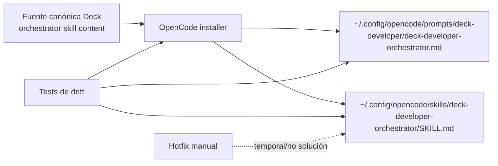

# Proposal: Sincronizar skills OpenCode desde el instalador

## Intent

El flujo de instalación OpenCode puede dejar desincronizados el prompt global y el skill global del orquestador. Tras `strengthen-triage-before-modification`, el prompt instalado en `~/.config/opencode/prompts/deck-developer/deck-developer-orchestrator.md` quedó actualizado, pero `~/.config/opencode/skills/deck-developer-orchestrator/SKILL.md` siguió stale. Hubo un hotfix manual, pero la solución correcta debe ser reproducible: Deck debe instalar/actualizar el skill desde su fuente controlada.

## Goal

Que re-ejecutar el instalador OpenCode de Deck produzca prompt y skill del orquestador correctos y sincronizados, sin editar manualmente `~/.config/opencode`.

## Scope

### In Scope
- Corregir el plan/aplicación de instalación OpenCode para copiar o generar `skills/deck-developer-orchestrator/SKILL.md` desde la fuente vigente.
- Detectar y sobrescribir contenido instalado stale cuando el contenido fuente cambie.
- Añadir/ajustar tests para prevenir drift entre prompt, skill generado/instalado y contenido fuente del orquestador.
- Tratar el hotfix manual como estado temporal: el instalador debe converger al contenido correcto al re-ejecutarse.

### Out of Scope
- Ediciones manuales directas como solución en `~/.config/opencode`.
- Cambios funcionales al comportamiento de INV-004 o al contenido del orquestador fuera de lo necesario para sincronización.
- Cambios equivalentes para otros runners salvo que compartan helpers y Design lo considere seguro.
- Ejecutar fases posteriores o implementar código en esta fase.

## Affected Capabilities

### New Capabilities
- *(ninguna)*

### Modified Capabilities
- `opencode-developer-team-install`: debe instalar/actualizar skills globales del Developer Team, incluido el orquestador, de forma reproducible e idempotente.
- `opencode-skill-sync-validation`: debe cubrir drift prompt/skill/fuente mediante tests.

### Unchanged Capabilities
- `orchestrator-triage-gate`: su contenido vigente se conserva; cambia cómo se instala/sincroniza.
- `opencode-prompt-generation`: sigue generando prompts bajo `prompts/deck-developer/`, pero debe quedar validado contra el skill referenciado.

## Approach

- Revisar el flujo de `packages/adapter-opencode/src/developer-team-install.ts`, `runner-adapter.ts`, `runner-capabilities.ts` y tests relacionados para ubicar dónde el prompt se actualiza pero el skill puede quedar stale.
- Hacer que el instalador escriba el `SKILL.md` global del orquestador desde la fuente canónica usada por Deck, no desde estado instalado previo ni hotfix manual.
- Asegurar idempotencia: segunda ejecución no cambia archivos si la fuente no cambió; una ejecución posterior sí actualiza contenido stale.
- Añadir tests focalizados que fallen si el prompt referencia un skill cuyo contenido instalado no coincide con la fuente esperada.

## Alternatives and Tradeoffs

| Alternative | Why Considered | Why Not Chosen |
|---|---|---|
| Mantener hotfix manual en `~/.config/opencode` | Rápido para desbloquear una máquina | No es reproducible, se pierde en reinstalaciones y contradice la restricción del usuario. |
| Solo documentar que se debe re-copiar el skill | Bajo costo | Depende de pasos humanos y no previene drift. |
| Validar drift sin cambiar instalador | Detecta el problema | No corrige la fuente del problema; el instalador seguiría produciendo estado stale. |

## Risks

| Risk | Likelihood | Mitigation |
|---|---|---|
| Sobrescribir personalizaciones locales del skill instalado | Medium | Limitar a skills administrados por Deck; documentar que `deck-developer-*` bajo config global es managed output. |
| Tests acoplados a texto exacto demasiado frágiles | Medium | Verificar equivalencia/fragmentos críticos o hash de contenido generado según recomiende Design. |
| Duplicar lógica entre prompt generation e install plan | Medium | Reusar helpers existentes o definir una fuente canónica única. |
| Afectar otros skills/runners por helpers compartidos | Low | Mantener alcance en OpenCode y cubrir regresión con tests existentes. |

## Rollback Plan

Revertir los cambios del instalador y tests vinculados a:
- `packages/adapter-opencode/src/developer-team-install.ts`
- `packages/adapter-opencode/src/runner-adapter.ts`
- `packages/adapter-opencode/src/runner-capabilities.ts`
- tests OpenCode relacionados

Luego re-ejecutar el instalador anterior si se necesita restaurar comportamiento previo. No hay migraciones ni estado persistente fuera de archivos generados en `~/.config/opencode`.

## Dependencies

- Fuente canónica actual del contenido del orquestador en `packages/core/src/teams/developer/orchestrator-content.ts` y/o `.opencode/skills/deck-developer-orchestrator/SKILL.md`.
- Cambio archivado `strengthen-triage-before-modification` como contexto de drift observado.

## Open Questions

- ¿Cuál debe ser la fuente canónica final del `SKILL.md` del orquestador: generación desde `orchestrator-content.ts`, copia de `.opencode/skills/deck-developer-orchestrator/SKILL.md`, o una consolidación explícita?
- ¿El instalador debe reportar explícitamente “updated stale skill” o basta con escritura idempotente y tests?

## Acceptance Direction

- [ ] Re-ejecutar el instalador OpenCode actualiza `~/.config/opencode/skills/deck-developer-orchestrator/SKILL.md` al contenido fuente vigente.
- [ ] Un skill instalado stale queda corregido sin edición manual.
- [ ] Los tests fallan si prompt y skill del orquestador vuelven a driftar.
- [ ] No se requiere parchear directamente archivos globales de OpenCode como solución.

## Next Steps

Ready for Spec (`deck-developer-spec`) and Design (`deck-developer-design`) in parallel.

## Mermaid Summary Source

