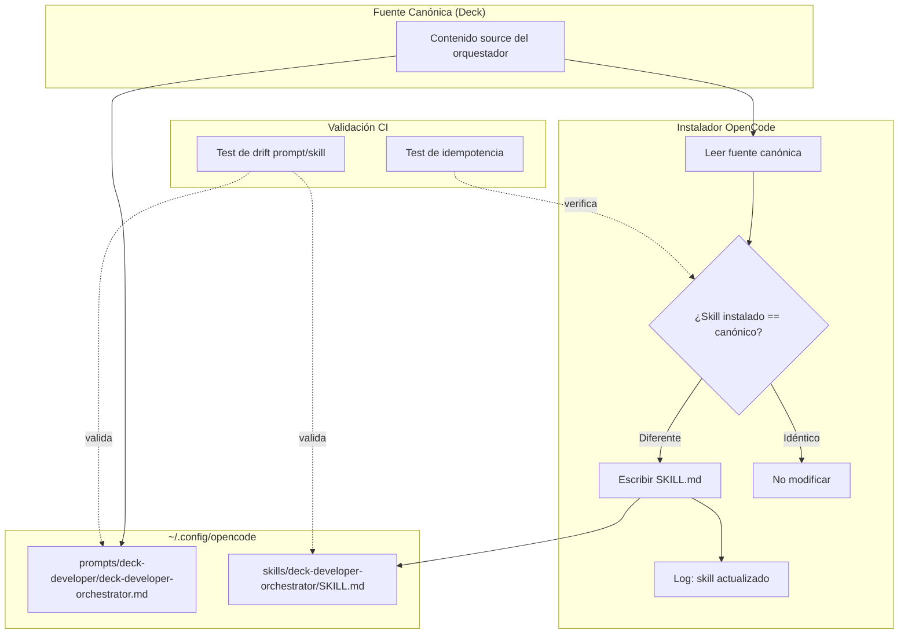

# Spec: Sincronizar skills OpenCode desde el instalador

## Source

- Proposal: `installer-sync-opencode-skills` proposal artifact
- Capabilities affected: `opencode-developer-team-install` (modified), `opencode-skill-sync-validation` (modified)

## Non-Goals / Out of Scope

- Ediciones manuales directas en `~/.config/opencode` como mecanismo de corrección.
- Cambios funcionales al comportamiento del orquestador o a INV-004.
- Aplicar el mismo mecanismo de sincronización a otros runners (salvo helpers compartidos que Design considere seguro).
- Ejecutar fases posteriores o implementar código en esta fase.
- Gestionar personalizaciones locales del usuario en skills `deck-developer-*`: estos son managed output y el instalador MAY sobrescribirlos.

---

## Requirements

### Capability: `opencode-developer-team-install`

**REQ-INST-001**: El instalador OpenCode de Deck MUST escribir el archivo `SKILL.md` del orquestador (`skills/deck-developer-orchestrator/SKILL.md` bajo el config global de OpenCode) desde una fuente canónica única controlada por Deck.
- Priority: MUST
- Surface: Integration
- Rationale: El prompt ya se genera desde fuente; el skill debe provenir de la misma fuente canónica para evitar drift.

**REQ-INST-002**: Re-ejecutar el instalador MUST sobrescribir un skill instalado stale cuando el contenido canónico difiera del contenido instalado.
- Priority: MUST
- Surface: Integration
- Rationale: El instalador debe converger al estado correcto sin intervención manual. El hotfix manual actual es estado temporal.

**REQ-INST-003**: Re-ejecutar el instalador MUST NOT modificar archivos de skill cuyo contenido instalado ya sea idéntico al contenido canónico (idempotencia).
- Priority: MUST
- Surface: Integration
- Rationale: Escrituras innecesarias generan ruido, invalidan caches y pueden romper observabilidad.

**REQ-INST-004**: El instalador MUST instalar todos los skills globales del Developer Team desde fuente canónica, no solo el orquestador.
- Priority: MUST
- Surface: Integration
- Rationale: El problema de drift no es exclusivo del orquestador; cualquier skill `deck-developer-*` puede quedar stale.

**REQ-INST-005**: El instalador SHOULD registrar en stdout/log cuando actualiza un skill stale (diff de contenido detectado y corregido).
- Priority: SHOULD
- Surface: UI
- Rationale: Facilita auditoría y debugging; no bloqueante para la corrección.

**REQ-INST-006**: Los archivos generados bajo `~/.config/opencode/skills/deck-developer-*` SHOULD ser tratados como managed output documentado; el instalador MAY sobrescribir personalizaciones locales.
- Priority: SHOULD
- Surface: General
- Rationale: Evita confusión sobre ownership. Se documenta que estos archivos son propiedad del instalador.

### Capability: `opencode-skill-sync-validation`

**REQ-VAL-001**: Debe existir al menos un test automatizado que falle si el prompt generado del orquestador y el skill instalado del orquestador referencian contenido inconsistente (drift).
- Priority: MUST
- Surface: General
- Rationale: El drift ya ocurrió una vez (`strengthen-triage-before-modification`); sin test, puede repetirse.

**REQ-VAL-002**: Los tests de drift MUST ejecutarse como parte de la suite de CI normal (no requieren setup especial ni acceso a `~/.config/opencode`).
- Priority: MUST
- Surface: Integration
- Rationale: Tests que no corren en CI no previenen regresiones.

**REQ-VAL-003**: Los tests de drift SHOULD validar equivalencia semántica (fragmentos críticos o estructura) antes que coincidencia textual exacta, para evitar fragilidad.
- Priority: SHOULD
- Surface: General
- Rationale: Tests acoplados a texto exacto generan falsos positivos ante cambios cosméticos.

**REQ-VAL-004**: Los tests MUST cubrir al menos el caso de skill stale (contenido instalado != fuente canónica) y el caso de skill sincronizado (contenido instalado == fuente canónica).
- Priority: MUST
- Surface: General
- Rationale: Ambos caminos deben estar cubiertos para garantizar idempotencia y corrección.

---

## Acceptance Scenarios

### Capability: `opencode-developer-team-install`

#### Scenario: Fresh install escribe skill desde fuente canónica
**Given** un entorno sin skill del orquestador instalado en `~/.config/opencode/skills/deck-developer-orchestrator/`
**When** se ejecuta el instalador OpenCode de Deck
**Then** el archivo `SKILL.md` se crea con contenido idéntico al de la fuente canónica de Deck
> Covers: REQ-INST-001, REQ-INST-004

#### Scenario: Re-run con skill stale lo sobrescribe
**Given** un skill del orquestador instalado con contenido diferente al canónico (stale)
**When** se ejecuta el instalador OpenCode de Deck
**Then** el archivo `SKILL.md` se sobrescribe con el contenido canónico vigente
> Covers: REQ-INST-002

#### Scenario: Re-run con skill idéntico no modifica archivos (idempotencia)
**Given** un skill del orquestador instalado con contenido idéntico al canónico
**When** se ejecuta el instalador OpenCode de Deck
**Then** el archivo `SKILL.md` no se modifica (mtime y contenido permanecen iguales)
> Covers: REQ-INST-003

#### Scenario: Hotfix manual queda sobrescrito por instalador
**Given** un skill del orquestador modificado manualmente en `~/.config/opencode` (hotfix)
**And** el contenido manual difiere del canónico
**When** se ejecuta el instalador OpenCode de Deck
**Then** el skill se actualiza al contenido canónico, eliminando la dependencia del hotfix
> Covers: REQ-INST-002

#### Scenario: Todos los skills deck-developer-* se sincronizan
**Given** múltiples skills `deck-developer-*` instalados, algunos stale y otros correctos
**When** se ejecuta el instalador OpenCode de Deck
**Then** todos los skills stale se actualizan al contenido canónico
**And** los skills correctos permanecen sin cambios
> Covers: REQ-INST-004, REQ-INST-003

#### Scenario: Instalador reporta actualización de skill stale
**Given** un skill del orquestador instalado stale
**When** se ejecuta el instalador OpenCode de Deck
**Then** la salida del instalador incluye un mensaje indicando que el skill fue actualizado
> Covers: REQ-INST-005

#### Variants
- **Variant: Skill no existe en fuente canónica**
  - Given un skill `deck-developer-X` referenciado en el plan de instalación
  - And no existe fuente canónica para ese skill
  - When se ejecuta el instalador
  - Then el instalador MUST reportar error y no crear un skill vacío
  > Covers: REQ-INST-001

### Capability: `opencode-skill-sync-validation`

#### Scenario: Test detecta drift entre prompt y skill
**Given** el prompt generado del orquestador y el skill instalado del orquestador
**When** el contenido del prompt referencia comportamiento no reflejado en el skill (o viceversa)
**Then** el test de drift falla con mensaje descriptivo
> Covers: REQ-VAL-001

#### Scenario: Test pasa con skill sincronizado
**Given** el prompt y skill del orquestador generados desde la misma fuente canónica
**When** se ejecutan los tests de drift
**Then** todos pasan sin error
> Covers: REQ-VAL-002, REQ-VAL-004

#### Scenario: Tests corren en CI sin setup especial
**Given** el entorno de CI estándar del proyecto
**When** se ejecuta la suite de tests
**Then** los tests de drift se ejecutan y reportan resultado sin requerir acceso a `~/.config/opencode`
> Covers: REQ-VAL-002

#### Scenario: Test valida fragmentos críticos, no texto exacto
**Given** el skill canónico contiene directivas clave (ej: "triage gate", "delegate")
**When** el skill instalado omite una directiva clave
**Then** el test falla identificando la directiva faltante
> Covers: REQ-VAL-003

#### Variants
- **Variant: Cambio cosmético en fuente**
  - Given la fuente canónica recibe un cambio cosmético (formato, whitespace)
  - When se ejecutan los tests de drift
  - Then los tests pasan (no fallan por diferencias cosméticas)
  > Covers: REQ-VAL-003

---

## Validation Rules

| Field / Input | Rule | Error Condition | REQ-ID |
|---|---|---|---|
| Contenido canónico del skill | MUST existir y ser no vacío antes de la instalación | Error si fuente no encontrada o vacía | REQ-INST-001 |
| Skill instalado vs canónico | Comparación de contenido para determinar stale | No es error; dispara actualización si difieren | REQ-INST-002 |
| Salida del instalador | SHOULD incluir línea de log por skill actualizado | Silencio aceptable pero no ideal | REQ-INST-005 |

## Error Contracts

| Condition | Error Type | Message | Detail |
|---|---|---|---|
| Fuente canónica de skill no encontrada | InstallError | `Canonical skill source not found for deck-developer-<name>` | Abortar instalación de ese skill; no crear archivo vacío |
| Error de escritura en config global | IOError | `Failed to write skill to <path>: <reason>` | No silenciar; propagar error |

## States and Transitions

> Omitido — no hay lifecycle de estados complejo. El comportamiento es idempotente: siempre converge al estado canónico.

---

## Open Questions

- **OQ-1**: ¿Cuál es la fuente canónica definitiva del `SKILL.md` del orquestador: `orchestrator-content.ts`, `.opencode/skills/deck-developer-orchestrator/SKILL.md`, o una consolidación? — Design debe resolver.
- **OQ-2**: ¿El instalador debe emitir un summary con diff summary por cada skill actualizado, o basta con un log line simple? — Preferencia del usuario no declarada.

---

## Compliance Matrix

| REQ-ID | Scenario(s) | Status |
|---|---|---|
| REQ-INST-001 | Fresh install, Skill no existe en fuente | Defined |
| REQ-INST-002 | Re-run stale, Hotfix manual sobrescrito | Defined |
| REQ-INST-003 | Re-run idéntico, Todos los skills sincronizados | Defined |
| REQ-INST-004 | Fresh install, Todos los skills sincronizados | Defined |
| REQ-INST-005 | Instalador reporta actualización | Defined |
| REQ-INST-006 | (implícito en REQ-INST-002: sobrescribe hotfix) | Defined |
| REQ-VAL-001 | Test detecta drift | Defined |
| REQ-VAL-002 | Tests corren en CI, Test pasa sincronizado | Defined |
| REQ-VAL-003 | Test valida fragmentos, Cambio cosmético | Defined |
| REQ-VAL-004 | Test pasa sincronizado | Defined |

---

## Mermaid Summary Source

