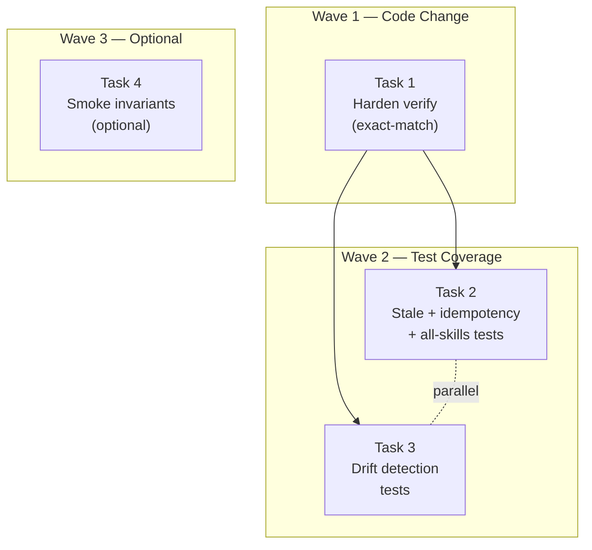

# Tasks: Sincronizar skills OpenCode desde el instalador

## Source

- Spec: `installer-sync-opencode-skills` spec artifact
- Design: `installer-sync-opencode-skills` design artifact
- Capabilities affected: `opencode-developer-team-install`, `opencode-skill-sync-validation`

## Reconciliation Summary

Spec exige sincronización determinística de skills `deck-developer-*` desde fuente canónica, idempotencia, y tests de drift. Design confirma la cadena canónica `orchestrator-content.ts` → `content-registry` → `buildSkillFileContent()` → `plan.skills` → `apply` → filesystem.

**Hallazgo clave**: `applyOpenCodeDeveloperTeamInstall()` ya implementa comparación byte-a-byte (`existing !== planned.content`) y estados `created`/`updated`/`unchanged` correctos. El gap principal está en `verifyOpenCodeDeveloperTeamInstall()`, que no exige igualdad exacta con `planned.content`. Los tests existentes cubren idempotencia básica pero no cubren stale overwrite, drift prompt/skill, ni verify exact-match.

**OQ-1 resuelta**: Design declara fuente canónica = `orchestrator-content.ts` vía `content-registry.getAgentContent()`. No bloquea tareas.
**OQ-2 abierta pero no bloqueante**: Es SHOULD-level; el diseño recomienda mantener `updated` genérico.

---

## Task Groups

### Group: Shared / Contracts

> No se requieren cambios en tipos, schemas, APIs ni contratos compartidos. La interfaz existente es suficiente.

---

### Group: Backend

#### Task 1: Endurecer verify con exact-match contra `planned.content`

**Owner**: General Apply
**Priority**: P0
**Complexity**: Low
**Parallel**: Yes
**Depends on**: none

**Description**
Modificar `verifyOpenCodeDeveloperTeamInstall()` en `developer-team-install.ts` para añadir un check de igualdad exacta entre el contenido del archivo instalado y `planned.content`. Si difieren, emitir un issue: `Content mismatch for skill <skillId>; installed file differs from planned content.`. Mantener los checks estructurales existentes (frontmatter, heading, invariants) como capas adicionales — no reemplazarlos.

**Files**
- `packages/adapter-opencode/src/developer-team-install.ts` — modify

**Verification**
- `bun test packages/adapter-opencode/src/developer-team-install.test.ts` pasa (tests existentes + nuevos de Task 2).
- Verify falla cuando un skill instalado tiene frontmatter correcto pero contenido body diferente a `planned.content`.

---

#### Task 2: Tests de stale overwrite, idempotencia byte-a-byte y all-skills sync

**Owner**: General Apply
**Priority**: P0
**Complexity**: Medium
**Parallel**: Yes
**Depends on**: none (tests prueban comportamiento existente de apply + verify endurecido de Task 1)

**Description**
Añadir tests en `developer-team-install.test.ts` cubriendo:

1. **Stale overwrite** (REQ-INST-002): Instalar, corromper un skill (contenido diferente), re-aplicar. Verificar que el archivo queda idéntico a `planned.content` y el resultado es `status: "updated"`.
2. **Idempotencia byte-a-byte** (REQ-INST-003): Aplicar, re-aplicar. Verificar `changedCount === 0` y contenido idéntico (mtime no cambia en segunda ejecución).
3. **All-skills sync** (REQ-INST-004): Verificar que TODOS los skills `deck-developer-*` se sincronizan — no solo el orquestador. Corromper múltiples skills, re-aplicar, verificar que todos se actualizan y los no-corruptos quedan `unchanged`.
4. **Verify exact-match** (REQ-VAL-004): Apply → corromper body (mantener frontmatter válido) → verify debe fallar con issue de content mismatch.
5. **Fuente canónica ausente** (variant REQ-INST-001): Verificar que `buildSkillFileContent()` lanza error cuando `getAgentContent()` retorna null (comportamiento ya existente; añadir test explícito).
6. **Reporte de skill actualizado** (REQ-INST-005): Verificar que apply retorna `status: "updated"` para skill stale y `status: "unchanged"` para skill correcto.

**Files**
- `packages/adapter-opencode/src/developer-team-install.test.ts` — modify

**Verification**
- `bun test packages/adapter-opencode/src/developer-team-install.test.ts` — todos los tests nuevos pasan.
- Coverage de stale overwrite, idempotencia, all-skills y verify exact-match confirmada.

---

#### Task 3: Tests de drift detection — consistencia prompt/skill y fragmentos críticos

**Owner**: General Apply
**Priority**: P0
**Complexity**: Medium
**Parallel**: Yes
**Depends on**: none (puede ejecutarse en paralelo con Task 2)

**Description**
Añadir tests de drift que validen la consistencia entre prompt y skill instalado:

1. **Prompt → Skill path** (REQ-VAL-001): Verificar que el prompt del orquestador contiene Skill Loading Gate con `absolutePath` que coincide exactamente con `plan.skills[].absolutePath` para `deck-developer-orchestrator`.
2. **Skill instalado == planned.content** (REQ-VAL-001): Después de apply, verificar que el skill en disco es idéntico a `planned.content` para TODOS los skills (no solo orquestador).
3. **Fragmentos críticos** (REQ-VAL-003): Verificar que el skill instalado contiene fragmentos semánticos clave: heading `"# Orchestrator Skill"`, sección `"## SDD Workflow"`, `"Visual Explanations"`, y al menos un invariant (`INV-001`). No exigir texto exacto — verificar presencia de fragmentos.
4. **Test pasa con skill sincronizado** (REQ-VAL-002, REQ-VAL-004): Después de apply normal, drift tests pasan sin error.
5. **Test falla con skill desincronizado** (REQ-VAL-001): Si se corrompe el skill instalado, los drift tests detectan la discrepancia.
6. **CI-compatible** (REQ-VAL-002): Todos los tests usan `configDir` temporal vía `createTempProject()`/`createTempConfigDir()` — no requieren acceso a `~/.config/opencode`.

Tests pueden ir en `developer-team-install.test.ts` (para drift skill ↔ plan) y/o `prompt-generation.test.ts` (para drift prompt → skill path). Preferir `developer-team-install.test.ts` si el drift se valida a nivel de plan.

**Files**
- `packages/adapter-opencode/src/developer-team-install.test.ts` — modify (drift skill/plan)
- `packages/adapter-opencode/src/prompt-generation.test.ts` — modify si el drift prompt→skill path requiere tests separados en este archivo

**Verification**
- `bun test packages/adapter-opencode/src/developer-team-install.test.ts` pasa.
- `bun test packages/adapter-opencode/src/prompt-generation.test.ts` pasa.
- Tests no requieren `~/.config/opencode` (CI-compatible).

---

#### Task 4: Smoke test de invariants críticos en orchestrator-content (opcional)

**Owner**: General Apply
**Priority**: P2
**Complexity**: Low
**Parallel**: Yes
**Depends on**: none

**Description**
Añadir/ajustar smoke test en `orchestrator-content.test.ts` que verifique la presencia de invariants críticos (`INV-001` a `INV-005`) en `ORCHESTRATOR_SKILL_BODY`. Esto proporciona una red de seguridad adicional si la composición del registry cambia. Evitar duplicar tests de texto exacto frágil — validar presencia de fragmentos clave.

**Files**
- `packages/core/src/teams/developer/orchestrator-content.test.ts` — modify optional

**Verification**
- `bun test packages/core/src/teams/developer/orchestrator-content.test.ts` pasa.

---

### Group: Frontend

> No hay tareas de frontend. El cambio es exclusivamente installer/backend.

---

## Dependency Graph

```
Task 1 (Backend: verify hardening)
  → Task 2 (Backend: stale/idempotency tests)  [verify hardening must exist for exact-match test]
  → Task 3 (Backend: drift detection tests)     [verify hardening must exist for drift test]
Task 4 (Backend: optional smoke) — independent
```

## Parallelization Plan

| Phase | Tasks | Can Run in Parallel |
|---|---|---|
| Backend wave 1 | Task 1 | Yes (independent, small change) |
| Backend wave 2 | Task 2, Task 3 | Yes — both test-only tasks, different test scopes, same file but non-overlapping describe blocks |
| Backend wave 3 | Task 4 | Yes — optional, independent |

**Nota**: Task 2 y Task 3 pueden ejecutarse en paralelo si se coordinan para no tocar las mismas líneas en el test file (usan `describe` blocks distintos). Si el Orchestrator prefiere evitar conflicto de edición, ejecutar secuencialmente (Task 2 → Task 3).

## Responsibility Contracts

| Contract / Boundary | Owner | Consumers | Notes |
|---|---|---|---|
| `planned.content` como expected output | Task 1 (verify), Task 2 (tests), Task 3 (tests) | verify + drift tests | Contenido generado por `buildSkillFileContent()` desde `content-registry`; no hardcodear body completo en tests |
| Prompt `absolutePath` ↔ Skill `absolutePath` | Task 3 (drift tests) | drift detection | Ambos provienen del mismo plan; tests validan consistencia |
| Fragmentos críticos (INV-*, SDD Workflow, Visual Explanations) | Task 3, Task 4 | drift + smoke tests | Validar presencia, no texto exacto |

## Complexity Summary

| Complexity | Count | Task Numbers |
|---|---|---|
| Low | 2 | 1, 4 |
| Medium | 2 | 2, 3 |

## Flagged for Splitting

- Ninguno. Todas las tareas son de complejidad Low-Medium y tocan 1-2 archivos cada una.

## Review Workload Forecast

| Signal | Value |
|---|---|
| Estimated changed lines | 100-400 |
| 400-line budget risk | Low |
| Scope reduction recommended | No |
| Sequential work slices recommended | No — tasks son pequeñas y enfocadas |
| Decision needed before Apply | No |

**Rationale**: Task 1 es ~10 líneas de cambio en verify. Tasks 2 y 3 suman ~200-300 líneas de tests. Task 4 es ~20 líneas opcional. Total estimado < 350 líneas. El riesgo de budget es bajo porque los cambios son aditivos (tests) y el cambio de código productivo es mínimo.

## Open Questions / Blockers

- **OQ-1 (fuente canónica)**: **RESUELTA** — Design declara `orchestrator-content.ts` vía `content-registry`. No bloquea ninguna tarea. Clasificación: ~~blocked~~ → unblocked.
- **OQ-2 (diff summary vs log line)**: **No bloqueante** — Es SHOULD-level (REQ-INST-005). Design recomienda mantener `updated` genérico. El status `updated` ya es reportado por apply. Si se desea un log line adicional, puede ser un micro-cambio dentro de Task 2. Clasificación: allowed-with-stub.

> **Blocker classification**: No hay blockers implementation-blocking. Todas las tareas están listas para Apply.

## Mermaid Summary Source


