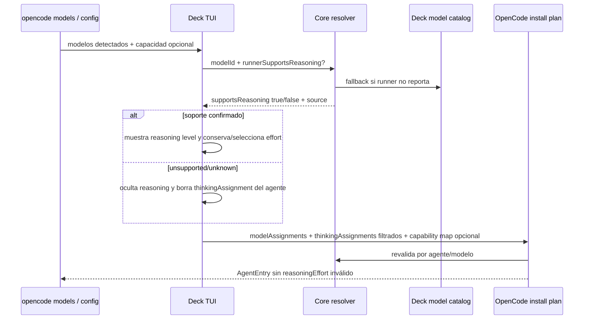
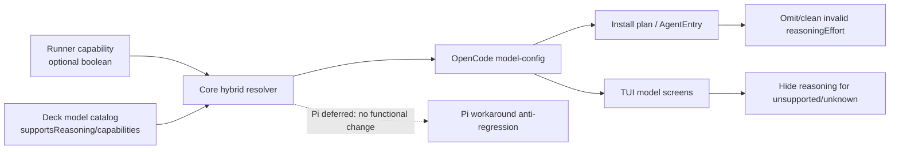

# Design: Capacidad híbrida de reasoning effort por modelo

## Source

- Proposal: `model-reasoning-effort-capability` proposal artifact
- Explorer: `openspec/changes/model-reasoning-effort-capability/exploration.md`
- Capabilities affected:
  - `model-reasoning-effort`
  - `opencode-model-configuration`
  - `developer-team-tui-model-selection`
  - `pi-model-configuration` solo anti-regresión
- Spec status: not yet available / parallel phase
- Registry mode: deferred — este artefacto no modifica `state.yaml` ni `events.yaml`.

## Current Architecture Context

| Área | Estado actual relevante |
|---|---|
| Catálogo core | `packages/core/src/model-catalog.ts` define `ModelEntry.capabilities` y `supportsReasoning?`; `findModel(modelId)` permite lookup por id. La mayoría de modelos deriva capacidad por `capabilities: ["reasoning"]`; `supportsReasoning` solo aparece explícito en `opencode-go/deepseek-v4-flash`. |
| OpenCode helper | `packages/adapter-opencode/src/model-config.ts` expone `supportsThinkingForOpenCodeModel(model?)`, hoy demasiado permisivo: `undefined => true`, solo excluye `*/deepseek-v4-flash`. `resolveThinkingForOpenCodeModel` y `getDefaultThinkingForOpenCodeModel` dependen de ese helper. |
| Config install | `packages/adapter-opencode/src/developer-team-install.ts` construye cada `AgentEntry` vía `buildAgentEntry(...)`; llama `resolveModelConfig(...)` y escribe `entry.reasoningEffort` si el resultado lo contiene. `config-merge.ts` reemplaza entradas `deck-developer-*`, por lo que omitir `reasoningEffort` en `AgentEntry` limpia valores previos gestionados por Deck. |
| Config read | `readOpenCodeDeveloperTeamModelConfigAssignments(...)` lee `~/.config/opencode/opencode.json` y preserva cualquier `reasoningEffort` parseable para agentes Deck sin verificar si el modelo lo soporta. |
| TUI | `apps/cli/src/tui/screens/developer-team-screens.tsx` muestra en `AgentModelConfigListScreen` el hint `${model} · thinking ${level}` para todo modelo asignado. `ModelSelectionScreen` usa `supportsThinkingForOpenCodeModel(m.id)` para hint. `apps/cli/src/tui/app.tsx` ya salta `agent-model-assignment` cuando `supportsThinking=false` y borra `thinkingAssignments[agent.id]`, pero depende del helper incorrecto. |
| OpenCode inventory | `detectOpenCodeModelInventoryForTui()` parsea `opencode models` con `parseOpenCodeModelsOutput(...)` y produce `{ id, displayName, providerId }`; no transporta metadatos de reasoning. |
| Pi | `packages/adapter-pi/src/model-config.ts` mantiene workaround histórico (`opencode-go` y `kimi-k2.6` deshabilitados). Queda fuera de cambio funcional. |

## Proposed Architecture

Introducir una resolución explícita y compartida de soporte de `reasoningEffort` con precedencia:

1. Señal del runner si existe (`true` o `false`).
2. Fallback al catálogo Deck (`supportsReasoning` explícito; si falta, `capabilities.includes("reasoning")`).
3. Modelo desconocido / sin confirmación: `supportsReasoning=false`.

### Resolver location/API

Crear un módulo core reutilizable, por ejemplo `packages/core/src/model-reasoning-capability.ts`, exportado desde `packages/core/src/index.ts`.

API propuesta:

```ts
export type ReasoningSupportSource = "runner" | "catalog" | "unknown";

export type ResolveReasoningSupportInput = {
  modelId?: string;
  runnerSupportsReasoning?: boolean | null;
  catalog?: ModelCatalog;
};

export type ResolveReasoningSupportResult = {
  supportsReasoning: boolean;
  source: ReasoningSupportSource;
};

export function resolveReasoningEffortSupport(input: ResolveReasoningSupportInput): ResolveReasoningSupportResult;
export function catalogSupportsReasoning(model?: ModelEntry): boolean | undefined;
```

Reglas:

- `runnerSupportsReasoning === true|false` gana siempre, incluso si contradice el catálogo.
- Sin señal runner: usar `findModel(modelId)`/`catalog.models`.
- En catálogo, `supportsReasoning` explícito gana; si es `undefined`, derivar de `capabilities.includes("reasoning")`.
- `modelId` ausente o no encontrado: `{ supportsReasoning:false, source:"unknown" }`.

### Component / Module Boundaries

| Component | Responsibility | Change Type |
|---|---|---|
| `packages/core/src/model-reasoning-capability.ts` | Resolver puro runner-first/catalog-fallback/unknown-false. | new |
| `packages/core/src/index.ts` | Exportar resolver/types para adaptadores y TUI. | modified |
| `packages/core/src/model-catalog.ts` | Mantener datos fallback; opcionalmente auditar `supportsReasoning` explícito vs `capabilities`. | modified |
| `packages/adapter-opencode/src/model-config.ts` | Delegar `supportsThinkingForOpenCodeModel`, `getDefaultThinking...`, `resolveThinking...`, `resolveModelConfig` y config-read al resolver. | modified |
| `packages/adapter-opencode/src/developer-team-install.ts` | Pasar señales runner/capability map al construir agentes; no escribir `reasoningEffort` inválido. | modified |
| `packages/adapter-opencode/src/runner-adapter.ts` / `runner-capabilities.ts` | Transportar `thinkingAssignments` filtrados y capability map cuando exista; mantener contrato explicit-only. | modified |
| `packages/adapter-opencode/src/config-merge.ts` | Sin cambio algorítmico esperado; documentar que replacement de `AgentEntry` limpia propiedades omitidas. | unchanged |
| `apps/cli/src/tui/app.tsx` | Guardar/propagar capacidad runner detectada por modelo; limpiar thinking stale durante hidratación/selección. | modified |
| `apps/cli/src/tui/screens/developer-team-screens.tsx` | Ocultar hint/selector de reasoning para unsupported/unknown. | modified |
| `packages/adapter-pi/src/model-config.ts` | No cambiar lógica funcional; solo tests anti-regresión si código compartido toca contratos. | unchanged/anti-regression |

## Data Flow

### Flow: selección TUI OpenCode



### Flow: instalación/merge no TUI

1. Entrada: `configModelOverrides`, `reasoningEffortOverrides`, y opcional `runnerReasoningCapabilitiesByModel`.
2. `resolveModelConfig(agentId, ..., capabilityMap)` determina modelo explícito.
3. Si no hay modelo explícito: no inferir modelo ni `reasoningEffort`.
4. Si hay modelo y resolver confirma soporte: preservar/escribir `reasoningEffort` explícito válido.
5. Si resolver no confirma soporte: devolver config sin `reasoningEffort`.
6. `mergeConfig(...)` reemplaza la entrada `deck-developer-*`; la ausencia de la propiedad limpia valores antiguos gestionados por Deck.

## API / Contract Implications

| Endpoint / Interface | Change | Backward Compatible |
|---|---|---|
| `resolveReasoningEffortSupport(input)` | Nuevo contrato core puro. | yes |
| `supportsThinkingForOpenCodeModel(model?, options?)` | Añadir `options.runnerSupportsReasoning?: boolean | null`; default sin options usa catálogo fallback. | yes |
| `resolveThinkingForOpenCodeModel(model, requested?, options?)` | Devolver `undefined` cuando resolver no confirma soporte. | yes |
| `resolveModelConfig(...)` | Añadir options/capability map opcional para filtrar `reasoningEffort`. | partial: cambia output para modelos unsupported, intencional |
| `buildOpenCodeDeveloperTeamInstallPlan(...options)` | Añadir capability map opcional; sin él usa catálogo. | yes |
| TUI model item | Extender modelo detectado con `supportsReasoning?: boolean` cuando runner lo reporte. | yes |
| `RunnerAdapter.supportsThinking(modelId)` | Puede quedarse estable; si se necesita runner signal en UI, preferir helper local con model metadata antes que romper interfaz global. | yes |

## State / Persistence Implications

- No hay migración de schema ni nueva persistencia.
- Limpieza se materializa al reescribir entradas `agent.deck-developer-*` de `opencode.json`.
- Lectura TUI debe filtrar `thinkingAssignments` stale para evitar mostrar valores ya inválidos antes de aplicar install.

## Migration / Backward Compatibility

- Idempotente: correr install varias veces mantiene `reasoningEffort` solo cuando está confirmado.
- Limitado a agentes gestionados por Deck porque `mergeConfig(...)` reemplaza por key `deck-developer-*`; no tocar entradas ajenas.
- Configs con modelo compatible conservan `reasoningEffort` explícito.
- Configs con modelo unsupported/unknown pierden `reasoningEffort` en la próxima escritura gestionada por Deck.
- Contrato explicit-only se preserva: sin modelo explícito no se escribe `model` ni `reasoningEffort`.

## File Impact Estimate

| File / Path | Action | Rationale |
|---|---|---|
| `packages/core/src/model-reasoning-capability.ts` | create | Resolver híbrido y tipos. |
| `packages/core/src/index.ts` | modify | Exportar resolver/types. |
| `packages/core/src/model-catalog.ts` | modify | Auditar/normalizar fallback; posible helper si no se crea módulo separado. |
| `packages/core/src/model-catalog.test.ts` | modify | Cubrir derivación por `supportsReasoning`/`capabilities`. |
| `packages/core/src/model-reasoning-capability.test.ts` | create | Tests de precedencia runner > catalog > unknown false. |
| `packages/adapter-opencode/src/model-config.ts` | modify | Reemplazar check ad-hoc y filtrar read/resolve. |
| `packages/adapter-opencode/src/model-config.test.ts` | modify | Tests supported, unsupported, unknown, runner true/false override. |
| `packages/adapter-opencode/src/developer-team-install.ts` | modify | Pasar capability map y omitir `reasoningEffort` inválido. |
| `packages/adapter-opencode/src/developer-team-install.test.ts` | modify | Verificar preservación/cleanup en `AgentEntry`. |
| `packages/adapter-opencode/src/runner-adapter.ts` | modify | Propagar options/capability map desde contrato del adapter si aplica. |
| `packages/adapter-opencode/src/runner-capabilities.ts` | modify | Mantener APIs alternativas coherentes con install/read. |
| `apps/cli/src/tui/app.tsx` | modify | Guardar capacidad opcional por modelo; limpiar stale thinking en hidratación/selección. |
| `apps/cli/src/tui/screens/developer-team-screens.tsx` | modify | Ocultar hint/selector reasoning para unsupported/unknown. |
| `apps/cli/src/tui/developer-team-flow.test.tsx` | modify | Cubrir salto de reasoning y cleanup de assignment. |
| `apps/cli/src/tui/screens/developer-team-screens.test.tsx` | modify | Cubrir hints condicionales. |
| `packages/adapter-pi/src/model-config.test.ts` | modify | Anti-regresión del workaround Pi si se toca código compartido. |

## Testing Strategy

| Layer | Tests |
|---|---|
| Core resolver | Unit tests: runner `true` gana a catálogo `false`; runner `false` gana a catálogo `true`; sin runner usa `supportsReasoning`; sin `supportsReasoning` usa `capabilities`; unknown/empty => false. |
| OpenCode model config | Unit tests para `supportsThinkingForOpenCodeModel`, `resolveThinkingForOpenCodeModel`, `readOpenCodeDeveloperTeamModelConfigAssignments`, `resolveModelConfig`; incluir `openai/gpt-4o` y modelo desconocido como unsupported. |
| Install/merge | Tests de `buildOpenCodeDeveloperTeamInstallPlan`: compatible preserva `reasoningEffort`; unsupported/unknown lo omite; `off` omite; sin modelo explícito no inventa config. |
| TUI screens | Render tests: `AgentModelConfigListScreen` muestra `thinking` solo cuando soporte confirmado; `ModelSelectionScreen` no ofrece hint de thinking para unsupported/unknown. |
| TUI flow | Tests de selección de modelo unsupported: asigna modelo, borra `thinkingAssignments[agent]`, no navega a `agent-model-assignment`. |
| Pi anti-regression | Confirmar que el workaround actual sigue igual y no se habilita reasoning para `opencode-go`/`kimi-k2.6` en Pi por efecto del resolver OpenCode. |

## Observability / Error Handling

- Resolver puro sin logging requerido.
- TUI puede mantener logs existentes (`detectOpenCodeModelInventoryForTui`) y no debe añadir ruido al usuario.
- Config JSON ilegible conserva comportamiento actual: no preselección; no cleanup hasta una escritura válida.
- Capability runner malformada debe tratarse como ausente (`undefined`) y caer al catálogo, no como soporte confirmado.

## Security / Performance / Accessibility Considerations

- Security: no nuevos secretos ni permisos; limpieza limitada a config gestionada por Deck.
- Performance: lookup por modelo debe ser O(1) si se crea `Map` local o O(n) con catálogo pequeño; sin impacto relevante.
- Accessibility/UX: ocultar controles no aplicables reduce ruido; evitar copy extra salvo que Spec lo exija.

## Tradeoffs

| Decision | Chosen | Rejected Alternative | Rationale |
|---|---|---|---|
| Fuente de capacidad | Resolver híbrido runner-first + catálogo fallback | Catálogo-only | El usuario rechazó catálogo-only; runner puede estar más actualizado. |
| Unknown | `supportsReasoning=false` | Preservar/escribir por defecto | Default seguro evita configs inválidas. |
| Ubicación del resolver | Core puro, adaptadores consumen | Resolver solo en OpenCode | Evita duplicación y deja contrato auditable sin cambiar Pi funcionalmente. |
| Cleanup | Omitir `reasoningEffort` al reconstruir `AgentEntry` gestionado por Deck | Mutar todo `opencode.json` buscando cualquier reasoning | Menor riesgo; respeta límite de entradas gestionadas. |
| TUI unsupported | Ocultar reasoning level/selection | Mostrar aviso amarillo/extra copy | Propuesta exige ocultar; menos ruido. |
| Pi | Mantener workaround | Unificar Pi con resolver | Usuario difirió Pi; tocarlo elevaría riesgo. |

## Risks

| Risk | Likelihood | Impact | Mitigation |
|---|---|---|---|
| Shape real de capability runner no existe o cambia | Medium | Medium | Diseñar input opcional simple (`boolean | null`) y tratar malformado como ausente. |
| Runner false contradice catálogo true | Medium | Medium | Tests de precedencia; documentar `source:"runner"`. |
| Cleanup elimina effort esperado por usuario | Medium | Medium | Solo cuando no hay soporte confirmado; limitado a agentes Deck. |
| TUI list no tiene metadata runner para modelo ya asignado | Medium | Low | Usar map de inventory cuando exista; fallback catálogo; unknown false. |
| Regresión Pi accidental por imports compartidos | Low | High | No cambiar lógica Pi; tests anti-regresión. |

## Open Decisions

- Shape exacto del runner capability metadata: si OpenCode CLI no expone soporte de reasoning, la implementación debe dejar `runnerSupportsReasoning` ausente y usar catálogo. Si existe metadata futura, mapearla a boolean sin expandir scope.
- Límite de cleanup fuera de agentes Deck: diseño recomienda solo `deck-developer-*`; si Spec exige limpiar entradas ajenas, requerirá decisión explícita por mayor riesgo.

## Dependencies

- Catálogo Deck debe conservar `capabilities` correctas para fallback.
- Tests deben aislar config real (`HOME`/`XDG` temporales) y no mutar config del usuario.
- No depende de cambios Pi funcionales.

## Rollback

- Revertir nuevo resolver y llamadas en OpenCode/TUI.
- Restaurar `supportsThinkingForOpenCodeModel` permisivo previo si se necesita rollback total.
- No hay migración irreversible; `reasoningEffort` removido puede reconfigurarse manualmente.

## Next Steps

Ready for Task (`deck-developer-task`) to break this design into implementation tasks, combined with Spec.

## Mermaid Summary Source


