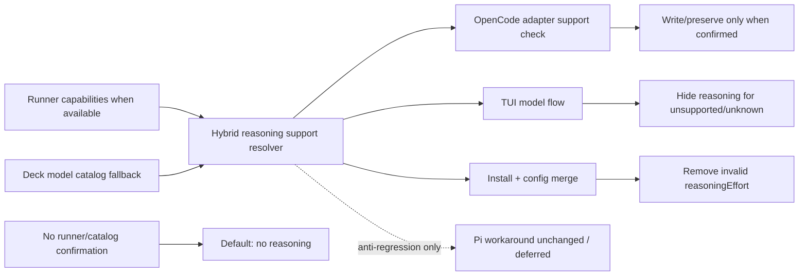

# Proposal: Capacidad híbrida de reasoning effort por modelo

## Intent

La instalación/configuración de modelos muestra y puede conservar `reasoningEffort` para modelos sin soporte confirmado de razonamiento. El usuario rechazó que el catálogo sea la única fuente de verdad: la dirección aceptada es híbrida, prefiriendo capacidades reportadas por el runner y usando el catálogo de Deck solo como fallback seguro.

## Goal

Mostrar, seleccionar, escribir y preservar `reasoningEffort` únicamente cuando runner o catálogo confirmen soporte de reasoning; si ninguno lo confirma, default seguro: sin reasoning.

## Scope

### In Scope
- Definir resolución híbrida de soporte: runner-provided capabilities primero, catálogo de Deck como fallback, unknown => no reasoning.
- Corregir la detección usada por OpenCode/instalación/TUI para no depender de un check ad-hoc ni de catálogo-only.
- Limpiar/remover `reasoningEffort` de configuraciones existentes cuando el modelo asignado no tenga soporte confirmado.
- Ocultar reasoning level/selection en la TUI para modelos sin soporte confirmado.
- Cubrir resolver híbrido, adapter/merge/install y TUI con pruebas enfocadas.

### Out of Scope
- Actualizar o rediseñar el workaround de Pi; queda diferido a otra sesión y debe evitar regresiones.
- Añadir presets o modelos baked-in no relacionados con capacidad de reasoning.
- Cambiar el contrato explicit-only: OpenCode solo escribe `model` y `reasoningEffort` cuando estén explícitamente configurados y sean válidos.
- Mostrar copy extra de “unsupported” en la TUI; la decisión es simplemente ocultar salvo que Spec/Design detecten ambigüedad crítica.

## Affected Capabilities

### New Capabilities
- None.

### Modified Capabilities
- `model-reasoning-effort`: `reasoningEffort` solo se ofrece, muestra y persiste con soporte confirmado por runner o catálogo.
- `opencode-model-configuration`: la instalación/configuración limpia `reasoningEffort` inválido cuando el resolver híbrido no confirma soporte.
- `developer-team-tui-model-selection`: la TUI oculta reasoning level/selection para modelos sin soporte confirmado.

### Unchanged Capabilities
- `pi-model-configuration`: Pi support/workaround queda sin cambio funcional; solo anti-regresión si hay código compartido.
- `explicit-model-configuration`: se mantiene sin presets ni defaults implícitos.

## Approach

- Introducir/usar un resolver de capacidad de reasoning con precedencia explícita:
  1. Si el runner reporta si el modelo soporta reasoning effort, usar esa señal.
  2. Si el runner no aporta capacidad, consultar el catálogo de Deck.
  3. Si runner y catálogo no confirman soporte, tratar el modelo como no compatible.
- Ajustar OpenCode para basar `supportsThinking`/equivalente en ese resolver híbrido, no en `endsWith("/deepseek-v4-flash")` ni en catálogo-only.
- En merge/instalación, si el resolver no confirma soporte para el modelo, remover `reasoningEffort` existente y no escribir uno nuevo.
- En la TUI, ocultar nivel/selección de reasoning cuando el resolver indique unsupported/unknown; mantener flujo simple.
- Mantener Pi fuera del cambio funcional: no eliminar ni relajar su workaround histórico; validar que el cambio compartido no lo degrade.

## Migration / Cleanup Behavior

- Al procesar configuración OpenCode existente, si `model` no tiene soporte confirmado por runner ni catálogo, eliminar `reasoningEffort` del bloque afectado.
- Si runner o catálogo confirman soporte y el usuario configuró `reasoningEffort`, preservarlo.
- Si no hay modelo explícito, no inferir presets ni escribir `reasoningEffort`.
- Si el runner reporta capacidad explícita, su señal prevalece sobre el catálogo para evitar que el catálogo desactualizado fuerce una decisión incorrecta.
- La limpieza debe ser idempotente y limitada a entradas gestionadas/actualizadas por Deck según el contrato existente de instalación.

## UX Behavior for TUI

- Para modelos con soporte confirmado por runner o catálogo: mostrar/permitir selección del nivel como hoy.
- Para modelos sin soporte confirmado: ocultar el nivel y saltar/no ofrecer selección de reasoning.
- No mostrar mensajes extra de unsupported salvo necesidad justificada por Spec/Design.
- El listado de agentes no debe mostrar `thinking default` ni valores previos cuando el modelo asignado no tenga soporte confirmado.

## Adapter / Catalog Implications

- Runner/OpenCode model metadata: cuando esté disponible, debe transportar o mapear la señal “supports reasoning effort” para que el resolver la prefiera.
- `packages/core/src/model-catalog.ts`: queda como fallback auditable, derivado de `capabilities` y/o `supportsReasoning`, no como única fuente de verdad.
- `packages/adapter-opencode/src/model-config.ts`: debe aceptar/consultar capacidades del runner cuando existan y caer al catálogo si faltan; unknown => false.
- `packages/adapter-opencode/src/developer-team-install.ts` y `packages/adapter-opencode/src/config-merge.ts`: deben limpiar/no persistir `reasoningEffort` inválido según el resolver híbrido.
- `packages/adapter-pi/src/model-config.ts`: Pi support update/workaround queda explícitamente fuera de alcance; conservar comportamiento actual salvo ajustes mínimos anti-regresión.

## Alternatives and Tradeoffs

| Alternative | Why Considered | Why Not Chosen |
|---|---|---|
| Catálogo-only | Simple, auditable, recomendado inicialmente por Explorer | Rechazado por el usuario; no respeta runners que pueden reportar capacidades actuales. |
| Runner-only | Fuente más cercana al entorno real | No todos los runners reportan capacidades; dejaría casos sin fallback conocido. |
| Solo ocultar en TUI | Cambio mínimo | No limpia configs existentes ni corrige persistencia inválida. |
| Cambiar OpenCode y Pi juntos | Consistencia entre adaptadores | Pi tiene workaround histórico no verificado; usuario decidió diferirlo. |
| Mantener `reasoningEffort` aunque sea inválido | Evita eliminar datos del usuario | Decisión previa: limpiar/remover para modelos sin soporte confirmado. |

## Risks

| Risk | Likelihood | Mitigation |
|---|---|---|
| Runner y catálogo discrepan | Medium | Precedencia documentada: runner gana cuando reporta capacidad; tests de precedencia. |
| Modelo desconocido tratado como no compatible oculta una capacidad real | Medium | Default seguro; futuro puede ampliar metadatos de runner/catalog. |
| Se elimina `reasoningEffort` que el usuario esperaba conservar | Medium | Limpiar solo cuando no exista soporte confirmado; pruebas de preservación para modelos compatibles. |
| Regresión Pi por cambios compartidos | Medium | Mantener Pi fuera de alcance funcional y añadir/verificar tests anti-regresión. |
| UI sigue mostrando valor stale | Medium | Tests del listado TUI con modelos soportados, no soportados y unknown. |

## Rollback Plan

- Revertir los cambios de resolver híbrido, adaptador OpenCode, TUI y config-merge/install de esta fase.
- Restaurar el comportamiento previo de `supportsThinkingForOpenCodeModel` y del hint TUI.
- Si una limpieza ya removió `reasoningEffort`, el usuario puede reconfigurarlo manualmente; no hay migración irreversible fuera del archivo de config.

## Dependencies

- El runner debe exponer capacidad de reasoning cuando pueda; si no puede, el diseño debe permitir ausencia de metadatos.
- Catálogo de Deck debe mantener datos suficientes como fallback para modelos conocidos.
- Tests existentes de catálogo, adaptador OpenCode, merge/instalación y TUI.

## Open Questions

- ¿Cuál es el shape exacto de la señal runner-provided para “supports reasoning effort” en cada runner soportado? Spec/Design deben fijar contrato interno.
- ¿La limpieza debe limitarse estrictamente a agentes gestionados por Deck o también a cualquier entrada existente que Deck lea/mergea? Spec/Design deben confirmar el límite exacto.

## Acceptance Direction

- [ ] Cuando el runner confirma soporte de reasoning, la TUI ofrece/muestra reasoning y la config puede preservar/escribir `reasoningEffort` válido.
- [ ] Cuando el runner no reporta capacidad, Deck usa el catálogo como fallback.
- [ ] Cuando ni runner ni catálogo confirman soporte, la TUI oculta reasoning y la config resultante no contiene `reasoningEffort`.
- [ ] Config OpenCode preserva `reasoningEffort` explícito para modelos con soporte confirmado.
- [ ] Pi conserva su comportamiento actual; Pi support update queda diferido sin regresión.
- [ ] Tests cubren precedencia runner > catálogo > default false, cleanup de config y hints TUI.

## Next Steps

Ready for Spec (`deck-developer-spec`) and Design (`deck-developer-design`) in parallel.

## Mermaid Summary Source

