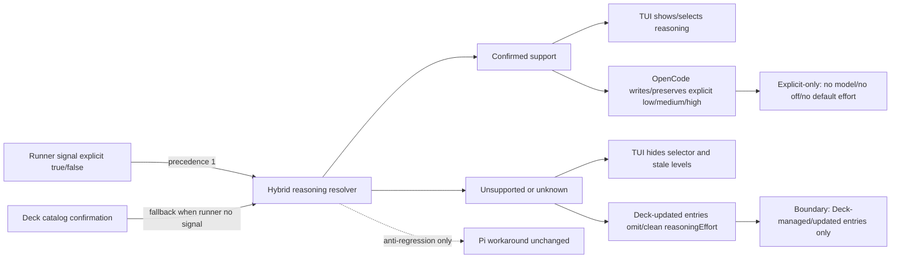

# Spec: Capacidad híbrida de `reasoningEffort` por modelo

## Source

- Proposal: `model-reasoning-effort-capability` proposal artifact
- Exploration: `model-reasoning-effort-capability` exploration artifact
- Registry context: `state.yaml`, `events.yaml` leídos solo como contexto
- Capabilities affected:
  - `model-reasoning-effort`
  - `opencode-model-configuration`
  - `developer-team-tui-model-selection`
  - `pi-model-configuration` anti-regresión solamente
  - `explicit-model-configuration`

## Requirements

### Capability: `model-reasoning-effort`

REQ-MRE-001: El sistema MUST resolver soporte de `reasoningEffort` con precedencia: señal explícita del runner > catálogo de Deck > default seguro sin reasoning.
  Priority: MUST
  Surface: General
  Rationale: Evita depender solo de catálogo y permite que runners con metadatos actuales sean fuente preferente.

REQ-MRE-002: Si el runner confirma explícitamente que un modelo soporta `reasoningEffort`, el sistema MUST tratar el modelo como compatible aunque el catálogo falte, esté desactualizado o discrepe.
  Priority: MUST
  Surface: Integration
  Rationale: La señal runner-provided aceptada por el usuario tiene prioridad.

REQ-MRE-003: Si el runner confirma explícitamente que un modelo no soporta `reasoningEffort`, el sistema MUST tratar el modelo como no compatible aunque el catálogo indique soporte.
  Priority: MUST
  Surface: Integration
  Rationale: La precedencia del runner aplica tanto a soporte como a no soporte explícito.

REQ-MRE-004: Si el runner no aporta señal explícita, el sistema MUST usar el catálogo de Deck como fallback; un modelo MUST ser compatible solo si el catálogo confirma soporte de reasoning.
  Priority: MUST
  Surface: General
  Rationale: Mantiene fallback auditable para runners sin metadatos de capacidad.

REQ-MRE-005: Si ni runner ni catálogo confirman soporte, el sistema MUST tratar el modelo como no compatible y MUST NOT mostrar, escribir ni preservar `reasoningEffort`.
  Priority: MUST
  Surface: General
  Rationale: Default seguro para modelos unknown/no confirmation.

REQ-MRE-006: La compatibilidad de reasoning MUST ser afirmativa y explícita; ausencia, null, valor desconocido o dato no interpretable MUST NOT contar como confirmación de soporte.
  Priority: MUST
  Surface: Validation
  Rationale: Refuerza contrato explicit-only y evita falsos positivos.

### Capability: `opencode-model-configuration`

REQ-OMC-001: OpenCode MUST escribir o preservar `reasoningEffort` únicamente cuando el modelo asignado tenga soporte confirmado por el resolver híbrido y el nivel haya sido configurado explícitamente.
  Priority: MUST
  Surface: Data
  Rationale: Evita persistir effort inválido y mantiene configuración explícita.

REQ-OMC-002: OpenCode MUST remover `reasoningEffort` existente en una entrada afectada cuando el modelo asignado no tenga soporte confirmado por runner ni catálogo.
  Priority: MUST
  Surface: Data
  Rationale: La propuesta decide limpiar/remover valores inválidos.

REQ-OMC-003: La limpieza MUST ser idempotente: ejecutar la misma operación varias veces sobre la misma entrada no compatible MUST producir una config sin `reasoningEffort` y sin cambios adicionales observables por esa limpieza.
  Priority: MUST
  Surface: Data
  Rationale: La migración/cleanup no debe oscilar ni degradar configs.

REQ-OMC-004: El límite de cleanup MUST ser solo las entradas gestionadas o actualizadas por Deck en la operación actual; entradas ajenas no escritas por Deck MUST conservarse intactas aunque contengan `reasoningEffort`.
  Priority: MUST
  Surface: Data
  Rationale: La exploración y propuesta limitan cleanup al contrato existente de instalación/merge.

REQ-OMC-005: Si no hay modelo explícito para una entrada, OpenCode MUST NOT inferir un modelo, MUST NOT inferir presets y MUST NOT escribir `reasoningEffort`.
  Priority: MUST
  Surface: Data
  Rationale: Preserva el contrato explicit-only existente.

REQ-OMC-006: Si el modelo tiene soporte confirmado y el usuario configuró un nivel válido de `reasoningEffort`, OpenCode MUST preservar/escribir ese nivel.
  Priority: MUST
  Surface: Data
  Rationale: Evita pérdida de configuración válida.

### Capability: `developer-team-tui-model-selection`

REQ-TUI-001: La TUI MUST ofrecer selección de nivel de reasoning solo para modelos con soporte confirmado por el resolver híbrido.
  Priority: MUST
  Surface: UI
  Rationale: El usuario pidió ocultar selección para modelos no compatibles.

REQ-TUI-002: Para modelos no compatibles o unknown, la TUI MUST saltar u ocultar el paso/selector de reasoning y MUST borrar/omitir cualquier asignación previa de reasoning para el agente afectado.
  Priority: MUST
  Surface: UI
  Rationale: Evita valores stale en el flujo interactivo.

REQ-TUI-003: El listado/resumen de agentes MUST NOT mostrar `thinking default`, `thinking <level>` ni valores previos cuando el modelo asignado no tenga soporte confirmado.
  Priority: MUST
  Surface: UI
  Rationale: La exploración identificó hints stale como problema observable.

REQ-TUI-004: La TUI SHOULD evitar copy adicional de “unsupported” para modelos sin soporte, salvo mensajes ya existentes o necesarios para compatibilidad del flujo.
  Priority: SHOULD
  Surface: UI
  Rationale: La propuesta decide ocultar, no añadir copy extra.

REQ-TUI-005: Para modelos con soporte confirmado, la TUI MUST mantener el comportamiento existente de mostrar el nivel actual o permitir seleccionar un nivel válido.
  Priority: MUST
  Surface: UI
  Rationale: No debe degradar modelos compatibles.

### Capability: `pi-model-configuration`

REQ-PI-001: El cambio MUST NOT alterar funcionalmente el workaround actual de Pi para modelos/provider con thinking deshabilitado históricamente.
  Priority: MUST
  Surface: Integration
  Rationale: Pi support/workaround está diferido explícitamente.

REQ-PI-002: Cualquier lógica compartida modificada por este cambio MUST preserve el comportamiento observable actual de Pi para omitir thinking donde Pi ya lo omitía.
  Priority: MUST
  Surface: Integration
  Rationale: Anti-regresión para código compartido.

### Capability: `explicit-model-configuration`

REQ-EXPL-001: El sistema MUST NOT añadir modelos baked-in, presets implícitos ni defaults de `reasoningEffort` fuera de una configuración explícita válida.
  Priority: MUST
  Surface: General
  Rationale: El contrato explicit-only queda unchanged.

REQ-EXPL-002: Un nivel `off` o ausencia de nivel MUST result in no persisted `reasoningEffort` para OpenCode.
  Priority: MUST
  Surface: Data
  Rationale: OpenCode persiste solo `low|medium|high` cuando corresponde.

## Acceptance Scenarios

### Capability: `model-reasoning-effort`

#### Scenario: Runner confirma soporte y gana al catálogo
**Given** un modelo con señal runner explícita `supports reasoning effort = true` y catálogo sin soporte o sin entrada confiable
**When** el sistema resuelve la capacidad de reasoning del modelo
**Then** el modelo se considera compatible con `reasoningEffort`
> Covers: REQ-MRE-001, REQ-MRE-002

#### Scenario: Runner confirma no soporte y gana al catálogo
**Given** un modelo con señal runner explícita `supports reasoning effort = false` y catálogo indicando soporte
**When** el sistema resuelve la capacidad de reasoning del modelo
**Then** el modelo se considera no compatible y no puede producir `reasoningEffort`
> Covers: REQ-MRE-001, REQ-MRE-003

#### Scenario: Fallback a catálogo cuando runner no aporta señal
**Given** un modelo sin señal runner explícita y con catálogo confirmando reasoning
**When** el sistema resuelve la capacidad de reasoning del modelo
**Then** el modelo se considera compatible
> Covers: REQ-MRE-004

#### Scenario: Unknown default sin reasoning
**Given** un modelo sin señal runner explícita y sin confirmación en catálogo
**When** el sistema resuelve la capacidad de reasoning del modelo
**Then** el modelo se considera no compatible
**And** ninguna superficie debe mostrar, escribir o preservar `reasoningEffort`
> Covers: REQ-MRE-005, REQ-MRE-006

### Capability: `opencode-model-configuration`

#### Scenario: Preserva effort explícito válido para modelo compatible
**Given** una entrada Deck actualizada por OpenCode con modelo explícito compatible y `reasoningEffort: high` configurado explícitamente
**When** se genera o mergea la configuración OpenCode
**Then** la entrada resultante conserva `model`
**And** conserva `reasoningEffort: high`
> Covers: REQ-OMC-001, REQ-OMC-006

#### Scenario: Limpia effort existente para modelo no compatible
**Given** una entrada Deck actualizada por OpenCode con modelo explícito no compatible y `reasoningEffort: high` existente
**When** se genera o mergea la configuración OpenCode
**Then** la entrada resultante conserva el `model` aplicable
**And** no contiene la clave `reasoningEffort`
> Covers: REQ-OMC-002

#### Scenario: Cleanup idempotente
**Given** una configuración ya limpiada para una entrada Deck con modelo no compatible y sin `reasoningEffort`
**When** se ejecuta nuevamente la misma operación de instalación/merge
**Then** la entrada permanece sin `reasoningEffort`
**And** la limpieza no introduce diferencias adicionales atribuibles a reasoning
> Covers: REQ-OMC-003

#### Scenario: Cleanup limitado a entradas Deck actualizadas
**Given** una configuración OpenCode con una entrada Deck que será escrita por la operación y otra entrada ajena no escrita por Deck
**And** ambas contienen `reasoningEffort` para modelos sin soporte confirmado
**When** Deck mergea la configuración
**Then** la entrada Deck actualizada queda sin `reasoningEffort`
**And** la entrada ajena permanece byte-equivalente en sus campos semánticos gestionados fuera de Deck
> Covers: REQ-OMC-004

#### Scenario: Sin modelo explícito no se escribe effort
**Given** un agente sin modelo explícito y con intento de configurar solo reasoning
**When** OpenCode resuelve la configuración del agente
**Then** no se escribe `model`
**And** no se escribe `reasoningEffort`
> Covers: REQ-OMC-005, REQ-EXPL-001

#### Scenario: `off` no persiste effort
**Given** un modelo compatible y el nivel explícito `off`
**When** OpenCode genera la configuración
**Then** la entrada resultante no contiene `reasoningEffort`
> Covers: REQ-EXPL-002

### Capability: `developer-team-tui-model-selection`

#### Scenario: Modelo compatible muestra selección
**Given** la TUI está configurando un agente y el modelo seleccionado tiene soporte confirmado
**When** el usuario selecciona el modelo
**Then** la TUI muestra o permite seleccionar un nivel válido de reasoning
**And** el resumen del agente puede mostrar el nivel seleccionado
> Covers: REQ-TUI-001, REQ-TUI-005

#### Scenario: Modelo no compatible oculta selección
**Given** la TUI está configurando un agente y el modelo seleccionado no tiene soporte confirmado
**When** el usuario selecciona el modelo
**Then** la TUI no ofrece selector de reasoning para ese modelo
**And** vuelve/continúa sin requerir selección de reasoning
> Covers: REQ-TUI-001, REQ-TUI-002

#### Scenario: Modelo unknown oculta selección y limpia stale
**Given** un agente tenía `thinking high` previamente asignado
**And** el usuario selecciona un modelo unknown sin confirmación runner ni catálogo
**When** la TUI actualiza la asignación del agente
**Then** la asignación de modelo se actualiza
**And** la asignación de reasoning del agente queda ausente
**And** el listado no muestra `thinking high` ni `thinking default`
> Covers: REQ-TUI-002, REQ-TUI-003, REQ-MRE-005

#### Scenario: No copy extra de unsupported en resumen
**Given** un agente tiene asignado un modelo sin soporte confirmado
**When** la TUI renderiza el listado/resumen de agentes
**Then** el hint no muestra nivel de reasoning
**And** no agrega copy nuevo de unsupported en ese resumen
> Covers: REQ-TUI-003, REQ-TUI-004

### Capability: `pi-model-configuration`

#### Scenario: Workaround Pi se preserva
**Given** un modelo/provider para el que Pi omitía thinking antes de este cambio
**When** se instala/configura/lanza Developer Team con Pi
**Then** Pi sigue omitiendo thinking para ese caso
**And** no se introduce un cambio funcional de soporte Pi en esta fase
> Covers: REQ-PI-001, REQ-PI-002

## Validation Rules

| Field / Input | Rule | Error Message | REQ-ID |
|---|---|---|---|
| Runner capability signal | Solo una señal explícita e interpretable de soporte/no soporte participa en precedencia; ausencia o valor desconocido equivale a “no signal”. | N/A — debe degradar a fallback/default, no error de usuario. | REQ-MRE-001, REQ-MRE-006 |
| Catalog reasoning support | Solo confirmación afirmativa del catálogo cuenta como soporte cuando runner no aporta señal. | N/A — unknown => no reasoning. | REQ-MRE-004, REQ-MRE-005 |
| OpenCode `reasoningEffort` | Solo `low`, `medium`, `high` pueden persistirse; `off`, inválido o ausente no se persiste. | N/A — omitir clave. | REQ-OMC-001, REQ-EXPL-002 |
| Modelo explícito | `reasoningEffort` requiere modelo explícito compatible en la entrada afectada. | N/A — omitir clave. | REQ-OMC-005 |
| Cleanup boundary | Cleanup aplica únicamente a entradas gestionadas/actualizadas por Deck durante la operación actual. | N/A — entradas ajenas se preservan. | REQ-OMC-004 |

## Error Contracts

| Condition | Error Code | Message | Status |
|---|---|---|---|
| Runner no reporta capacidades | N/A | Sin error; usar catálogo como fallback. | N/A |
| Runner/catalog no confirman soporte | N/A | Sin error; tratar como no compatible y omitir `reasoningEffort`. | N/A |
| `reasoningEffort` existente inválido para modelo no compatible | N/A | Sin error; limpiar en entrada Deck afectada. | N/A |
| Config ajena contiene `reasoningEffort` inválido | N/A | Sin error; no modificar si no es entrada Deck actualizada. | N/A |

## States and Transitions

| State | Description | Entry Criteria |
|---|---|---|
| Supported by runner | Compatible por señal explícita runner. | Runner reporta soporte `true`. |
| Unsupported by runner | No compatible por señal explícita runner. | Runner reporta soporte `false`. |
| Supported by catalog fallback | Compatible por catálogo. | Runner no aporta señal y catálogo confirma reasoning. |
| Unknown/unsupported default | No compatible por default seguro. | Runner no aporta señal y catálogo no confirma soporte. |

| From | To | Trigger | Side Effects |
|---|---|---|---|
| Any | Supported by runner | Runner aporta soporte explícito `true`. | TUI puede mostrar selector; config puede preservar/escribir effort explícito válido. |
| Any | Unsupported by runner | Runner aporta soporte explícito `false`. | TUI oculta selector; config limpia/omite effort en entradas Deck afectadas. |
| Any | Supported by catalog fallback | Runner sin señal + catálogo confirma soporte. | TUI puede mostrar selector; config puede preservar/escribir effort explícito válido. |
| Any | Unknown/unsupported default | Sin confirmación runner/catalog. | TUI oculta selector; config limpia/omite effort en entradas Deck afectadas. |

## Open Questions

- None — spec is self-contained. El shape interno exacto de la señal runner-provided queda para Design sin cambiar el contrato observable definido aquí.

## Compliance Matrix

| REQ-ID | Scenario(s) | Status |
|---|---|---|
| REQ-MRE-001 | Runner confirma soporte y gana al catálogo; Runner confirma no soporte y gana al catálogo | Defined |
| REQ-MRE-002 | Runner confirma soporte y gana al catálogo | Defined |
| REQ-MRE-003 | Runner confirma no soporte y gana al catálogo | Defined |
| REQ-MRE-004 | Fallback a catálogo cuando runner no aporta señal | Defined |
| REQ-MRE-005 | Unknown default sin reasoning; Modelo unknown oculta selección y limpia stale | Defined |
| REQ-MRE-006 | Unknown default sin reasoning | Defined |
| REQ-OMC-001 | Preserva effort explícito válido para modelo compatible | Defined |
| REQ-OMC-002 | Limpia effort existente para modelo no compatible | Defined |
| REQ-OMC-003 | Cleanup idempotente | Defined |
| REQ-OMC-004 | Cleanup limitado a entradas Deck actualizadas | Defined |
| REQ-OMC-005 | Sin modelo explícito no se escribe effort | Defined |
| REQ-OMC-006 | Preserva effort explícito válido para modelo compatible | Defined |
| REQ-TUI-001 | Modelo compatible muestra selección; Modelo no compatible oculta selección | Defined |
| REQ-TUI-002 | Modelo no compatible oculta selección; Modelo unknown oculta selección y limpia stale | Defined |
| REQ-TUI-003 | Modelo unknown oculta selección y limpia stale; No copy extra de unsupported en resumen | Defined |
| REQ-TUI-004 | No copy extra de unsupported en resumen | Defined |
| REQ-TUI-005 | Modelo compatible muestra selección | Defined |
| REQ-PI-001 | Workaround Pi se preserva | Defined |
| REQ-PI-002 | Workaround Pi se preserva | Defined |
| REQ-EXPL-001 | Sin modelo explícito no se escribe effort | Defined |
| REQ-EXPL-002 | `off` no persiste effort | Defined |

## Mermaid Summary Source

