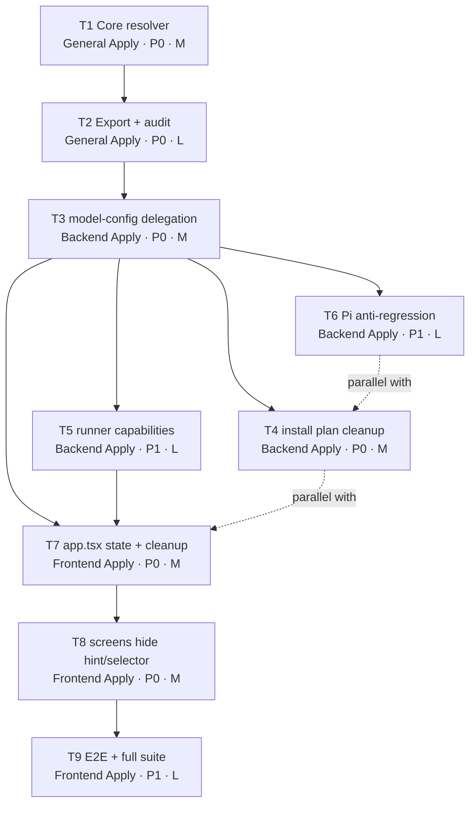

# Tasks: Capacidad híbrida de `reasoningEffort` por modelo

## Source

- Spec: `model-reasoning-effort-capability` spec artifact
- Design: `model-reasoning-effort-capability` design artifact
- Capabilities affected: `model-reasoning-effort`, `opencode-model-configuration`, `developer-team-tui-model-selection`, `pi-model-configuration` (anti-regresión), `explicit-model-configuration`

## Task Groups

### Group: Shared / Contracts (Core Resolver)

#### Task 1: Crear módulo core `model-reasoning-capability.ts` con resolver híbrido y tipos

**Owner**: General Apply
**Priority**: P0 (blocking)
**Complexity**: Medium
**Parallel**: No — bloquear todas las tareas OpenCode/TUI
**Depends on**: none

**Description**
Crear `packages/core/src/model-reasoning-capability.ts` con tipos y funciones puras:
- `type ReasoningSupportSource = "runner" | "catalog" | "unknown"`
- `type ResolveReasoningSupportInput { modelId?: string; runnerSupportsReasoning?: boolean | null; catalog?: ModelCatalog }`
- `type ResolveReasoningSupportResult { supportsReasoning: boolean; source: ReasoningSupportSource }`
- `resolveReasoningEffortSupport(input)` — precedencia: runner `true|false` gana; sin runner, `findModel(modelId)` → `supportsReasoning` explícito; si `undefined`, derivar de `capabilities.includes("reasoning")`; sin modelo o sin confirmación → `{ supportsReasoning: false, source: "unknown" }`.
- `catalogSupportsReasoning(model?)` — helper puro.
- Sin efectos, sin logging, sin imports del runner.

**TDD / Test-first**: escribir primero `packages/core/src/model-reasoning-capability.test.ts` con casos de precedencia: runner `true` gana a catálogo `false`; runner `false` gana a catálogo `true`; sin runner usa `supportsReasoning` explícito; sin `supportsReasoning` deriva de `capabilities`; `null`/`undefined`/`modelId` ausente/no encontrado → `false` + `source: "unknown"`. La implementación debe hacer pasar todos los tests.

**Files**
- `packages/core/src/model-reasoning-capability.ts` — create
- `packages/core/src/model-reasoning-capability.test.ts` — create

**Verification**
- `bun test packages/core/src/model-reasoning-capability.test.ts` pasa todos los casos de precedencia.
- `bunx tsc --noEmit` (en `packages/core`) sin errores.
- El resolver es puro: no muta inputs, no lee FS, no importa del runner.

---

#### Task 2: Exportar resolver desde barrel y auditar fallback de catálogo

**Owner**: General Apply
**Priority**: P0 (blocking)
**Complexity**: Low
**Parallel**: No — depende de Task 1
**Depends on**: Task 1

**Description**
- Añadir export del resolver y tipos en `packages/core/src/index.ts` para que adaptadores y TUI los consuman.
- Auditar `packages/core/src/model-catalog.ts` para confirmar que el fallback del catálogo sigue siendo válido; no se requiere poblar `supportsReasoning` en 24 entradas (la Spec acepta derivación por `capabilities`). Documentar inline que `supportsReasoning` explícito sigue ganando a `capabilities` cuando ambos existen.
- Añadir/actualizar tests en `packages/core/src/model-catalog.test.ts` solo si la auditoría revela un cambio de comportamiento necesario; si no, dejar tests existentes intactos (no expandir alcance).

**TDD / Test-first**: si se añade helper nuevo o se cambia derivación, escribir test antes de modificar.

**Files**
- `packages/core/src/index.ts` — modify (export nuevo)
- `packages/core/src/model-catalog.ts` — modify (comentario de auditoría, sin cambio funcional esperado)
- `packages/core/src/model-catalog.test.ts` — unchanged/conditional modify

**Verification**
- `bun test packages/core` pasa.
- `bunx tsc --noEmit` (en `packages/core`) sin errores.
- El resolver es importable desde `@core`/ruta relativa del barrel tanto por adapter-opencode como por apps/cli.

---

### Group: Backend (OpenCode Adapter)

#### Task 3: Reescribir `model-config.ts` de OpenCode para delegar al resolver híbrido

**Owner**: Backend Apply
**Priority**: P0
**Complexity**: Medium
**Parallel**: No — bloquea Task 4 y Task 5
**Depends on**: Task 2

**Description**
Modificar `packages/adapter-opencode/src/model-config.ts`:
- `supportsThinkingForOpenCodeModel(model?, options?)` — añadir `options?: { runnerSupportsReasoning?: boolean | null }`. Delegar a `resolveReasoningEffortSupport` con el catálogo importado. Sin options y sin runner signal, usar catálogo fallback. Mantener compatibilidad del call-site sin options.
- `resolveThinkingForOpenCodeModel(model, requested?, options?)` — devolver `undefined` cuando el resolver no confirma soporte, sin importar `requested`.
- `getDefaultThinkingForOpenCodeModel` — coherente con la nueva semántica: solo devuelve default cuando el resolver confirma soporte.
- `resolveModelConfig(...)` — aceptar `capabilityMap?: Map<string, boolean | null>` o `options.runnerSupportsReasoningByModel?: Record<string, boolean | null>`; usarlo para revalidar el modelo antes de incluir `reasoningEffort`.
- `readOpenCodeDeveloperTeamModelConfigAssignments(...)` — leer y devolver `reasoningEffort` parseable para entradas Deck, pero añadir un campo derivado `effectiveReasoningEffort` que es `undefined` cuando el modelo no tiene soporte confirmado por el resolver (la TUI lo usará para filtrar hints stale). Preservar el valor crudo en la respuesta para no perder información antes del install.

**TDD / Test-first**: actualizar `packages/adapter-opencode/src/model-config.test.ts` primero con casos: `openai/gpt-4o` y `google/gemini-2.5-flash` ahora retornan `false`; `openai/gpt-5.5` y `anthropic/claude-sonnet-4` retornan `true`; runner `true` gana a catálogo `false`; runner `false` gana a catálogo `true`; modelo unknown retorna `false`; `resolveThinkingForOpenCodeModel` devuelve `undefined` para unsupported. La implementación debe hacer pasar los tests.

**Files**
- `packages/adapter-opencode/src/model-config.ts` — modify
- `packages/adapter-opencode/src/model-config.test.ts` — modify

**Verification**
- `bun test packages/adapter-opencode/src/model-config.test.ts` pasa.
- `bunx tsc --noEmit` (en `packages/adapter-opencode`) sin errores.
- El call-site antiguo (`supportsThinkingForOpenCodeModel(m.id)` sin options) sigue funcionando con fallback a catálogo.

---

#### Task 4: Actualizar `developer-team-install.ts` para pasar capability map y omitir `reasoningEffort` inválido

**Owner**: Backend Apply
**Priority**: P0
**Complexity**: Medium
**Parallel**: No — depende de Task 3
**Depends on**: Task 3

**Description**
Modificar `packages/adapter-opencode/src/developer-team-install.ts`:
- `buildAgentEntry(...)` y `resolveModelConfig(...)` — aceptar opciones para propagar `runnerSupportsReasoningByModel`. Si la entrada Deck no tiene modelo explícito → no escribir `model` ni `reasoningEffort` (contrato explicit-only).
- Si el resolver no confirma soporte para el modelo asignado → no incluir `reasoningEffort` en el `AgentEntry` resultante (cleanup natural al reescribir entrada `deck-developer-*`).
- Si el nivel es `off` o inválido → omitir la clave (alineado con REQ-EXPL-002).
- Si el nivel es `low|medium|high` y el modelo es compatible → preservar/escribir.
- `buildOpenCodeDeveloperTeamInstallPlan(...)` — exponer `capabilityMap` opcional en su firma, manteniendo compatibilidad con call-sites que no la pasan (fallback a catálogo).

**TDD / Test-first**: actualizar `packages/adapter-opencode/src/developer-team-install.test.ts` con escenarios: compatible preserva `reasoningEffort: high`; unsupported/unknown omite la clave; `off` omite; sin modelo explícito no inventa config; cleanup idempotente (re-correr install sobre entrada ya limpiada no cambia nada); entradas ajenas (no `deck-developer-*`) se preservan. Tests antes de cambios.

**Files**
- `packages/adapter-opencode/src/developer-team-install.ts` — modify
- `packages/adapter-opencode/src/developer-team-install.test.ts` — modify

**Verification**
- `bun test packages/adapter-opencode/src/developer-team-install.test.ts` pasa.
- `bunx tsc --noEmit` sin errores.
- Plan generado para `openai/gpt-4o` con `reasoningEffort: high` previo no contiene `reasoningEffort` en la entrada Deck resultante; plan para `anthropic/claude-sonnet-4` con `reasoningEffort: high` sí lo contiene.

---

#### Task 5: Transportar capability map desde runner-adapter/runner-capabilities

**Owner**: Backend Apply
**Priority**: P1
**Complexity**: Low
**Parallel**: Yes — puede correr en paralelo con Task 4 (no comparte archivos modificables directamente)
**Depends on**: Task 3

**Description**
Modificar `packages/adapter-opencode/src/runner-adapter.ts` y `packages/adapter-opencode/src/runner-capabilities.ts`:
- Añadir (si no existe) o extender el tipo de capabilities para incluir una señal opcional de soporte de reasoning por modelo. Si OpenCode CLI no expone esta señal, dejar el campo ausente y el resolver caerá a catálogo (es la rama documentada).
- Exponer un helper local `getRunnerReasoningCapabilityByModel()` que devuelva `Map<string, boolean | null>` cuando el runner proporcione metadata, o `undefined` si no.
- No romper `RunnerAdapter.supportsThinking(modelId)`; si la interfaz global no se puede extender sin romper contratos, encapsular la nueva señal en un helper local usado por install/TUI.

**TDD / Test-first**: añadir/actualizar test mínimo que confirme que cuando el runner no expone metadata, el helper devuelve `undefined` y el flujo cae a catálogo.

**Files**
- `packages/adapter-opencode/src/runner-adapter.ts` — modify
- `packages/adapter-opencode/src/runner-capabilities.ts` — modify
- `packages/adapter-opencode/src/runner-adapter.test.ts` o similar — modify (si existe test file)

**Verification**
- `bun test packages/adapter-opencode` pasa.
- `bunx tsc --noEmit` sin errores.
- Sin metadata del runner → install plan usa catálogo fallback.

---

#### Task 6: Anti-regresión Pi — confirmar que el workaround sigue intacto

**Owner**: Backend Apply
**Priority**: P1
**Complexity**: Low
**Parallel**: Yes — independiente de Task 4/5
**Depends on**: Task 3

**Description**
- No modificar `packages/adapter-pi/src/model-config.ts` funcionalmente.
- Si Task 3/4/5 introduce imports compartidos que Pi consume indirectamente, ejecutar `bun test packages/adapter-pi` y verificar que `supportsThinkingForModel` sigue retornando `false` para `opencode-go/*` y `*/kimi-k2.6` (workaround histórico).
- Si el contrato de `RunnerAdapter` cambia de forma que Pi queda acoplado a un helper que ya no aplica, aislar el cambio con un adapter-specific shim para que Pi siga ignorando thinking donde ya lo ignoraba.

**TDD / Test-first**: añadir/confirmar test que documente el comportamiento actual de Pi para los modelos excluidos; no es un test nuevo si ya existe — solo verificar que sigue pasando.

**Files**
- `packages/adapter-pi/src/model-config.test.ts` — unchanged/conditional modify
- `packages/adapter-pi/src/model-config.ts` — unchanged (anti-regresión)

**Verification**
- `bun test packages/adapter-pi` pasa.
- `supportsThinkingForModel({ thinking: true }, "opencode-go", "deepseek-v4-pro")` retorna `false` (workaround activo).
- `supportsThinkingForModel({ thinking: true }, "kimi-k2.6")` retorna `false`.

---

### Group: Frontend (TUI)

#### Task 7: `app.tsx` — propagar capacidad detectada y limpiar thinking stale

**Owner**: Frontend Apply
**Priority**: P0
**Complexity**: Medium
**Parallel**: No — bloquea Task 8
**Depends on**: Task 3, Task 5

**Description**
Modificar `apps/cli/src/tui/app.tsx`:
- Hidratación: al leer `modelAssignments` existentes, eliminar `thinkingAssignments[agent.id]` cuando el modelo asignado no tenga soporte confirmado por el resolver (usar `getRunnerReasoningCapabilityByModel()` si existe, si no, el resolver con catálogo).
- Selección: cuando el usuario selecciona un modelo sin soporte confirmado, borrar `thinkingAssignments[agent.id]` y saltarse la pantalla `agent-model-assignment` (comportamiento ya existente, ahora basado en el resolver correcto).
- Estado: introducir/ajustar un map opcional de `modelSupportsReasoningById: Map<string, boolean>` alimentado por inventory detection, pasada al resolver cuando esté disponible.
- Pasar el `capabilityMap` al construir el install plan.

**TDD / Test-first**: actualizar `apps/cli/src/tui/developer-team-flow.test.tsx` con escenarios: modelo unsupported limpia `thinkingAssignments[agent]`; modelo unknown limpia; modelo compatible preserva; modelo compatible con runner `false` explícito limpia. Tests antes de cambios.

**Files**
- `apps/cli/src/tui/app.tsx` — modify
- `apps/cli/src/tui/developer-team-flow.test.tsx` — modify

**Verification**
- `bun test apps/cli/src/tui/developer-team-flow.test.tsx` pasa.
- `bunx tsc --noEmit` (en `apps/cli`) sin errores.
- Selección de `openai/gpt-4o` no navega a `agent-model-assignment` y limpia cualquier `thinking` previo.

---

#### Task 8: `developer-team-screens.tsx` — ocultar hint/selector de reasoning para unsupported/unknown

**Owner**: Frontend Apply
**Priority**: P0
**Complexity**: Medium
**Parallel**: No — depende de Task 7
**Depends on**: Task 7

**Description**
Modificar `apps/cli/src/tui/screens/developer-team-screens.tsx`:
- `AgentModelConfigListScreen` — el hint debe mostrar `thinking <level>` solo cuando el modelo asignado tiene soporte confirmado; en caso contrario, omitir la parte de thinking (mostrar solo `model` o `not configured`).
- `ModelSelectionScreen` — el hint por modelo debe usar el resolver para diferenciar "no compatible" vs "compatible"; no añadir copy extra de unsupported salvo mensajes ya existentes.
- `AgentModelAssignmentScreen` — recibir el resolver o un flag `supportsThinking` calculado por el caller; cuando `false`, la pantalla no debe renderizarse (o renderizarse sin selector). Mantener el flujo actual de skip en `app.tsx` como fuente de verdad de navegación.

**TDD / Test-first**: actualizar `apps/cli/src/tui/screens/developer-team-screens.test.tsx` con render tests: hint con thinking solo cuando soporte confirmado; hint sin thinking cuando soporte no confirmado; ningún copy nuevo "unsupported" en el resumen. Tests antes de cambios.

**Files**
- `apps/cli/src/tui/screens/developer-team-screens.tsx` — modify
- `apps/cli/src/tui/screens/developer-team-screens.test.tsx` — modify

**Verification**
- `bun test apps/cli/src/tui/screens/developer-team-screens.test.tsx` pasa.
- `bunx tsc --noEmit` sin errores.
- Render snapshot/listado de un agente con `openai/gpt-4o` no contiene `thinking default` ni `thinking <level>`.

---

#### Task 9: Integración final — TUI flow + verificación E2E de tests existentes

**Owner**: Frontend Apply
**Priority**: P1
**Complexity**: Low
**Parallel**: No — depende de Task 8
**Depends on**: Task 8

**Description**
- Correr la suite completa del repositorio: `bun test` (sin args) desde la raíz del monorepo.
- Verificar que los tests pre-existentes de catálogo, OpenCode adapter, install, TUI siguen pasando.
- Si algún test asume comportamiento viejo (ej. `supportsThinkingForOpenCodeModel("openai/gpt-4o") === true`), debe haber sido actualizado en Tasks 3-4; este task solo confirma que no quedan desalineados.
- Actualizar `apps/cli/src/tui/developer-team-flow.test.tsx` con un test E2E ligero que recorra: agente con modelo compatible → reasoning visible y preservado; agente con modelo unsupported → reasoning oculto, `thinkingAssignments` limpio, install plan sin `reasoningEffort`.

**TDD / Test-first**: el E2E test debe escribirse antes de la verificación final y debe fallar contra el código pre-cambio; pasar tras Tasks 3-8.

**Files**
- `apps/cli/src/tui/developer-team-flow.test.tsx` — modify (E2E test)

**Verification**
- `bun test` desde la raíz: 0 fallas.
- `bunx tsc --noEmit` en `apps/cli`, `packages/core`, `packages/adapter-opencode`, `packages/adapter-pi`: 0 errores.
- E2E test añadido cubre los dos flujos (compatible/unsupported).

---

## Dependency Graph

```
Task 1 (Core resolver) → Task 2 (Export + audit)
Task 2 → Task 3 (OpenCode model-config)
Task 3 → Task 4 (install plan)
Task 3 → Task 5 (runner capabilities)
Task 3 → Task 6 (Pi anti-regression)
Task 3 + Task 5 → Task 7 (TUI app.tsx)
Task 7 → Task 8 (TUI screens)
Task 8 → Task 9 (E2E + full suite)
```

## Parallelization Plan

| Phase | Tasks | Can Run in Parallel | Notes |
|---|---|---|---|
| 1 — Core | 1, 2 | Sequentially (T1 → T2) | Bloquea todo lo demás |
| 2 — Backend | 3 → (4, 5, 6) | T3 secuencial; T4, T5, T6 en paralelo entre sí | T6 es read-only/anti-regression |
| 3 — Frontend | 7 → 8 → 9 | TUI completamente secuencial | Depende de capacidad propagada por T5 |
| Cross-phase | Backend (4-6) puede correr en paralelo con Frontend (7) si T3+T5 están listos | T7 depende de T3+T5; T4 puede correr en paralelo con T7 | Acoplamiento por tipos resueltos en T2/T3 |

## Responsibility Contracts

| Contract / Boundary | Owner | Consumers | Notes |
|---|---|---|---|
| `resolveReasoningEffortSupport` API y tipos | General Apply (T1) | Backend Apply (T3-T6), Frontend Apply (T7-T9) | Contrato puro; failure mode `unknown`; importable desde barrel. |
| `supportsThinkingForOpenCodeModel` con `options` | Backend Apply (T3) | Backend Apply (T4), Frontend Apply (T7) | Compatibilidad preservada para call-sites sin options. |
| `capabilityMap` opcional en `buildOpenCodeDeveloperTeamInstallPlan` | Backend Apply (T4, T5) | Frontend Apply (T7) | Ausente = fallback catálogo; presente = runner gana. |
| `modelSupportsReasoningById` map para TUI | Frontend Apply (T7) | Frontend Apply (T8) | Alimentado por inventory del TUI; consistente con resolver. |
| Pi behavior | Backend Apply (T6) | (no consumer in this change) | Anti-regresión, no new contract. |

## Complexity Summary

| Complexity | Count | Task Numbers |
|---|---|---|
| Low | 4 | Task 2, Task 5, Task 6, Task 9 |
| Medium | 5 | Task 1, Task 3, Task 4, Task 7, Task 8 |
| High | 0 | — |

> Total: 9 tasks. No High complexity.

## Flagged for Splitting

- None. Cada task cabe en una sesión.
- Task 1 (Core resolver) y Task 4 (install plan) son los más amplios pero siguen atómicos. Si Task 4 se siente grande durante Apply, dividir entre "revalidación de modelo + omitir effort" y "cleanup de entradas Deck" — pero mantener atomicidad de decisión por ahora.

## Review Workload Forecast

| Signal | Value |
|---|---|
| Estimated changed lines | 100-400 |
| 400-line budget risk | Medium |
| Scope reduction recommended | No |
| Sequential work slices recommended | Yes — fases 1→2→3 secuenciales por dependencia |
| Decision needed before Apply | No — Design ya resolvió precedencia y cleanup boundary |

**Rationale**: El cambio concentra la mayor parte del código nuevo en el resolver core (T1, ~80 líneas) y sus tests (~120 líneas). Las modificaciones en `model-config.ts`, `developer-team-install.ts` y las dos pantallas TUI son deleciones/reescrituras puntuales (~30-80 líneas cada una). Total estimado: 300-450 líneas brutas, pero el diff neto es menor porque se reemplaza código existente. La estructura secuencial por fase reduce conflictos de merge entre Backend y Frontend. No se requiere decisión pendiente: la precedencia runner > catálogo > unknown y el cleanup boundary `deck-developer-*` están fijados en Spec/Design.

## Open Questions / Blockers

- **OQ-1** (unblocked, decision documented in Design §Open Decisions): shape exacto del runner capability metadata. Resuelto con `runnerSupportsReasoning?: boolean | null`; si el runner no expone metadata, se omite el campo y se usa catálogo. No bloquea Apply.
- **OQ-2** (unblocked, decision documented in Design §Open Decisions): límite de cleanup fuera de agentes Deck. Resuelto: solo entradas `deck-developer-*` (Deck-managed/updated entries). Entradas ajenas se preservan intactas. No bloquea Apply.
- **OQ-3** (allowed-with-placeholder, no bloquea): si en el futuro el runner expone una signal de reasoning distinta de `boolean` (ej. array de niveles soportados), Task 5 puede ampliar el helper `getRunnerReasoningCapabilityByModel` para mapearla a `boolean` sin expandir el scope del resolver core. Documentado como follow-up.

> No implementation-blocking open questions. Tasks están listos para Apply.

## Mermaid Summary Source


