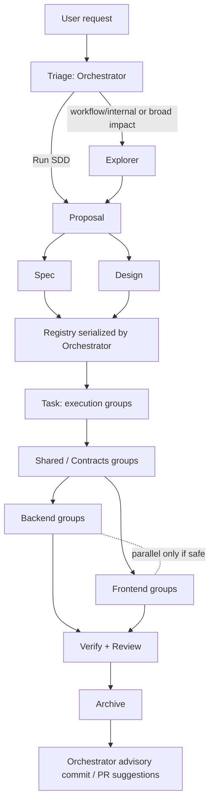

## Design Created

**Change**: `optimize-sdd-apply-and-commit-suggestions`
**Artifact Path**: `openspec/changes/optimize-sdd-apply-and-commit-suggestions/design.md`
**Artifact Exists**: `true`
**Artifact Byte Count**: `26481`
**Registry State Path**: `openspec/changes/optimize-sdd-apply-and-commit-suggestions/state.yaml`
**Registry Events Path**: `openspec/changes/optimize-sdd-apply-and-commit-suggestions/events.yaml`
**Registry Write**: deferred
**Registry Recorded**: not written by Design Agent in registry-deferred mode
**Registry Intent**: phase `design`, status `completed`, artifact `openspec/changes/optimize-sdd-apply-and-commit-suggestions/design.md`, event type `design.completed`
**Registry Event Note**: Design completed in registry-deferred mode; artifact self-verified on disk with `exists=true` and byte count `26481`. Orchestrator should serialize state/events after the parallel Spec+Design batch completes.
**Registry Blocker**: none
**Phase Status**: completed

### Summary
- **Approach**: Distributed skill-guidance update: Orchestrator schedules and presents, Task emits Apply execution groups, Apply agents execute ordered groups, phase agents self-verify persistence, Archive stays traceability-focused.
- **Components Affected**: 13 skill/config components.
- **Files Estimated**: 14 file/path entries in the impact estimate.
- **Risk Level**: Medium.
- **Open Decisions**: 4.
- **Migration Required**: no.
- **Spec Status**: not yet available.

### Blockers / Open Questions
- **Blockers**: none.
- **Open Decisions**:
  - Confirm whether prompt/skill guidance is sufficient or a separate launcher/runtime layer also needs enforcement changes.
  - Decide whether commit suggestions should be one best candidate plus alternatives when ambiguous, or always multiple candidates.
  - Decide whether optional PR title/body appears after every Archive or only when a PR workflow is detected/requested.
  - Decide whether persistence-hardening wording should also be centralized in shared guidance if such a shared mechanism is introduced later.

### Key Tradeoffs
- Distributed skill updates over Orchestrator-only guidance — aligns Orchestrator, Task, Apply, and phase-agent contracts.
- Execution groups over one task per Apply launch — improves context continuity while keeping safe fanout available.
- Orchestrator-owned post-Archive Git suggestions over Archive-owned suggestions — preserves Archive traceability boundary and keeps user-facing synthesis centralized.
- Phase-agent self-verification plus Orchestrator registry gates over Orchestrator-only verification — reduces false-positive phase completion.

### Mermaid Source for Orchestrator Display

### Diagram-Ready Summary

| Node | Summary |
|---|---|
| Orchestrator | Owns triage, registry gates, Apply scheduling, Mermaid presentation, config override provenance, post-Archive Git suggestions |
| Task | Emits execution groups and dependency/fanout data |
| Apply agents | Execute ordered assigned groups, not just one task by default |
| Phase agents | Persist artifacts and self-verify artifact/registry or deferred registry intent |
| Archive | Closes traceability; Git suggestions remain Orchestrator-owned |

### Next Step
Ready for Task (`deck-developer-task`) to combine with Spec and break into implementation tasks.
