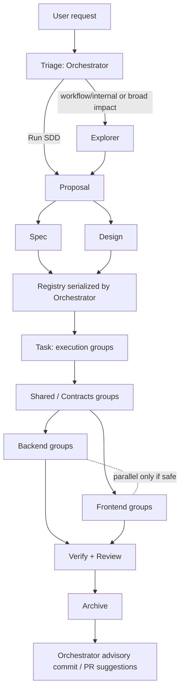

# Design: Optimize SDD Apply Dispatch and Commit Suggestions

## Source

- Proposal: `optimize-sdd-apply-and-commit-suggestions` proposal artifact
- Exploration: `openspec/changes/optimize-sdd-apply-and-commit-suggestions/exploration.md`
- Capabilities affected: `sdd-post-archive-git-suggestions`, `sdd-phase-artifact-verification`, `orchestrator-agent-config-respect`, `sdd-phase-mermaid-summaries`, `sdd-apply-orchestration`, `sdd-explorer-triage`, `orchestrator-role-based-delegation`, `sdd-phase-sequence`, `human-git-control`
- Spec status: not yet available
- Registry mode: registry-deferred; this Design writes `design.md` only and returns registry intent for Orchestrator serialization.
- Adaptive context: not loaded; no memory adapter tools were available in this run.

## Current Architecture Context

- `.pi/skills/deck-developer-orchestrator/SKILL.md` owns SDD triage, phase routing, registry phase gates, parallel Spec+Design and Verify+Review registry-deferred handling, Apply routing, and user-facing synthesis.
- Current Apply routing is dependency-aware but underspecified:
  - Task Agent recommends owner: General, Backend, Frontend.
  - Orchestrator classifies tasks as unblocked/blocked/allowed-with-placeholder.
  - Shared/contracts usually run before backend/frontend; backend/frontend may run in parallel only when contracts are clear.
  - The skill does not define execution groups, fanout criteria, or how many tasks one Apply launch should receive.
- `.pi/skills/deck-developer-task/SKILL.md` already groups tasks into Shared / Contracts, Backend, and Frontend and produces dependency, parallelization, responsibility-contract, complexity, and review workload sections. It does not explicitly emit an Apply execution-group contract for Orchestrator scheduling.
- `.pi/skills/deck-developer-apply-general/SKILL.md`, `.pi/skills/deck-developer-apply-backend/SKILL.md`, and `.pi/skills/deck-developer-apply-frontend/SKILL.md` receive assigned task numbers and can update `apply-progress.md`; they do not explicitly say that assigned work may be a coherent ordered group instead of a single task.
- Phase skills persist artifacts and registries, but most do not require explicit on-disk self-verification evidence before reporting success. Current state for this change records previous false-positive persistence that required Orchestrator repair.
- Orchestrator registry gates verify artifact/registry existence before phase advancement, but this must be paired with phase-agent self-verification to prevent completed reports with missing files.
- `.pi/agents/deck-developer-*.md` agent configs include registered execution settings such as `model`, `tools`, `thinking`, `systemPromptMode`, `inheritProjectContext`, and `inheritSkills`; no workflow skill currently states a provenance rule for overrides.
- Orchestrator visual guidance currently allows brief visual summaries but explicitly says to avoid Mermaid syntax in user-facing copy. The proposal requires a phase-specific exception/replacement for Proposal, Spec, Design, and Task summaries.
- `.pi/skills/deck-developer-archive/SKILL.md` owns traceability and archive movement, not Git commit/PR suggestions.

## Proposed Architecture

Use distributed prompt/guidance updates with Orchestrator as the coordinating boundary:

1. **Orchestrator remains the scheduler and user-facing owner**:
   - expands triage triggers for Explorer-before-Proposal;
   - applies role-based delegation outside formal SDD when specialist rules trigger;
   - respects registered agent execution config by default;
   - verifies phase artifacts/registry before advancement;
   - converts Task execution groups into Apply launches;
   - presents Mermaid-backed summaries after Proposal, Spec, Design, and Task;
   - generates advisory Git suggestions after Archive.
2. **Task becomes the Apply batch planning source**:
   - keep existing task groups, dependency graph, and parallelization plan;
   - add an explicit `Apply Execution Groups` section or equivalent diagram-ready structure with group IDs, owner, ordered task IDs, dependency gates, touched areas/files, fanout safety, and verification scope.
3. **Apply agents become batch executors**:
   - accept an ordered list of related tasks or execution group(s) assigned by Orchestrator;
   - execute in order within a group;
   - stop/report blockers at group boundaries rather than inventing cross-boundary fixes;
   - update progress per task and per assigned group.
4. **Phase-agent persistence hardening is repeated at each phase boundary**:
   - every phase skill that writes artifacts must self-verify required files on disk before claiming completion;
   - non-deferred phases also verify registry state/event entries;
   - deferred phases verify artifact existence and return registry intent, explicitly not claiming registry writes.
5. **Mermaid remains explanatory and runner-agnostic**:
   - Proposal, Spec, Design, and Task agents provide compact Mermaid source or diagram-ready data in their artifacts/return contracts;
   - Orchestrator renders/presents concise fenced `mermaid` blocks in user-facing phase summaries;
   - diagrams never replace authoritative OpenSpec text or registry entries, and equivalent text remains present.
6. **Archive remains traceability-focused**:
   - Archive may be updated for self-verification and to clarify it does not own Git suggestions;
   - Orchestrator uses completed change/diff context after Archive to suggest commit message(s) and optional PR metadata without mutating Git state.

### Component / Module Boundaries

| Component | Responsibility | Change Type |
|---|---|---|
| `.pi/skills/deck-developer-orchestrator/SKILL.md` | SDD triage, delegation, scheduling, registry gates, Apply batching, user-facing summaries, post-Archive Git suggestions, config override provenance | modified |
| `.pi/skills/deck-developer-task/SKILL.md` | Transform Spec+Design into task plan and authoritative Apply execution groups | modified |
| `.pi/skills/deck-developer-apply-general/SKILL.md` | Execute shared/general ordered task groups and report per-task/group progress | modified |
| `.pi/skills/deck-developer-apply-backend/SKILL.md` | Execute backend ordered task groups behind shared/backend contract gates | modified |
| `.pi/skills/deck-developer-apply-frontend/SKILL.md` | Execute frontend ordered task groups behind shared/frontend contract gates | modified |
| `.pi/skills/deck-developer-proposal/SKILL.md` | Persist proposal, self-verify artifact/registry, provide proposal diagram source/data | modified |
| `.pi/skills/deck-developer-spec/SKILL.md` | Persist spec, support registry-deferred self-verification, provide requirements diagram source/data | modified |
| `.pi/skills/deck-developer-design/SKILL.md` | Persist design, support registry-deferred self-verification, provide architecture/lifecycle diagram source/data | modified |
| `.pi/skills/deck-developer-explorer/SKILL.md` | Persist exploration and self-verify artifact/registry before completion | modified |
| `.pi/skills/deck-developer-verify/SKILL.md` | Persist verify report and self-verify artifact/registry or deferred intent | modified |
| `.pi/skills/deck-developer-review/SKILL.md` | Persist review report and self-verify artifact/registry or deferred intent | modified |
| `.pi/skills/deck-developer-archive/SKILL.md` | Persist/archive traceability, self-verify archive movement/registry, clarify Git suggestions are Orchestrator-owned if needed | modified |
| `.pi/agents/deck-developer-*.md` | Registered execution config source of truth (`model`, `tools`, `thinking`, inheritance settings) | unchanged unless a config defect is discovered |
| `openspec/changes/{change-name}/state.yaml` and `events.yaml` | Official phase registry; Orchestrator serializes deferred Spec/Design intents | unchanged by this phase; future phases modify through registry rules |

### Apply Batching Architecture

**Task-to-Apply contract**

Task artifact should expose execution groups with this shape (as markdown table or diagram-ready structured bullets):

| Field | Meaning |
|---|---|
| `Group ID` | Stable group label, e.g. `G1-shared-contracts`, `G2-backend-routing` |
| `Owner` | General Apply, Backend Apply, or Frontend Apply |
| `Ordered Tasks` | Task IDs in the sequence the assigned Apply agent must follow |
| `Depends On` | Group IDs or task IDs that must complete first |
| `Touched Areas / Files` | Expected file/component/service areas used for conflict checks |
| `Contracts Produced` | Shared types/API/schema/prompt contracts this group establishes |
| `Contracts Consumed` | Upstream contracts required before this group can run |
| `Can Parallel With` | Group IDs safe to run concurrently, with rationale |
| `Fanout Safety` | Independent areas, no overlapping files, no ordering dependency, low conflict risk, independent verification |
| `Verification Scope` | Checks the Apply agent should run for that group |

**Orchestrator scheduling rules**

- Build an execution DAG from Task groups and dependencies.
- Gate 1: block Apply if Task artifact has unresolved implementation-blocking questions, missing execution groups, or ambiguous owner/context.
- Gate 2: run shared/contracts groups first when downstream groups consume their outputs.
- Gate 3: fan out only when all criteria hold:
  - no direct dependency between candidate groups;
  - no overlapping files/components/services or stateful resources;
  - no shared contract still in flux;
  - independent verification commands/checks exist;
  - conflict risk is low and rollback/repair can be localized;
  - each group has a clear owner and bounded context.
- Gate 4: backend/frontend parallelization is allowed only after shared/API/prompt contracts are explicit and neither side must invent or reshape the contract.
- Default launch unit: one coherent execution group per Apply agent. The Orchestrator may assign multiple ordered groups to one Apply launch when they share owner/context and a sequential dependency, and parallelism would only add overhead.
- Avoid one-task-per-agent fanout unless tasks are genuinely independent and context-light.
- Avoid broad mega-batches when a group crosses owner boundaries, touches unrelated files, or exceeds the review workload budget.

### Data Flow

1. User request enters Orchestrator.
2. Orchestrator triage classifies Direct, Specialist only, Recommend SDD, or Run SDD.
3. If the request involves codebase/architecture/agent config/prompts/SDD internals/OpenSpec/routing/broad impact and details are not already known, Orchestrator runs Explorer before Proposal.
4. Proposal writes `proposal.md`; Proposal return/artifact includes text summary plus proposal Mermaid source or diagram-ready scope flow.
5. Orchestrator verifies Proposal artifact/registry, presents a Mermaid-backed user summary, then runs Spec and Design in registry-deferred mode.
6. Spec and Design each write only their artifact, self-verify artifact existence, and return registry intent plus diagram source/data.
7. Orchestrator serializes Spec+Design registry updates, verifies official registry state/events, then presents Mermaid-backed summaries.
8. Task consumes Spec+Design and writes `tasks.md`, including `Apply Execution Groups`, dependency/fanout data, and Mermaid source/data for execution flow.
9. Orchestrator validates task blockers and execution groups, then dispatches Apply agents by group DAG.
10. Apply agents update `apply-progress.md` per task/group; Orchestrator coordinates any sequential gates or safe fanout.
11. Verify and Review run after Apply per existing parallel/deferred rules.
12. Archive closes the change and preserves traceability.
13. Orchestrator inspects completed change/diff context and presents advisory conventional commit message(s) and optional PR title/body; it does not commit, push, branch, or open PRs.

### Mermaid Summary Source

Diagram-ready summary for Orchestrator display:

| Node | Summary |
|---|---|
| Orchestrator | Owns triage, phase gates, Apply scheduling, Mermaid presentation, config override provenance, post-Archive Git suggestions |
| Task | Emits execution groups and dependency/fanout data |
| Apply agents | Execute ordered assigned groups, not just one task by default |
| Phase agents | Persist artifacts and self-verify artifact/registry or deferred registry intent |
| Archive | Closes traceability; Git suggestions remain Orchestrator-owned |

### API / Contract Implications

| Endpoint / Interface | Change | Backward Compatible |
|---|---|---|
| Task artifact contract (`tasks.md`) | Add `Apply Execution Groups` / diagram-ready dependency data used by Orchestrator for Apply scheduling | yes; existing task sections remain |
| Apply agent input contract | Assigned work may be ordered task lists or execution group IDs, not only isolated task numbers | yes; a single task is a degenerate one-task group |
| Apply progress artifact (`apply-progress.md`) | Progress should identify completed/blocked work per task and assigned group when grouped dispatch is used | yes; existing per-task format remains valid |
| Phase agent return contracts | Include self-verification evidence: artifact path, `exists=true`, byte count; for non-deferred phases registry state/event evidence; for deferred phases registry intent only | partial; stricter validation may reject previously accepted incomplete outputs |
| Orchestrator phase summaries | Proposal, Spec, Design, and Task summaries include fenced `mermaid` blocks or rendered equivalents, while text remains authoritative | yes; user-facing additive behavior |
| Orchestrator launch contract | Registered agent config is used by default; any execution-setting override requires explicit provenance | yes; prevents unintended overrides |
| Post-Archive Orchestrator summary | Adds advisory conventional commit and optional PR title/body suggestions without Git mutation | yes; advisory only |

### State / Persistence Implications

- No product database, runtime state, or external storage changes.
- OpenSpec registry files remain the authoritative phase state:
  - `openspec/changes/{change-name}/state.yaml`
  - `openspec/changes/{change-name}/events.yaml`
- Registry-deferred phases write only phase artifacts and return serialized registry intent to the Orchestrator.
- Self-verification evidence becomes part of the phase return contract and, where useful, phase provenance in registry updates performed by Orchestrator or non-deferred agents.
- Diagrams are persisted as explanatory artifact sections or return-contract data; they do not modify requirements, approvals, or registry state.

### Migration / Backward Compatibility

- No data migration required.
- Existing OpenSpec changes remain valid; new guidance applies to future phase runs after skill updates.
- Existing Task artifacts without `Apply Execution Groups` can be handled conservatively by Orchestrator:
  - request Task repair before Apply when grouping/fanout is ambiguous;
  - or fall back to current owner/dependency grouping only when safe and explicitly reported.
- Existing visual guidance in Orchestrator should be reconciled by replacing or narrowing “Avoid Mermaid syntax in user-facing copy” to a non-SDD/general-summary rule; SDD Proposal/Spec/Design/Task summaries are an explicit Mermaid exception.
- Agent config files remain unchanged unless implementation discovers invalid registered settings; the design relies on Orchestrator guidance to avoid passing overrides.

## File Impact Estimate

| File / Path | Action | Rationale |
|---|---|---|
| `.pi/skills/deck-developer-orchestrator/SKILL.md` | modify | Add Explorer triage triggers, role-based delegation outside SDD, Apply execution-group scheduling, fanout gates, registered-config override provenance, stricter artifact/registry gate checks, phase Mermaid presentation, and post-Archive advisory Git suggestions |
| `.pi/skills/deck-developer-task/SKILL.md` | modify | Add explicit Apply execution-group output contract and Mermaid/diagram-ready execution dependency data |
| `.pi/skills/deck-developer-apply-general/SKILL.md` | modify | Clarify General Apply may receive coherent ordered shared/general task groups and must report per-task/group progress |
| `.pi/skills/deck-developer-apply-backend/SKILL.md` | modify | Clarify Backend Apply may receive coherent ordered backend groups gated by shared/API contracts |
| `.pi/skills/deck-developer-apply-frontend/SKILL.md` | modify | Clarify Frontend Apply may receive coherent ordered frontend groups gated by shared/API contracts |
| `.pi/skills/deck-developer-proposal/SKILL.md` | modify | Add artifact/registry self-verification and proposal Mermaid source/diagram-ready summary data in artifact/return contract |
| `.pi/skills/deck-developer-spec/SKILL.md` | modify | Add artifact/registry or deferred-intent self-verification and requirements Mermaid source/diagram-ready summary data |
| `.pi/skills/deck-developer-design/SKILL.md` | modify | Add artifact/registry or deferred-intent self-verification and architecture/lifecycle Mermaid source/diagram-ready summary data |
| `.pi/skills/deck-developer-explorer/SKILL.md` | modify | Add artifact/registry self-verification before completed report |
| `.pi/skills/deck-developer-verify/SKILL.md` | modify | Add verify report self-verification and deferred registry-intent evidence |
| `.pi/skills/deck-developer-review/SKILL.md` | modify | Add review report self-verification and deferred registry-intent evidence |
| `.pi/skills/deck-developer-archive/SKILL.md` | modify | Add archive-report/archive-location self-verification; clarify Git suggestions are Orchestrator post-Archive behavior if needed |
| `.pi/agents/deck-developer-*.md` | unchanged | Registered configs are the source of truth; do not edit unless a concrete config defect is discovered during implementation |
| `openspec/changes/optimize-sdd-apply-and-commit-suggestions/design.md` | create | Official Design artifact for this phase |

## Testing Strategy

- Static artifact review:
  - confirm each modified skill has no contradictory instructions for the new behavior;
  - confirm Orchestrator no longer has an unconditional ban on user-facing Mermaid for SDD phase summaries;
  - confirm Apply routing does not imply one task per Apply launch.
- Contract checks on skill text:
  - phase skills require `exists=true` and byte count before success;
  - deferred phases state registry writes are not performed and return registry intent;
  - non-deferred phases verify state/event entries before claiming registry recorded.
- Scenario/dry-run validation:
  - sample Task output with shared, backend, and frontend groups produces shared-first scheduling and safe backend/frontend parallelization;
  - blocked group prevents downstream Apply launch;
  - missing artifact/registry evidence causes Orchestrator to stop or request repair;
  - post-Archive summary suggests commit/PR metadata without mutating Git.
- Regression checks:
  - existing single-task Apply assignment remains valid as a one-task execution group;
  - Direct and Specialist-only workflows remain available and do not force SDD.

## Observability / Error Handling

- Phase agents should fail closed:
  - if artifact write cannot be verified, return `blocked` with file path and error;
  - if non-deferred registry verification fails, return registry blocker and do not claim completed;
  - if registry-deferred mode is active, do not claim registry writes, only registry intent.
- Orchestrator should fail closed before phase advancement:
  - missing artifact, missing state phase entry, missing event, dropped prior registry history, bad return contract, or inconsistent counts stops progression.
- Apply scheduling should report why groups are serialized or parallelized, including dependency/fanout rationale.
- Override provenance should be visible whenever Orchestrator does not use registered config: explicit source, overridden fields, reason, and documented workflow rule or user instruction.

## Security / Performance / Accessibility Considerations

- Security:
  - Git suggestions are advisory only; no automatic commits, pushes, branch changes, PR creation, or credential use.
  - Registered execution-config respect reduces risk of accidentally granting tools/settings not present in agent config.
- Performance:
  - Apply batching reduces launch overhead and improves context continuity for related work.
  - Fanout remains constrained to low-conflict, independently verifiable groups to avoid rework.
- Accessibility:
  - Mermaid diagrams are supplemental; equivalent text summaries remain required.
  - Diagrams should not rely on color as the sole differentiator and should remain readable as fenced source when not rendered.

## Tradeoffs

| Decision | Chosen | Rejected Alternative | Rationale |
|---|---|---|---|
| Scope of guidance update | Distributed skill updates with Orchestrator as coordinator | Orchestrator-only update | Keeps Task output, Apply input, phase verification, and user-facing presentation contracts aligned instead of relying on one central prompt to compensate for ambiguous agent contracts |
| Apply dispatch unit | Coherent execution groups with ordered tasks | One Apply agent per task | Reduces overhead and preserves context for related work while still allowing one-task groups for independent work |
| Parallelization policy | Dependency-gated fanout with explicit safety criteria | Always parallelize backend/frontend after Task | Prevents shared-contract drift, file conflicts, duplicate context, and unverifiable partial work |
| Task contract | Add explicit execution-group/fanout data | Infer groups from existing Shared/Backend/Frontend sections only | Makes Orchestrator scheduling deterministic and repairable when grouping data is missing |
| Git suggestions ownership | Orchestrator post-Archive advisory output | Archive Agent generates commit/PR suggestions | Archive remains traceability-focused; Orchestrator is already the user-facing synthesizer and can use final archive/diff context |
| Persistence hardening | Both phase-agent self-verification and Orchestrator registry gate verification | Orchestrator-only verification | Prevents false-positive phase reports earlier and gives Orchestrator concrete evidence to validate |
| Registered execution config | Use agent config by default; overrides require provenance | Allow launch prompts to silently override model/context/thinking/tools | Preserves registered agent setup and makes rare exceptions auditable |
| Mermaid presentation | Phase agents supply source/data; Orchestrator presents user-facing diagrams | Phase agents directly own user-facing diagrams | Maintains the Orchestrator as single user-facing communicator while giving it phase-specific diagram inputs |
| Mermaid authority | Diagrams explanatory/non-authoritative | Diagrams become acceptance or registry source | Prevents diagram drift from changing scope or approval state |

## Risks

| Risk | Likelihood | Impact | Mitigation |
|---|---|---|---|
| Prompt/guidance changes may not control a separate launcher/runtime layer | Medium | High | Keep design environment-agnostic, but flag launcher coupling as an open decision; verify behavior in a dry run after prompt updates |
| Execution groups become too broad and reduce Apply quality | Medium | Medium | Require bounded owner/context, touched-area disclosure, review workload awareness, and split/serialize criteria |
| Overly conservative fanout loses performance benefit | Medium | Medium | Require Task to identify safe `Can Parallel With` groups and Orchestrator to explain serialization when it declines fanout |
| Parallel Apply groups conflict on hidden shared files | Medium | High | Use touched-area/file overlap checks, shared/contracts-first gate, and independent verification criteria |
| Self-verification wording diverges across phase skills | Medium | Medium | Use shared wording repeated consistently in each phase skill, with only artifact names/status values customized |
| Mermaid diagrams drift from authoritative artifacts | Medium | Medium | Mark diagrams explanatory, keep text equivalents, and make Orchestrator summaries reflect official artifacts/registry only |
| Commit/PR suggestion type or scope is ambiguous | Medium | Low | Provide multiple candidates or explicitly mark uncertainty; do not mutate Git state |
| Config override provenance is omitted in urgent flows | Low | Medium | Orchestrator phase gate should reject launch summaries that used overrides without provenance when overrides are visible in the workflow |

## Open Decisions

- Launcher coupling — confirm whether prompt/skill guidance is sufficient or whether a separate launcher/runtime layer also needs changes to enforce batching and registered config respect.
- Git suggestion format — decide whether Orchestrator should always show one best conventional commit plus alternatives when ambiguous, or always show multiple candidates.
- PR metadata trigger — decide whether optional PR title/body appears after every Archive or only when a PR workflow is detected/requested.
- Verification wording location — decide whether to also add a shared reusable persistence-hardening snippet outside individual skills if a shared guidance mechanism is introduced later.

## Dependencies

- Spec artifact may refine externally observable behavior; Task should reconcile Spec and Design before implementation.
- Access to final diff/change context after Archive for advisory commit/PR suggestions.
- Existing `.pi/agents/deck-developer-*.md` registered configs remain the source of execution settings.
- Mermaid-compatible markdown presentation is optional by runner; fenced source must remain readable when not rendered.

## Next Steps

Ready for Task (`deck-developer-task`) to break this design into implementation tasks, combined with Spec.
