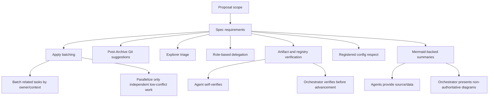

## Spec Created

**Change**: optimize-sdd-apply-and-commit-suggestions
**Artifact Path**: `openspec/changes/optimize-sdd-apply-and-commit-suggestions/spec.md`
**Artifact Exists**: true
**Artifact Byte Count**: 26098
**Registry State Path**: `openspec/changes/optimize-sdd-apply-and-commit-suggestions/state.yaml`
**Registry Events Path**: `openspec/changes/optimize-sdd-apply-and-commit-suggestions/events.yaml`
**Registry Write**: deferred
**Registry Recorded**: phase `spec`, status `not-recorded-deferred`, event `not-recorded-deferred`
**Registry Intent**: phase `spec`, status `completed`, artifact `openspec/changes/optimize-sdd-apply-and-commit-suggestions/spec.md`, event type `spec.completed`, event note `Spec phase completed in registry-deferred mode; spec.md verified on disk with exists=true and byte_count=26098. Orchestrator should serialize registry state/event after parallel phase completion.`
**Registry Blocker**: none; registry write intentionally deferred per Orchestrator instruction
**Phase Status**: completed

### Summary
- **Capabilities Specified**: 7 capabilities
- **Total Requirements**: 26 requirements (20 MUST, 6 SHOULD, 0 MAY)
- **Acceptance Scenarios**: 22 scenarios
- **Open Questions**: 7 questions remaining

### Key Requirements
- REQ-APPLY-001: Orchestrator must not default to one Apply agent per related task. (MUST)
- REQ-APPLY-003: Multi-agent Apply fanout is allowed only for independent, non-overlapping, low-conflict, independently verifiable work. (MUST)
- REQ-GIT-001: After Archive, Orchestrator must suggest advisory conventional commit message(s). (MUST)
- REQ-TRIAGE-001: Explorer-before-Proposal must cover codebase, architecture, agent config, prompts, workflow, OpenSpec, routing, and broad-impact changes. (MUST)
- REQ-VERIFY-003: In registry-deferred mode, phase agents must verify artifacts and return registry intent without claiming registry writes. (MUST)
- REQ-CONFIG-001: Orchestrator must respect registered agent execution configuration by default. (MUST)
- REQ-MERMAID-001: Orchestrator summaries after Proposal, Spec, Design, and Task must include concise Mermaid diagrams. (MUST)

### Blockers / Open Questions
- **Blockers**: none
- **Open Questions**:
  - Is launcher behavior fully prompt-driven, or is there separate runtime/configuration logic that also needs modification?
  - Should post-Archive PR title/body suggestions always be shown, or only when a PR workflow is detected or requested?
  - Should commit suggestions provide one best recommendation or multiple candidates when conventional commit type/scope is ambiguous?
  - Should artifact self-verification wording be repeated in every phase-agent skill, centralized in shared Developer Team guidance, or both?
  - What exact verification evidence should each phase return beyond the proposed minimal set?
  - Should Mermaid diagrams be required in both official artifact/agent return contract and Orchestrator summary, or should agents provide only diagram-ready structure?
  - Should existing Orchestrator guidance discouraging Mermaid syntax be replaced entirely or narrowed to non-SDD conversational summaries?

### Mermaid Source for Orchestrator Display

### Next Step
Ready for Design (`deck-developer-design`) and Task (`deck-developer-task`) consumption after Orchestrator serializes deferred registry updates for parallel phases.
