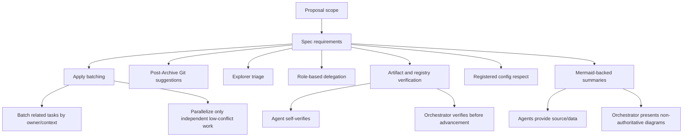

# Spec: Optimize SDD Apply Dispatch and Commit Suggestions

## Source

- Proposal: `optimize-sdd-apply-and-commit-suggestions` proposal artifact
- Exploration: `optimize-sdd-apply-and-commit-suggestions` exploration artifact
- Capabilities affected: `sdd-apply-orchestration`, `sdd-post-archive-git-suggestions`, `sdd-explorer-triage`, `orchestrator-role-based-delegation`, `sdd-phase-artifact-verification`, `orchestrator-agent-config-respect`, `sdd-phase-mermaid-summaries`
- Registry mode: deferred; this artifact defines registry intent only and does not update `state.yaml` or `events.yaml`.

## Requirements

### Capability: sdd-apply-orchestration

REQ-APPLY-001: The Orchestrator MUST NOT default to launching one Apply agent per task when tasks share a coherent owner, context, dependency chain, file area, component, service, or verification path.
  Priority: MUST
  Surface: General
  Rationale: Reduces unnecessary fanout and preserves context continuity for related work.

REQ-APPLY-002: The Orchestrator MUST group related Apply work into coherent batches by owner/context and may assign an ordered list of related tasks to one appropriately specialized Apply agent.
  Priority: MUST
  Surface: General
  Rationale: Ensures related implementation work is handled with shared context and explicit ordering.

REQ-APPLY-003: The Orchestrator MUST launch multiple Apply agents only when work areas are independent, non-overlapping, have no ordering dependency, have low conflict risk, and can be verified independently.
  Priority: MUST
  Surface: General
  Rationale: Keeps parallelism safe and prevents avoidable conflicts.

REQ-APPLY-004: Apply dispatch MUST preserve dependency-aware ordering, including shared/contracts work before dependent backend/frontend work and backend/frontend parallelism only when dependencies are clear.
  Priority: MUST
  Surface: General
  Rationale: Prevents dependent agents from implementing against unstable or missing contracts.

REQ-APPLY-005: Task output SHOULD provide execution groups and parallelization guidance that the Orchestrator can use as the primary source for Apply batching decisions.
  Priority: SHOULD
  Surface: General
  Rationale: Keeps Apply dispatch grounded in the formal task plan.

### Capability: sdd-post-archive-git-suggestions

REQ-GIT-001: After Archive completes, the Orchestrator MUST provide advisory conventional commit message suggestion(s) based on the completed change/diff context.
  Priority: MUST
  Surface: UI
  Rationale: Helps users finish changes with consistent Git metadata.

REQ-GIT-002: Post-Archive Git suggestions MUST NOT automatically commit, push, change branches, create PRs, or otherwise mutate Git state.
  Priority: MUST
  Surface: Security
  Rationale: Preserves human control of repository state.

REQ-GIT-003: The Orchestrator SHOULD provide optional PR title/body suggestions after Archive when sufficient completed change/diff context exists.
  Priority: SHOULD
  Surface: UI
  Rationale: Assists users preparing review metadata without requiring automation.

REQ-GIT-004: When conventional commit type or scope is ambiguous, suggestions SHOULD be labeled advisory and may include multiple candidates or note the ambiguity.
  Priority: SHOULD
  Surface: UI
  Rationale: Avoids presenting inferred Git metadata as authoritative.

### Capability: sdd-explorer-triage

REQ-TRIAGE-001: Before Proposal, the Orchestrator MUST route to Explorer when requested work requires codebase, architecture, agent configuration, prompt, SDD workflow, OpenSpec, routing, or broad-impact understanding.
  Priority: MUST
  Surface: General
  Rationale: Ensures Proposal is informed by appropriate discovery for high-impact workflow changes.

REQ-TRIAGE-002: Explorer-before-Proposal triage MUST treat internal workflow and agent-system changes as eligible for exploration even when they do not modify product code.
  Priority: MUST
  Surface: General
  Rationale: Prevents prompt/configuration/workflow changes from bypassing discovery.

### Capability: orchestrator-role-based-delegation

REQ-DELEGATION-001: Outside formal SDD and direct workflows, the Orchestrator MUST apply specialized role-based delegation when registered delegation rules trigger.
  Priority: MUST
  Surface: General
  Rationale: Preserves specialized agent responsibilities in non-SDD contexts.

REQ-DELEGATION-002: Role-based delegation outside SDD MUST NOT redefine or skip the formal SDD phase sequence when the user is running an SDD workflow.
  Priority: MUST
  Surface: General
  Rationale: Keeps formal SDD authoritative while allowing delegation elsewhere.

### Capability: sdd-phase-artifact-verification

REQ-VERIFY-001: A phase agent MUST self-verify required artifact files exist on disk before claiming phase completion.
  Priority: MUST
  Surface: Data
  Rationale: Prevents false-positive completion reports for missing artifacts.

REQ-VERIFY-002: In non-deferred registry mode, a phase agent MUST verify required registry state/event persistence before claiming completion.
  Priority: MUST
  Surface: Data
  Rationale: Ensures official OpenSpec registry reflects reported phase completion.

REQ-VERIFY-003: In registry-deferred mode, a phase agent MUST verify the phase artifact exists and return registry intent instead of claiming registry writes.
  Priority: MUST
  Surface: Data
  Rationale: Supports safe parallel phases without concurrent registry writes.

REQ-VERIFY-004: The Orchestrator MUST verify official artifact and registry state before advancing to the next phase that depends on those records.
  Priority: MUST
  Surface: Data
  Rationale: Makes official OpenSpec artifacts and registry entries the source of truth for phase advancement.

REQ-VERIFY-005: Completion evidence SHOULD include the artifact path, `exists=true`, byte count, phase status, registry intent or recorded event type, and any blocker.
  Priority: SHOULD
  Surface: Data
  Rationale: Provides compact, testable verification evidence.

### Capability: orchestrator-agent-config-respect

REQ-CONFIG-001: The Orchestrator MUST use registered agent execution configuration by default, including model, context, thinking, tools, and similar settings.
  Priority: MUST
  Surface: General
  Rationale: Prevents arbitrary launcher overrides from bypassing registered agent configuration.

REQ-CONFIG-002: The Orchestrator MUST NOT override registered execution configuration unless explicitly requested by the user or required by documented workflow rules.
  Priority: MUST
  Surface: General
  Rationale: Keeps exceptions deliberate and auditable.

REQ-CONFIG-003: When an allowed execution-configuration override is used, the Orchestrator SHOULD identify the basis for the override in its delegation context or summary.
  Priority: SHOULD
  Surface: General
  Rationale: Provides provenance for non-default execution behavior.

### Capability: sdd-phase-mermaid-summaries

REQ-MERMAID-001: After Proposal, Spec, Design, and Task phases, the Orchestrator MUST include a concise Mermaid diagram in its user-facing phase summary.
  Priority: MUST
  Surface: UI
  Rationale: Improves user comprehension of phase outputs across supported runners.

REQ-MERMAID-002: Phase agents for Proposal, Spec, Design, and Task SHOULD provide Mermaid source or diagram-ready data in artifacts or return contracts when useful for Orchestrator summaries.
  Priority: SHOULD
  Surface: Data
  Rationale: Enables consistent summaries while keeping presentation ownership with the Orchestrator.

REQ-MERMAID-003: Mermaid diagrams MUST be explanatory and non-authoritative; official OpenSpec artifacts and registry entries remain authoritative.
  Priority: MUST
  Surface: General
  Rationale: Prevents diagrams from replacing required textual specifications or registry records.

REQ-MERMAID-004: Mermaid summaries MUST be runner-agnostic and remain understandable as fenced source when a runner does not render Mermaid.
  Priority: MUST
  Surface: UI
  Rationale: Maintains usability across rendering environments.

REQ-MERMAID-005: Phase-summary guidance that discourages Mermaid syntax MUST be reconciled so it does not prohibit the required Proposal, Spec, Design, and Task summary diagrams.
  Priority: MUST
  Surface: UI
  Rationale: Removes conflict between existing visual guidance and the new phase-specific requirement.

## Acceptance Scenarios

### Capability: sdd-apply-orchestration

#### Scenario: Related tasks are batched into one ordered Apply assignment
**Given** a Task artifact defines related shared and backend tasks that touch the same service or contract
**When** the Orchestrator dispatches Apply work
**Then** it assigns the related tasks as an ordered list to one suitable Apply agent instead of launching one agent per task
> Covers: REQ-APPLY-001, REQ-APPLY-002, REQ-APPLY-004, REQ-APPLY-005

#### Scenario: Independent work is safely parallelized
**Given** a Task artifact defines frontend and backend work with non-overlapping files/components/services, no ordering dependency, low conflict risk, and independent verification paths
**When** the Orchestrator dispatches Apply work
**Then** it may launch separate appropriately specialized Apply agents for those independent areas
> Covers: REQ-APPLY-003, REQ-APPLY-005

#### Scenario: Shared contract work blocks dependent parallelism
**Given** frontend and backend tasks both depend on a shared contract task
**When** the Orchestrator plans Apply dispatch
**Then** it schedules or delegates the shared/contract task before dependent backend/frontend work and does not parallelize dependent work until dependencies are clear
> Covers: REQ-APPLY-004

#### Scenario: Conflict risk prevents multi-agent fanout
**Given** two tasks appear independent but modify overlapping files, components, services, or verification fixtures
**When** the Orchestrator evaluates Apply fanout
**Then** it keeps the tasks in one ordered batch or otherwise avoids parallel Apply agents for those tasks
> Covers: REQ-APPLY-001, REQ-APPLY-003

### Capability: sdd-post-archive-git-suggestions

#### Scenario: Archive completion produces advisory Git metadata
**Given** Archive has completed and completed change/diff context is available
**When** the Orchestrator presents the post-Archive summary
**Then** it includes advisory conventional commit suggestion(s) and optional PR title/body suggestions when sufficient context exists
> Covers: REQ-GIT-001, REQ-GIT-003

#### Scenario: Git suggestions do not mutate repository state
**Given** Archive has completed
**When** the Orchestrator provides commit or PR metadata suggestions
**Then** no commit, push, branch change, PR creation, or other Git-state mutation occurs automatically
> Covers: REQ-GIT-002

#### Scenario: Ambiguous conventional commit suggestion
**Given** the completed diff supports more than one plausible conventional commit type or scope
**When** the Orchestrator generates post-Archive suggestions
**Then** it labels the suggestions as advisory and either presents multiple candidates or notes the ambiguity
> Covers: REQ-GIT-004

### Capability: sdd-explorer-triage

#### Scenario: Internal workflow change triggers Explorer before Proposal
**Given** a user requests a change involving agent configuration, prompts, SDD workflow internals, OpenSpec behavior, routing, or broad project impact
**When** the Orchestrator performs pre-Proposal triage
**Then** it routes to Explorer before Proposal
> Covers: REQ-TRIAGE-001, REQ-TRIAGE-002

#### Scenario: Product architecture change triggers Explorer before Proposal
**Given** a user requests a change that requires codebase or architecture understanding
**When** the Orchestrator performs pre-Proposal triage
**Then** it routes to Explorer before Proposal
> Covers: REQ-TRIAGE-001

### Capability: orchestrator-role-based-delegation

#### Scenario: Specialized delegation outside formal SDD
**Given** the user is not running formal SDD or a direct workflow and a registered specialized delegation rule triggers
**When** the Orchestrator handles the request
**Then** it delegates to the appropriate specialized role according to registered rules
> Covers: REQ-DELEGATION-001

#### Scenario: Formal SDD sequence remains authoritative
**Given** the user is running a formal SDD workflow
**When** specialized role rules would otherwise apply
**Then** the Orchestrator preserves the formal SDD phase sequence and does not skip required phases because of non-SDD delegation rules
> Covers: REQ-DELEGATION-002

### Capability: sdd-phase-artifact-verification

#### Scenario: Phase agent verifies artifact before success
**Given** a phase agent has written its required artifact
**When** it prepares its completion response
**Then** it verifies the artifact exists on disk and reports completion evidence including path and byte count
> Covers: REQ-VERIFY-001, REQ-VERIFY-005

#### Scenario: Non-deferred registry mode requires registry verification
**Given** a phase runs in non-deferred registry mode
**When** the phase agent prepares to claim completion
**Then** it verifies required artifact, state, and event persistence before reporting completed status
> Covers: REQ-VERIFY-001, REQ-VERIFY-002, REQ-VERIFY-005

#### Scenario: Registry-deferred phase returns intent only
**Given** a phase runs in registry-deferred mode
**When** the phase agent prepares its completion response
**Then** it verifies the phase artifact exists and returns registry intent without writing or claiming registry updates
> Covers: REQ-VERIFY-003, REQ-VERIFY-005

#### Scenario: Orchestrator blocks advancement on missing official records
**Given** a phase agent reports completion but the official artifact or required registry record is missing
**When** the Orchestrator verifies phase completion before advancement
**Then** it does not advance the dependent phase and reports or repairs the persistence issue according to workflow rules
> Covers: REQ-VERIFY-004

### Capability: orchestrator-agent-config-respect

#### Scenario: Registered configuration is used by default
**Given** an agent has registered execution configuration
**When** the Orchestrator launches that agent
**Then** it uses the registered configuration without arbitrary model, context, thinking, tools, or similar overrides
> Covers: REQ-CONFIG-001

#### Scenario: Explicit override is allowed and identified
**Given** the user explicitly requests an execution-configuration override or a documented workflow rule requires one
**When** the Orchestrator launches an agent with the override
**Then** the override is allowed and its basis is identifiable in delegation context or summary
> Covers: REQ-CONFIG-002, REQ-CONFIG-003

#### Scenario: Undocumented override is rejected
**Given** no explicit user request and no documented workflow rule requires an override
**When** an Orchestrator launch would override registered execution configuration
**Then** the override is not used
> Covers: REQ-CONFIG-002

### Capability: sdd-phase-mermaid-summaries

#### Scenario: Orchestrator summary includes Mermaid after each planning phase
**Given** Proposal, Spec, Design, or Task phase has completed
**When** the Orchestrator presents the user-facing phase summary
**Then** the summary includes a concise fenced Mermaid diagram for that phase
> Covers: REQ-MERMAID-001, REQ-MERMAID-004

#### Scenario: Agent provides diagram-ready source data
**Given** a Proposal, Spec, Design, or Task phase agent has phase relationships that can be summarized visually
**When** it writes its artifact or return contract
**Then** it should include Mermaid source or diagram-ready data that the Orchestrator may use for the user-facing summary
> Covers: REQ-MERMAID-002

#### Scenario: Diagram does not replace authoritative text
**Given** a Mermaid diagram appears in a phase summary or artifact
**When** a diagram conflicts with official textual requirements, design, tasks, or registry entries
**Then** the official OpenSpec artifact text and registry entries are authoritative
> Covers: REQ-MERMAID-003

#### Scenario: Mermaid discouragement guidance is reconciled
**Given** existing guidance discourages Mermaid syntax in user-facing copy
**When** applying Proposal, Spec, Design, or Task phase-summary rules
**Then** that discouragement does not prohibit the required phase-specific Mermaid diagram
> Covers: REQ-MERMAID-005

## Validation Rules

| Field / Input | Rule | Error Message | REQ-ID |
|---|---|---|---|
| Apply batch | Must be grouped by coherent owner/context when tasks are related | Apply dispatch must not default to one agent per related task | REQ-APPLY-001, REQ-APPLY-002 |
| Multi-agent Apply fanout | Must satisfy independence, non-overlap, no ordering dependency, low conflict risk, and independent verification | Parallel Apply fanout is not safe for this task group | REQ-APPLY-003 |
| Apply order | Shared/contracts dependencies must precede dependent work | Dependent Apply work cannot start before required shared/contracts work is clear | REQ-APPLY-004 |
| Post-Archive Git action | Suggestions are advisory only and must not mutate Git state | Automatic Git mutation is not allowed by this workflow | REQ-GIT-002 |
| Pre-Proposal triage | Codebase, architecture, agent config, prompt, workflow, OpenSpec, routing, or broad-impact changes require Explorer | Explorer is required before Proposal for this change type | REQ-TRIAGE-001 |
| Phase completion | Required artifact must exist on disk before completion is claimed | Phase artifact verification failed | REQ-VERIFY-001 |
| Registry-deferred phase | Must return registry intent and must not claim registry writes | Registry writes are deferred; return intent only | REQ-VERIFY-003 |
| Agent launch config | Registered execution configuration must be used unless allowed exception exists | Execution override requires explicit user request or documented workflow rule | REQ-CONFIG-001, REQ-CONFIG-002 |
| Phase summary | Proposal, Spec, Design, and Task summaries must include concise Mermaid source | Missing required phase-summary Mermaid diagram | REQ-MERMAID-001 |

## Error Contracts

| Condition | Error Code | Message | Status |
|---|---|---|---|
| Unsafe Apply parallelization criteria are not met | `APPLY_FANOUT_UNSAFE` | Parallel Apply fanout is unsafe; use an ordered batch or resolve dependencies first. | Blocked dispatch until regrouped |
| Phase agent cannot verify required artifact | `ARTIFACT_VERIFICATION_FAILED` | Required phase artifact does not exist or cannot be verified on disk. | Blocked phase completion |
| Phase agent cannot verify required registry in non-deferred mode | `REGISTRY_VERIFICATION_FAILED` | Required registry state or event is missing or unverifiable. | Blocked phase completion |
| Phase agent claims registry write in deferred mode | `REGISTRY_DEFERRED_WRITE_CLAIM` | Registry mode is deferred; phase may only return registry intent. | Blocked or corrected response |
| Orchestrator cannot verify official artifact/registry before phase advancement | `PHASE_ADVANCEMENT_VERIFICATION_FAILED` | Official phase records are missing or inconsistent; do not advance. | Blocked advancement |
| Undocumented execution configuration override attempted | `AGENT_CONFIG_OVERRIDE_NOT_ALLOWED` | Registered agent execution configuration must be respected unless an explicit exception applies. | Blocked launch or launch without override |
| Required Mermaid phase summary missing | `MERMAID_SUMMARY_MISSING` | Phase summary requires a concise Mermaid diagram. | Summary incomplete |

## States and Transitions

| State | Description | Entry Criteria |
|---|---|---|
| Apply Planning | Orchestrator is mapping Task execution groups to Apply assignments | Task artifact is available for Apply dispatch |
| Batched Apply Ready | Related work has been grouped into coherent ordered Apply assignments | Batching criteria and dependency ordering are satisfied |
| Parallel Apply Ready | Independent work has been approved for multi-agent fanout | All multi-agent criteria are satisfied |
| Phase Artifact Written | A phase artifact has been written by a phase agent | Artifact write operation completed |
| Phase Verified | Required artifact and applicable registry records or registry intent have been verified | Self-verification succeeds |
| Phase Advancement Ready | Orchestrator has verified official records needed to advance | Official artifact/registry verification succeeds |
| Archive Completed | Archive phase has completed and completed change/diff context is available | Archive completion is verified |
| Git Suggestions Presented | Advisory commit and optional PR metadata have been shown | Post-Archive suggestions are generated without Git mutation |

| From | To | Trigger | Side Effects |
|---|---|---|---|
| Apply Planning | Batched Apply Ready | Related tasks are grouped by owner/context with required ordering | One Apply agent can receive an ordered task list |
| Apply Planning | Parallel Apply Ready | Work satisfies all safe fanout criteria | Multiple Apply agents may be launched for independent areas |
| Phase Artifact Written | Phase Verified | Phase agent verifies artifact plus registry or registry intent as applicable | Completion evidence can be reported |
| Phase Verified | Phase Advancement Ready | Orchestrator verifies official artifact/registry records | Dependent phase may advance |
| Archive Completed | Git Suggestions Presented | Orchestrator evaluates completed change/diff context | Advisory Git/PR metadata is displayed; Git state is unchanged |

## Mermaid Summary Source

Diagram note: This Mermaid source is explanatory and non-authoritative. The requirements, scenarios, and OpenSpec registry are authoritative.

## Open Questions

- Is launcher behavior fully prompt-driven, or is there separate runtime/configuration logic that also needs modification?
- Should post-Archive PR title/body suggestions always be shown, or only when a PR workflow is detected or requested?
- Should commit suggestions provide one best recommendation or multiple candidates when conventional commit type/scope is ambiguous?
- Should artifact self-verification wording be repeated in every phase-agent skill, centralized in shared Developer Team guidance, or both?
- What exact verification evidence should each phase return beyond the proposed minimal set of `exists=true`, byte count, phase status, registry intent/recorded event type, and blockers?
- Should Mermaid diagrams be required in both the official artifact/agent return contract and the Orchestrator's user-facing phase summary, or should agents provide only diagram-ready structure while only the Orchestrator renders Mermaid to the user?
- Should the existing Orchestrator rule that says to avoid Mermaid syntax in user-facing copy be replaced entirely or narrowed to non-SDD conversational summaries?

## Compliance Matrix

| REQ-ID | Scenario(s) | Status |
|---|---|---|
| REQ-APPLY-001 | Related tasks are batched into one ordered Apply assignment; Conflict risk prevents multi-agent fanout | Defined |
| REQ-APPLY-002 | Related tasks are batched into one ordered Apply assignment | Defined |
| REQ-APPLY-003 | Independent work is safely parallelized; Conflict risk prevents multi-agent fanout | Defined |
| REQ-APPLY-004 | Related tasks are batched into one ordered Apply assignment; Shared contract work blocks dependent parallelism | Defined |
| REQ-APPLY-005 | Related tasks are batched into one ordered Apply assignment; Independent work is safely parallelized | Defined |
| REQ-GIT-001 | Archive completion produces advisory Git metadata | Defined |
| REQ-GIT-002 | Git suggestions do not mutate repository state | Defined |
| REQ-GIT-003 | Archive completion produces advisory Git metadata | Defined |
| REQ-GIT-004 | Ambiguous conventional commit suggestion | Defined |
| REQ-TRIAGE-001 | Internal workflow change triggers Explorer before Proposal; Product architecture change triggers Explorer before Proposal | Defined |
| REQ-TRIAGE-002 | Internal workflow change triggers Explorer before Proposal | Defined |
| REQ-DELEGATION-001 | Specialized delegation outside formal SDD | Defined |
| REQ-DELEGATION-002 | Formal SDD sequence remains authoritative | Defined |
| REQ-VERIFY-001 | Phase agent verifies artifact before success; Non-deferred registry mode requires registry verification | Defined |
| REQ-VERIFY-002 | Non-deferred registry mode requires registry verification | Defined |
| REQ-VERIFY-003 | Registry-deferred phase returns intent only | Defined |
| REQ-VERIFY-004 | Orchestrator blocks advancement on missing official records | Defined |
| REQ-VERIFY-005 | Phase agent verifies artifact before success; Non-deferred registry mode requires registry verification; Registry-deferred phase returns intent only | Defined |
| REQ-CONFIG-001 | Registered configuration is used by default | Defined |
| REQ-CONFIG-002 | Explicit override is allowed and identified; Undocumented override is rejected | Defined |
| REQ-CONFIG-003 | Explicit override is allowed and identified | Defined |
| REQ-MERMAID-001 | Orchestrator summary includes Mermaid after each planning phase | Defined |
| REQ-MERMAID-002 | Agent provides diagram-ready source data | Defined |
| REQ-MERMAID-003 | Diagram does not replace authoritative text | Defined |
| REQ-MERMAID-004 | Orchestrator summary includes Mermaid after each planning phase | Defined |
| REQ-MERMAID-005 | Mermaid discouragement guidance is reconciled | Defined |
