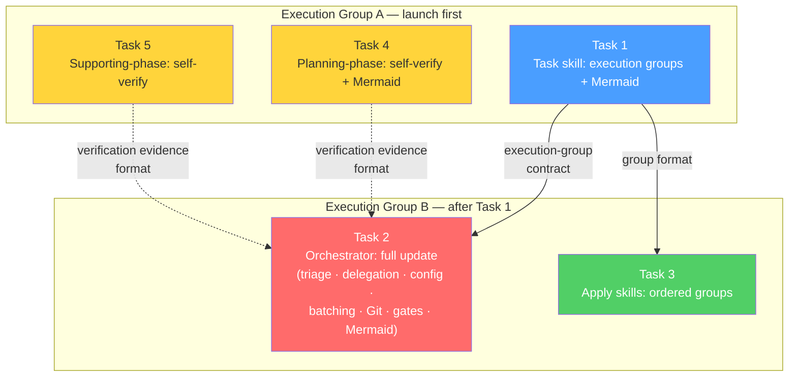

# Task Agent Output: optimize-sdd-apply-and-commit-suggestions

## Tasks Created

**Change**: optimize-sdd-apply-and-commit-suggestions
**Artifact Path**: `openspec/changes/optimize-sdd-apply-and-commit-suggestions/tasks.md`
**Registry State Path**: `openspec/changes/optimize-sdd-apply-and-commit-suggestions/state.yaml`
**Registry Events Path**: `openspec/changes/optimize-sdd-apply-and-commit-suggestions/events.yaml`
**Registry Recorded**: phase `task`, status `completed`, event `task.completed`
**Registry Blocker**: none

### Verification Evidence
- `tasks.md`: exists=true, byte_count=16249
- `state.yaml`: exists=true, task phase status=completed, all prior phases preserved (explore, proposal, spec, design)
- `events.yaml`: exists=true, task.completed event present, all 9 prior events preserved

### Summary
- **Total Tasks**: 5 tasks
- **Groups**: Shared: 5, Backend: 0, Frontend: 0 (all changes are prompt/guidance skill files)
- **Blocking Dependencies**: 2 pairs (Task 1 → Task 2, Task 1 → Task 3)
- **High Complexity Tasks**: 1 (Task 2: Orchestrator full update)
- **Review Workload Forecast**: Medium risk, 400-800 estimated lines, scope reduction: No, sequential slices: Yes (2 execution groups)
- **Open Questions**: 4 (all non-blocking or allowed-with-placeholder)

### Task Overview

| Task | Title | Owner | Priority | Complexity | Depends On |
|---|---|---|---|---|---|
| 1 | Task skill — Execution-group output contract and Mermaid data | General Apply | P0 | Medium | none |
| 2 | Orchestrator skill — Full orchestration update | General Apply | P0 | High | Task 1 |
| 3 | Apply skills — Ordered task group acceptance | General Apply | P1 | Low | Task 1 |
| 4 | Planning-phase skills — Self-verification and Mermaid data | General Apply | P1 | Medium | none |
| 5 | Supporting-phase skills — Self-verification | General Apply | P1 | Low | none |

### Routing Recommendations
- **General Apply**: Tasks 1, 2, 3, 4, 5 (all tasks)
- **Backend Apply**: none
- **Frontend Apply**: none

### Execution Groups

**Group A** (launch first, 3 tasks parallel):
- Task 1: Task skill execution groups
- Task 4: Planning-phase self-verification + Mermaid
- Task 5: Supporting-phase self-verification

**Group B** (after Task 1, 2 tasks parallel):
- Task 2: Orchestrator full update
- Task 3: Apply skills ordered groups

### Parallelization
- Execution Group A: Tasks 1, 4, 5 **can** run in parallel (no file overlap)
- Execution Group B: Tasks 2, 3 **can** run in parallel after Task 1 (no file overlap)
- Cross-group: Group B cannot start until Task 1 in Group A completes

### Blocker Classification
- **Unblocked**: All 5 tasks
- **Open questions**: 4 (launcher coupling, Git format, PR trigger, verification wording location) — all non-blocking or allowed-with-placeholder

### Review Workload Forecast
- Estimated changed lines: 400-800
- 400-line budget risk: Medium
- Scope reduction recommended: No
- Sequential work slices recommended: Yes (2 execution-group phases)
- Decision needed before Apply: No

### Mermaid Source for Orchestrator Display

Diagram note: This Mermaid source explains the task execution groups and dependencies — the substantive output of the Task phase. It is non-authoritative; the task descriptions and OpenSpec registry are authoritative.

### Next Step
Ready for Apply agents (`deck-developer-apply-general`) according to execution-group dependencies. Recommend 2 General Apply launches: one for Group A (Tasks 1+4+5) and one for Group B (Tasks 2+3).
