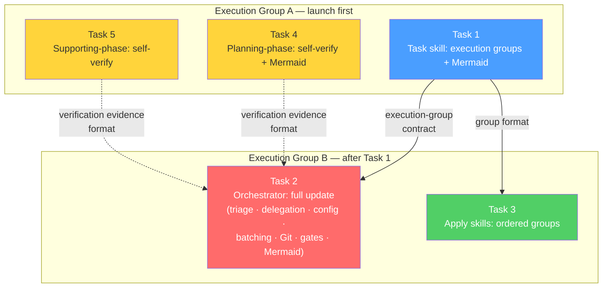

# Tasks: Optimize SDD Apply Dispatch and Commit Suggestions

## Source

- Spec: `optimize-sdd-apply-and-commit-suggestions` spec artifact
- Design: `optimize-sdd-apply-and-commit-suggestions` design artifact
- Capabilities affected: `sdd-apply-orchestration`, `sdd-post-archive-git-suggestions`, `sdd-explorer-triage`, `orchestrator-role-based-delegation`, `sdd-phase-artifact-verification`, `orchestrator-agent-config-respect`, `sdd-phase-mermaid-summaries`

## Task Groups

All tasks modify shared prompt/guidance skill files — there is no backend or frontend product code. Every task is routed to **General Apply**.

---

### Group: Shared / Contracts

#### Task 1: Task skill — Execution-group output contract and Mermaid data

**Owner**: General Apply
**Priority**: P0 (blocking)
**Complexity**: Medium
**Parallel**: Yes
**Depends on**: none

**Description**
Add an explicit `Apply Execution Groups` section to the Task skill output contract. This section must include group ID, owner, ordered task IDs, dependency gates, touched areas/files, contracts produced/consumed, `Can Parallel With` rationale, fanout safety criteria, and verification scope. Also add guidance for Task agents to provide Mermaid source or diagram-ready execution dependency data in artifacts/return contracts so the Orchestrator can present execution-group flow diagrams.

**Files**
- `.pi/skills/deck-developer-task/SKILL.md` — modify

**Verification**
- Task skill includes an `Apply Execution Groups` output section with all specified fields.
- Task skill includes Mermaid/diagram-ready guidance for execution dependency data.
- No contradiction with existing Shared/Backend/Frontend grouping or dependency-graph sections.

---

#### Task 2: Orchestrator skill — Full orchestration update

**Owner**: General Apply
**Priority**: P0 (blocking)
**Complexity**: High
**Parallel**: No — depends on Task 1 (execution-group contract)
**Depends on**: Task 1

**Description**
Apply all orchestration changes to the Orchestrator skill in one coherent update:

1. **Explorer-before-Proposal triage** (REQ-TRIAGE-001, REQ-TRIAGE-002): Expand triage triggers to route to Explorer when work involves codebase, architecture, agent config, prompts, SDD workflow internals, OpenSpec/routing, or broad project impact — even without product-code changes.
2. **Role-based delegation outside SDD** (REQ-DELEGATION-001, REQ-DELEGATION-002): Clarify that specialized delegation applies outside formal SDD/direct workflows when registered rules trigger, while formal SDD phase sequence remains authoritative.
3. **Registered config override provenance** (REQ-CONFIG-001..003): State that registered agent execution configuration (`model`, `context`, `thinking`, `tools`, etc.) is used by default; overrides require explicit user request or documented workflow rule, with provenance recorded in delegation context/summary.
4. **Apply execution-group scheduling** (REQ-APPLY-001..005): Convert Task execution groups into Apply-agent batches using the DAG from Task output. One coherent group per Apply agent as default; multi-agent fanout only when criteria hold (independent areas, non-overlapping files, no ordering dependency, low conflict risk, independent verification). Shared/contracts first; backend/frontend parallel only after dependencies clear.
5. **Post-Archive advisory Git suggestions** (REQ-GIT-001..004): After Archive completes, inspect change/diff context and suggest advisory conventional commit message(s) and optional PR title/body. Never commit, push, branch, or create PRs automatically. Label ambiguous suggestions as advisory with multiple candidates when needed.
6. **Phase artifact/registry gate verification** (REQ-VERIFY-004): Strengthen Orchestrator phase-advancement gates to verify official artifact existence and registry state/events before advancing dependent phases. Block advancement on missing records.
7. **Mermaid phase-summary presentation** (REQ-MERMAID-001..005): After Proposal, Spec, Design, and Task, include concise fenced `mermaid` blocks in user-facing summaries that explain substantive phase output (scope, requirements, architecture, execution groups). Reconcile existing "avoid Mermaid in user-facing copy" guidance so it does not prohibit these required phase-summary diagrams. Diagrams are non-authoritative; equivalent text must remain.

**Files**
- `.pi/skills/deck-developer-orchestrator/SKILL.md` — modify

**Verification**
- Orchestrator skill contains explicit triage triggers for internal/broad-impact changes routing to Explorer.
- Role-based delegation is scoped outside formal SDD with SDD sequence preserved.
- Config override rule states registered config is default, with provenance for exceptions.
- Apply dispatch references execution groups from Task output with batching rules and fanout criteria.
- Post-Archive section provides advisory Git suggestion guidance with no auto-mutation.
- Phase-advancement gate requires artifact/registry verification.
- Mermaid presentation guidance is present for Proposal, Spec, Design, and Task summaries.
- Existing Mermaid discouragement is reconciled (narrowed to non-SDD general summaries).
- No internal contradictions in the updated skill.

---

#### Task 3: Apply skills — Ordered task group acceptance

**Owner**: General Apply
**Priority**: P1
**Complexity**: Low
**Parallel**: No — depends on Task 1 (execution-group contract format)
**Depends on**: Task 1

**Description**
Update the three Apply agent skills to clarify that each may receive an ordered list of related tasks or execution group(s) from the Orchestrator. Apply agents must execute tasks in order within a group, stop/report blockers at group boundaries, and update progress per task and per assigned group. General Apply handles shared/general groups; Backend Apply handles backend groups gated by shared/API contracts; Frontend Apply handles frontend groups gated by shared/API contracts.

**Files**
- `.pi/skills/deck-developer-apply-general/SKILL.md` — modify
- `.pi/skills/deck-developer-apply-backend/SKILL.md` — modify
- `.pi/skills/deck-developer-apply-frontend/SKILL.md` — modify

**Verification**
- Each Apply skill states it may receive ordered task lists or execution groups.
- Each skill describes in-order execution within a group.
- Each skill describes per-task and per-group progress reporting.
- General, Backend, and Frontend variants reference their respective gate contexts (shared/general, API contracts, etc.).
- No contradiction with existing single-task assignment behavior.

---

#### Task 4: Planning-phase skills — Self-verification and Mermaid data

**Owner**: General Apply
**Priority**: P1
**Complexity**: Medium
**Parallel**: Yes
**Depends on**: none

**Description**
Add artifact/registry self-verification and Mermaid source/diagram-ready data to the four planning-phase skills:

- **Proposal** (non-deferred): Self-verify `proposal.md` exists on disk and registry state/events are persisted before claiming completion. Provide proposal Mermaid source (scope/decision flow) in artifact/return contract.
- **Spec** (deferred): Self-verify `spec.md` exists on disk; return registry intent (not registry writes) when deferred. Provide requirements/acceptance Mermaid source in artifact/return contract.
- **Design** (deferred): Self-verify `design.md` exists on disk; return registry intent when deferred. Provide architecture/lifecycle Mermaid source in artifact/return contract.
- **Task**: No additional self-verification beyond what the Task skill already defines for persistence. Mermaid guidance is covered in Task 1.

Completion evidence should include artifact path, `exists=true`, byte count, phase status, registry intent or recorded event type, and any blocker.

**Files**
- `.pi/skills/deck-developer-proposal/SKILL.md` — modify
- `.pi/skills/deck-developer-spec/SKILL.md` — modify
- `.pi/skills/deck-developer-design/SKILL.md` — modify

**Verification**
- Each planning-phase skill requires artifact self-verification (exists on disk) before claiming completion.
- Non-deferred phases (Proposal) also verify registry state/events.
- Deferred phases (Spec, Design) return registry intent and do not claim registry writes.
- Each skill provides Mermaid source or diagram-ready data guidance in artifact/return contract.
- Completion evidence format is specified (path, exists, bytes, status, registry intent/event, blockers).

---

#### Task 5: Supporting-phase skills — Self-verification

**Owner**: General Apply
**Priority**: P1
**Complexity**: Low
**Parallel**: Yes
**Depends on**: none

**Description**
Add artifact/registry self-verification to the four supporting-phase skills:

- **Explorer** (non-deferred): Self-verify `exploration.md` exists and registry is persisted before claiming completion.
- **Verify** (deferred): Self-verify verify report exists on disk; return registry intent when deferred.
- **Review** (deferred): Self-verify review report exists on disk; return registry intent when deferred.
- **Archive** (non-deferred): Self-verify archive report/movement and registry are persisted. Clarify that Git suggestions are Orchestrator post-Archive behavior, not Archive-owned.

Completion evidence format matches Task 4: artifact path, `exists=true`, byte count, phase status, registry intent or recorded event type, and any blocker.

**Files**
- `.pi/skills/deck-developer-explorer/SKILL.md` — modify
- `.pi/skills/deck-developer-verify/SKILL.md` — modify
- `.pi/skills/deck-developer-review/SKILL.md` — modify
- `.pi/skills/deck-developer-archive/SKILL.md` — modify

**Verification**
- Each supporting-phase skill requires artifact self-verification before claiming completion.
- Non-deferred phases (Explorer, Archive) verify both artifact and registry.
- Deferred phases (Verify, Review) return registry intent and do not claim registry writes.
- Archive skill clarifies Git suggestions are Orchestrator-owned.
- Completion evidence format is consistent with Task 4.

---

## Dependency Graph

```
Task 1 (Task skill: execution groups + Mermaid)
  → Task 2 (Orchestrator: full update)
  → Task 3 (Apply skills: ordered groups)

Task 4 (Planning-phase: self-verify + Mermaid)  — independent
Task 5 (Supporting-phase: self-verify)           — independent
```

## Parallelization Plan

| Phase | Tasks | Can Run in Parallel |
|---|---|---|
| A — Contracts + Independent phases | 1, 4, 5 | Yes — no file overlap |
| B — Orchestration consumers | 2, 3 | Yes after Task 1 — no file overlap between 2 and 3 |

## Execution Groups

### Execution Group A (launch first, parallel)

| Group ID | Owner | Ordered Tasks | Files Touched | Fanout Safety |
|---|---|---|---|---|
| `EG-A` | General Apply (3 parallel agents or 1 agent with 3 tasks) | Task 1, Task 4, Task 5 | Task skill, Proposal/Spec/Design skills, Explorer/Verify/Review/Archive skills | Independent files; no overlap; independent verification |

### Execution Group B (after Task 1, parallel)

| Group ID | Owner | Ordered Tasks | Files Touched | Fanout Safety |
|---|---|---|---|---|
| `EG-B` | General Apply (2 parallel agents or 1 agent with 2 tasks) | Task 2, Task 3 | Orchestrator skill, Apply-General/Backend/Frontend skills | Independent files; no overlap; Task 2 and 3 both consume Task 1 contract but do not share files |

### Scheduling Notes

- **Default**: Assign all tasks in one group to one General Apply agent executing in dependency order (1 → 4/5 parallel or sequential → 2 → 3).
- **Fanout option**: Launch up to 3 General Apply agents in Phase A (one per task), then up to 2 in Phase B. This is safe because no files overlap across tasks within each phase.
- **Recommended**: Use 2 General Apply launches — one for Phase A (Tasks 1+4+5 as ordered list) and one for Phase B (Tasks 2+3 as ordered list). This balances context continuity with reasonable parallelism.

## Responsibility Contracts

| Contract / Boundary | Owner | Consumers | Notes |
|---|---|---|---|
| Task execution-group output format | Task 1 (Task skill) | Task 2 (Orchestrator), Task 3 (Apply skills) | Orchestrator reads groups; Apply agents receive ordered task lists based on groups |
| Self-verification evidence format | Task 4, Task 5 (phase skills) | Task 2 (Orchestrator gate verification) | Phase agents produce evidence; Orchestrator validates before phase advancement |
| Mermaid diagram source/data | Task 1, Task 4 (planning-phase skills) | Task 2 (Orchestrator presentation) | Agents supply source; Orchestrator presents to user |
| Post-Archive Git suggestion behavior | Task 2 (Orchestrator) | User-facing only | Archive skill does not own Git suggestions |

## Complexity Summary

| Complexity | Count | Task Numbers |
|---|---|---|
| Low | 2 | 3, 5 |
| Medium | 2 | 1, 4 |
| High | 1 | 2 |

## Flagged for Splitting

- **Task 2**: Touches a single file but covers 7 capability areas (triage, delegation, config, Apply batching, Git suggestions, registry gates, Mermaid). If the Orchestrator skill is very large, the Orchestrator may ask the Apply agent to split into two sequential passes. Flagged but not required to split since all changes are to one file and benefit from coherent context.

## Review Workload Forecast

| Signal | Value |
|---|---|
| Estimated changed lines | 400-800 |
| 400-line budget risk | Medium |
| Scope reduction recommended | No |
| Sequential work slices recommended | Yes — two execution-group phases (A then B) |
| Decision needed before Apply | No |

**Rationale**: 12 skill files are modified with additive prompt/guidance changes. The Orchestrator skill (Task 2) accounts for roughly half the change volume. No product code is involved. The 400-line budget risk is medium because the Orchestrator skill update is substantial, but the changes are well-scoped by capability. Two sequential execution-group phases keep the review manageable.

## Open Questions / Blockers

- **Launcher coupling** (non-blocking): It is not confirmed whether prompt/guidance changes alone control launcher dispatch behavior. If a separate runtime layer enforces behavior, additional changes may be needed beyond prompt updates. Allowed-with-placeholder — proceed with prompt changes and verify in dry run.
- **Git suggestion format** (allowed-with-placeholder): Whether to always show one best conventional commit suggestion or multiple candidates when ambiguous is an open decision. The current spec allows either; Apply agents should implement "advisory with candidates when ambiguous" as the default.
- **PR metadata trigger** (allowed-with-placeholder): Whether optional PR title/body appears after every Archive or only when a PR workflow is detected is open. Implement as always-advisory (shown when context is sufficient) for now.
- **Self-verification wording location** (non-blocking): Whether to add a shared reusable persistence-hardening snippet in a common location or repeat in each skill is open. For now, repeat consistent wording in each skill per the Design's recommendation.

> All tasks are unblocked. Open questions are classified as non-blocking or allowed-with-placeholder. Implementation may proceed.

## Mermaid Summary Source



Diagram note: This Mermaid source is explanatory and non-authoritative. The task descriptions, dependency graph, and OpenSpec registry are authoritative.
