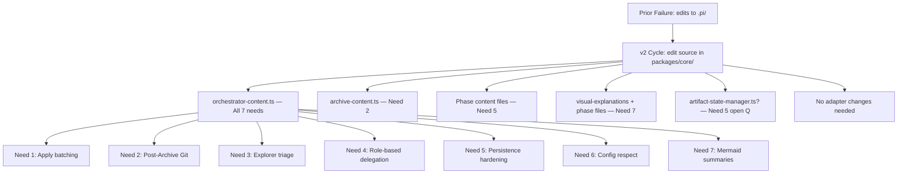

## Proposal Created

**Change**: optimize-sdd-v2-core-implementation
**Artifact Path**: `openspec/changes/optimize-sdd-v2-core-implementation/proposal.md`
**Registry State Path**: `openspec/changes/optimize-sdd-v2-core-implementation/state.yaml`
**Registry Events Path**: `openspec/changes/optimize-sdd-v2-core-implementation/events.yaml`
**Registry Recorded**: phase `proposal`, status `completed`, event `proposal.completed`
**Registry Blocker**: none

### Summary
- **Intent**: Implement 7 SDD orchestration improvements (Apply batching, post-Archive Git suggestions, Explorer triage, delegation clarity, persistence hardening, config respect, Mermaid summaries) in the correct source layer (`packages/core/`) instead of the prior failed target (`.pi/` adapter output).
- **Goal**: Make SDD orchestration faster, safer, and more reliable by updating canonical source content files that persist across adapter rebuilds.
- **Scope**: 8 deliverables in (7 content file updates + artifact-state-manager evaluation), adapter changes explicitly out of scope
- **Approach**: Update guidance text in `packages/core/src/teams/developer/` content files; adapter (`packages/adapter-pi/`) materializes changes to `.pi/` automatically with no adapter code changes needed.
- **Risk Level**: Medium (content-only changes but large surface area across 7 needs; 4 open questions for Design/Spec)
- **Open Questions**: 4 questions remaining (artifact-state-manager code needs? runtime launcher config overrides? Mermaid discouragement reconciliation? Mermaid in artifacts vs Orchestrator only?)

### Completion Evidence
- `proposal.md`: exists=true, 10,696 bytes
- `state.yaml`: phase `proposal` status `completed`, artifact `proposal.md`; prior `explore` phase preserved
- `events.yaml`: event `proposal.completed` present; prior events (`explore.started`, `explore.completed`, `change.created`) preserved

### Mermaid Source — Scope/Decision Structure

Diagram note: Mermaid source is explanatory and non-authoritative. The proposal text and OpenSpec registry are authoritative.

### Next Step
Ready for Spec (`deck-developer-spec`) and Design (`deck-developer-design`) in parallel. Prior spec artifact from `optimize-sdd-apply-and-commit-suggestions/spec.md` (27 REQs, 7 capabilities) is valid and should be reused with updated source file references.
