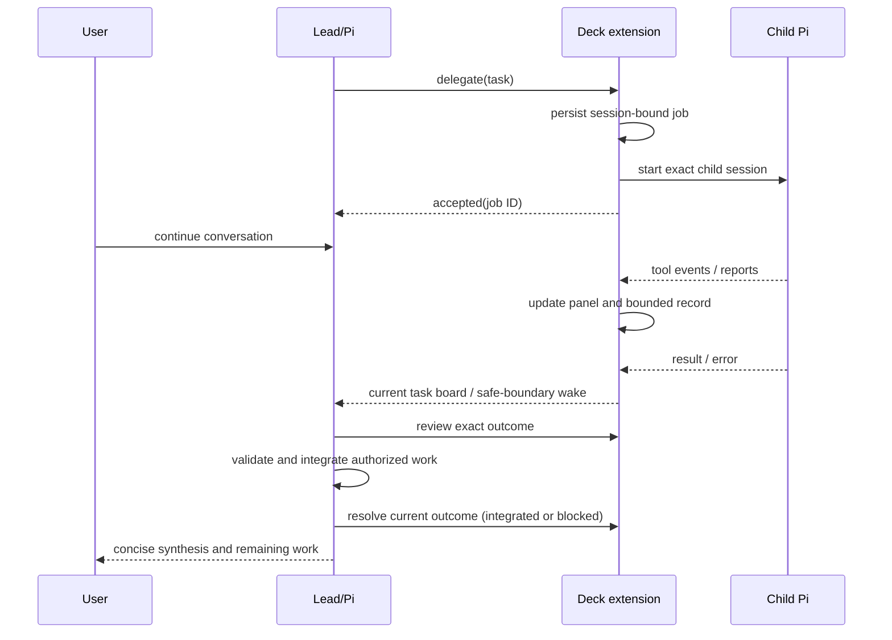

# Design
## Accepted decisions
1. Pi-only, in-process background job manager. No detached supervisor or work surviving a normal session switch/shutdown.
2. Stable parent-session + task identity. Prefer native session entries for metadata plus a private exact-session child storage location; no project-wide scans or latest-session inference. Validate persisted records as untrusted.
3. Generation fencing on session change; per-job AbortControllers, session-wide concurrency bound, explicit cancellation and mutually exclusive resume. Stop and settle children before reuse; never rely on PID alone.
4. Persistent child session identity replaces --no-session where managed recovery is available. Resume means the same history and role, not the same OS process. Do not extend permissions via records.
5. Background acknowledgment returns immediately. Progress stays in panel/history. Pi-only ephemeral task-board contexts carry current lifecycle state; hidden coalesced wakes contain metadata, not child reports. Deliver while idle or at native agent_settled, never enqueue behind a busy tool loop that can already integrate the result. Guard by parent identity, generation, attempt and outcome; native context admission is not integration.
6. Preserve actual event evidence from JSONL: assistant reports, tool starts/ends, retry events where supported, errors and completion. Bounded activity ring and output; redact/sanitize diagnostics. No percentages, thought-stream exposure or guessed status from silence.
7. Existing TUI installation path remains the sole distribution path. Generate assets with scripts/generate-pi-extension-assets.ts, never hand-edit bundles.
## Visual agreement
Medium: native Pi terminal UI, theme-integrated and compact. One right-hand floating overlay replaces the superseded above-editor panel. Monospaced native typography, theme colors, explicit state labels, bounded rows and no decorative activity animation. Expanded panel is viewport anchored, not a transcript widget, and non-modal; typing and conversation scrolling remain available. Avoid the editor; collapse responsively on insufficient width/height. User minimization is sticky through updates. Compact indicator shows counts/attention, details expose timestamped observed events versus agent reports. Provide a discoverable command/toggle without overriding Pi shortcuts. Keep the original conversation intact.
Selected guidance: deck-frontend-design for routing; no web-aesthetic skills apply to native TUI. Implementer owns native overlay layout/focus/scroll testing.
## Child shell containment decision
Native Pi Bash creates detached shell groups outside the delegated Pi process group. A blanket permanent recovery refusal for all write-capable roles would violate the agreed continuation outcome. The implementation owner is authorized to use Pi's supported child-scoped Bash tool operations seam (not installed-runtime patching) to contain delegated commands within job ownership, preserve native tool definitions/results and role policy, and exercise real native-runtime cancellation/completion. The parent Lead's tools are unchanged. This is an in-scope lifecycle implementation detail; no daemon, global monkey-patch or arbitrary persisted-PID cleanup is authorized. Any platform where settlement cannot be proven must fail closed and be documented rather than silently claiming resumability.

## Runtime sequence

## Verification requirements
TDD for acknowledgment, lifecycle isolation, concurrency, cancellation, explicit resume identity, no auto-start and notification routing. Native Pi contract evidence for overlays, focus and scrolling is required; a snapshot alone cannot prove scroll behavior. Exercise installed package APIs offline using temp HOME/PI directories and fake provider/children; do not install on the user's machine. Validate generated bundle freshness and TUI materialization integration. Review persistence/process boundaries. For the user-authorized Lead-only recovery, Lead performs the boundary review without spawning another agent; previous independent review is historical evidence only.
## Approved native UI support boundary
The user approved the native-mode split: fullscreen (Pi default) provides a viewport-anchored floating right panel; regular mode uses a compact status indicator and detail access, with no promise of anchoring over terminal-owned scrollback. Never change user mode/settings automatically. This supersedes the previously generic cross-mode overlay requirement. See verification.md for the initial renderer evidence. Continue implementation and verify actual fullscreen scroll/focus plus regular fallback.

## Approved presentation refinement (implemented)
User confirmed the live panel is visible and requested a quieter presentation: remove command/help text and task IDs from the floating panel, remove the technical asterisk/running line, retain elapsed time as hh:mm:ss, and improve long-text layout. Show a human-readable role name, concise meaningful activity and bounded word-wrapped assignment/progress instead of hard-cut single-line text. Keep command controls in the existing /subagents command surface, not in the floating panel. Compact status should avoid help-command clutter as well. Use explicit ellipsis only when bounded multi-line space is exhausted; preserve fixed viewport anchoring, no focus theft, sticky minimization, responsive fallback and input clearance. This supersedes the original on-panel control hints, raw IDs, second counters and dense event metadata. The later Lead-only recovery owns combined asset generation and verification; no implementation subagents remain active.

## Final implementation notes
- Native Pi session entries hold a session-wide execution journal across transcript tree navigation; execution effects are not rewound by selecting an earlier branch. A new parent/fork cannot inherit another parent's tasks.
- Linux child Bash backend uses Pi's supported native definition with owned process-group operations and nonce/PID-bound startup acknowledgement over supported JSON IPC. Lead tools remain native. Delegated PowerShell and unsupported platform/shell backends are blocked; unproven ownership keeps an exclusive lease and refuses continuation. This bounds recovery without treating the runner as a sandbox or rolling back external effects.
- Native /subagents command provides toggle/details/list/inspect/cancel/resume. UI uses Pi's viewport overlay in fullscreen and status fallback otherwise; no settings writes or shortcut overrides.
- The Pi tool additionally exposes review/resolve controls with exact outcome fencing and concrete resolution notes. A short title is separate from the internal assignment. Failed results carry structured reason/exit/signal information. Pending persistence is visible and retried.
- Native custom continuations can reset before_agent_start prompt overrides. Memory reuses only the exact parent's last authorized advisory ephemerally when absent; it does not recall/capture child text or persist the advisory.
- Final evidence is in verification.md and lead-only-recovery.md; repository-only delivery, no personal installation or release.

## Non-goals
Daemon execution after closing Pi, custom parent resume picker, global job adoption, branch/worktree automation, automatic replay, external dashboard.

## Current visual delta — compact colored row
The user reinstalled/restarted Pi, confirmed the new panel is visible and explicitly reauthorized delegation for this test. Preserve the existing native terminal identity. Combine human role name, HH:MM:SS duration and readable state on one row; color the role with the native theme accent and state with semantic native theme colors. Keep duration neutral/muted and the short task title beneath. Use concise labels where necessary without conflating execution with integration. Preserve visible labels (not color alone), terminal-cell bounds, non-capturing viewport anchoring, sticky minimization and regular-mode fallback. This supersedes only the separate state row and monochrome role/state treatment. No lifecycle/core/other-runner redesign, personal installation or automatic settings changes. Guidance: deck-frontend-design routing; native Pi theme is the visual authority, no web-style skill required. One Apply Fast owner handles this reversible visual delta; Lead integrates and records evidence.

### Follow-up while the compact-row task is running
The user rejects the generic `+N more` row. Show individual rows only for executing jobs (running and cancelling while settlement is still pending). Queued and terminal jobs belong in a concise aggregate summary by meaningful state, including results awaiting Lead review; keep detailed historical records accessible through existing controls. Preserve the compact colored role/time/state row and task title. This is a delta on the current panel candidate, not permission to start overlapping implementations or change lifecycle semantics. Apply and verify this follow-up before reporting the visual request complete.

The user also reported excessive Lead preparation and delayed conversational availability. For this known local change, Lead should hand off promptly with the compact visual agreement; the implementation worker should consume its own implementation skill. Loading the entire implementation skill in Lead was unnecessary duplication, not subagent execution. Do not repeatedly inspect/poll an active task or inflate this visual delta into a new investigation/QA workflow.

### Reinstalled-session counter refinement
The user sees the new summary after reinstalling Pi and restarting the session, but rejects its two-line footprint. Replace the verbose execution/disposition summary with one compact, theme-colored counter row: C = completed, F = failed, I = integrated, B = blocked. Completed/integrated use native success, failed uses error, blocked uses warning; keep counts/labels legible without color. Preserve active agent cards and all lifecycle behavior. Retain visibility of other actionable states with concise, non-ambiguous counters when necessary, without returning to two verbose summary lines or a generic +N more. Use native ANSI-aware width handling and the existing compact fallback. This is a local delta on the same panel candidate, not a redesign or personal installation request.

### Two-letter counter refinement
The user requests uniform two-letter counters and distinct blocked/cancelled colors. Implemented directly as a local visual delta: Co completed, Fa failed, In integrated, Bl blocked, Qu queued, Le awaiting Lead, Re reviewing, It interrupted, Ca cancelled, De delivery blocked, Ac action overdue, Ru running and Cg cancelling. It and Cg deliberately disambiguate states that would otherwise share In and Ca. Blocked remains native warning/amber; cancelled now uses native muted/neutral color. Active cards, counts, one-line summary, ANSI-aware sizing and overflow fallback are unchanged.

Updated native assertions and added coverage for two-letter uniqueness and distinct cancelled/blocked colors. Regenerated canonical Pi bundles. Native panel, offline PTY and asset tests: 26 passed, 0 failed across 3 files; whitespace check passed. The former temporary Bun 1.3.12 executable is no longer present; this cosmetic delta was verified with the installed Bun 1.4.0, without reinstalling a runtime or claiming a pinned-runtime run. No personal installation/theme, lifecycle, Core or other-runner changes.
