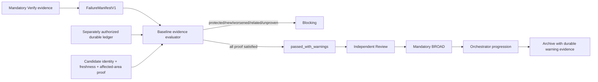

# Design: Orchestrator-Triggered Project Preparation and Session Baseline

## Design status

- **Change ID:** `project-init-skill-registry-and-session-baseline`
- **Phase:** Design
- **Status:** Revised Design completed independently of the parallel revised Spec; Spec/Design reconciliation is required before Tasks.
- **Approved replacement Proposal:** `sha256:a22066d9a6c32c087eef2b152327797dea5c9c2a899d1173679d87f34f133861`
- **Risk:** High. This change controls silent project-local effects and final-QA disposition.
- **Scope:** Design only. This artifact grants no Tasks, Apply, environment-installation, registry-write, Git-write, generated-output, or user-home authority.

This revision supersedes the former CLI-centered Design at `sha256:ecfba25881e60dad5a51aaf40055dbdc2af72abf5174e4bfc11eba631f9e2a75`. Historical events and failed predecessor evidence remain immutable. The implementation architecture below is derived from the approved replacement Proposal, current source/tests, promoted OpenSpec contracts, and current predecessor state; it does not depend on the content of the parallel revised Spec.

## Decision summary

The chosen solution has two ordered, separately bounded workstreams:

1. **Session preparation:** the existing Orchestrator performs one bounded read-only preparation preflight before SDD triage. It delegates once to the existing `deck-init` subagent only when OpenSpec or the project Skill Registry needs work. A trusted process-local Deck authority independently gates that modifying delegation. `deck-init` coordinates existing project-local tools and writers; it is not a CLI product surface or a shared application service.
2. **Baseline disposition:** one evidence-backed final-QA decision boundary validates whether a reproduced finding is a genuinely unrelated, non-regressive, non-protected baseline warning. Mandatory TARGETED, AFFECTED_AREA, independent Review, and BROAD checks still execute. A fully proven warning permits `passed_with_warnings`; every unproven, new, worsened, related, stale, conflicting, or protected finding blocks.

No third workstream is introduced.

## Corrected boundaries and removed stale architecture

### Retained existing owners

| Concern | Existing owner retained | Design use |
|---|---|---|
| Session orchestration | Canonical Orchestrator system/agent/skill surfaces and `INV-003` | Run the preparation preflight before SDD triage, cache the bounded result, and delegate `deck-init` when required. |
| Project preparation | Existing `deck-init` agent/skill, including compact materialization | Coordinate independent OpenSpec, index, registry, capability, and ignore components without a global early return. |
| Skill Registry status and persistence | Current validate/discover/refresh commands, canonical discovery/canonicalization, and `SkillRegistryWriterV1` | Inspect once at session start; reconcile only inside authorized `deck-init`; preserve complete-before-persist, compare-and-swap, atomic replacement, and last-valid bytes. |
| Capability readiness and project operations | Existing active-runner inventory and already exposed Serena, codebase-memory, and analogous capability tools | Detect availability read-only and invoke only declared project-local operations for tools already installed, configured, exposed, and usable. |
| Tool installation and user-global configuration | Existing TUI capability setup | Unchanged and unreachable from preparation; used only as a next-action destination. |
| Runtime modification authority | Existing process-local runner-hook pattern | Add a preparation-specific, one-use host gate; caller/prompt data never mints authority. |
| Final-QA contracts | Existing `FailureManifestV1`, finding disposition, protected-risk, failure delta, staged verification, candidate identity, freshness, and centralized registry coordinator | Add evidence/quality envelopes that are required whenever a raw mandatory check has a residual finding. |
| Prompt materialization | Core canonical content -> OpenCode/Pi plans -> derived runner assets | Change canonical source only; derived outputs are generated and verified, never directly edited. |

### Withdrawn architecture

The following former Design elements are deleted from the solution and must not reappear in Tasks or Apply:

- a `deck init` command or alias;
- top-level command parsing, flags, exit codes, human/JSON command rendering, or command-dispatch smoke acceptance for project preparation;
- a project-init TUI action, screen, adapter, or installation-flow integration;
- `ProjectInitServiceV1`, `ProjectInitRequestV1`, `ProjectInitResultV1`, or an equivalent shared CLI/TUI/agent service;
- CLI-owned Serena/codebase-memory initializers or a new capability-initializer framework;
- a public project-init API or package export used by CLI/TUI callers;
- direct Orchestrator writes to project preparation files;
- direct edits to generated runner assets or installed user-home files;
- the former 65-target and 4,200–6,400-line estimate.

Existing `deck skill-registry validate|discover|refresh` commands remain in use. They are Skill Registry surfaces, not a project-init command.

## Chosen architecture

### 1. Once-per-session Orchestrator preparation gate

`INV-003` becomes the **Session Preparation Gate** while retaining invariant ID, position, critical tier, and session/agent/skill/manifest coverage.

The first Orchestrator action for a project session, before classifying a non-trivial request or entering any SDD phase, is a bounded read-only preflight:

1. Canonicalize the project root through the runner's existing project context and bind a privacy-safe root digest. A session is bound to this root and active runner; a later root/runner change is a mismatch, not a second preparation opportunity.
2. Read `openspec/config.yaml` with the existing init-state semantics. Missing, unreadable, malformed, or `initialized != true` state records an OpenSpec preparation need. Malformed/unreadable existing content is safety-blocking and is never overwritten.
3. Run exactly one active-runner-bound Skill Registry validation and derive only `SkillDiscoveryContextV1`: `registry_path`, `status`, `reason_code`, `guidance`, `active_runner_id`, and `authority_reminder_version`, plus already-bounded diagnostics.
4. Cache the preflight and mark the session preparation check complete. There is no watcher, timer, periodic validation, or second ordinary Skill Registry validation in the session.
5. Continue directly to SDD triage only when OpenSpec is initialized and Skill Registry status is `ready`.
6. Otherwise issue at most one exact `deck-init` delegation for the session. `missing`, `stale`, `invalid`, and `indeterminate` all request a bounded registry reconciliation attempt; `deck-init` may conclude that safe reconciliation is unavailable without improvising a write.

The preflight is Deck session preparation, not Explore, Proposal, Spec, Design, Tasks, Apply, Verify, Review, BROAD, or Archive. It creates no phase, phase status, OpenSpec change artifact, `state.yaml` entry, or `events.yaml` entry.

### 2. Trusted preparation authority

Add an internal host contract in `@deck/sdd-runtime`, not an initialization service. `session-preparation.ts` owns only canonical request/result parsing, once-per-session state, delegation digesting, one-use authorization, rejection codes, and safe transient telemetry. It has no filesystem, Skill Registry, capability, installer, CLI, TUI, or project-write implementation.

#### Delegation claims

The trusted runner provider creates a process-local HMAC-SHA-256 authorization envelope with these canonical claims:

```ts
interface SessionPreparationAuthorizationClaimsV1 {
  readonly schema: "session-preparation-authorization-v1";
  readonly authorizationId: `prep-authz:v1:${string}`;
  readonly sessionIdDigest: `sha256:${string}`;
  readonly invocationId: string;
  readonly agentId: "deck-init";
  readonly activeRunnerId: string;
  readonly projectRootDigest: `sha256:${string}`;
  readonly delegationDigest: `sha256:${string}`;
  readonly needs: readonly ("openspec" | "skill_registry")[];
  readonly allowedOperations: readonly SessionPreparationOperationV1[];
  readonly blockedTargets: readonly string[];
  readonly issuedAt: string;
  readonly expiresAt: string;
  readonly nonce: string;
  readonly maxUses: 1;
}
```

`SessionPreparationOperationV1` is a closed symbolic union: OpenSpec inspect/merge at `openspec/config.yaml`; Skill Registry validate/discover/refresh at the canonical project root; codebase-memory `index_repository`; Serena's active-runner-exposed project onboarding operation; declared analogous project-local capability operations; and exact ownership-safe ignore reconciliation. It contains neither arbitrary shell text nor installer/network/global-configuration operations.

The authorization lifetime is at most five minutes with at most thirty seconds of future clock skew, matching the existing invocation-authorization limits. The process-local key is never serialized. Validation binds the runner, session, invocation, canonical-root digest, delegation digest, need set, closed operation set, and blocked targets, then atomically reserves the nonce before the native runner launches `deck-init`.

OpenCode and Pi canonical hook sources extend the existing trusted-provider pattern for `deck-init` only:

- strip any caller-supplied preparation control field before role detection;
- obtain authority only from the captured process-local provider;
- reject missing, malformed, expired, future, restarted, revoked, replayed, role-, runner-, root-, invocation-, delegation-, operation-, or target-mismatched authority;
- permit the native delegation exactly once only after validation and reservation;
- never retain a static-compatible modifying fallback for preparation;
- clear session preparation state on runner session deletion/closure.

The system owner's approval of this change establishes policy but does not mint an invocation authority. The exact delegation and the trusted runtime envelope must both be present. Because the trusted provider authorizes normal Deck preparation, no separate routine user prompt or acceptance receipt is required.

### 3. `deck-init` component coordinator

`deck-init` remains prompt/skill-driven and uses existing tools. It does not call a new service and does not delegate further. It validates the bounded authority reference supplied by the host context, then processes components independently in this deterministic order:

1. **Root and authority precondition** — verify runner/root/delegation binding and the closed operation set; reject before effects on any mismatch.
2. **OpenSpec** — inspect and, only when absent or safely mergeable, reuse current stack/testing/monorepo detection and OpenSpec merge behavior. Preserve existing keys, rules, comments, and ordering where the current merge mechanism supports them. Set `initialized: true` only after the merged file reparses and postconditions pass. An already initialized config is `unchanged`, not a global return.
3. **Skill Registry** — consume the cached bounded context, then use active-runner explicit validate/discover/refresh services/commands. Re-evaluate the complete current source set immediately before a write. Existing lifecycle selection chooses migration or regeneration; existing writer authority, exact target tuple, safe ignore coverage, compare-and-swap, atomic replacement, and prior-valid preservation remain authoritative. The Orchestrator never writes the registry.
4. **Codebase index** — when codebase-memory is enabled and the active runner exposes a usable tool, inspect current project-index evidence. Invoke only `index_repository` with the canonical root, the valid existing mode or `full`, and persistence enabled when the project is absent/stale. Re-inspect after the call. Directory existence alone is not readiness.
5. **Serena project state** — when Serena is enabled and the active runner exposes a usable project-local onboarding operation, inspect current project evidence and invoke that operation only when needed. Existing valid `.serena/project.yml` and `.serena/.gitignore` remain project-shareable and are preserved. No guessed Serena CLI, MCP/global configuration write, language-server installation, memory creation, or user-home setup is permitted.
6. **Analogous configured capabilities** — a capability is eligible only when current runner configuration enables it, the active runner already exposes a usable tool, the tool declares a bounded project-local operation and owned outputs, and no installation/global effect is reachable. Detector-only or instruction-only capabilities are not initialized.
7. **Owned ignore contributions** — reconcile only exact local/non-versionable rules declared by components that actually produced or own the artifacts; verify postconditions and aggregate the result.

One component's ready state or failure never suppresses inspection of later independent components. A component effect runs at most once per preparation invocation, and every effect is followed by a read-only postcondition. Attempted work is not success.

### 4. Component and overall semantics

The `deck-init` return is an internal, bounded subagent handoff, not a CLI/API schema and not persisted as an artifact. It is parsed by the preparation host/orchestrator boundary and carries no registry body, candidate records, absolute project path, secrets, user-home path, or raw tool output.

```ts
interface DeckPreparationHandoffV1 {
  readonly kind: "deck-preparation-handoff-v1";
  readonly preparationStatus: "completed" | "partial" | "blocked";
  readonly continueToTriage: boolean;
  readonly legacyOutcome: "success" | "already-initialized" | "failed";
  readonly sessionIdDigest: `sha256:${string}`;
  readonly invocationId: string;
  readonly projectRootDigest: `sha256:${string}`;
  readonly activeRunnerId: string;
  readonly delegationDigest: `sha256:${string}`;
  readonly authorityReferenceDigest: `sha256:${string}`;
  readonly dependencyDigest: `sha256:${string}`;
  readonly components: readonly DeckPreparationComponentHandoffV1[];
  readonly skillDiscoveryContext: SkillDiscoveryContextV1;
  readonly nextActions: readonly DeckPreparationNextActionV1[];
  readonly telemetry: DeckPreparationTelemetryV1;
  readonly blockers: readonly string[];
}

type DeckPreparationComponentStatusV1 =
  | "ready"
  | "changed"
  | "unchanged"
  | "unavailable"
  | "skipped"
  | "blocked";
```

| Component result | Meaning | Overall effect |
|---|---|---|
| `ready`, `changed`, `unchanged` | Applicable component has verified current postconditions. | Does not degrade readiness. |
| `unavailable` | Capability is enabled, but its executable/tool/runner surface is absent or unusable. | `partial`; next action is existing TUI capability setup. |
| `skipped` | Capability is not enabled, not applicable, has no project initializer, or is dependency-blocked by another unavailable optional component. | Does not itself degrade readiness. |
| `blocked` | Authority, containment, tracked/shareable ownership, malformed-state, compare-and-swap, postcondition, or other safety proof failed. | `blocked` for unsafe conflicts; no write fallback. |

Overall aggregation is deterministic:

- `completed`: OpenSpec is ready and every applicable component is ready/changed/unchanged; `continueToTriage: true`.
- `partial`: OpenSpec is ready and remaining issues are fail-open registry discovery or unavailable optional project tooling; `continueToTriage: true`, with bounded direct skill discovery when the registry remains non-ready.
- `blocked`: OpenSpec is not safely initialized, result/authority identity is invalid, or a protected safety/ownership conflict occurred; `continueToTriage: false` for SDD work.
- `legacyOutcome` remains additive compatibility evidence: `already-initialized` only when all components were unchanged, `success` for other completed results, and `failed` for partial/blocked. Updated Orchestrator surfaces use `preparationStatus` and `continueToTriage`; stale consumers therefore fail closed rather than claiming readiness.

There is no routine success message or pause. The Orchestrator surfaces a concise preparation notice only for `partial`/`blocked`, a required TUI next action, or an explicit user request for details.

### 5. Transient preparation telemetry

`DeckPreparationTelemetryV1` is returned in-memory and may be emitted through the existing safe runner telemetry sink; it is never written to OpenSpec change state. It contains only:

- runner, session/root/invocation/delegation digests;
- outcome `not_needed | completed | partial | blocked`;
- sorted component IDs and status/reason codes;
- requested/committed/no-op/rejected effect counts;
- authority outcome and stable rejection code;
- duration bucket, never raw timestamps or paths in user-facing output.

Telemetry failure never authorizes a write and never changes a verified preparation result. Missing required result binding is a blocker, not a telemetry warning.

### 6. Ownership-safe `.gitignore` contribution

The existing Skill Registry writer remains the sole owner of `/.atl/skill-registry.md` coverage. `deck-init` does not reproduce that algorithm.

For other project-local capability artifacts, an exact rule may be contributed only when all of these are proven immediately before commit:

1. the active component declares the exact normalized, root-contained artifact and exact root-anchored or component-local rule;
2. the artifact is machine-local/non-versionable, not shareable configuration or a shareable generated bootstrap artifact;
3. the artifact and proposed rule are not tracked by Git, and the rule cannot match any declared shareable path;
4. ownership is unambiguous and the ignore file is an existing regular UTF-8 file, not a symlink;
5. the read digest still matches at compare-and-swap commit time.

An existing exact or owner-permitted broader rule satisfies coverage; no additional rule is added. Otherwise append only the missing exact rule, preserving all existing bytes, comments, blank lines, and ordering and adding only the minimum newline separator/final newline. Never remove, reorder, normalize, broaden, untrack, or invoke Git. A missing/unreadable root `.gitignore` retains the current registry-writer failure behavior rather than creating a second policy.

Initial classifications remain:

| Path family | Treatment |
|---|---|
| `/.atl/skill-registry.md` | Machine-local generated; exact coverage owned by the existing registry writer. |
| `/.serena/project.yml`, `/.serena/.gitignore` | Shareable project configuration; never root-ignored or untracked. |
| Serena cache/local override paths | Exact component-local rules only when the active initializer declares and owns them. No blanket `/.serena/`. |
| Persisted codebase-memory bootstrap artifacts | Shareable generated evidence; no blanket `/.codebase-memory/`. |
| Ambiguous memories, mixed runner directories, or unknown tool output | No rule and no inferred ownership; return a bounded diagnostic/blocker as appropriate. |

## Baseline finding-disposition architecture

### 1. Authoritative service boundary

Add `BaselineEvidenceEnvelopeV1` and `QualityDispositionEnvelopeV1` contracts plus `evaluateFindingDispositionBaselineV1` in `@deck/sdd-runtime`. The evaluator is the only final-QA boundary that may convert a raw mandatory-check finding into a non-blocking warning.

Existing `FailureManifestV1`, `FindingDispositionEnvelopeV1`, `projectFindingDispositionV1`, protected-risk authority, failure delta, staged verification, candidate identity, and freshness remain parseable and authoritative for their current purposes. A bare baseline fingerprint or `relationship: unrelated_baseline` is insufficient for final progression.

```ts
interface BaselineEvidenceEnvelopeV1 {
  readonly schema: "baseline-evidence-envelope-v1";
  readonly digest: `sha256:${string}`;
  readonly policyVersion: "baseline-disposition-policy-v1";
  readonly normalizedFingerprint: `sha256:${string}`;
  readonly baselineSubject: ImmutableQualitySubjectV1;
  readonly candidateSubject: CandidateQualitySubjectV1;
  readonly baselineObservations: readonly FindingObservationV1[];
  readonly candidateObservations: readonly FindingObservationV1[];
  readonly environmentEquivalence: EnvironmentEquivalenceV1;
  readonly causalIsolation: CausalIsolationEvidenceV1;
  readonly nonRegression: NonRegressionEvidenceV1;
  readonly ledgerAuthority: BaselineLedgerAuthorityRefV1;
  readonly freshness: BaselineEvidenceFreshnessV1;
}

interface QualityDispositionEnvelopeV1 {
  readonly schema: "quality-disposition-envelope-v1";
  readonly digest: `sha256:${string}`;
  readonly batchId: BatchId;
  readonly batchDigest: `sha256:${string}`;
  readonly manifestDigest: `sha256:${string}`;
  readonly verificationDigest: `sha256:${string}`;
  readonly findingDispositionDigest: `sha256:${string}`;
  readonly baselineEvidenceDigests: readonly `sha256:${string}`[];
  readonly mandatoryExecutionComplete: true;
  readonly status: "passed" | "passed_with_warnings" | "failed";
  readonly warningFindingIds: readonly FindingId[];
  readonly blockingFindingIds: readonly FindingId[];
  readonly producerRole: "verify" | "review" | "orchestrator" | "archive";
  readonly producerInstanceId: string;
  readonly producedAt: string;
}
```

The cross-subject normalized fingerprint hashes policy version, suite/check ID, diagnostic/test name, repository-relative location, oracle ID, category, and a sanitized stable error-signature digest. It excludes batch/subject digests, timestamps, absolute paths, prose, ports, temporary roots, and producer identity. A versioned normalizer may remove only declared volatile values; it must retain expected/actual semantics and stable error codes.

### 2. Proof required for every warning

Every residual finding must satisfy all conditions independently:

1. An immutable baseline subject predates the candidate's first relevant modification, and the current candidate has a distinct bound batch/tree digest.
2. The same normalized fingerprint reproduces on both subjects under an execution plan fixed before repetition and equivalent sanitized environments.
3. Candidate diff/allowlist, affected-area dependency/call/data-flow/configuration analysis, and oracle analysis establish no credible causal path.
4. Candidate severity, occurrence count/frequency, reachability, duration, resource impact, and protected-risk class are not worse.
5. Current TARGETED and AFFECTED_AREA obligations pass independently, independent Review confirms the causal/protected judgment, and BROAD executes before final acceptance.
6. The `FailureManifestV1` finding is `relationship: unrelated_baseline`, `status: pre_existing`, and has safe evidence.
7. A separately authorized durable `openspec/baseline-health.yaml` entry binds the normalized fingerprint, policy/normalizer, immutable subject, environment cohort, evidence digests, approval identity, and invalidation triggers.

Reproduction thresholds are closed decisions:

- deterministic findings: `2/2` consecutive reproductions on baseline and `2/2` on candidate; a still-valid durable ledger may replace only the baseline rerun;
- flaky/timing findings: exactly five predeclared runs per subject, the fingerprint in at least three on each, all outcomes retained, candidate count no greater than baseline, and no worse candidate metric; flaky evidence expires after fourteen days or an earlier trigger;
- cross-platform findings: independent evidence per `os + arch + runtime-major` cohort;
- environment equivalence: cohort, runtime/tool major versions, lockfile, command/check-plan digest, locale, timezone, and allowlisted sanitized environment-value digests must match; unknown differences block.

The same failing candidate cannot create or approve the ledger entry it consumes. Ordinary preparation, Verify, Review, BROAD, Orchestrator, and Archive have no ledger-write authority. Admission requires a separate authorized OpenSpec Apply with an exact ledger allowlist, pre-existing immutable evidence, independent Verify/Review, and a distinct transaction/approval identity.

### 3. Protected precedence and invalidation

Age or a ledger entry can never downgrade security, authorization, credential/secret exposure, Git safety, destructive behavior, data loss, required migration/public-interface/cross-package architecture obligations, generated-output violations, registry conflict/recovery-required state, freshness/identity failure, or required artifact/requirement/task/Design violations.

Evidence is invalid after any fingerprint/policy/normalizer, command, test, oracle, dependency/configuration, lockfile, protected-policy, candidate, environment-cohort, producer-identity, or linked-artifact digest change; after a new causal path or worsened metric; on ledger expiry; or while registry recovery/conflict remains unresolved. Unknown, stale, missing, contradictory, or partially validated evidence is blocking.

### 4. Verify, Review, BROAD, Orchestrator, and Archive mapping

- **Verify/TARGETED/AFFECTED_AREA/BROAD:** execute every scheduled check and retain raw exits/results. Build `FailureManifestV1`, then request one evaluator decision. A nonzero raw result remains evidence; it is not hidden or relabeled.
- **Stage status:** existing staged-verification status remains `passed` when mandatory execution is complete and the quality envelope has no blocking finding. No new `StageStatus` value is added.
- **Verify phase/intent:** use `passed_with_warnings` when the quality envelope has at least one validated warning and no blocker; otherwise `passed` or `failed`.
- **Review:** use a fresh identity and independently validate causality, protected risk, metric non-regression, Verify binding, and warning durability. Runtime role status remains `passed | failed`; the Review RegistryIntent is `passed_with_warnings` when warnings remain. Matching fingerprints never force approval.
- **Execution control plane:** accept an additive `qualityDisposition` sidecar bound to the role result, batch, dossier verification, manifest, and decision. All-green legacy results need no sidecar. Any raw failure or warning claim requires a valid sidecar; absent/mismatched/stale output fails closed.
- **Orchestrator:** progress only with the latest candidate-bound Verify and Review envelopes, complete mandatory BROAD, independent identities, and fresh dependency/subject digests. A validated warning does not enter repair routing and does not trigger a routine user pause.
- **Archive:** state status remains canonical `archived`. Archive may proceed from current `passed` or `passed_with_warnings` quality only when no blocker exists. It preserves every warning, baseline/ledger/evidence digest, failed attempt, residual risk, and follow-up, and never claims repository-wide green.

## Boundary and sequence diagrams

```mermaid
sequenceDiagram
    participant O as Orchestrator
    participant H as Trusted runner hook
    participant D as existing deck-init
    participant R as existing Skill Registry services/writer
    participant C as existing project-local capability tools
    participant T as existing TUI setup

    O->>O: once/session read-only OpenSpec + SkillDiscoveryContext checks
    alt ready
        O->>O: continue to SDD triage
    else preparation needed
        O->>H: exact deck-init delegation request
        H->>H: validate + reserve process-local one-use authority
        alt authority invalid
            H-->>O: blocked/partial; no delegation and no write fallback
        else authority valid
            H->>D: permit one existing deck-init invocation
            D->>R: validate/discover; refresh only when needed
            D->>C: inspect -> project-local operation -> postcondition
            D-->>O: bound completed | partial | blocked handoff
            O->>O: cache result; continue or block before triage
        end
    end
    Note over D,T: D never calls installer/global setup; unavailable points to T
```



## State, persistence, and ownership

### Session state

- The runner hook keeps one ephemeral preparation record keyed by runner/session/root digests: `unchecked -> not_needed | delegated -> completed | partial | blocked`.
- The state is monotonic. Duplicate/replayed preparation requests return the prior safe result or `AUTHZ_REPLAYED`; they never execute another effect.
- Skill discovery is validated once. A successful writer/postcondition may replace the cached bounded context from the `deck-init` handoff without running another ordinary session validation.
- Session deletion clears only ephemeral host state. No cleanup deletes project files.

### Project state

Permitted persistent effects are limited to existing OpenSpec config behavior, the current Skill Registry writer's two exact targets when required, and project-local artifacts/ignore rules owned by an already available capability. No preparation operation writes change-local `state.yaml`/`events.yaml`, baseline ledger entries, runner/global configuration, package state, or Git state.

### Final-QA state

Baseline and quality envelopes are immutable, digest-bound sidecars referenced by Verify/Review/Archive artifacts and RegistryIntent notes. The centralized coordinator remains the only registry writer. Warning disposition never changes the candidate identity, mandatory-stage order, or evidence freshness rules.

## Compatibility and migration

- **No command migration:** no command is added or reserved. Existing no-argument and unknown-command behavior remains unchanged.
- **Existing `deck-init`:** frontmatter identity, delegate-only installation, and existing active-runner materialization remain. The internal return is additive; stale consumers see `legacyOutcome: failed` for partial/blocked and therefore fail closed.
- **Existing OpenSpec projects:** `initialized: true` means only the OpenSpec component is unchanged. Registry and capability components still inspect once. Existing keys/history are retained.
- **Existing Skill Registry:** no schema/status vocabulary change. Ready registries are untouched; non-ready states use current lifecycle and writer. Last-valid content survives failure.
- **Existing runner adapters:** no capability catalog or installation interface change. Canonical hooks add only the `deck-init` authority branch; TUI installation plans and user-global writers remain unchanged.
- **Existing capability files:** valid tracked/shareable Serena and persisted codebase-memory artifacts remain visible and unchanged. Preparation never untracks them.
- **Existing QA contracts:** `FailureManifestV1`, low-level disposition, staged-verification status, and canonical registry statuses remain parseable. New evidence/quality envelopes are additive and required only for residual mandatory-check findings.
- **No bulk migration:** behavior takes effect on the next materialized Orchestrator session. There is no background job, installer migration, or automatic ledger mutation.

## Verification strategy

### Session preparation and authority

- Unit-test all five Skill Registry statuses, missing/malformed/initialized OpenSpec, root/runner changes, no-need, one-delegation, session cleanup, and deterministic aggregation.
- Prove authority issue/parse/validation, five-minute lifetime, clock skew, one-use reservation, replay/restart/revoke, role/session/root/runner/invocation/delegation/operation/target mismatch, malformed proof, and provider absence.
- Adapter-hook tests must strip caller preparation data, never call a provider for unrelated agents, call the trusted provider exactly once for `deck-init`, and block before native delegation on every rejected authority.
- Assert no user acceptance prompt on the valid path and no modifying fallback on the invalid path.
- Assert preparation creates no SDD phase/status/artifact/event and the Orchestrator does not write `.atl/skill-registry.md`.

### Component behavior and ownership

- Fresh, initialized, partial, blocked, and rerun fixtures prove no global early return, stable component order, one effect per component, postcondition checks, and unchanged rerun bytes.
- Registry fixtures exercise ready/missing/stale/invalid/indeterminate, complete-before-persist, active-runner-only source scope, migration/regeneration selection, exact authority/target tuples, compare-and-swap conflict, failpoint preservation, and no second writer.
- Codebase-memory fixtures use only the exposed `index_repository` tool and verify `unavailable` for enabled absent/unusable surfaces; Serena fixtures use only the active runner's declared project onboarding operation. Poison installer/package-manager/download/network/global-config functions must receive zero calls.
- Git-ignore fixtures cover tracked/shareable refusal, exact existing coverage, owner-permitted broader coverage, comments/order/blank-line/newline preservation, conflicting ownership, symlink/non-UTF-8/CAS refusal, and no blanket mixed-directory rule.

### Baseline disposition and lifecycle

- Contract tests reject cross-batch findings, unsafe evidence, bad normalized fingerprints, mutable/missing baseline subjects, environment/cohort mismatch, non-fixed repetition plans, insufficient deterministic/flaky samples, discarded runs, metric worsening, causal overlap, expired/invalid ledger, self-admission, and each protected floor.
- Service tests cover all-green `passed`, fully proven `passed_with_warnings`, mixed warning+blocker precedence, multiple findings, durable baseline-half reuse, every invalidation trigger, and deterministic output ordering/digests.
- Control-plane tests prove stage `passed` plus phase `passed_with_warnings`, raw failing evidence retention, mandatory BROAD, independent Verify/Review identities, quality sidecar binding, freshness invalidation, no repair/pause for a validated warning, and fail-closed missing/mismatched sidecars.
- Archive prompt tests prove warning preservation and refusal on any blocker/stale evidence; no test may update the live baseline ledger.

### Prompt and materialization parity

- Assert both authority fragments byte-for-byte and exactly once on every applicable legacy/compact source surface.
- Assert removal of all user-offer language, global OpenSpec early returns, direct installer authority, and any project-preparation CLI/TUI/shared-service wording.
- Assert semantic parity through Core content registry, strict legacy profile digest, OpenCode prompt/install plans, Pi registry/profile consumption, and canonical source-to-derived generation.
- Regenerate derived runner assets only through the normal generator when required and prove the second generation is byte-identical. Derived files are never direct edit targets.

### Stage order

Focused tests run first, then affected package/materialization tests, typecheck, independent Review, and mandatory repository BROAD against one current candidate and dependency set. This change may not use its own warning policy to excuse a regression it introduces.

## Rollout and rollback

### Rollout

1. Reconcile this Design with the independently revised Spec; reject all withdrawn CLI/TUI/service behavior and close every item in the reconciliation section below.
2. Keep non-overlapping runtime contracts, role content, and tests separate from predecessor-overlapping Orchestrator/materialization paths.
3. Land preparation authority/hook behavior before prompt text advertises silent modifying preparation; missing provider remains fail-closed throughout rollout.
4. Land baseline evidence/evaluator/control-plane behavior before role prompts permit warning progression.
5. Materialize from canonical sources, then run fresh TARGETED, AFFECTED_AREA, independent Review, and mandatory BROAD.

### Rollback

Rollback is a separately authorized forward change. Disable/remove the preparation-specific hook and restore prior canonical prompt behavior together so no prompt advertises an unavailable authority path. Restore prior quality-sidecar consumption only after role prompts again block residual raw failures. Preserve all OpenSpec lifecycle history, failed attempts, warning evidence, and prior-valid Skill Registry bytes.

Rollback must not uninstall tools, write user-global configuration, delete capability project files, remove ignore rules automatically, mutate Git, edit derived outputs directly, or erase baseline/predecessor evidence. Any project-local reversal requires current ownership/tracking evidence and its own exact authorization.

## Predecessor overlap assessment

Current official predecessor state is `review/failed`; `R5-B01` remains unresolved and blocks its mandatory BROAD. Its Design names 17 implementation targets. The revised 36-target set below has **nine actual path intersections**:

1. `packages/core/src/teams/developer/orchestrator-invariants.ts`
2. `packages/core/src/teams/developer/orchestrator-content.ts`
3. `packages/core/src/teams/developer/orchestrator-invariants.test.ts`
4. `packages/core/src/teams/developer/orchestrator-invariants.task2.test.ts`
5. `packages/core/src/teams/developer/orchestrator-content.test.ts`
6. `packages/core/src/teams/developer/content-registry.test.ts`
7. `packages/core/src/teams/developer/prompt-profile.test.ts`
8. `packages/adapter-opencode/src/developer-team-install.test.ts`
9. `packages/adapter-opencode/src/prompt-generation.test.ts`

This is proven overlap, not an assumption. In particular, both changes edit `ORCHESTRATOR_AGENT_BODY` and its negative parity oracle. Different symbols within the same path are not sufficient no-overlap evidence under the predecessor Design.

Tasks may be authored after Spec/Design reconciliation, and disjoint implementation batches may be planned. Apply for any of the nine intersecting paths remains blocked until the coordinator consumes an authoritative predecessor repair/closure with fresh TARGETED -> AFFECTED_AREA -> independent Review -> mandatory BROAD evidence, or records a stronger authorized path-level coordination decision that preserves both candidates' identity/freshness. This successor does not repair, waive, relabel, or amend predecessor history.

## Exact editable targets and estimate

This is the complete implementation impact map. It is not Apply authority. Any additional editable path is an ambiguity stop requiring Design reconciliation. Derived outputs, project artifacts, registry YAML, configuration, Git state, and user-home files are not editable implementation targets.

### Runtime preparation authority and adapter hooks

1. `packages/sdd-runtime/src/execution/session-preparation.ts` (new)
2. `packages/sdd-runtime/src/execution/session-preparation.test.ts` (new)
3. `packages/sdd-runtime/src/index.ts`
4. `packages/sdd-runtime/src/index.test.ts`
5. `packages/adapter-opencode/assets/opencode/plugins/developer-team-execution.ts`
6. `packages/adapter-opencode/src/developer-team-execution-reachability.test.ts`
7. `packages/adapter-pi/assets/pi/extensions/developer-team-execution.ts`
8. `packages/adapter-pi/src/developer-team-execution-reachability.test.ts`

### Baseline evidence and progression

9. `packages/sdd-runtime/src/contracts/baseline-evidence.ts` (new)
10. `packages/sdd-runtime/src/contracts/baseline-evidence.test.ts` (new)
11. `packages/sdd-runtime/src/orchestrator/finding-disposition-service.ts` (new)
12. `packages/sdd-runtime/src/orchestrator/finding-disposition-service.test.ts` (new)
13. `packages/sdd-runtime/src/execution/execution-control-plane.ts`
14. `packages/sdd-runtime/src/execution/execution-role-scheduler.test.ts`

### Canonical prompts, skills, invariants, and Core tests

15. `packages/core/src/teams/developer/readiness-authority.ts` (new)
16. `packages/core/src/teams/developer/readiness-authority.test.ts` (new)
17. `packages/core/src/skills/bootstrap/deck-init-content.ts`
18. `packages/core/src/skills/bootstrap/index.test.ts`
19. `packages/core/src/teams/developer/bootstrap-compact-content.ts`
20. `packages/core/src/teams/developer/orchestrator-invariants.ts`
21. `packages/core/src/teams/developer/orchestrator-invariants.test.ts`
22. `packages/core/src/teams/developer/orchestrator-invariants.task2.test.ts`
23. `packages/core/src/teams/developer/orchestrator-content.ts`
24. `packages/core/src/teams/developer/orchestrator-content.test.ts`
25. `packages/core/src/teams/developer/content-registry.ts`
26. `packages/core/src/teams/developer/content-registry.test.ts`
27. `packages/core/src/teams/developer/prompt-profile.test.ts`
28. `packages/core/src/teams/developer/verify-content.ts`
29. `packages/core/src/teams/developer/verify-content.test.ts`
30. `packages/core/src/teams/developer/review-content.ts`
31. `packages/core/src/teams/developer/review-content.test.ts`
32. `packages/core/src/teams/developer/archive-content.ts`
33. `packages/core/src/teams/developer/archive-content.test.ts`

### Materialization acceptance tests

34. `packages/adapter-opencode/src/developer-team-install.test.ts`
35. `packages/adapter-opencode/src/prompt-generation.test.ts`
36. `packages/adapter-pi/src/registry-consumption.test.ts`

**Estimate:** 36 editable files: 8 new and 28 modified; approximately **2,800–4,000 touched lines**, including **1,350–2,000 test lines**. The estimate includes internal authority/evidence contracts and all prompt parity tests; it excludes normal derived-output regeneration because derived files are not direct targets.

## Exact Implementation Instructions

All EIIs are independently testable. The two authority-critical shared fragments are byte-verbatim. Every other prompt/skill/system EII is semantic-constrained and must compose the applicable exact fragment exactly once.

### EII-PISB-001 — Deck preparation authority fragment

- **Editable source target:** `packages/core/src/teams/developer/readiness-authority.ts`, canonical symbol `DECK_PREPARATION_AUTHORITY_BOUNDARY_V1`.
- **Mode:** `byte-verbatim`.
- **Required change:** Emit exactly this text, including heading, punctuation, and paragraph breaks:

```text
## Deck Preparation Authority Boundary

Deck preparation runs once per runner session before SDD triage and is not an SDD phase. The Orchestrator may perform only bounded read-only preparation checks and MUST NOT write project preparation state. When preparation is required, it MUST issue one exact delegation to the existing `deck-init` subagent. The delegation itself grants no modifying authority. A modifying effect is permitted only when the exact delegation and a trusted process-local Deck preparation authority both validate for the same session, invocation, canonical project-root digest, active runner, component, action, and target set. Caller or prompt data cannot mint, widen, replay, or substitute for that authority. Missing, expired, replayed, mismatched, malformed, revoked, or restarted authority MUST fail closed before the effect, preserve prior valid bytes, and MUST NOT trigger a write fallback. Valid normal preparation requires no routine user approval or pause. `deck-init` MUST NOT install, download, upgrade, invoke package managers, write user-global configuration, call TUI installation actions, mutate Git state, or write centralized SDD `state.yaml` or `events.yaml`.
```

- **Preserved constraints:** Git discard protection, active-runner scope, centralized registry ownership, TUI installation ownership, and language policy.
- **Affected tests/assertions:** `readiness-authority.test.ts`, Orchestrator/deck-init content tests, content-registry/profile tests, and OpenCode/Pi materialization tests.
- **Prohibited reinterpretations:** no prompt/user acceptance as authority; no static-compatible write; no second delegation; no installer/global/Git/central-registry effect.
- **Ambiguity stop:** any surface that cannot compose the bytes exactly once without contradictory lower-priority prose blocks implementation.

### EII-PISB-002 — Finding-disposition authority fragment

- **Editable source target:** `packages/core/src/teams/developer/readiness-authority.ts`, canonical symbol `FINDING_DISPOSITION_AUTHORITY_BOUNDARY_V1`.
- **Mode:** `byte-verbatim`.
- **Required change:** Emit exactly this text:

```text
## Finding Disposition and Baseline Authority Boundary

Every required TARGETED, AFFECTED_AREA, independent Review, and mandatory BROAD check MUST execute against the current candidate with independent identity and fresh evidence. A raw finding is non-blocking only when the authoritative baseline-evidence evaluator proves an immutable pre-candidate baseline, the same normalized fingerprint on baseline and candidate under equivalent sanitized environments, causal unrelatedness, no worsening, no protected risk, and a separately authorized durable ledger entry. New, worsened, related, unproven, stale, conflicting, security, authorization, credential or secret, Git-safety, destructive, data-loss, protected migration, public-interface, architecture, generated-output, registry-recovery, freshness, and required-artifact findings remain blocking regardless of age. The same failing run MUST NOT create or authorize the ledger entry that would excuse it. `passed_with_warnings` changes disposition only: it never skips, shortens, filters, defers, or relabels mandatory execution, never requires active-session repair or a routine user pause for a fully proven unrelated warning, and never permits progression or Archive with a blocking finding.
```

- **Preserved constraints:** role independence, `FailureManifestV1`, protected-risk authority, candidate/dependency freshness, lane floors, centralized registry ownership, and Git safety.
- **Affected tests/assertions:** shared fragment, Orchestrator/Verify/Review/Archive content, content-registry/profile, runtime evaluator/control-plane, and materialization tests.
- **Prohibited reinterpretations:** no prose-only baseline claim, bare fingerprint, age, user pressure, or focused-green evidence as a substitute; Review cannot inherit Verify judgment; Archive cannot claim global green.
- **Ambiguity stop:** absent, stale, conflicting, or partially validated evidence is blocking; no fallback wording or status is invented.

### EII-PISB-003 — `INV-003` Session Preparation Gate

- **Editable source target:** `packages/core/src/teams/developer/orchestrator-invariants.ts`, canonical symbol currently named `INV_003_SDD_INITIALIZATION_GATE` (rename to `INV_003_SESSION_PREPARATION_GATE` while retaining ID `INV-003`).
- **Mode:** `semantic-constrained`.
- **Required clauses:** before SDD triage; once-per-session OpenSpec plus SkillDiscoveryContext read-only checks; exact non-ready predicates; one silent `deck-init` delegation; no Orchestrator writes; separate trusted runtime authority; completed/partial/blocked continuation; no phase/artifact/event.
- **Preserved constraints:** invariant order, critical tier, surface set, rendering, verification, and all other invariant IDs.
- **Affected tests/assertions:** both invariant test files, Orchestrator content, manifest/invariant verification as unchanged gates.
- **Prohibited reinterpretations:** no SDD-phase placement, OpenSpec-only gate, user offer, global early return, or second validation/delegation.
- **Ambiguity stop:** inability to establish canonical root/runner/session identity blocks the gate.

### EII-PISB-004 — Compact `INV-003` summary

- **Editable source target:** `packages/core/src/teams/developer/orchestrator-invariants.ts`, `COMPACT_ORCHESTRATOR_INVARIANT_SUMMARIES_V1` entry `INV-003`.
- **Mode:** `semantic-constrained`.
- **Required clauses:** once/session read-only preparation before triage; exact `deck-init` delegation when needed; host authority separate; no new phase or Orchestrator write.
- **Preserved constraints:** ten-entry order/immutability and all unrelated summaries.
- **Affected tests/assertions:** invariant, content-registry, profile, and materialization tests.
- **Prohibited reinterpretations:** compactness must not omit authority separation or move the gate after triage.
- **Ambiguity stop:** stop rather than emit a vague “initialize if needed” summary.

### EII-PISB-005 — Legacy Orchestrator system prompt

- **Editable source target:** `packages/core/src/teams/developer/orchestrator-content.ts`, `ORCHESTRATOR_SYSTEM_PROMPT`; named Team Roster, Session Preparation Gate, Skill Discovery, Runtime Authority, Independent Quality, and Archive progression sections.
- **Mode:** `semantic-constrained`.
- **Required clauses:** update `deck-init` role description; run preflight before triage; replace the user migration offer with one silent exact delegation; consume the bound preparation handoff; cache returned bounded context without ordinary revalidation; compose both exact fragments once; accept warnings only through current quality envelopes and complete BROAD.
- **Preserved constraints:** all predecessor-owned ownership/pre-QA/decision/commit-only fragments, triage/restatement, phase order, mode, centralized intents, Git safety, and user-language behavior.
- **Affected tests/assertions:** Orchestrator content, profile digest, content registry, OpenCode prompt/install, Pi profile consumption.
- **Prohibited reinterpretations:** no direct write, CLI/TUI init surface, automatic TUI call, warning label without service evidence, or repair/pause for a proven warning.
- **Ambiguity stop:** contradictory lower-priority offer/early-return/failure-pause text must be removed or implementation stops.

### EII-PISB-006 — Legacy Orchestrator agent body

- **Editable source target:** `packages/core/src/teams/developer/orchestrator-content.ts`, `ORCHESTRATOR_AGENT_BODY`; Skill Discovery Coordination, Intake, Runtime/Quality, and Instructions sections.
- **Mode:** `semantic-constrained`.
- **Required clauses:** exact once/session preflight and delegation behavior; no user offer; exact fragment composition; preparation result binding; warning progression without failure-pause handling.
- **Preserved constraints:** specialist ownership, all predecessor fragments including commit-only semantics, delegation triggers, Git safety, and matching role skill.
- **Affected tests/assertions:** Orchestrator content and six-surface negative/parity assertions, adapter plan tests.
- **Prohibited reinterpretations:** do not alter unrelated delegation/commit behavior as part of this change; no prompt authority.
- **Ambiguity stop:** any conflict with current predecessor candidate text blocks this overlapping target.

### EII-PISB-007 — Legacy Orchestrator skill body

- **Editable source target:** `packages/core/src/teams/developer/orchestrator-content.ts`, `ORCHESTRATOR_SKILL_BODY`; Triage Gate, Verify and Review, Skill Resolution, Recovery, and Result Acceptance sections.
- **Mode:** `semantic-constrained`.
- **Required clauses:** preparation precedes triage and phase workflow; silent non-ready delegation; no repeated validation; direct-discovery partial continuation; quality-sidecar acceptance and warning preservation; no warning repair/pause.
- **Preserved constraints:** artifact persistence, phase routing, preconditions, recovery, language, execution mode, centralized registry, and Git suggestions.
- **Affected tests/assertions:** Orchestrator/content-registry/profile/materialization tests.
- **Prohibited reinterpretations:** no new phase/status/artifact; no specialist or Orchestrator registry write during preparation.
- **Ambiguity stop:** missing bound handoff or freshness evidence blocks continuation.

### EII-PISB-008 — Compact Orchestrator system prompt

- **Editable source target:** `packages/core/src/teams/developer/orchestrator-content.ts`, `ORCHESTRATOR_SYSTEM_PROMPT_COMPACT`.
- **Mode:** `semantic-constrained`.
- **Required clauses:** EII-PISB-005 semantics in compact form; both exact fragments once; explicit no routine offer/pause; preparation authority hard stops; quality warning progression.
- **Preserved constraints:** all current compact authority/order/language/hard-stop clauses.
- **Affected tests/assertions:** profile markers/digest, Orchestrator parity, OpenCode/Pi session materialization.
- **Prohibited reinterpretations:** no omission of once cadence, host authority, mandatory BROAD, or blocker precedence.
- **Ambiguity stop:** size pressure never permits dropping an invariant.

### EII-PISB-009 — Compact Orchestrator agent body

- **Editable source target:** `packages/core/src/teams/developer/orchestrator-content.ts`, `ORCHESTRATOR_COMPACT_AGENT_BODY`.
- **Mode:** `semantic-constrained`.
- **Required clauses:** bounded preflight before intake; one exact `deck-init` delegation; no writes/offers; result binding; both authority fragments exactly once; warning is not a Verify/Review failure.
- **Preserved constraints:** role skill loading, ownership, independent QA, hard stops, and Git safety.
- **Affected tests/assertions:** content-registry/profile and adapter materialization.
- **Prohibited reinterpretations:** no direct initialization algorithm or status flattening.
- **Ambiguity stop:** contradictory compact wording blocks generation.

### EII-PISB-010 — Compact Orchestrator skill body

- **Editable source target:** `packages/core/src/teams/developer/orchestrator-content.ts`, `ORCHESTRATOR_COMPACT_SKILL_BODY`.
- **Mode:** `semantic-constrained`.
- **Required clauses:** compact end-to-end coordination for pre-triage preparation and quality warning progression; exact fragments once; no user offer; no phase invention.
- **Preserved constraints:** authoritative flow, immutable results, deterministic routing, centralized intents, and Git safety.
- **Affected tests/assertions:** content-registry/profile/materialization tests.
- **Prohibited reinterpretations:** no write fallback, self-approved baseline, or Archive on blockers.
- **Ambiguity stop:** missing authority/result/quality binding stops.

### EII-PISB-011 — Legacy `deck-init` skill content

- **Editable source target:** `packages/core/src/skills/bootstrap/deck-init-content.ts`, `deckInitSkillContentLines`; frontmatter description and Activation Contract, Hard Rules, Decision Gates, Execution Steps, Authority, Return, and Output sections.
- **Mode:** `semantic-constrained`.
- **Required clauses:** delegated existing subagent only; exact host-bound authority; independent components/no global return; existing OpenSpec/index and Skill Registry commands/services; active-runner project-local capability tools; status table and bounded internal handoff; idempotency/postconditions; narrow ignore policy; EII-PISB-001 exactly once.
- **Preserved constraints:** `name: deck-init`, non-user-invocable/delegate-only metadata, active-runner scope, complete-before-persist registry behavior, prior-valid bytes, and Git safety.
- **Affected tests/assertions:** bootstrap index, shared authority, content registry/profile, OpenCode/Pi materialization.
- **Prohibited reinterpretations:** no new project-preparation command, arbitrary scanning/writer, installer/package manager/network/global config, direct TUI call, state/events write, or prompt-minted authority.
- **Ambiguity stop:** unavailable tool/operation/ownership becomes `unavailable` or `blocked`; never guess a command or target.

### EII-PISB-012 — Compact `deck-init` agent

- **Editable source target:** `packages/core/src/teams/developer/bootstrap-compact-content.ts`, `DECK_INIT_COMPACT_AGENT_BODY`.
- **Mode:** `semantic-constrained`.
- **Required clauses:** EII-PISB-011 boundaries; execute components directly under host authority; no early return; internal status/result; EII-PISB-001 exactly once.
- **Preserved constraints:** matching role skill load and Git safety.
- **Affected tests/assertions:** shared authority, content-registry/profile, materialization tests.
- **Prohibited reinterpretations:** no abbreviated install authority, user approval, or omitted postcondition.
- **Ambiguity stop:** stop if compact text cannot preserve authority and component semantics.

### EII-PISB-013 — Compact `deck-init` skill

- **Editable source target:** `packages/core/src/teams/developer/bootstrap-compact-content.ts`, `DECK_INIT_COMPACT_SKILL_BODY`.
- **Mode:** `semantic-constrained`.
- **Required clauses:** deterministic seven-component algorithm, existing command/tool reuse, status aggregation, no routine pause, and EII-PISB-001 exactly once.
- **Preserved constraints:** active-runner-only discovery and safe bounded return.
- **Affected tests/assertions:** same as EII-PISB-012.
- **Prohibited reinterpretations:** no independent service/API, CLI dispatch, TUI integration, or global early return.
- **Ambiguity stop:** unknown capability operation/ownership is never inferred.

### EII-PISB-014 — Verify agent body

- **Editable source target:** `packages/core/src/teams/developer/verify-content.ts`, `VERIFY_AGENT_BODY`.
- **Mode:** `semantic-constrained`.
- **Required clauses:** mandatory execution and raw evidence; evaluator-bound warnings; no blocker downgrade; EII-PISB-002 exactly once; immutable return includes quality disposition and warning/blocker distinction.
- **Preserved constraints:** compliance-only role, independence, no fixes, artifact return, centralized registry, and Git safety.
- **Affected tests/assertions:** Verify content, shared authority, content-registry/profile/materialization, runtime sidecar tests.
- **Prohibited reinterpretations:** no hidden nonzero result, skipped BROAD, or prose baseline classification.
- **Ambiguity stop:** missing manifest/evaluator/freshness evidence is failed.

### EII-PISB-015 — Verify skill body

- **Editable source target:** `packages/core/src/teams/developer/verify-content.ts`, `VERIFY_SKILL_BODY`; test execution, classification, report, registry intent, rules, and return sections.
- **Mode:** `semantic-constrained`.
- **Required clauses:** exact proof dimensions/thresholds; stage `passed` versus phase `passed_with_warnings`; raw evidence and `FailureManifestV1`; candidate/environment/causality/non-regression/ledger digests; no active-session repair/pause for proven warnings; EII-PISB-002 once.
- **Preserved constraints:** TDD, lane floors, generated-output discipline, report persistence, and current status vocabulary.
- **Affected tests/assertions:** Verify and runtime evaluator/control-plane tests.
- **Prohibited reinterpretations:** warning status never means a skipped/shortened check.
- **Ambiguity stop:** unknown fingerprint/environment/causality/ledger/protected/freshness evidence blocks.

### EII-PISB-016 — Compact Verify agent

- **Editable source target:** `packages/core/src/teams/developer/verify-content.ts`, `VERIFY_COMPACT_AGENT_BODY`.
- **Mode:** `semantic-constrained`.
- **Required clauses:** scheduled-stage execution, raw evidence, quality sidecar, warning/blocker distinction, EII-PISB-002 once.
- **Preserved constraints:** fresh independent identity, stage scope, immutable return.
- **Affected tests/assertions:** Verify/profile/materialization tests.
- **Prohibited reinterpretations:** no warning-by-label or mandatory omission.
- **Ambiguity stop:** invalid sidecar blocks.

### EII-PISB-017 — Compact Verify skill

- **Editable source target:** `packages/core/src/teams/developer/verify-content.ts`, `VERIFY_COMPACT_SKILL_BODY`.
- **Mode:** `semantic-constrained`.
- **Required clauses:** same status mapping and proof gate as legacy; mandatory BROAD; EII-PISB-002 once.
- **Preserved constraints:** omission policy and centralized result/intents.
- **Affected tests/assertions:** Verify/profile/materialization tests.
- **Prohibited reinterpretations:** no deferred mandatory broad or raw-failure suppression.
- **Ambiguity stop:** missing evidence is failed.

### EII-PISB-018 — Review agent body

- **Editable source target:** `packages/core/src/teams/developer/review-content.ts`, `REVIEW_AGENT_BODY`.
- **Mode:** `semantic-constrained`.
- **Required clauses:** independently validate quality, causal isolation, protected risk, metric non-regression, Verify/quality binding, and warning durability; return own identity/quality evidence; EII-PISB-002 once.
- **Preserved constraints:** engineering-quality role, no compliance duplication/fixes, scope, and Git safety.
- **Affected tests/assertions:** Review/shared/content-registry/profile/materialization tests.
- **Prohibited reinterpretations:** matching fingerprint/Verify warning never compels approval.
- **Ambiguity stop:** any proof dimension Review cannot independently validate is blocking.

### EII-PISB-019 — Review skill body

- **Editable source target:** `packages/core/src/teams/developer/review-content.ts`, `REVIEW_SKILL_BODY`; artifact intake, findings, persistence, status, and return sections.
- **Mode:** `semantic-constrained`.
- **Required clauses:** fresh identity; four-way scope classification retained; validated warning versus blocker; canonical `passed | passed_with_warnings | failed` RegistryIntent status; no routine warning pause; EII-PISB-002 once.
- **Preserved constraints:** anchored findings, Design fidelity, optional-scope separation, immutable provenance/intents.
- **Affected tests/assertions:** Review and control-plane/materialization tests.
- **Prohibited reinterpretations:** no `approved_with_changes` shortcut for blocking work and no inherited Verify judgment.
- **Ambiguity stop:** stale/contradictory quality evidence fails Review.

### EII-PISB-020 — Compact Review agent

- **Editable source target:** `packages/core/src/teams/developer/review-content.ts`, `REVIEW_COMPACT_AGENT_BODY`.
- **Mode:** `semantic-constrained`.
- **Required clauses:** independent baseline/causality/protected judgment, warning/blocker distinction, EII-PISB-002 once.
- **Preserved constraints:** fresh identity, approved batch scope, no fixes.
- **Affected tests/assertions:** Review/profile/materialization tests.
- **Prohibited reinterpretations:** no copied Verify verdict.
- **Ambiguity stop:** insufficient proof blocks.

### EII-PISB-021 — Compact Review skill

- **Editable source target:** `packages/core/src/teams/developer/review-content.ts`, `REVIEW_COMPACT_SKILL_BODY`.
- **Mode:** `semantic-constrained`.
- **Required clauses:** evaluator-bound quality review, canonical status mapping, immutable return, EII-PISB-002 once.
- **Preserved constraints:** role skills, findings anchors, centralized intents.
- **Affected tests/assertions:** Review/profile/materialization tests.
- **Prohibited reinterpretations:** no baseline admission or warning-by-age.
- **Ambiguity stop:** invalid evidence fails.

### EII-PISB-022 — Archive agent body

- **Editable source target:** `packages/core/src/teams/developer/archive-content.ts`, `ARCHIVE_AGENT_BODY`.
- **Mode:** `semantic-constrained`.
- **Required clauses:** require current Verify/Review/BROAD quality evidence; allow validated warnings without blockers; preserve warning/evidence/failed-attempt/rollback history; EII-PISB-002 once.
- **Preserved constraints:** closer-only role, no fixes/prompt changes, project-note deferral, Git safety.
- **Affected tests/assertions:** Archive/shared/content-registry/profile/materialization tests.
- **Prohibited reinterpretations:** no ledger write, baseline repair, evidence erasure, or global-green claim.
- **Ambiguity stop:** missing/stale/conflicting evidence blocks Archive.

### EII-PISB-023 — Archive skill body

- **Editable source target:** `packages/core/src/teams/developer/archive-content.ts`, `ARCHIVE_SKILL_BODY`; preconditions, traceability, verification/review, persistence, rules, and return sections.
- **Mode:** `semantic-constrained`.
- **Required clauses:** exact acceptance mapping; canonical archive status remains `archived`; preserve all warning refs/residual risk/follow-ups; EII-PISB-002 once.
- **Preserved constraints:** archive move and self-verification, append-only history, cleanup failure blocking, centralized registry, advisory Git only.
- **Affected tests/assertions:** Archive/profile/materialization and evaluator acceptance tests.
- **Prohibited reinterpretations:** no Archive on any blocker or invalidation.
- **Ambiguity stop:** stop before move/intent on incomplete quality evidence.

### EII-PISB-024 — Compact Archive agent

- **Editable source target:** `packages/core/src/teams/developer/archive-content.ts`, `ARCHIVE_COMPACT_AGENT_BODY`.
- **Mode:** `semantic-constrained`.
- **Required clauses:** current complete quality evidence, validated warnings allowed, durable preservation, EII-PISB-002 once.
- **Preserved constraints:** no implementation/Git mutation and append-only history.
- **Affected tests/assertions:** Archive/profile/materialization tests.
- **Prohibited reinterpretations:** no label-only archive readiness.
- **Ambiguity stop:** any blocker/staleness refuses Archive.

### EII-PISB-025 — Compact Archive skill

- **Editable source target:** `packages/core/src/teams/developer/archive-content.ts`, `ARCHIVE_COMPACT_SKILL_BODY`.
- **Mode:** `semantic-constrained`.
- **Required clauses:** same acceptance/preservation semantics as legacy, EII-PISB-002 once, canonical archived intent.
- **Preserved constraints:** traceability, rollback, advisory Git, centralized registry.
- **Affected tests/assertions:** Archive/profile/materialization tests.
- **Prohibited reinterpretations:** no warning deletion or ledger mutation.
- **Ambiguity stop:** missing bound evidence blocks.

### EII-PISB-026 — Runtime-control map and canonical materialization

- **Editable source target:** `packages/core/src/teams/developer/content-registry.ts`, `PROMPT_RUNTIME_CONTROL_MAP_V1`; canonical source/materialization tests listed in the target map.
- **Mode:** `semantic-constrained`.
- **Required clauses:** register active controls `session-preparation-authorization-v1` and `quality-disposition-envelope-v1`; prove every canonical symbol above reaches compact/legacy OpenCode/Pi surfaces; update strict profile digests/markers only from current generated content.
- **Preserved constraints:** compact default, legacy compatibility profile, existing runtime controls/order unless a deterministic append is required, and source-of-truth mapping.
- **Affected tests/assertions:** content registry, prompt profile, OpenCode install/prompt generation, Pi registry consumption, runtime exports.
- **Prohibited reinterpretations:** never directly edit generated JS, installed prompts/skills, build metadata, or user-home materializations.
- **Ambiguity stop:** second generation mismatch or an unlisted canonical source requirement stops Apply and returns to Design.

## Alternatives rejected

| Alternative | Why rejected |
|---|---|
| New project-preparation CLI | Wrong entry point, duplicates existing subagent ownership, adds parser/TUI/binary surfaces, and violates the approved replacement scope. |
| Shared CLI/TUI/agent init service | Recreates the withdrawn architecture and unnecessary public contract. |
| Orchestrator writes registry/config directly | Violates least authority and existing writer/subagent boundaries. |
| Routine user approval before preparation | Adds an unnecessary session pause and confuses delegation with trusted runtime effect authority. |
| Prompt-only authority assertion | Cannot reject replay, mismatch, restart, or caller-injected authority; runner hooks must enforce it. |
| Let `deck-init` install missing tools | Crosses into TUI-owned environment/global authority and makes package-manager/network effects reachable. |
| Global OpenSpec early return | Leaves registry, index, and capability components stale on already initialized projects. |
| Blanket-ignore tool directories | Hides tracked/shareable configuration and generated bootstrap evidence. |
| Treat old finding fingerprints as sufficient | Existing batch-bound fingerprints cannot prove cross-subject identity or causal non-regression. |
| Let Verify admit its own baseline | Self-authorizes an exception and enables regression laundering. |
| Add `passed_with_warnings` to stage status | Breaks the closed staged-verification contract; stage `passed` plus quality/phase warning status is additive. |
| Skip BROAD for known debt | Makes mandatory execution candidate-dependent and hides regressions. |

## Tradeoffs and risks

| Risk / cost | Accepted mitigation |
|---|---|
| Host hook complexity for a pre-SDD action | Isolate canonical parsing/authority in one runtime module; adapters only bind runner identity/provider hooks. |
| Silent preparation could appear to grant blanket authority | Exact byte fragment, process-local one-use envelope, closed operation set, caller stripping, and fail-closed rejection. |
| Prompt-driven component orchestration is less centralized than a service | Deliberate approved boundary; exact deterministic steps, host authority, existing specialized writers/tools, and materialization parity tests constrain it. |
| Tool behavior/version drift | Require active runner exposure plus usability and postcondition evidence; absent/unsupported becomes `unavailable`, never a guessed command or installer fallback. |
| Partial readiness can hide optional degradation | Bounded durable-in-session component status and explicit TUI next action; OpenSpec/safety blockers still stop triage. |
| Existing broad ignore rules may hide shareable state | Preserve user policy but refuse the conflicting initializer; never rewrite/untrack silently. |
| Baseline proof is expensive | Fixed deterministic/flaky thresholds and durable baseline-half reuse; current candidate evidence always remains fresh. |
| False unrelatedness | Causal/dependency/config/oracle proof, metric comparison, protected precedence, and fresh independent Review. |
| Prompt drift across six Orchestrator and four-per-role surfaces | Shared byte fragments, semantic EIIs, strict profile digest, and adapter-plan/materialization tests. |
| Current predecessor overlap delays some Apply | Partition disjoint batches but retain the path-level gate for nine proven intersections; never weaken predecessor evidence. |

Residual risk remains High until runner-hook, materialization, baseline anti-laundering, independent Review, and mandatory BROAD evidence all pass for one current candidate.

## Reconciliation required with the parallel revised Spec

Before Tasks, the coordinator must compare the independently produced Spec with this Design and require all of the following:

1. No project-preparation CLI command, parser, flags, exit code, command result, TUI init action/screen, shared init service, or installed-binary init dispatch scenario remains.
2. Preparation is once per session, read-only at the Orchestrator, before SDD triage, outside phase lifecycle, and limited to one exact `deck-init` delegation.
3. Routine preparation requires no user approval, while exact delegation and process-local modifying authority remain separate; every invalid/replay/mismatch case fails closed with no write fallback.
4. Non-ready Skill Registry predicates, one-validation cadence, existing service/writer reuse, and no Orchestrator registry write match exactly.
5. OpenSpec, registry, codebase-memory, Serena, analogous capability eligibility, component order, idempotency, postconditions, `unavailable`/`skipped`, partial/blocked continuation, and TUI next action match exactly.
6. `.gitignore` ownership, tracked/shareable preservation, exact append behavior, ambiguous refusal, and no Git mutation match exactly.
7. Internal handoff/telemetry fields and their no-phase/no-artifact/no-routine-pause semantics match exactly; the Spec must not convert them into a public API.
8. Baseline proof conditions, thresholds, protected precedence, sidecar binding, stage/phase/Review/Archive status mapping, no repair/pause for proven warnings, and mandatory BROAD match exactly.
9. The Spec's exact implementation-facing path references and predecessor rule reflect the 36-target set and nine proven intersections rather than the withdrawn estimate or an assumed gate.
10. Generated-output, runtime authority, centralized registry, freshness/identity, repair governance, Git safety, and predecessor history remain intact.

Any mismatch is a reconciliation blocker. Tasks must not choose between alternatives or invent missing behavior.

## Open decisions

None. All behavior needed by Tasks is closed above. Tool versions and runner exposure are runtime evidence checks with predetermined `unavailable` handling, not architecture decisions. A request for an additional target, operation, capability initializer, ignore classification, status, or fallback returns to Design.

## Dependencies and provenance

### Official dependencies

- approved replacement `proposal.md` at `sha256:a22066d9a6c32c087eef2b152327797dea5c9c2a899d1173679d87f34f133861`
- coordinator-owned approval evidence in this change's current `state.yaml` and `events.yaml`
- current canonical `deck-init`, Orchestrator, Verify, Review, Archive, prompt-profile, and adapter materialization sources/tests
- current Skill Registry contracts, validation/discovery/refresh command path, canonical writer, and archived discovery contracts
- current runner-host authorization pattern, capability tools/inventory, OpenSpec init/index behavior, and TUI installer ownership
- current `FailureManifestV1`, finding-disposition, failure-delta, staged-verification, protected-risk, freshness, execution-control, RegistryIntent, and registry-coordinator contracts
- current `openspec/baseline-health.yaml` and archived broad-baseline evidence
- current predecessor `state.yaml`, `events.yaml`, Design, and Review report including `R5-B01`

### Provenance

- **Role:** `deck-developer-design`
- **Instance:** `deck-developer-design-opencode-project-init-replacement-20260728`
- **Runner:** `opencode`
- **Model:** `openai/gpt-5.6-sol`
- **Loaded role skill:** `deck-developer-design`
- **Skill discovery:** supplied `SkillDiscoveryContextV1` status `indeterminate`, reason `validate_command_returned_unexpected_interactive_menu`, active runner `opencode`, reminder `v1`; bounded active-OpenCode direct discovery only. No Skill Registry generation, refresh, repair, or write was performed.
- **Adaptive context:** loaded as advisory. Official OpenSpec artifacts, source/tests, and current registry/predecessor evidence prevailed.
- **Writes performed:** this `design.md` only.

## Design handoff

- **FailureManifestV1:** not applicable; Design did not execute an implementation/verification batch.
- **Registry ownership:** Design did not modify centralized registry YAML. Exactly one digest-bound `RegistryIntentV1` is returned out of band for coordinator validation and atomic reconciliation.
- **Next action:** reconcile the parallel revised Spec with this Design, atomically commit the returned Design intent, then route to Tasks. Apply of the nine proven overlapping paths remains governed by the predecessor boundary above.
