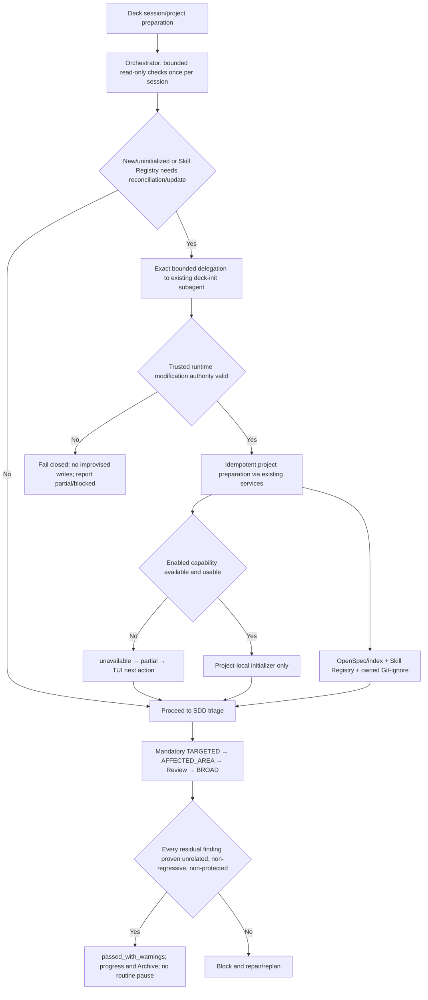

# Proposal — Orchestrator-Triggered Project Preparation and Session Baseline

## Proposal status

- **Change ID:** `project-init-skill-registry-and-session-baseline`
- **Classification:** Run SDD
- **Mode:** Interactive
- **Status:** Collaborative replacement draft; explicit system-owner reapproval is pending
- **Stakeholder:** The user is the client, system owner, domain authority, and active stakeholder for Deck preparation, authority boundaries, project-sharing policy, and final-QA disposition.
- **Risk level:** High

Creating this replacement draft is not approval. The coordinator may record approval only from new explicit human evidence. The existing Spec and Design were derived from superseded scope and must not be reworked until this revised Proposal is approved.

## Explicit supersession

This Proposal supersedes the prior CLI-centered draft at digest `sha256:b7e3f60d72b5917fc6f33b2036ea2febb4551e561619e4a32268ee7edb91d69b`. Historical Proposal approval, Spec, and Design events remain immutable evidence, but they do not authorize this corrected scope or implementation.

In this change, `deck-init` means the existing Deck subagent/skill. It does not mean a new `deck init` CLI command. The prior real-CLI entry point, CLI flags/exits/result contract, TUI init screen/adapter, cross-surface `ProjectInitServiceV1`, and fresh installed-binary CLI dispatch acceptance are withdrawn from current scope.

The prior 65-target, 4,200–6,400-line estimate is invalidated and non-authoritative. This Proposal requires the smallest bounded change that satisfies the corrected behavior. Revised Design owns the evidence-backed target set and must not inherit the withdrawn estimate.

## Corrected collaborative problem

Deck needs reliable project preparation before the Orchestrator classifies a request or enters the SDD phase flow. Today the preparation responsibility is split across Orchestrator session checks, prompt-driven `deck-init` behavior, Skill Registry commands/services, and capability-specific project state. Treating this as a new product CLI would add the wrong entry point, duplicate ownership, and substantially inflate scope.

The correct entry point is Orchestrator startup/session preparation. The Orchestrator can observe initialization and Skill Registry state read-only, but it must not write project artifacts itself. When preparation is needed, it should delegate automatically to the existing `deck-init` subagent. Routine Deck preparation should not interrupt the user when trusted runtime authority is valid, while exact delegation, modifying-effect authority, and safety controls must remain separate and fail closed.

Final QA has a connected truthfulness problem. Mandatory checks must continue to run, yet a fully proven pre-existing, reproducible, unrelated, non-regressive, non-protected finding should not force active-session repair or block progression and Archive. A weak exception could launder candidate regressions, so protected-risk precedence and evidence sufficiency must remain fail-safe.

## Intent

Make the Orchestrator the once-per-session project-preparation trigger before SDD triage. It performs bounded read-only checks and, for a new/uninitialized project or a Skill Registry that requires creation, reconciliation, or update, automatically issues an exact bounded delegation to the existing `deck-init` subagent.

Under trusted runtime modification authority, `deck-init` idempotently initializes or validates OpenSpec and the project index as applicable, reconciles `.atl/skill-registry.md` through existing services, initializes project-local state for already available configured capabilities, and adds only owned local/non-versionable Git-ignore entries. Delegation may be silent and introduces no routine approval pause; missing or invalid runtime authority fails closed without improvised writes.

The ordered quality workstream keeps all mandatory checks while assigning `passed_with_warnings` to findings proven pre-existing, reproducible, unrelated, non-regressive, and non-protected. Those warnings remain durable but do not require active-session repair, block progression or Archive, or create routine user pauses.

## Measurable outcomes

| Outcome | Evidence of success |
|---|---|
| Correct entry point | No new `deck init` CLI command, CLI contract, TUI init surface, or shared CLI/TUI/agent init service is introduced. Canonical source and runner-materialized Orchestrator/`deck-init` surfaces express the same preparation behavior. |
| Startup cadence | Before SDD triage, the Orchestrator performs the bounded initialization and SkillDiscoveryContext checks once per session; ordinary validation is read-only. |
| Automatic bounded delegation | New/uninitialized project state or a SkillDiscoveryContext result of `missing`, `stale`, `invalid`, or `indeterminate` that requires registry creation/reconciliation/update causes one exact Orchestrator delegation to `deck-init`, without the Orchestrator writing the affected files. |
| Authority separation | Delegation authority never substitutes for modifying-effect authority. Every write requires the exact delegation plus trusted runtime authorization and safety checks; absent or invalid authority produces a fail-closed component result and no improvised write. |
| No routine preparation pause | When trusted Deck preparation authority is valid, delegation and project preparation create no routine user pauses, approval prompts, or interruptions. Results remain observable without becoming an approval gate. |
| Idempotent project preparation | Fresh, partial, and complete reruns independently reconcile OpenSpec, applicable project index state, the Skill Registry, configured capability project state, and owned ignore coverage without a global early return or unnecessary rewrites. |
| Registry lifecycle preservation | Session validation remains read-only and once per session. `deck-init` reuses existing active-runner-bounded discovery, complete-before-persist evaluation, exact write authority, compare-and-swap, and atomic preservation services. |
| Capability status truthfulness | An enabled capability with an absent or unusable tool is `unavailable`, makes preparation `partial`, and points to the existing TUI. `skipped` is reserved for not-enabled, not-applicable, or dependency-blocked components. |
| Installer boundary | `deck-init` never installs, downloads, upgrades, invokes package managers, or writes user-global tool configuration. Existing TUI installation/configuration remains the exclusive tool installer. |
| Ownership-safe Git ignore | Only missing, root-anchored rules for verified local/non-versionable owned artifacts are added. Tracked or potentially shareable project configuration and unrelated `.gitignore` content remain visible and unchanged. |
| Active-change-first QA | TARGETED, AFFECTED_AREA, independent Review, and BROAD still execute with candidate identity and freshness evidence. Related, new, worsened, unproven, or protected findings remain blocking. |
| Warning progression | A finding satisfying every unrelated-baseline proof condition yields `passed_with_warnings`; it remains recorded but does not require active-session repair, block progression/Archive, or pause the user routinely. |
| Minimal bounded scope | Revised Design derives the smallest exact target set from the corrected subagent entry point and explicitly compares it with predecessor targets; the withdrawn estimate has no planning authority. |

## Authorized scope

This remains one successor change with two ordered workstreams and no third adjustment.

### Workstream 1 — Orchestrator-triggered Deck preparation

This workstream covers only:

- Orchestrator startup/session semantics before SDD triage;
- once-per-session bounded read-only initialization and SkillDiscoveryContext validation;
- deterministic conditions for automatic exact delegation to the existing `deck-init` subagent;
- separation of delegation authority from trusted runtime modification authority, including fail-closed handling;
- idempotent `deck-init` subagent/skill behavior for OpenSpec, applicable project indexing, Skill Registry reconciliation, project-local capability initialization, and owned Git-ignore entries;
- reuse of existing Skill Registry commands/domain services rather than Orchestrator writes or a second registry implementation;
- `unavailable`, `skipped`, partial, completed, and blocked preparation semantics without defining a public CLI result contract;
- semantic parity across relevant Orchestrator and `deck-init` source/materialized prompt and skill surfaces; and
- the smallest implementation and test boundary proven by revised Design.

The automatic delegation is Deck preparation outside the SDD phase sequence. It does not create a new phase and does not authorize `deck-init` or any specialist to write centralized SDD `state.yaml` or `events.yaml`.

### Workstream 2 — Evidence-backed session baseline disposition

After Workstream 1, this workstream composes existing `FailureManifestV1`, finding-disposition, failure-delta, candidate identity, freshness, staged-verification, Review, and Archive concepts into one active-change-first rule.

A finding is non-blocking only when durable evidence proves all of the following:

1. it predates the candidate using an immutable baseline subject and digest;
2. the same normalized fingerprint reproduces against baseline and candidate under equivalent sanitized environments;
3. affected-area, dependency, configuration, and causal analysis establishes unrelatedness;
4. severity, frequency, count, reachability, duration, resource impact, and protected-risk classification are not worsened;
5. active-change targeted and affected-area obligations pass independently; and
6. separately authorized baseline evidence plus linked Verify, Review, `FailureManifestV1`, and Archive records preserve the warning.

When every finding from a mandatory stage is either absent or proven under this rule, the lifecycle result is `passed` or `passed_with_warnings` as applicable. Warnings do not trigger active-session repair or a routine user pause and do not block progression or Archive. Unknown, insufficient, stale, conflicting, new, related, worsened, or protected findings remain blocking. Mandatory checks are never skipped, shortened, deferred, filtered, or relabeled to manufacture a warning.

### Why one successor remains coherent

Workstream 1 establishes truthful project/session readiness through Deck's existing Orchestrator and `deck-init` ownership. Workstream 2 defines how the prepared session judges active-change quality without laundering unrelated repository debt. They remain separately bounded and ordered while preserving the system owner's single readiness-and-progression intent. No third adjustment is needed.

## Explicit exclusions

- No real `deck init` CLI command or alias.
- No CLI parser flags, exit codes, JSON/human CLI result contract, routing branch, or installed-binary dispatch acceptance for project preparation.
- No TUI project-init screen, project-init adapter, or TUI-to-init service integration.
- No `ProjectInitServiceV1` or equivalent shared CLI/TUI/agent application service.
- No use of the withdrawn 65-target or 4,200–6,400-line estimate.
- No Orchestrator direct write to `.atl/skill-registry.md`, `.gitignore`, project capability state, `state.yaml`, or `events.yaml`.
- No assumption that exact Orchestrator delegation alone authorizes a modifying effect.
- No package/tool installation, download, upgrade, package-manager execution, or user-global tool configuration by `deck-init`.
- No change to the existing TUI installer except treating it as the unchanged next-action owner for unavailable tools.
- No blanket ignore policy for mixed or potentially shareable project surfaces.
- No broad repair of pre-existing repository debt or self-authorization of a newly discovered baseline fingerprint.
- No weakening of protected security, authorization, credential, Git-safety, destructive-behavior, migration, public-interface, architecture, or data-loss hard stops.
- No omitted mandatory checks, stale identity acceptance, or non-independent final QA.
- No direct edits to generated output.
- No Git discard, reset, restore, clean, untrack, stage, commit, push, branch, rebase, or history rewrite.
- No amendment or reinterpretation of archived Skill Registry contracts, archived broad-baseline evidence, or predecessor failure history.
- No modification of any path intersecting `runner-capability-standardization`.
- No implementation before revised Spec, Design, Tasks, approval, and exact allowlists authorize it.

## High-level approach

1. **Run a bounded preparation preflight.** At Deck session/project preparation, before SDD triage, the Orchestrator performs read-only OpenSpec and once-per-session SkillDiscoveryContext checks.
2. **Classify the preparation need.** Ready state continues to triage. New/uninitialized state or a `missing`, `stale`, `invalid`, or `indeterminate` SkillDiscoveryContext requiring registry creation, reconciliation, or update produces one bounded `deck-init` delegation.
3. **Enforce two authority gates.** The delegation identifies exact scope and actor; trusted runtime authorization independently governs each modifying effect. Valid authority takes the normal no-pause path. Missing, stale, mismatched, replayed, or invalid authority fails closed and returns truthful partial/blocked evidence.
4. **Prepare through existing services.** `deck-init` invokes the existing OpenSpec/index, Skill Registry, and capability project-local initialization mechanisms. It does not invent scanning, persistence, installer, or centralized registry logic.
5. **Reconcile components independently.** One failed or unavailable component does not erase successful preparation. Enabled absent/unusable tools become `unavailable` and partial with a TUI next action; non-enabled/not-applicable/dependency-blocked components become `skipped`.
6. **Preserve artifact ownership.** Capability declarations distinguish generated/cache/runtime artifacts from potentially shareable project configuration. Only verified local/non-versionable ownership produces a narrow ignore entry.
7. **Apply fail-safe quality disposition.** Execute every mandatory check, classify exact findings through protected-risk-first evidence rules, and propagate `passed_with_warnings` consistently through progression and Archive.
8. **Prove the corrected boundary.** Revised Design and tests cover Orchestrator/`deck-init` source and materialized surfaces, no routine preparation pause, runtime authority failures, no installer reachability, registry atomicity, idempotency, status semantics, and quality progression—without adding CLI dispatch scope.

## Dependencies

- Orchestrator startup/session-preparation surfaces and their source/materialized parity mechanisms.
- The existing `deck-init` subagent, role/skill prompts, and active-runner materialization.
- Existing once-per-session `SkillDiscoveryContextV1` validation and bounded active-runner fallback.
- Archived `agent-skill-registry-discovery` contracts and existing Skill Registry validate/discover/refresh/domain/persistence services.
- Trusted runtime delegation, modification-authorization, atomic-write, and Git-safety controls.
- Existing OpenSpec initialization/indexing and capability-owned project-local initializer mechanisms.
- Existing TUI installation/configuration flow as the exclusive unavailable-tool next action, not an implementation target.
- Existing `FailureManifestV1`, finding-disposition, failure-delta, candidate identity, freshness, staged-verification, Review, BROAD, and Archive contracts.
- `openspec/config.yaml`, `openspec/baseline-health.yaml`, and centralized coordinator ownership of SDD registry state.
- Archived `stabilize-repository-broad-baseline` evidence and the authoritative lifecycle history of `streamline-orchestrator-ownership-and-acceptance`.
- Revised Design target analysis before any conclusion about predecessor overlap.

## Tradeoffs and consequential choices

| Choice | Benefit | Accepted cost |
|---|---|---|
| Existing subagent rather than new CLI | Aligns with current Deck ownership and removes most mistaken surface area. | Project preparation remains an Orchestrator-driven capability rather than a standalone user command. |
| Silent automatic delegation under trusted authority | Avoids routine preparation pauses before SDD triage. | Runtime delegation and write authority must be mechanically distinct, auditable, and fail closed. |
| Orchestrator observes; `deck-init` modifies | Preserves least authority and existing Skill Registry writer boundaries. | Preparation requires a bounded delegation even when the need is detected locally. |
| Component-level partial readiness | Preserves successful project setup when optional tooling is unavailable. | The session must carry truthful unavailable/skipped evidence and next actions. |
| Smallest Design-derived target set | Prevents the withdrawn CLI architecture from inflating implementation. | Exact estimate and overlap judgment are deferred until revised Design evidence exists. |
| Strict unrelated-baseline proof | Avoids unnecessary active-session repair without regression laundering. | Two-subject reproduction, causal isolation, freshness, and durable evidence remain intentionally expensive. |

## Risks and mitigations

| Risk | Mitigation boundary |
|---|---|
| Silent delegation is mistaken for blanket write authority | Require an exact Orchestrator delegation and a separate trusted runtime modification authorization for every effect; reject replay or mismatch. |
| Invalid authority creates an improvised fallback write | Fail closed, preserve prior valid artifacts, and report partial/blocked status; use read-only direct discovery where permitted. |
| Once-per-session registry evidence becomes stale before a write | Existing writer re-evaluates current sources and compare-and-swap expectations immediately before persistence. |
| `deck-init` grows installer reachability | Keep installer commands and user-global configuration outside descriptors and prove negative reachability across source/materialized surfaces. |
| Project-local initialization hides shareable configuration | Use exact artifact ownership, tracked/shareable guards, and preservation-safe narrow ignore updates. |
| Prompt/profile drift changes startup behavior | Require semantic parity across relevant Orchestrator and `deck-init` source and materialized surfaces. |
| Baseline warnings excuse a candidate regression | Require immutable two-sided reproduction, causal isolation, exact fingerprint equivalence, non-regression evidence, ledger authority, and protected-risk precedence. |
| Prior Spec/Design remain mistaken authority | Record Proposal supersession, require new approval, then rework and realign Spec/Design before Tasks. |
| R5-B01 is assumed to overlap or not overlap | Revised Design compares exact targets. Only proven actual overlap invokes predecessor handling. |

## Predecessor boundary

`R5-B01` and all predecessor Review/BROAD history remain authoritative. They do not block this Proposal revision, reapproval, revised Spec, revised Design, or Tasks.

The corrected smaller boundary invalidates the prior assumption of overlap. Revised Design must compare its exact target set with the predecessor. If no shared implementation target exists, `R5-B01` is not an Apply gate for this change. If actual overlap exists, overlapping Apply requires authoritative coordination that preserves predecessor candidate identity and freshness; no specialist may waive or reinterpret the predecessor blocker.

## Rollback strategy

Rollback is a separately authorized forward change limited to the eventual smallest approved target set. It restores prior Orchestrator startup and `deck-init` prompt/skill behavior, project-local preparation coordination, and quality-disposition behavior while preserving all lifecycle and failed-attempt history.

Registry rollback preserves the last valid registry through the same exact-authority atomic writer. Project-local state and narrow ignore entries are reversed only with current ownership/tracking evidence and separate authorization; shareable configuration and unrelated content remain untouched. There is no CLI, TUI-init, installer, uninstall, generated-output, destructive-Git, commit, or push rollback path in this change.

## Open decisions for revised Spec and Design

These decisions are intentionally bounded and not guessed here:

1. Exact Orchestrator startup point and parity surfaces that guarantee preparation occurs once before SDD triage.
2. Exact read-only predicates for new/uninitialized state and for registry creation, reconciliation, or update delegation.
3. Trusted runtime authority shape, one-use/replay rules, target binding, and fail-closed component progression.
4. Component ordering and the internal preparation summary needed by the Orchestrator without creating a public CLI contract.
5. Capability-specific availability/health evidence and the smallest project-local initializer set.
6. Ownership and disposition of ambiguous local versus shareable capability artifacts.
7. User-visible telemetry that keeps automatic preparation observable without creating a routine approval pause.
8. Durable lifecycle mapping for `passed_with_warnings`, including separately authorized baseline-ledger admission.
9. Minimum repeated reproduction and environment-equivalence evidence for flaky or cross-platform baseline findings.
10. Revised exact targets, implementation size, and evidence-backed predecessor overlap classification.

## Proposal summary diagram

## Approval request

**Do you approve this replacement Proposal as the authoritative scope for `project-init-skill-registry-and-session-baseline`—Orchestrator-triggered once-per-session preparation delegated to the existing `deck-init` subagent, no new CLI/TUI init surface, trusted runtime-authorized project-local effects, TUI-exclusive tool installation, the preserved evidence-backed `passed_with_warnings` quality policy, and Design-derived overlap handling—so the coordinator may record new approval and authorize revised Spec and Design?**

Until that approval is recorded, the prior approval does not authorize this corrected scope, revised Spec or Design work remains blocked, and no Tasks or implementation authority is inferred.

## Official dependency references

- `openspec/changes/project-init-skill-registry-and-session-baseline/exploration.md`
- `openspec/changes/project-init-skill-registry-and-session-baseline/state.yaml`
- `openspec/changes/project-init-skill-registry-and-session-baseline/events.yaml`
- Existing `spec.md` and `design.md` as superseded-scope history pending authorized revision
- `openspec/archive/agent-skill-registry-discovery/spec.md`
- `openspec/archive/agent-skill-registry-discovery/design.md`
- `openspec/archive/stabilize-repository-broad-baseline/`
- `openspec/changes/streamline-orchestrator-ownership-and-acceptance/state.yaml`
- `openspec/changes/streamline-orchestrator-ownership-and-acceptance/events.yaml`
- `openspec/changes/streamline-orchestrator-ownership-and-acceptance/review-report.md`
- `openspec/config.yaml`
- `openspec/baseline-health.yaml`

## Provenance and coordination

- **Role:** `deck-developer-proposal`
- **Instance:** `deck-developer-proposal-opencode-orchestrator-deck-init-replacement-20260728`
- **Runner:** `opencode`
- **Model:** `openai/gpt-5.6-sol`
- **Loaded role skill:** `deck-developer-proposal`
- **Skill discovery:** Supplied V1 status `indeterminate`, reason `validate_command_returned_unexpected_interactive_menu`, active runner `opencode`, authority reminder `v1`; bounded active-OpenCode direct discovery only. No registry generation, refresh, repair, or write was performed by this role.
- **Adaptive context:** Advisory only; official OpenSpec artifacts and the system owner's authoritative correction controlled this revision.
- **Registry ownership:** This role did not modify `state.yaml` or `events.yaml`. One nested `RegistryIntentV1` is returned out of band for coordinator validation and atomic reconciliation.
