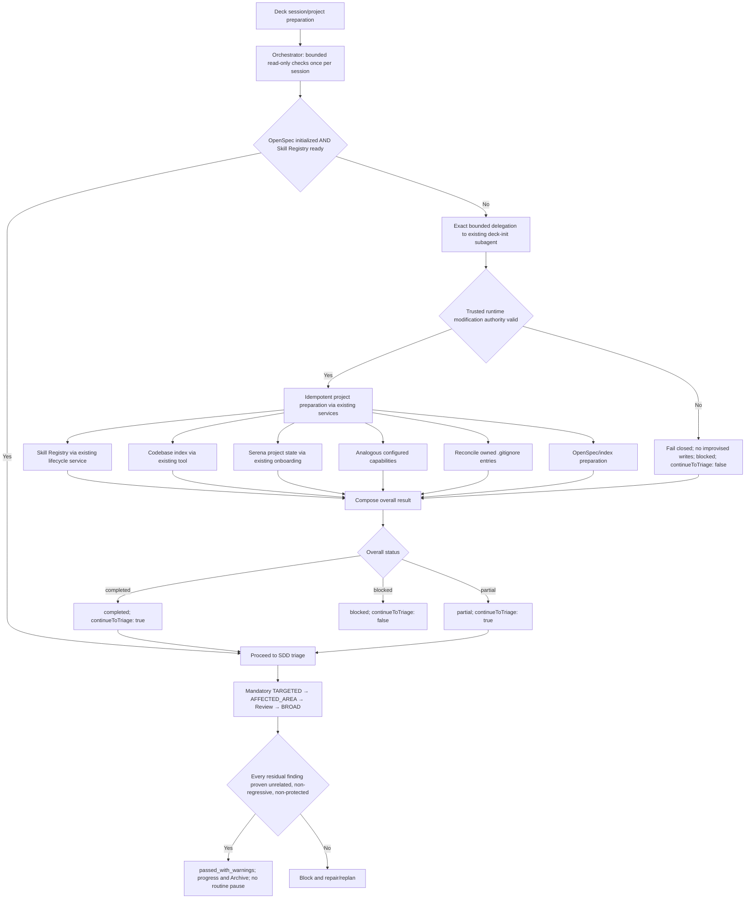

# Spec — Project Init, Skill Registry, and Session Baseline

## Spec Status

- **Change ID:** `project-init-skill-registry-and-session-baseline`
- **Phase:** Spec
- **Mode:** Interactive
- **Status:** Reconciled with revised Design (`sha256:4396901c8a920b6331436ea7a3d764df07918a4999b067fee9c2793616ee77e9`)
- **Predecessor:** `streamline-orchestrator-ownership-and-acceptance` (failed; R5-B01 applies per REQ-017/REQ-018)
- **Approved Proposal digest:** replacement Proposal recorded in `state.yaml` / `events.yaml`

## Supersession Note

The prior Spec (`sha256:a7e703e0e578030bf4eecb7f8509db97e032420707066ab60b12573f9b9282b0`) defined `deck init` as a real CLI command with `--runner` flags, exit codes, a shared `ProjectInitServiceV1`, TUI init screen, and installed-binary acceptance tests. That CLI-centered scope has been superseded by the replacement Proposal. All prior CLI-centered requirements (REQ-001 through REQ-003, REQ-020, REQ-021) are removed. This revised Spec defines only the Orchestrator-triggered, `deck-init` subagent-delegated behavior. The prior Spec remains immutable history; this document is the sole normative authority.

## Context Authority

### OFFICIAL CONTEXT

This spec derives from the approved replacement Proposal (`proposal.md`), the completed Exploration (`exploration.md`), and the revised Design (`design.md`, `sha256:4396901c8a920b6331436ea7a3d764df07918a4999b067fee9c2793616ee77e9`). The Spec Registry lifecycle pair remains operational authority.

OpenSpec artifacts and the Spec Registry are authoritative. Adaptive context is advisory only.

### APPLIED CAPABILITY GUIDANCE

- **API/Interface Design:** Contract-first versioning, additive compatibility, boundary validation, consistent error/status semantics.
- **Security and Hardening:** No authority injection from metadata. Capability availability is read-only evidence, not modification authority.

## Behavioral Scope Summary

This specification defines the Orchestrator's once-per-session project-preparation trigger before SDD triage. It establishes 8 behavioral areas covering Orchestrator session preparation, automatic bounded delegation to the existing `deck-init` subagent, authority separation and fail-closed handling, Skill Registry reconciliation, capability detection and project-local initialization, ownership-safe Git-ignore reconciliation, readiness-state taxonomy, baseline disposition policy, and predecessor/registry artifact integrity.

## Requirements

### Priority Levels (RFC 2119)

- **MUST** — absolute requirement; violation is a defect.
- **SHOULD** — strong recommendation; deviation requires documented justification.
- **MAY** — optional; implementation discretion.

---

### Group 1: Orchestrator Session Preparation

#### REQ-001: Once-Per-Session Preparation Before SDD Triage

**Priority:** MUST

Before entering SDD triage, the Orchestrator MUST perform bounded read-only project initialization and SkillDiscoveryContext validation exactly once per session. This check MUST determine whether the project is new/uninitialized, OpenSpec preparation is incomplete (missing, unreadable, malformed, or `initialized != true`), or the project Skill Registry is missing, stale, invalid, indeterminate, or otherwise requires authorized reconciliation. The session is bound to one project root and active runner; a later root/runner change is a mismatch, not a second preparation opportunity. Ordinary session-start validation is read-only and MUST NOT modify any project artifact.

**Rationale:** The Orchestrator is the correct entry point for project preparation, not a CLI command. Read-only checks separate detection from modification.

##### Scenario: New project detected

```
Given  a project with no `openspec/config.yaml`
When   the Orchestrator performs session preparation
Then   the project MUST be classified as new/uninitialized
And    the Orchestrator MUST NOT write any project artifact
And    the Orchestrator MUST delegate to `deck-init`
```

##### Scenario: Existing project with valid state

```
Given  a project with `initialized: true` in `openspec/config.yaml`
And    a valid Skill Registry with matching fingerprint
When   the Orchestrator performs session preparation
Then   the preparation result MUST indicate ready
And    no delegation to `deck-init` MUST occur
And    the Orchestrator MUST proceed to SDD triage
```

##### Scenario: Registry missing on existing project

```
Given  an initialized project with no `.atl/skill-registry.md`
When   the Orchestrator performs session preparation
Then   the SkillDiscoveryContext status MUST be `missing`
And    the Orchestrator MUST delegate to `deck-init`
```

##### Scenario: Registry stale or indeterminate

```
Given  a project with a registry whose fingerprint does not match current sources
When   the Orchestrator performs session preparation
Then   the SkillDiscoveryContext status MUST be `stale` or `indeterminate`
And    the Orchestrator MUST delegate to `deck-init`
```

##### Scenario: Root/runner mismatch in same session

```
Given  a session already bound to project root A and runner X
When   the Orchestrator receives a request for root B or runner Y
Then   the preparation result MUST be a mismatch
And    no second preparation MUST occur
```

---

### Group 2: deck-init Subagent Delegation and Authority

#### REQ-002: Automatic Silent Delegation to deck-init

**Priority:** MUST

When the preparation check from REQ-001 identifies a need, the Orchestrator MUST issue exactly one bounded delegation to the existing `deck-init` subagent/skill. Delegation MUST be automatic and MUST NOT require routine user approval. The delegation MUST identify exact scope and actor. Deck preparation occurs outside the SDD phase flow and MUST NOT create a new SDD phase, status, or artifact.

**Rationale:** Routine Deck preparation should not interrupt the user when trusted runtime authority is valid. The delegation is preparation, not an SDD phase.

##### Scenario: Automatic delegation without user pause

```
Given  a new project requiring initialization
When   the Orchestrator detects the preparation need
Then   the Orchestrator MUST delegate to `deck-init` automatically
And    no routine user approval prompt MUST appear
And    no new SDD phase MUST be created
```

##### Scenario: One delegation per preparation need

```
Given  a project with both missing OpenSpec and missing registry
When   the Orchestrator detects the preparation need
Then   exactly one delegation to `deck-init` MUST occur
And    the delegation MUST cover both OpenSpec and registry needs
```

---

#### REQ-003: Authority Separation

**Priority:** MUST

Delegation authority MUST NOT substitute for modifying-effect authority. Every write performed by `deck-init` requires the exact delegation plus trusted runtime authorization and safety checks. The authorization MUST bind the session, invocation, canonical project-root digest, active runner, component, action, and target set. Missing, stale, mismatched, replayed, or invalid authority MUST fail closed with no improvised writes. Caller or prompt data cannot mint, widen, replay, or substitute for that authority. The result MUST report truthful partial/blocked evidence.

**Rationale:** Silent delegation must not be mistaken for blanket write authority. Authority gates must be mechanically distinct and auditable.

##### Scenario: Valid authority proceeds without pause

```
Given  a delegation from the Orchestrator with valid trusted runtime authority
When   `deck-init` attempts to reconcile the Skill Registry
Then   the write MUST proceed
And    no routine user pause MUST occur
```

##### Scenario: Missing authority fails closed

```
Given  a delegation from the Orchestrator with missing or invalid runtime authority
When   `deck-init` attempts any modifying effect
Then   the effect MUST NOT proceed
And    the component result MUST be `blocked`
And    no improvised write MUST occur
```

##### Scenario: Replayed authority rejected

```
Given  a delegation with a previously used authority token
When   `deck-init` validates the authority
Then   the authority MUST be rejected as replayed
And    the component MUST fail closed
```

##### Scenario: Operation mismatch rejected

```
Given  a delegation with authority for OpenSpec operations only
When   `deck-init` attempts a Skill Registry write
Then   the authority MUST be rejected as operation-mismatched
And    the registry component MUST be `blocked`
```

---

#### REQ-004: Idempotent Project Preparation

**Priority:** MUST

`deck-init` MUST idempotently prepare project-local OpenSpec/index state, create/reconcile/update `.atl/skill-registry.md` through existing atomic contracts, initialize project-local state for already available configured capabilities, and add only owned local/non-versionable `.gitignore` entries. Fresh, partial, and complete reruns MUST independently reconcile each component without a global early return or unnecessary rewrites. A component effect MUST run at most once per preparation invocation, and every effect MUST be followed by a read-only postcondition. Attempted work is not success.

**Rationale:** Idempotency supports recovery from transient failures and repeated session preparation.

##### Scenario: Complete rerun performs no writes

```
Given  a project fully prepared by a previous `deck-init` run
When   `deck-init` runs again
Then   no file writes MUST occur
And    every component result MUST indicate `unchanged` or `ready`
```

##### Scenario: Partial rerun recovers failed component

```
Given  a project where registry reconciliation previously failed
And    OpenSpec was already initialized
When   `deck-init` runs again
Then   the OpenSpec component MUST remain `unchanged`
And    registry reconciliation MUST be attempted again
```

##### Scenario: Postcondition failure blocks component

```
Given  a component effect appears to succeed
And    the postcondition probe fails
When   `deck-init` verifies the component
Then   the component result MUST be `blocked`
And    attempted work MUST NOT be reported as success
```

---

#### REQ-005: Failure Isolation and Status Aggregation

**Priority:** MUST

A failure in one preparation component MUST NOT prevent other components from being attempted or succeeding. Each component MUST have its own result. One component's ready state or failure MUST NOT suppress inspection of later independent components.

Component status vocabulary:

- `ready`: applicable component has verified current postconditions with no change needed.
- `changed`: applicable component produced an effect and verified postconditions.
- `unchanged`: applicable component was already current and no effect was needed.
- `unavailable`: an enabled capability whose required executable/tool/runner surface is absent or unusable. This status affects overall readiness and MUST provide a next action directing the user to Deck's existing TUI installation/configuration flow. `deck-init` MUST NOT install, download, upgrade, or globally configure the capability.
- `skipped`: reserved for non-enabled, not-applicable, no-project-initializer, or dependency-blocked-by-unavailable-optional components. This status does NOT affect overall readiness.
- `blocked`: authority, containment, tracked/shareable ownership, malformed-state, compare-and-swap, postcondition, or other safety proof failed. No write fallback exists.

Overall status aggregation:

- `completed`: OpenSpec is ready and every applicable component is `ready`/`changed`/`unchanged`; `continueToTriage: true`.
- `partial`: OpenSpec is ready and remaining issues are fail-open registry discovery or unavailable optional project tooling; `continueToTriage: true`, with bounded direct skill discovery when the registry remains non-ready.
- `blocked`: OpenSpec is not safely initialized, result/authority identity is invalid, or a protected safety/ownership conflict occurred; `continueToTriage: false` for SDD work.

**Rationale:** Failure isolation preserves successful initialization work and enables targeted recovery.

##### Scenario: Registry fails but OpenSpec succeeds

```
Given  a project with valid OpenSpec configuration
And    registry generation fails
When   `deck-init` runs
Then   the OpenSpec component result MUST be `ready` or `unchanged`
And    the registry component result MUST be `blocked`
And    the overall result MUST be `partial`
```

##### Scenario: Capability unavailable but other components succeed

```
Given  a project where Serena is not installed (executable absent or unusable)
And    OpenSpec and registry reconcile successfully
When   `deck-init` runs
Then   the Serena component result MUST be `unavailable`
And    the result MUST provide a next action directing to the TUI flow
And    the overall result MUST be `partial`
And    `continueToTriage` MUST be `true`
```

##### Scenario: Pre-component validation failure blocks triage

```
Given  an invalid or escaping project root
When   `deck-init` validates the request
Then   no component MUST execute
And    the overall result MUST be `blocked`
And    `continueToTriage` MUST be `false`
```

##### Scenario: Authority mismatch blocks without fallback

```
Given  a delegation with mismatched runner identity
When   `deck-init` validates the authority reference
Then   the overall result MUST be `blocked`
And    no modifying effect MUST be attempted
And    `continueToTriage` MUST be `false`
```

##### Scenario: Later components inspected despite earlier failure

```
Given  OpenSpec initialization succeeds
And    registry reconciliation fails
And    codebase-memory is available
When   `deck-init` runs
Then   the OpenSpec component MUST be `ready` or `unchanged`
And    the registry component MUST be `blocked`
And    the codebase-memory component MUST still be inspected
```

---

### Group 3: Skill Registry Reconciliation

#### REQ-006: Reuse Existing Registry Domain

**Priority:** MUST

`deck-init` MUST reconcile the Skill Registry through the existing skill-discovery domain lifecycle service. `deck-init` MUST NOT perform model-directed scanning, independent adapter-specific registry writes, or direct file construction. The archived authority contract (active-runner scope, exact one-use write authority, complete candidate validation, compare-and-swap, atomic preservation) MUST be reused unchanged.

The lifecycle operation is selected from inspected state:

| OpenSpec/registry state | Operation |
|---|---|
| Fresh OpenSpec project and no registry | `initial_generation` |
| Existing initialized project and no registry | `migration` |
| Existing stale/invalid/indeterminate registry | `regeneration` |
| Ready fingerprint match | read-only `unchanged` |

**Rationale:** The existing Core implementation supplies the reusable registry service boundary. Reimplementing would drift from the archived contract.

##### Scenario: Missing registry generated during init

```
Given  a project without an existing registry
When   `deck-init` reconciles the registry
Then   it MUST invoke the existing skill-discovery lifecycle service
And    the domain MUST enumerate active-runner and generic project sources
And    the domain MUST validate the complete candidate before writing
And    the domain MUST write atomically (temp + rename)
```

##### Scenario: Valid registry not regenerated

```
Given  a project with a valid registry (fingerprint matches)
When   `deck-init` runs
Then   the registry MUST NOT be regenerated
And    the registry component result MUST be `unchanged`
```

---

#### REQ-007: Session Validation Remains Read-Only

**Priority:** MUST

Session-start registry validation MUST remain read-only and once per session. The Orchestrator MUST NOT modify the registry during session-start validation. Validation classifies the registry as `ready`, `missing`, `stale`, `invalid`, or `indeterminate` and passes compact Skill Discovery Context to specialists. `deck-init` owns authorized reconciliation; the Orchestrator NEVER writes the Skill Registry.

**Rationale:** Read-only validation separates classification from modification, preserving the archived contract.

##### Scenario: Session validation does not create or modify registry

```
Given  a session start with no existing registry
When   the Orchestrator validates
Then   the status MUST be `missing`
And    no file MUST be created or modified
And    compact Skill Discovery Context MUST include status `missing`
```

---

#### REQ-008: Registry Failure Is Fail-Open

**Priority:** MUST

When registry generation or reconciliation fails during `deck-init`, the failure MUST be reported as a registry component failure. `deck-init` MUST NOT block other components from succeeding. The last valid registry (if any) MUST be preserved. Bounded direct discovery MUST remain available for specialists.

**Rationale:** Registry failure degrades discovery convenience, not SDD operation.

##### Scenario: Registry failure does not block other components

```
Given  a project where registry source evaluation fails
When   `deck-init` runs
Then   the registry component result MUST be `blocked` with diagnostic
And    OpenSpec, capability, and Git-ignore components MUST still be attempted
```

---

### Group 4: Capability Detection and Project-Local Initialization

#### REQ-009: Read-Only Capability Availability Detection

**Priority:** MUST

For each enabled capability, `deck-init` MUST perform read-only detection of: (a) configured selection for the active runner, (b) executable/package presence, (c) health/usability prerequisites. `deck-init` MUST NOT install, download, upgrade, invoke package managers, use network installation, or create user-global runner configuration. The TUI exclusively installs tools.

The capability ID and executable name MAY differ. For example, capability ID `codebase-memory` uses executable `codebase-memory-mcp`. Detection MUST probe the executable declared by the capability descriptor, not assume the capability ID equals the executable name.

**Rationale:** The system owner established the boundary: init detects availability; the TUI owns installation.

##### Scenario: Capability executable present and healthy

```
Given  Serena is enabled for the active runner
And    the `serena` executable is on PATH and responds to `--version`
When   `deck-init` detects capability availability
Then   the Serena availability result MUST be `available`
And    no installation or network operation MUST occur
```

##### Scenario: Capability executable absent

```
Given  codebase-memory is enabled for the active runner
And    the `codebase-memory-mcp` executable is not on PATH
When   `deck-init` detects capability availability
Then   the codebase-memory availability result MUST be `unavailable`
And    no download or installation MUST occur
And    the component result MUST be `unavailable` with next-action pointing to TUI flow
And    the overall result MUST be `partial`
```

---

#### REQ-010: Project-Local Initializer Invocation

**Priority:** MUST

When an enabled capability is detected as available and its declared health/usability prerequisites pass, `deck-init` MUST invoke only that capability's authorized project-local initializer. `deck-init` MUST verify the initializer's declared project evidence afterward. `deck-init` MUST NOT invoke any environment-level installer, MCP configuration writer, or user-global configuration effect. A capability is eligible for initialization only when current runner configuration enables it, the active runner already exposes a usable tool, the tool declares a bounded project-local operation and owned outputs, and no installation/global effect is reachable. Detector-only or instruction-only capabilities are not initialized.

**Rationale:** Project-local initializers (e.g., `.serena/project.yml` creation) are distinct from environment installation.

##### Scenario: Available capability runs project-local initializer

```
Given  Serena is detected as available
And    Serena's project-local initializer creates `.serena/project.yml`
When   `deck-init` runs capability initialization
Then   the Serena project-local initializer MUST be invoked
And    `.serena/project.yml` MUST be created or reconciled
And    no `uv tool install` or MCP config write MUST occur
```

##### Scenario: Unavailable capability does not run initializer

```
Given  codebase-memory is detected as unavailable (executable absent or unusable)
When   `deck-init` runs capability initialization
Then   the codebase-memory project-local initializer MUST NOT be invoked
And    the component result MUST be `unavailable`
And    the result MUST include a next action directing to the TUI flow
And    the overall result MUST be `partial`
```

##### Scenario: Detector-only capability skipped

```
Given  a capability that is enabled but declares no project-local initializer
When   `deck-init` evaluates the capability
Then   the component result MUST be `skipped`
And    the overall result MUST NOT be degraded by this component
```

---

#### REQ-011: Surface-Complete Capability Readiness

**Priority:** MUST

`deck-init` MUST distinguish at least these states per enabled capability: (a) configured/selected for the active runner, (b) executable/package present (using the declared executable name, not the capability ID), (c) executable usable (not merely discoverable), (d) applicable project-local state initialized and valid. Binary presence alone MUST NOT prove project readiness.

**Rationale:** Presence-only readiness claims are a composition gap. Detection must use the declared executable name.

##### Scenario: Presence alone insufficient for ready status

```
Given  codebase-memory-mcp executable is on PATH
And    codebase-memory MCP configuration is missing from the active runner
When   `deck-init` evaluates codebase-memory readiness
Then   the readiness result MUST NOT be `ready`
And    the result MUST indicate which surface is missing
```

---

#### REQ-012: No Installation Authority

**Priority:** MUST

`deck-init` MUST NOT have any package/tool installation, download, package-manager invocation, network installation, or user-global capability configuration authority. No prompt, status, or adapter MUST grant such authority. Deck's existing TUI installation/configuration flow remains the exclusive owner of those effects. `deck-init` never installs, downloads, upgrades, invokes package managers, or writes user-global tool configuration.

**Rationale:** The system owner's authoritative correction establishes this boundary.

##### Scenario: Init cannot reach installation code path

```
Given  any enabled capability is unavailable
When   `deck-init` runs
Then   no code path for package download, installation subprocess,
       package-manager invocation, or user-global config write
       MUST be reachable from `deck-init`
```

---

### Group 5: Ownership-Safe Git-Ignore Reconciliation

#### REQ-013: Narrow Owned Artifact Rules

**Priority:** MUST

`deck-init` MUST reconcile Git-ignore entries only for verified `machine_local_generated` owned artifacts derived from capability ownership descriptors. `deck-init` MUST add only missing, root-anchored rules. `deck-init` MUST NOT add blanket rules for mixed or potentially shareable directories.

An exact ignore rule may be contributed only when ALL of the following are proven immediately before commit:

1. The active component declares the exact normalized, root-contained artifact and exact root-anchored or component-local rule.
2. The artifact is machine-local/non-versionable, not shareable configuration or a shareable generated bootstrap artifact.
3. The artifact and proposed rule are not tracked by Git, and the rule cannot match any declared shareable path.
4. Ownership is unambiguous and the ignore file is an existing regular UTF-8 file, not a symlink.
5. The read digest still matches at compare-and-swap commit time.

Classification boundary for codebase-memory artifacts:

- `/.codebase-memory/.gitattributes`, `/.codebase-memory/artifact.json`, `/.codebase-memory/graph.db.zst` are classified as `shareable_generated` because the persisted graph is explicitly usable for team bootstrap. They are NOT auto-ignored. No blanket `/.codebase-memory/` rule is added.
- Codebase-memory local cache/runtime artifacts (if any) that are declared `machine_local_generated` by the capability descriptor MAY receive owned ignore entries.

**Rationale:** Blanket rules can hide shareable config. Ownership descriptors distinguish shareable generated artifacts from local cache.

##### Scenario: Narrow rule added for machine-local artifact

```
Given  an ownership descriptor declares `/.atl/skill-registry.md` as `machine_local_generated`
And    no existing broader rule covers it
And    `.gitignore` exists and is writable
When   `deck-init` reconciles Git-ignore entries
Then   `/.atl/skill-registry.md` MUST be appended
And    no broader `/.atl/` rule MUST be added
```

##### Scenario: Broader existing rule accepted

```
Given  `.gitignore` already contains `/.atl/`
When   `deck-init` reconciles Git-ignore entries
Then   no additional rule for `/.atl/skill-registry.md` MUST be added
```

##### Scenario: Shareable generated artifact not ignored

```
Given  an ownership descriptor declares `/.codebase-memory/graph.db.zst` as `shareable_generated`
When   `deck-init` reconciles Git-ignore entries
Then   no rule MUST be added for `/.codebase-memory/graph.db.zst`
And    the file MUST remain visible to Git
```

##### Scenario: Tracked artifact refuses ignore rule

```
Given  an artifact is declared `machine_local_generated`
And    the artifact is already tracked by Git
When   `deck-init` reconciles Git-ignore entries
Then   no rule MUST be added for the tracked artifact
And    a diagnostic MUST note the tracked-file refusal
```

##### Scenario: Symlinked ignore file refused

```
Given  `.gitignore` is a symlink
When   `deck-init` attempts to reconcile Git-ignore entries
Then   the reconciliation MUST be refused
And    the component result MUST be `blocked`
```

---

#### REQ-014: Preserve Unrelated Content

**Priority:** MUST

`deck-init` MUST preserve every unrelated byte and line ordering in `.gitignore`. `deck-init` MUST NOT overwrite, remove, reorder, normalize, broaden, or untrack existing entries. `deck-init` MUST NOT invoke Git to change tracking state.

**Rationale:** Git-ignore safety requires minimal, additive changes.

##### Scenario: Existing entries preserved

```
Given  `.gitignore` contains 20 existing entries in a specific order
When   `deck-init` appends a new narrow rule
Then   all 20 existing entries MUST remain unchanged
And    their ordering MUST be preserved
And    the new rule MUST be appended
```

##### Scenario: Tracked file not untracked

```
Given  `.serena/project.yml` is tracked by Git
When   `deck-init` reconciles Git-ignore entries
Then   `.serena/project.yml` MUST NOT be untracked
And    no rule MUST be added that would hide it
```

---

#### REQ-015: Shareable Configuration Protection

**Priority:** MUST

`deck-init` MUST NOT hide descriptor-declared `shareable_config` or `shareable_generated` paths. When an ownership descriptor classifies a path as `shareable_config` or `shareable_generated`, `deck-init` MUST NOT add an ignore rule for it. An existing exact or owner-permitted broader rule satisfies coverage; no additional rule is added.

Ownership decisions:

| Path | Classification |
|---|---|
| `/.serena/project.yml`, `/.serena/.gitignore` | `shareable_config`; never auto-ignore |
| `/.codebase-memory/.gitattributes`, `artifact.json`, `graph.db.zst` | `shareable_generated`; never auto-ignore |
| `/.deck/config.json` | `shareable_config`; never auto-ignore |

##### Scenario: Shareable config not hidden

```
Given  an ownership descriptor declares `/.deck/config.json` as `shareable_config`
When   `deck-init` reconciles Git-ignore entries
Then   no rule MUST be added for `/.deck/config.json`
And    the file MUST remain visible to Git
```

---

### Group 6: Readiness-State Taxonomy

#### REQ-016: Component-Level Readiness States

**Priority:** MUST

`deck-init` MUST distinguish and report the following independent readiness states:

1. **Binary presence:** The executable (by declared name, not capability ID) exists on the filesystem or PATH.
2. **Usability:** The executable passes health prerequisites.
3. **Runner readiness:** The active runner's MCP/plugin/config surface for the capability is present and valid.
4. **Project initialization:** The capability's project-local state is initialized and valid.
5. **Skill Registry readiness:** The `.atl/skill-registry.md` is valid, complete, and fingerprint-matched.

Each state MUST be independently evaluated and reported. A lower state MUST NOT imply a higher state. An enabled capability with an absent or unusable tool is `unavailable`, overall preparation is `partial`, and the next action is TUI. `skipped` is reserved for not-enabled, not-applicable, no-project-initializer, or dependency-blocked-by-unavailable-optional components and does not affect readiness.

**Rationale:** Per component-level truthfulness, presence-only readiness claims are insufficient.

##### Scenario: Binary present but runner not ready

```
Given  `serena` executable is on PATH
And    Serena MCP config is missing from the active runner
When   `deck-init` evaluates readiness
Then   binary presence MUST be `true`
And    usability MUST be `true` (assuming health check passes)
And    runner readiness MUST be `false`
And    the component MUST be `unavailable` with TUI next action
```

##### Scenario: All states satisfied

```
Given  a capability where binary, usability, runner, and project-local states are all valid
When   `deck-init` evaluates readiness
Then   the component result MUST be `ready` or `unchanged`
```

---

### Group 7: Baseline Disposition Policy

#### REQ-017: Mandatory QA Execution

**Priority:** MUST

All required TARGETED, AFFECTED_AREA, independent Review, and BROAD checks MUST execute with candidate identity and freshness evidence. No check MAY be skipped, shortened, deferred, filtered, or relabeled. BROAD MUST always execute.

**Rationale:** The policy changes disposition of proven findings; it does not change whether checks run.

##### Scenario: All mandatory checks execute

```
Given  an active change entering Verify/Review
When   the QA cycle runs
Then   TARGETED checks MUST execute
And    AFFECTED_AREA checks MUST execute
And    independent Review MUST execute
And    mandatory BROAD MUST execute
And    no check MAY be skipped or filtered
```

---

#### REQ-018: Blocking Findings Remain Blocking

**Priority:** MUST

The following categories of findings MUST remain blocking regardless of age or baseline classification:

1. New findings introduced by the active change.
2. Worsened findings (increased severity, frequency, count, reachability, duration, resource impact).
3. In-scope or causally related findings.
4. Security, authorization, credential/secret exposure, Git safety, destructive behavior, and data-loss findings.
5. Protected migration/public-interface/cross-package-architecture obligations.
6. Active-change requirement/task/Design violations.
7. Stale, missing, conflicting, or insufficient evidence.
8. Skipped mandatory checks, direct generated-output edits, or freshness violations.
9. Registry conflicts or recovery-required states.

##### Scenario: Related regression blocks

```
Given  a test failure introduced by the active change's candidate
When   Verify evaluates the finding
Then   the finding MUST be classified as `blocker`
And    the active change MUST NOT proceed until resolved
```

##### Scenario: Security finding blocks regardless of age

```
Given  a credential-exposure finding discovered in BROAD
And    the finding predates the active change
When   Verify evaluates the finding
Then   the finding MUST be classified as `blocker`
And    the finding MUST NOT be reclassified as a non-blocking warning
```

---

#### REQ-019: Proven Unrelated Baseline Findings as Warnings

**Priority:** MUST

A finding MAY be non-blocking only when ALL of the following evidence is present:

1. **Identity:** Normalized cross-subject fingerprint computed from policy version, suite/check ID, test/diagnostic name, repository-relative location, oracle ID, category, and sanitized stable error-signature digest. It excludes batch/subject digests, timestamps, absolute paths, prose, ports, temporary roots, and producer identity. A versioned normalizer may remove only declared volatile values; it must retain expected/actual semantics and stable error codes.
2. **Reproduction:** Same normalized fingerprint reproduced against both an immutable baseline subject and the active candidate subject under an execution plan fixed before repetition and equivalent sanitized environments. Thresholds: deterministic findings require `2/2` consecutive reproductions on each subject; a durable valid ledger entry may replace only the baseline `2/2`. Flaky/timing-sensitive findings require exactly 5 predeclared runs per subject with the same fingerprint occurring at least 3 times on each, all outcomes retained, candidate count no greater than baseline, and no worse candidate metric. Flaky evidence expires after 14 days or an earlier declared trigger. Cross-platform observations require independent evidence per `os + arch + runtime-major` cohort.
3. **Pre-existence:** Immutable baseline ref and digest proving the failure existed before the candidate's first relevant modification.
4. **Unrelatedness:** Candidate diff/allowlist does not modify the failing location, its callers/dependencies/configuration, or the check oracle. Affected-area/call/data-flow/configuration analysis and oracle analysis find no credible causal path.
5. **Non-regression:** Fingerprint, severity, failure count, reachability, duration, resource impact, and protected-risk classification are unchanged. No test was skipped, weakened, filtered, or relabeled.
6. **Durable record:** `FailureManifestV1` records `relationship: unrelated_baseline` and `status: pre_existing` with safe evidence. A separately authorized, pre-existing `openspec/baseline-health.yaml` ledger entry binds the normalized fingerprint, policy/normalizer version, immutable subject, environment cohort, evidence digests, approval identity, and invalidation triggers.
7. **Environment equivalence:** OS/architecture cohort, runtime name/major, relevant tool versions, lockfile digests, command/check-plan digest, locale, timezone, and allowlisted sanitized environment-value digests must match. Any permitted difference must be enumerated in the ledger entry and must not affect the oracle; unknown differences block.

Unknown, insufficient, stale, conflicting, or ambiguous evidence MUST fail safe to blocking.

The same failing candidate cannot create or approve the ledger entry it consumes. Ordinary preparation, Verify, Review, BROAD, Orchestrator, and Archive have no ledger-write authority. Admission requires a separate authorized OpenSpec Apply with an exact ledger allowlist, pre-existing immutable evidence, independent Verify/Review, and a distinct transaction/approval identity.

##### Scenario: Fully proven unrelated finding is non-blocking

```
Given  a test failure with normalized fingerprint "abc123"
And    the same fingerprint exists on the immutable baseline (2/2 reproduction or valid ledger)
And    the candidate diff does not modify the failing test or its dependencies
And    affected-area analysis finds no causal path
And    severity, count, and reachability are unchanged
And    FailureManifestV1 records unrelated_baseline/pre_existing
And    a separately authorized ledger entry exists in baseline-health.yaml
When   Verify evaluates the finding
Then   the finding MUST be classified as a non-blocking warning
And    the finding MUST NOT block progression or Archive
```

##### Scenario: Insufficient evidence defaults to blocking

```
Given  a test failure that appears pre-existing
And    only one reproduction against the candidate (no baseline reproduction)
When   Verify evaluates the finding
Then   the finding MUST be classified as `blocker`
```

##### Scenario: Flaky finding requires 5-run threshold

```
Given  a timing-sensitive test failure
And    only 2 out of 5 baseline runs reproduced the fingerprint (below 3/5 threshold)
When   Verify evaluates the finding
Then   the finding MUST be classified as `blocker`
```

##### Scenario: Cross-platform finding requires per-cohort evidence

```
Given  a test failure observed on linux/x64
And    no evidence exists for the darwin/arm64 cohort
When   Verify evaluates the finding for a darwin/arm64 candidate
Then   the finding MUST be classified as `blocker`
And    linux/x64 evidence MUST NOT satisfy the darwin/arm64 cohort
```

---

#### REQ-020: Stage and Phase Status Semantics

**Priority:** MUST

When every mandatory check executes and no blocking disposition exists, the stage MUST be `passed`. When every mandatory check executes and some findings have validated non-blocking dispositions, the stage MUST be `passed` and the phase status MUST be `passed_with_warnings`. When any finding has a blocking disposition, the stage/phase MUST be `failed`. No new `StageStatus` value is added.

##### Scenario: Passed with warnings

```
Given  all mandatory checks have executed
And    one test failure has a validated non-blocking disposition
And    no blocking findings exist
When   Verify evaluates the stage
Then   the stage MUST be `passed`
And    the phase status MUST be `passed_with_warnings`
```

##### Scenario: Blocked

```
Given  all mandatory checks have executed
And    one test failure has no validated non-blocking disposition
When   Verify evaluates the stage
Then   the stage MUST be `failed`
```

---

#### REQ-021: Durable Warning Evidence

**Priority:** MUST

Any non-blocking baseline finding MUST have linked evidence in: (a) `FailureManifestV1` with `relationship: unrelated_baseline` and `status: pre_existing`, (b) `BaselineEvidenceEnvelopeV1` and `QualityDispositionEnvelopeV1` from the authoritative baseline-evidence evaluator, (c) Verify report with baseline ref, candidate batch, commands, results, and causal analysis, (d) Review report independently confirming the disposition with fresh identity, (e) Archive report preserving the warning and residual risk. The evidence MUST reference `openspec/baseline-health.yaml` when the ledger already contains the fingerprint.

Review independently validates architecture/causality/protected risk with a fresh identity and emits a service-bound confirmation. It cannot inherit Verify's judgment merely because the fingerprint matches. A validated warning does not enter repair routing and does not trigger a routine user pause.

##### Scenario: Warning preserved through lifecycle

```
Given  a non-blocking baseline finding with full evidence
When   the change progresses through Verify → Review → Archive
Then   each report MUST reference the finding's disposition and evidence
And    Review MUST independently validate the disposition
And    Archive MUST surface the warning and residual risk
And    Archive MUST NOT delete failed evidence or claim global green
```

##### Scenario: Warning does not trigger repair or pause

```
Given  a validated non-blocking warning
When   the Orchestrator evaluates progression
Then   the warning MUST NOT enter repair routing
And    no routine user pause MUST occur
```

---

#### REQ-022: Ledger Reconciliation Separation

**Priority:** MUST

Baseline-ledger reconciliation (adding a newly proven pre-existing fingerprint to `openspec/baseline-health.yaml`) MUST be a separate, explicitly authorized, evidence-backed action with these properties:

- The action requires a separate explicitly authorized OpenSpec Apply with an exact `openspec/baseline-health.yaml` allowlist.
- Immutable evidence must be produced before that Apply.
- Independent Verify/Review must validate the evidence.
- The transaction/approval identity must differ from the failing candidate.
- Until that action completes, the finding blocks.

A failing run MUST NOT self-authorize its own baseline exception.

##### Scenario: Failing run cannot self-authorize

```
Given  a test failure discovered during the active change's Verify
And    the failure appears to predate the candidate
When   Verify evaluates the finding
Then   the finding MUST be classified as `blocker` until ledger reconciliation
And    the Verify run MUST NOT add the fingerprint to baseline-health.yaml
```

---

### Group 8: Predecessor and Registry Artifact Integrity

#### REQ-023: Preserve and Consume Predecessor History

**Priority:** MUST

The archived `agent-skill-registry-discovery` requirements/design/implementation history, archived `stabilize-repository-broad-baseline` green evidence, and the history of `streamline-orchestrator-ownership-and-acceptance` (including its failed Review events and R5-B01) MUST remain unchanged and traceable. This change MUST NOT amend, erase, reinterpret, or relabel any predecessor artifacts.

This successor consumes whatever final predecessor state the coordinator authoritatively records. If the predecessor is authoritatively repaired and closed before this successor's overlapping Apply begins, the successor consumes that closed result. R5-B01 governs only the overlapping-Apply gate per REQ-024.

##### Scenario: Predecessor artifacts unchanged by this successor

```
Given  the predecessor `streamline-orchestrator-ownership-and-acceptance` has any lifecycle status
When   this change is applied
Then   the predecessor's state.yaml, events.yaml, and reports MUST be unchanged
And    this successor MUST NOT reinterpret or relabel predecessor findings
```

---

#### REQ-024: Overlapping-Apply Gate

**Priority:** MUST

Implementation that overlaps with predecessor Orchestrator/final-QA content MUST NOT begin until one of: (a) the predecessor's R5-B01 is resolved and fresh TARGETED → AFFECTED_AREA → independent Review → mandatory BROAD evidence completes for the resulting predecessor candidate, or (b) the coordinator approves an authoritative path-level non-overlap plan for that batch.

Disjoint canonical symbols in the same file are not sufficient no-overlap proof.

##### Scenario: Overlapping targets gated

```
Given  this change shares implementation targets with the predecessor
And    R5-B01 is not yet resolved
When   an Apply task targets an overlapping file
Then   the task MUST NOT begin
And    the blocker MUST be reported
```

---

#### REQ-025: Mandatory Independent QA Identity and Freshness

**Priority:** MUST

Each QA stage (TARGETED, AFFECTED_AREA, independent Review, BROAD) MUST have independent identity and freshness evidence. Evidence from a prior stage or prior run MUST NOT be reused without explicit freshness validation. Stale evidence MUST be treated as missing.

##### Scenario: Fresh evidence required per stage

```
Given  TARGETED checks pass with evidence timestamp T1
When   AFFECTED_AREA checks run at timestamp T2
Then   AFFECTED_AREA MUST produce its own evidence
And    it MUST NOT rely solely on TARGETED evidence from T1
```

---

#### REQ-026: Orchestrator Never Writes Skill Registry

**Priority:** MUST

The Orchestrator MUST NOT write, create, update, or delete `.atl/skill-registry.md` or any Skill Registry artifact. Only `deck-init` (through the existing atomic registry writer) is authorized to modify the registry. The Orchestrator performs read-only validation only.

**Rationale:** Centralized SDD registry writes must go through the existing atomic contracts, not the Orchestrator.

##### Scenario: Orchestrator validation is read-only

```
Given  the Orchestrator detects a missing registry
When   the Orchestrator performs session validation
Then   no registry file MUST be created or modified
And    the Orchestrator MUST delegate to `deck-init` for reconciliation
```

---

#### REQ-027: Preparation Results Are Bounded

**Priority:** MUST

Preparation results and telemetry MUST be bounded and MUST NOT create a new SDD phase, status, or artifact. The `deck-init` return is an internal bounded subagent handoff, not a CLI/API schema and not persisted as an artifact. It carries no registry body, candidate records, absolute project path, secrets, user-home path, or raw tool output. Preparation results remain observable without becoming an approval gate or routine interaction pause. Telemetry failure never authorizes a write and never changes a verified preparation result.

##### Scenario: No new SDD phase from preparation

```
Given  the Orchestrator delegates to `deck-init` for project preparation
When   `deck-init` completes
Then   no new SDD phase or status artifact MUST be created
And    the preparation result MUST be observable in the session context
And    no routine user pause MUST occur
```

##### Scenario: Handoff contains no secrets or raw output

```
Given  `deck-init` completes with a `completed` status
When   the Orchestrator receives the handoff
Then   the handoff MUST NOT contain registry body, candidate records,
       absolute project path, secrets, user-home path, or raw tool output
```

---

#### REQ-028: Generated-Output Protection

**Priority:** MUST

`deck-init` and the Orchestrator MUST NOT directly edit generated outputs. Generated outputs are produced only by their canonical generators. Any required regeneration MUST use the canonical generator and MUST be byte-identical on a second generation.

##### Scenario: Generated files not hand-edited

```
Given  a generated output file exists
When   `deck-init` or the Orchestrator runs
Then   the generated file MUST NOT be directly modified
And    any required regeneration MUST use the canonical generator
```

---

## Behavioral Area Coverage Matrix

| # | Behavioral Area | Primary Requirements |
|---|---|---|
| 1 | Orchestrator session preparation | REQ-001, REQ-002 |
| 2 | deck-init subagent delegation and authority | REQ-003, REQ-004, REQ-005 |
| 3 | Skill Registry reconciliation | REQ-006, REQ-007, REQ-008 |
| 4 | Capability detection and project-local initialization | REQ-009, REQ-010, REQ-011, REQ-012 |
| 5 | Ownership-safe Git-ignore reconciliation | REQ-013, REQ-014, REQ-015 |
| 6 | Readiness-state taxonomy | REQ-016 |
| 7 | Baseline disposition policy | REQ-017, REQ-018, REQ-019, REQ-020, REQ-021, REQ-022 |
| 8 | Predecessor and registry artifact integrity | REQ-023, REQ-024, REQ-025, REQ-026, REQ-027, REQ-028 |

## Coverage Summary

- **Requirement count:** 28
- **Scenario count:** 59
- **MUST requirements:** 28
- **SHOULD requirements:** 0
- **MAY requirements:** 0

## Removed Behavior (from prior CLI-centered Spec)

| Prior Req | Description | Reason for removal |
|---|---|---|
| REQ-001 | Real `deck init` CLI command | No CLI command in revised scope; `deck-init` is a subagent/skill |
| REQ-002 | Shared `ProjectInitServiceV1` | No shared CLI/TUI/agent service; Orchestrator delegates to `deck-init` |
| REQ-003 | No global OpenSpec early return | CLI service concern; subagent handles component-level internally |
| REQ-020 | Source-level and fresh-binary CLI acceptance | No CLI dispatch; acceptance is for subagent behavior |
| REQ-021 | Negative installation reachability proof | No CLI code path to prove; subagent boundary is behavioral |

## Retained Behavior (rewritten for subagent context)

| Prior Req | New Req | Description |
|---|---|---|
| REQ-004 | REQ-004/005 | Component-level init, idempotency, failure isolation |
| REQ-007–010 | REQ-006–008 | Skill Registry reconciliation, read-only session, fail-open |
| REQ-011–014 | REQ-009–012 | Capability detection, project-local init, no installation |
| REQ-015–018 | REQ-013–015 | Git-ignore reconciliation |
| REQ-019 | REQ-016 | Readiness-state taxonomy |
| REQ-022–027 | REQ-017–022 | Baseline disposition policy |
| REQ-028–030 | REQ-023–025, 028 | Predecessor/registry integrity |

## Added Behavior (new in this Spec)

| New Req | Description |
|---|---|
| REQ-001 | Once-per-session Orchestrator preparation before SDD triage |
| REQ-002 | Automatic silent delegation to `deck-init` |
| REQ-003 | Authority separation (delegation ≠ modification authority) |
| REQ-026 | Orchestrator never writes Skill Registry |
| REQ-027 | Preparation results are bounded (no new SDD phase) |

## Contradictions and Ambiguities Self-Check

| Item | Check | Result |
|---|---|---|
| REQ-003 (authority separation) vs REQ-002 (silent delegation) | No contradiction: delegation is automatic; authority for writes is separate | ✅ Pass |
| REQ-005 (`unavailable` affects overall) vs REQ-005 (`skipped` does not) | No contradiction: Design defines the distinction | ✅ Pass |
| REQ-005 (`blocked` vs `partial`) | No contradiction: `blocked` = safety/authority failure with `continueToTriage: false`; `partial` = fail-open with `continueToTriage: true` | ✅ Pass |
| REQ-009 (capability ID ≠ executable) vs REQ-011 (binary presence) | No contradiction: both use declared executable name | ✅ Pass |
| REQ-013 (5 proof conditions) vs REQ-014 (preserve unrelated) | No contradiction: REQ-013 governs what may be added; REQ-014 governs preservation of existing content | ✅ Pass |
| REQ-013 (tracked artifact refusal) vs REQ-005 (component status) | Aligned: tracked-file refusal is `blocked`, not `failed` | ✅ Pass |
| REQ-019 (flaky 5-run ≥3/5) vs Design (same thresholds) | Aligned: 5 predeclared runs, ≥3/5 each subject, 14-day expiry | ✅ Pass |
| REQ-019 (cross-platform cohorts) vs Design (os+arch+runtime-major) | Aligned: independent per-cohort evidence required | ✅ Pass |
| REQ-022 (separate Apply for ledger) vs Design (separate authorized Apply) | Aligned: immutable evidence before Apply, different identity | ✅ Pass |
| REQ-023 (preserve history) vs REQ-023 (consume closed result) | No contradiction: artifacts unchanged; successor consumes final state | ✅ Pass |
| REQ-026 (Orchestrator never writes) vs REQ-007 (deck-init owns reconciliation) | No contradiction: separate actors, aligned boundary | ✅ Pass |
| REQ-027 (bounded handoff) vs Design (DeckPreparationHandoffV1) | Aligned: internal handoff, not CLI/API, no secrets/raw output | ✅ Pass |

No contradictions or ambiguities identified.

## Design Alignment Verdict

The revised Design (`sha256:4396901c8a920b6331436ea7a3d764df07918a4999b067fee9c2793616ee77e9`) has been reconciled against this Spec. All 10 reconciliation items from the Design are closed:

| # | Reconciliation Item | Verdict |
|---|---|---|
| 1 | No CLI/TUI/shared-service requirement | ✅ Confirmed: zero CLI command, parser, flags, exit codes, TUI init action/screen, shared init service, or installed-binary dispatch remains |
| 2 | Preparation cadence and delegation predicates | ✅ Aligned: once per session, read-only, before SDD triage, outside phase lifecycle, one exact delegation, explicit non-ready predicates |
| 3 | Authority separation and fail-closed | ✅ Aligned: delegation ≠ modification authority; HMAC-bound claims; fail-closed on missing/stale/mismatched/replayed/invalid |
| 4 | Registry predicates, cadence, writer reuse | ✅ Aligned: five states, one validation, existing service/writer, no Orchestrator write |
| 5 | Component order, idempotency, unavailable/skipped, continuation | ✅ Aligned: 7-step deterministic order, `ready`/`changed`/`unchanged`/`unavailable`/`skipped`/`blocked`, `completed`/`partial`/`blocked` with `continueToTriage` |
| 6 | Git-ignore ownership and proof conditions | ✅ Aligned: 5 proof conditions, tracked/shareable preservation, exact append, ambiguous refusal |
| 7 | Handoff/telemetry bounded, no-phase/no-artifact | ✅ Aligned: internal handoff not CLI/API, no secrets/raw output, no SDD phase |
| 8 | Baseline proof thresholds and durable warning progression | ✅ Aligned: deterministic 2/2, flaky 5/≥3/5/14-day, per-cohort, evaluator-bound, sidecar binding, no repair/pause for warnings |
| 9 | 36-target set and 9 predecessor intersections | ✅ Confirmed: Design identifies 9 proven path intersections; Spec does not reference implementation targets |
| 10 | Generated-output, authority, registry, freshness, repair, Git safety | ✅ All intact |

## Open Questions

None. All behavioral questions are closed by the revised Design:

1. ~~Design reconciliation~~ — Closed: Design revised at `sha256:4396901c8a920b6331436ea7a3d764df07918a4999b067fee9c2793616ee77e9`.
2. ~~Orchestrator delegation surface~~ — Closed: Design §1, EII-PISB-003–010 specify exact INV-003 gate and 6 Orchestrator prompt surfaces.
3. ~~deck-init subagent prompt content~~ — Closed: Design EII-PISB-011–013 specify legacy/compact agent/skill behavior.
4. ~~Flaky/platform repetition thresholds~~ — Closed: Design §2 specifies deterministic 2/2, flaky 5/≥3/5/14-day, per-cohort cross-platform.

## Exclusions (Explicit)

1. No real `deck init` CLI command, CLI contract, TUI init surface, or shared CLI/TUI/agent init service.
2. No CLI parser flags, exit codes, JSON/human CLI result contract, or installed-binary dispatch acceptance.
3. No `ProjectInitServiceV1` or equivalent shared application service.
4. No package/tool installation, download, upgrade, package-manager invocation, or user-global tool configuration by `deck-init`.
5. No change to the existing TUI installer except treating it as the unchanged next-action owner for unavailable tools.
6. No Orchestrator direct write to `.atl/skill-registry.md`, `.gitignore`, project capability state, `state.yaml`, or `events.yaml`.
7. No blanket ignore policy for mixed or potentially shareable project directories.
8. No broad repair of pre-existing repository debt or self-authorization of a newly discovered baseline fingerprint.
9. No weakening of protected security, authorization, credential, Git-safety, destructive-behavior, migration, public-interface, architecture, or data-loss hard stops.
10. No omitted mandatory checks, stale identity acceptance, or non-independent final QA.
11. No direct edits to generated outputs.
12. No Git discard, reset, restore, clean, untrack, stage, commit, push, branch, rebase, or history rewrite.
13. No amendment or reinterpretation of archived Skill Registry contracts, archived broad-baseline evidence, or predecessor failure history.
14. No modification of any path intersecting `runner-capability-standardization`.
15. No implementation before revised Design, Tasks, approval, and exact allowlists authorize it.

## Explanatory Diagram

The following Mermaid diagram illustrates the Orchestrator-triggered preparation flow. **This diagram is explanatory and non-authoritative; the requirements above define the actual behavior.**



## Official Dependency References

- `openspec/changes/project-init-skill-registry-and-session-baseline/exploration.md`
- `openspec/changes/project-init-skill-registry-and-session-baseline/proposal.md` (replacement)
- `openspec/changes/project-init-skill-registry-and-session-baseline/design.md` (`sha256:4396901c8a920b6331436ea7a3d764df07918a4999b067fee9c2793616ee77e9`)
- `openspec/changes/project-init-skill-registry-and-session-baseline/state.yaml`
- `openspec/changes/project-init-skill-registry-and-session-baseline/events.yaml`
- `openspec/archive/agent-skill-registry-discovery/spec.md`
- `openspec/archive/agent-skill-registry-discovery/design.md`
- `openspec/archive/stabilize-repository-broad-baseline/`
- `openspec/changes/streamline-orchestrator-ownership-and-acceptance/state.yaml`
- `openspec/changes/streamline-orchestrator-ownership-and-acceptance/events.yaml`
- `openspec/config.yaml`
- `openspec/baseline-health.yaml`

## Provenance

- **Role:** `deck-developer-spec`
- **Instance:** `deck-developer-spec-opencode-project-init-reconciliation-20260728`
- **Runner:** `opencode`
- **Model:** `opencode-go/mimo-v2.5-pro`
- **Loaded role skill:** `deck-developer-spec`
- **Skill discovery:** Supplied V1 status `indeterminate`, reason `validate_command_returned_unexpected_interactive_menu`, active runner `opencode`, bounded direct discovery only. No registry generation, refresh, repair, or write was performed by this role.
- **Adaptive context:** Not loaded; official OpenSpec artifacts remained authoritative.
- **Reconciliation:** This Spec is reconciled with the revised Design (`sha256:4396901c8a920b6331436ea7a3d764df07918a4999b067fee9c2793616ee77e9`). All 10 Design reconciliation items are closed. Status vocabulary aligned: component `ready`/`changed`/`unchanged`/`unavailable`/`skipped`/`blocked`; overall `completed`/`partial`/`blocked` with `continueToTriage`. Git-ignore 5 proof conditions added. Open questions cleared. Task remains blocked until a fresh independent Design alignment check passes.
