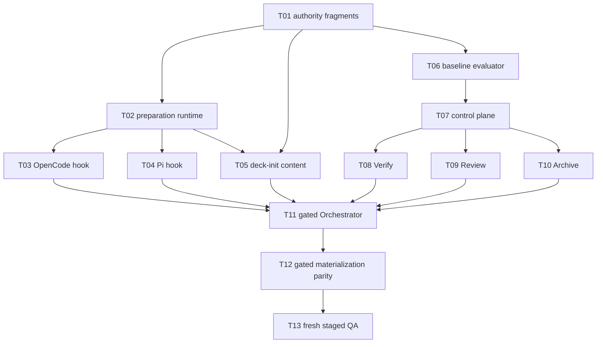

# Tasks — Orchestrator-Triggered Project Preparation and Session Baseline

## Authority and planning basis

- **Change:** `project-init-skill-registry-and-session-baseline`
- **Task phase only:** this plan grants no Apply, source/test/configuration/generated-output, registry, Git, or user-home authority.
- **Approved inputs:** Proposal `sha256:a22066d9a6c32c087eef2b152327797dea5c9c2a899d1173679d87f34f133861`; Spec `sha256:9513dacae9deff5a0b94356bedc238eff4838a256d78a39779446cfaf9f4bbec`; Design `sha256:4396901c8a920b6331436ea7a3d764df07918a4999b067fee9c2793616ee77e9`.
- **Reconciliation:** 28/28 MUST requirements, 59/59 scenarios, 36/36 exact editable targets, and 26/26 EIIs are allocated below. The fresh independent alignment result is PASS; no open design decision or `design-instruction-ambiguous` blocker exists at Task authoring time.
- **Entry point:** the existing `deck-init` subagent/skill remains the only project-preparation implementor delegated by the Orchestrator. No `deck init` CLI command/alias/parser/flags/exits/rendering/dispatch acceptance, TUI project-init action/screen/adapter, public project-init API, or shared CLI/TUI/agent `ProjectInitService` may be introduced.
- **Code economy:** reuse current runtime authorization, OpenSpec/index, Skill Registry, capability, prompt registry/profile, runner hook, failure-manifest, disposition, staged-verification, and Archive infrastructure. The 36-file and 2,800–4,000 touched-line estimate exceeds advisory budgets; **Quality override used** because security authority, anti-laundering evidence, complete prompt parity, generated-output discipline, and tests are non-negotiable. No new dependency or generalized initializer framework is authorized.
- **Apply authorization:** every task requires a new explicit Apply authorization and exact Orchestrator delegation for its immutable allowlist. Tasks that include an Apply-gated path additionally require the R5-B01 condition in `preconditions.md`.

## Global constraints applied to every task

### Blocked/excluded targets

All paths outside the task's listed **Files** are blocked. The following remain excluded even as runtime effects or evidence fixtures: generated outputs; installed/materialized runner files as direct edit targets; user-home state; `.atl/skill-registry.md`; `.gitignore`; registry YAML including change-local `state.yaml`/`events.yaml`; `openspec/baseline-health.yaml` content; Proposal, Spec, Design, and configuration; predecessor artifacts; any path intersecting `runner-capability-standardization`; package installation/download/upgrade/network/global configuration; destructive or modifying Git operations; stage/commit/push/branch/rebase/history rewrite. Generated runner parity may be produced only transiently through canonical generators and must be verified, never hand-edited or committed by these tasks.

### Apply-gated paths

The following nine exact paths overlap predecessor R5-B01 and are marked **Apply-gated** wherever listed:

1. `packages/core/src/teams/developer/orchestrator-invariants.ts`
2. `packages/core/src/teams/developer/orchestrator-content.ts`
3. `packages/core/src/teams/developer/orchestrator-invariants.test.ts`
4. `packages/core/src/teams/developer/orchestrator-invariants.task2.test.ts`
5. `packages/core/src/teams/developer/orchestrator-content.test.ts`
6. `packages/core/src/teams/developer/content-registry.test.ts`
7. `packages/core/src/teams/developer/prompt-profile.test.ts`
8. `packages/adapter-opencode/src/developer-team-install.test.ts`
9. `packages/adapter-opencode/src/prompt-generation.test.ts`

Disjoint symbols in any one of these files do not prove non-overlap. No specialist may waive, repair, relabel, or reinterpret predecessor history.

### EII fidelity rules

- **EII-PISB-001 (`byte-verbatim`):** every mapped task must compose the exact fenced `DECK_PREPARATION_AUTHORITY_BOUNDARY_V1` text from Design lines 502–506, byte-for-byte and exactly once on each applicable surface. No prompt/user acceptance authority, static-compatible write, second delegation, installer/global/Git/central-registry effect, or contradictory lower-priority prose is permitted.
- **EII-PISB-002 (`byte-verbatim`):** every mapped task must compose the exact fenced `FINDING_DISPOSITION_AUTHORITY_BOUNDARY_V1` text from Design lines 519–523, byte-for-byte and exactly once on each applicable surface. No prose-only baseline claim, bare fingerprint, age, pressure, focused-green evidence, inherited Review judgment, skipped mandatory check, or global-green Archive claim is permitted.
- All semantic EIIs carry every required clause, preserved constraint, prohibition, and ambiguity stop from Design §§Exact Implementation Instructions. Any inability to satisfy one is a hard stop `design-instruction-ambiguous`; Apply must not invent behavior.

### TDD, verification, rollout, and rollback convention

- Every task starts with its stated **RED** checks and captures a candidate-bound failure proving the intended contract is absent or violated; only then may GREEN implementation begin.
- Verification is Apply-local and ordered: task-focused tests first, then affected package tests/typecheck/materialization checks. No later task may consume stale candidate/dependency evidence.
- Every effect path must be functionally exercised through **Orchestrator → existing `deck-init` preparation behavior**, not a new CLI/TUI/public service.
- Final candidate order is fresh **TARGETED → AFFECTED_AREA → independent Review → mandatory BROAD**. Required checks always execute; only a fully proven unrelated, pre-existing, non-regressive, non-protected finding with authoritative envelopes and a separately authorized existing ledger entry may progress as `passed_with_warnings`, without repair or routine pause. Raw failures remain recorded.
- Rollback is always a separately authorized forward change limited to the same canonical source/test allowlist. It must preserve lifecycle/predecessor/warning history and prior-valid registry bytes, never edit derived outputs directly, mutate Git, uninstall tools, write user-home state, delete project files, or mutate baseline ledger content.

## Workstreams, groups, and deterministic batches

| Batch | Workstream / group | Tasks | Lane | Gate | Depends on |
|---|---|---|---|---|---|
| B01 | Preparation / canonical authority | T01 | General | None | — |
| B02 | Preparation / host runtime | T02 | Backend | None | T01 |
| B03 | Preparation / runner hooks | T03, T04 | Backend, parallel lanes P1/P2 | None | T02 |
| B04 | Preparation / existing deck-init content | T05 | General | None | T01, T02 |
| B05 | Quality / baseline contracts and evaluator | T06 | Backend | None | T01 |
| B06 | Quality / execution control plane | T07 | Backend | None | T06 |
| B07 | Quality / Verify, Review, Archive content | T08, T09, T10 | General, parallel lanes Q1/Q2/Q3 | None | T01, T06, T07 |
| B08 | Preparation / Orchestrator invariant and content | T11 | General | **R5-B01 gated** | T02, T03, T04, T05, T07–T10 |
| B09 | Integration / canonical map and materialization parity | T12 | General | **R5-B01 gated** | T03–T11 |
| B10 | Candidate QA / functional and staged closure | T13 | General Apply-local checks, then independent Verify/Review | Inherits B08/B09 gate | T12 |

Preparation B02–B05 and quality B05–B07 may proceed on independent files after T01. B08/B09 reunify both workstreams into one coherent candidate. Any modification after a stage invalidates downstream evidence and restarts from TARGETED for the new candidate.

## Atomic tasks

### T01 — Add canonical authority fragments

- **Owner:** `deck-developer-apply-general`
- **Priority:** P0
- **Complexity:** M
- **Parallel:** No; foundation for both workstreams.
- **Depends on:** None.
- **Files:** `packages/core/src/teams/developer/readiness-authority.ts` (new); `packages/core/src/teams/developer/readiness-authority.test.ts` (new).
- **Blocked/excluded targets:** Global exclusions; no gated path.
- **Requirements/scenarios:** REQ-003 (valid/missing/replayed/operation-mismatch authority); REQ-012 (installation unreachable); REQ-017 (all mandatory checks); REQ-018 (related/security findings block); REQ-019 (fully proven/insufficient/flaky/cross-platform evidence); REQ-020 (passed-with-warnings/blocked); REQ-022 (failing run cannot self-authorize); REQ-025 (fresh stage evidence); REQ-028 (generated files not hand-edited).
- **Design constraints / EIIs:** EII-PISB-001 `byte-verbatim`; EII-PISB-002 `byte-verbatim`; preserve exact fenced bytes and export stable canonical symbols for downstream composition.
- **RED:** Add tests that fail because both symbols/exports and exact bytes are absent; assert heading, paragraph breaks, punctuation, UTF-8 bytes, no interpolation, and exactly-one composition helper behavior.
- **GREEN:** Add only the two canonical constants and minimal exports needed by current Core consumers; no policy logic or new abstraction beyond a shared source of truth.
- **Exact verification:** focused authority tests; Core typecheck; assertions hashing each exact fragment and rejecting one-byte mutation/duplicate composition.
- **Completion evidence:** RED and GREEN command/result records, changed-file digest, exact-fragment SHA-256 values, and proof no additional path changed.
- **Rollout condition:** land before any runtime or prompt task references the fragments.
- **Rollback boundary:** revert both canonical constants/tests together; consumers must first be restored to prior blocking behavior.

### T02 — Implement trusted once-per-session preparation authorization runtime

- **Owner:** `deck-developer-apply-backend`
- **Priority:** P0
- **Complexity:** XL
- **Parallel:** Yes, after T01; may run concurrently with T06.
- **Depends on:** T01.
- **Files:** `packages/sdd-runtime/src/execution/session-preparation.ts` (new); `packages/sdd-runtime/src/execution/session-preparation.test.ts` (new); `packages/sdd-runtime/src/index.ts`; `packages/sdd-runtime/src/index.test.ts`.
- **Blocked/excluded targets:** Global exclusions; no filesystem/registry/capability/installer/CLI/TUI implementation in this module; no gated path.
- **Requirements/scenarios:** REQ-001 all 5; REQ-002 both; REQ-003 all 4; REQ-004 complete/partial/postcondition; REQ-005 all 5; REQ-007 read-only validation; REQ-012 installer unreachable; REQ-016 both readiness scenarios; REQ-026 read-only Orchestrator; REQ-027 both bounded-handoff scenarios.
- **Design constraints / EIIs:** EII-PISB-001 `byte-verbatim` authority semantics; Design §§1–5 and Session state. Implement only canonical request/result parsing, root/session/runner binding, delegation digest, HMAC-SHA-256 claims, ≤5-minute life, ≤30-second future skew, one-use nonce reservation, monotonic session state/cleanup, rejection codes, bounded handoff/telemetry parsing, deterministic aggregation, and safe exports.
- **RED:** Contract tests for all five registry statuses; missing/malformed/initialized OpenSpec; one delegation; root/runner mismatch; malformed/expired/future/restarted/revoked/replayed and every identity/operation/target mismatch; provider absence; bounded-data rejection; telemetry failure non-authority; cleanup and duplicate requests.
- **GREEN:** Minimal internal runtime contract using existing crypto/authorization conventions; no arbitrary shell/operation strings; atomically reserve before delegation; stale consumers fail closed through `legacyOutcome`.
- **Exact verification:** focused runtime tests; package typecheck; index export tests; deterministic digest/order tests; negative import/reachability checks for filesystem, installer, CLI, TUI, registry writer, user-home, and Git effects.
- **Completion evidence:** passing matrix for every rejection code and aggregation branch, one-use concurrency evidence, exports digest, and no-effect proof.
- **Rollout condition:** complete before hooks or prompt text advertise silent modifying preparation; provider absence must remain fail-closed.
- **Rollback boundary:** remove authority runtime and exports together with adapter branches; never leave prompt-authorized fallback.

### T03 — Bind trusted preparation authority in the OpenCode runner hook

- **Owner:** `deck-developer-apply-backend`
- **Priority:** P0
- **Complexity:** L
- **Parallel:** Yes, lane P1 with T04 after T02.
- **Depends on:** T02.
- **Files:** `packages/adapter-opencode/assets/opencode/plugins/developer-team-execution.ts`; `packages/adapter-opencode/src/developer-team-execution-reachability.test.ts`.
- **Blocked/excluded targets:** Global exclusions; direct installed OpenCode assets and user-home materialization excluded; no gated path.
- **Requirements/scenarios:** REQ-002 both; REQ-003 all 4; REQ-012 installer unreachable; REQ-027 bounded/no phase; REQ-028 generated files not hand-edited.
- **Design constraints / EIIs:** EII-PISB-001 `byte-verbatim` semantics. Strip caller-supplied preparation controls; obtain only captured process-local provider authority; call provider exactly once for `deck-init`, never for unrelated agents; validate/reserve before native delegation; reject all mismatches; clear on session closure; no static fallback.
- **RED:** Hook/reachability tests fail for injected metadata, provider absence, replay/mismatch, unrelated-agent provider call, double invocation, native delegation before reservation, and poison installer/network/global/Git functions.
- **GREEN:** Add the smallest `deck-init`-only hook branch using T02 exports and current trusted-provider pattern.
- **Exact verification:** adapter focused tests/typecheck; zero-call poison assertions; one successful native delegation and every rejected case blocked before delegation.
- **Completion evidence:** branch/rejection matrix, provider call counts, and source-only changed-path proof.
- **Rollout condition:** T02 exports stable and current; may land independently of Pi but no prompt activation until both runner lanes pass.
- **Rollback boundary:** remove OpenCode branch and tests; retain fail-closed runtime until all consumers are removed.

### T04 — Bind trusted preparation authority in the Pi runner hook

- **Owner:** `deck-developer-apply-backend`
- **Priority:** P0
- **Complexity:** L
- **Parallel:** Yes, lane P2 with T03 after T02.
- **Depends on:** T02.
- **Files:** `packages/adapter-pi/assets/pi/extensions/developer-team-execution.ts`; `packages/adapter-pi/src/developer-team-execution-reachability.test.ts`.
- **Blocked/excluded targets:** Global exclusions; direct installed Pi assets and user-home materialization excluded; no gated path.
- **Requirements/scenarios:** Same mapped scenarios as T03.
- **Design constraints / EIIs:** EII-PISB-001 `byte-verbatim` semantics and the exact OpenCode/Pi hook requirements from Design §2.
- **RED:** Pi-equivalent injection, provider-call, reservation, rejection, session-cleanup, native-delegation-order, and poison reachability failures.
- **GREEN:** Add only the Pi-native `deck-init` authority branch through T02 contracts.
- **Exact verification:** Pi focused tests/typecheck and parity of stable rejection behavior with T03 without sharing runner-exclusive roots.
- **Completion evidence:** Pi branch/rejection matrix, provider call counts, and no installed-output edits.
- **Rollout condition:** same as T03; both adapters required before canonical prompts activate the behavior.
- **Rollback boundary:** remove Pi branch/tests without changing unrelated runner execution.

### T05 — Encode the deterministic existing `deck-init` coordinator

- **Owner:** `deck-developer-apply-general`
- **Priority:** P0
- **Complexity:** XL
- **Parallel:** Yes after T01/T02; independent of baseline tasks.
- **Depends on:** T01, T02.
- **Files:** `packages/core/src/skills/bootstrap/deck-init-content.ts`; `packages/core/src/skills/bootstrap/index.test.ts`; `packages/core/src/teams/developer/bootstrap-compact-content.ts`.
- **Blocked/excluded targets:** Global exclusions; specifically no new service/API/framework, CLI/TUI init surface, guessed command, independent registry writer/scanner, installer/network/global config, direct TUI call, state/events write, Git mutation, or broad ignore rule; no gated path.
- **Requirements/scenarios:** REQ-003 all 4; REQ-004 all 3; REQ-005 all 5; REQ-006 both; REQ-008 registry failure isolation; REQ-009 both; REQ-010 all 3; REQ-011 presence-insufficient; REQ-012 unreachable installation; REQ-013 all 5; REQ-014 both; REQ-015 shareable config; REQ-016 both; REQ-023 predecessor unchanged; REQ-027 both; REQ-028 generated protection.
- **Design constraints / EIIs:** EII-PISB-011, -012, -013 `semantic-constrained`, each composing EII-PISB-001 `byte-verbatim` exactly once. Preserve `name: deck-init`, delegate-only/non-user-invocable identity, deterministic seven-component order, existing OpenSpec/index/registry/capability tools, active-runner scope, no global early return, one effect/component, postconditions, bounded handoff/status/telemetry, unavailable/skipped taxonomy, TUI next action, narrow ownership/CAS policy, and prior-valid bytes.
- **RED:** Content tests for fresh/ready/partial/blocked/rerun; all five registry statuses and lifecycle operation selection; later-component inspection after failure; codebase-memory only through exposed `index_repository`; Serena only through declared onboarding; analogous eligibility; unavailable/skipped; tracked/shareable/symlink/non-UTF8/CAS/coverage/newline cases; poison install/package/network/global/TUI/Git calls; exact fragment count; forbidden CLI/service prose.
- **GREEN:** Update legacy and compact canonical content only, reusing existing commands and tools; no implementation target outside the three files.
- **Exact verification:** focused bootstrap/content tests; Core typecheck; semantic marker/negative-prohibition matrix; functional harness proving the described Orchestrator-bound handoff exercises OpenSpec → registry → codebase-memory → Serena → analogous → ignore aggregation and re-run no-op behavior.
- **Completion evidence:** scenario matrix, exact fragment count/hash, stable component-order/status snapshots, byte-stable no-op proof, and poison zero-call evidence.
- **Rollout condition:** T02 authority contract exists; T03/T04 hooks must be complete before user-visible activation.
- **Rollback boundary:** restore legacy/compact `deck-init` content together; preserve generated/project/user state and registry bytes.

### T06 — Add baseline evidence contracts and authoritative finding evaluator

- **Owner:** `deck-developer-apply-backend`
- **Priority:** P0
- **Complexity:** XL
- **Parallel:** Yes after T01; independent of preparation implementation.
- **Depends on:** T01.
- **Files:** `packages/sdd-runtime/src/contracts/baseline-evidence.ts` (new); `packages/sdd-runtime/src/contracts/baseline-evidence.test.ts` (new); `packages/sdd-runtime/src/orchestrator/finding-disposition-service.ts` (new); `packages/sdd-runtime/src/orchestrator/finding-disposition-service.test.ts` (new).
- **Blocked/excluded targets:** Global exclusions; no `openspec/baseline-health.yaml` mutation or ledger admission; no prompt-only evaluator; no gated path.
- **Requirements/scenarios:** REQ-017 all mandatory checks; REQ-018 related/security blockers; REQ-019 all 4; REQ-020 both; REQ-021 warning preservation/no pause; REQ-022 self-admission refusal; REQ-025 fresh stage evidence.
- **Design constraints / EIIs:** EII-PISB-002 `byte-verbatim` semantics; Design Baseline finding-disposition §§1–3. Add `BaselineEvidenceEnvelopeV1`, `QualityDispositionEnvelopeV1`, versioned normalized fingerprint, `evaluateFindingDispositionBaselineV1`, exact deterministic 2/2 and flaky 5-run/≥3 thresholds, 14-day expiry, per-cohort environment equivalence, immutable pre-candidate baseline, causal isolation, metric non-worsening, protected precedence, ledger authority separation, complete invalidation list, deterministic ordering/digests.
- **RED:** Reject cross-batch/unsafe/bad-fingerprint/mutable subject/environment mismatch/non-fixed plan/insufficient or discarded runs/worsening/causal overlap/expired ledger/self-admission/every protected floor/stale producer or artifact; prove all-green, warning, mixed blocker precedence, multiple findings, valid baseline-half reuse, and each invalidation trigger.
- **GREEN:** Implement strict parser/evaluator atop existing `FailureManifestV1` and disposition contracts; preserve existing parseability and make unknown/partial/conflicting evidence block.
- **Exact verification:** focused contract/service tests; runtime typecheck; deterministic digest/order repetition; mutation tests across every evidence field; ledger write reachability must be zero.
- **Completion evidence:** closed decision table for each condition/threshold/protected floor, raw finding retention, and stable envelope digests.
- **Rollout condition:** evaluator must land before control-plane or role prompts accept warning progression.
- **Rollback boundary:** restore raw findings to blocking before removing evaluator/contracts; preserve all emitted evidence history.

### T07 — Bind quality disposition into the execution control plane

- **Owner:** `deck-developer-apply-backend`
- **Priority:** P0
- **Complexity:** L
- **Parallel:** No within quality lane.
- **Depends on:** T06.
- **Files:** `packages/sdd-runtime/src/execution/execution-control-plane.ts`; `packages/sdd-runtime/src/execution/execution-role-scheduler.test.ts`.
- **Blocked/excluded targets:** Global exclusions; no new StageStatus, no skipped/filtered/relabelled check, no ledger write; no gated path.
- **Requirements/scenarios:** REQ-017 mandatory execution; REQ-018 blockers; REQ-019 fully proven/insufficient; REQ-020 both statuses; REQ-021 both; REQ-022 self-admission; REQ-025 fresh independent evidence.
- **Design constraints / EIIs:** EII-PISB-002 `byte-verbatim` semantics and Design §4. Add optional `qualityDisposition` sidecar bound to role result, batch, dossier verification, manifest, and evaluator decision. All-green legacy results need none; any raw failure/warning claim requires a valid fresh sidecar. Stage remains `passed|failed`; phase/intent may be `passed_with_warnings`; warning does not enter repair/pause; blockers fail closed.
- **RED:** Scheduler/control-plane tests for missing/mismatched/stale sidecar, cross-batch and identity mismatch, raw nonzero retention, stage/phase mapping, warning no-repair, blocker repair, and mandatory BROAD/independent identities.
- **GREEN:** Minimal additive sidecar validation and routing; preserve legacy all-green behavior and current public status vocabulary.
- **Exact verification:** focused scheduler tests, runtime typecheck, candidate/dependency digest invalidation, and all-green compatibility suite.
- **Completion evidence:** status/routing matrix and evidence that mandatory checks still execute under warning disposition.
- **Rollout condition:** T06 evaluator stable; must land before Verify/Review/Archive prompt permission.
- **Rollback boundary:** return all residual raw failures to blocking before removing sidecar consumption.

### T08 — Update Verify canonical content for evidence-bound warnings

- **Owner:** `deck-developer-apply-general`
- **Priority:** P1
- **Complexity:** L
- **Parallel:** Yes, quality lane Q1 with T09/T10 after T07.
- **Depends on:** T01, T06, T07.
- **Files:** `packages/core/src/teams/developer/verify-content.ts`; `packages/core/src/teams/developer/verify-content.test.ts`.
- **Blocked/excluded targets:** Global exclusions; no baseline ledger edits, hidden nonzero result, deferred BROAD, warning-by-label, or fixes; no gated path.
- **Requirements/scenarios:** REQ-017 mandatory execution; REQ-018 both blocker scenarios; REQ-019 all 4; REQ-020 both; REQ-021 warning evidence/no pause; REQ-022 self-admission; REQ-025 fresh evidence.
- **Design constraints / EIIs:** EII-PISB-014, -015, -016, -017 `semantic-constrained`; EII-PISB-002 `byte-verbatim` exactly once per applicable legacy/compact surface. Preserve compliance-only independence, TDD/lane floors, raw evidence, `FailureManifestV1`, proof dimensions/thresholds, stage `passed` versus phase `passed_with_warnings`, immutable quality return, centralized intents, and generated-output discipline.
- **RED:** Exact-fragment count, mandatory-stage markers, raw-failure retention, threshold/protected/freshness/ledger clauses, status mapping, no repair/pause for proven warning, and forbidden warning-label/skipped-BROAD prose.
- **GREEN:** Update only canonical Verify content/tests, consuming T06/T07 contracts without duplicating evaluator logic.
- **Exact verification:** focused Verify tests; Core typecheck; semantic parity across four Verify surfaces; negative assertions for every prohibition.
- **Completion evidence:** role-content clause matrix and exact-fragment digest/count.
- **Rollout condition:** runtime evaluator/control-plane ready.
- **Rollback boundary:** restore Verify to blocking residual raw failures before removing runtime support.

### T09 — Update Review canonical content for independent warning judgment

- **Owner:** `deck-developer-apply-general`
- **Priority:** P1
- **Complexity:** M
- **Parallel:** Yes, lane Q2 with T08/T10 after T07.
- **Depends on:** T01, T06, T07.
- **Files:** `packages/core/src/teams/developer/review-content.ts`; `packages/core/src/teams/developer/review-content.test.ts`.
- **Blocked/excluded targets:** Global exclusions; no copied Verify verdict, baseline admission, warning-by-age, fixes, or `approved_with_changes` shortcut; no gated path.
- **Requirements/scenarios:** REQ-017 independent Review; REQ-018 blockers; REQ-019 proof gate; REQ-020 status semantics; REQ-021 both; REQ-022 self-admission; REQ-025 fresh identity.
- **Design constraints / EIIs:** EII-PISB-018, -019, -020, -021 `semantic-constrained`; EII-PISB-002 `byte-verbatim` exactly once per applicable surface. Independently validate causality, protected risk, metric non-regression, Verify/quality binding, warning durability, four-way scope classification, fresh identity, canonical intent statuses, and immutable evidence.
- **RED:** Tests fail when Review can inherit Verify, omit a proof dimension, accept stale/contradictory sidecars, alter four-way classification, or pause on a valid warning.
- **GREEN:** Update canonical Review content/tests only; no evaluator duplication.
- **Exact verification:** focused Review tests; Core typecheck; four-surface semantic and exact-fragment parity; blocker precedence matrix.
- **Completion evidence:** independent-judgment matrix, identity/binding evidence, exact-fragment count.
- **Rollout condition:** T06/T07 ready; may run parallel with T08/T10.
- **Rollback boundary:** restore Review to reject warning progression before runtime removal.

### T10 — Update Archive canonical content for durable warning preservation

- **Owner:** `deck-developer-apply-general`
- **Priority:** P1
- **Complexity:** M
- **Parallel:** Yes, lane Q3 with T08/T09 after T07.
- **Depends on:** T01, T06, T07.
- **Files:** `packages/core/src/teams/developer/archive-content.ts`; `packages/core/src/teams/developer/archive-content.test.ts`.
- **Blocked/excluded targets:** Global exclusions; no ledger write, baseline repair, warning deletion, evidence erasure, global-green claim, Archive on blocker/staleness, or Git mutation; no gated path.
- **Requirements/scenarios:** REQ-017 BROAD completion; REQ-018 blockers; REQ-019 proof gate; REQ-020 status semantics; REQ-021 warning preservation/no pause; REQ-022 self-admission; REQ-023 history preservation; REQ-025 freshness.
- **Design constraints / EIIs:** EII-PISB-022, -023, -024, -025 `semantic-constrained`; EII-PISB-002 `byte-verbatim` exactly once per applicable surface. Require current Verify/Review/BROAD quality evidence, canonical `archived` status, warning/evidence/failed-attempt/rollback/residual-risk/follow-up preservation, append-only history, and cleanup failure blocking.
- **RED:** Tests for missing/stale/conflicting quality evidence, any blocker, absent BROAD, warning preservation, canonical archive intent, no ledger write, and no global-green claim.
- **GREEN:** Update canonical Archive content/tests only.
- **Exact verification:** focused Archive tests; Core typecheck; four-surface parity and exact-fragment count; refusal-before-move/intent assertions.
- **Completion evidence:** acceptance/refusal matrix and durable-reference markers.
- **Rollout condition:** T06/T07 ready; role prompts may not activate before all T08–T10 pass.
- **Rollback boundary:** restore Archive refusal for residual findings before runtime quality support is removed; preserve history.

### T11 — Implement the Apply-gated Orchestrator Session Preparation Gate

- **Owner:** `deck-developer-apply-general`
- **Priority:** P0
- **Complexity:** XL
- **Parallel:** No; integration point for both workstreams.
- **Depends on:** T02, T03, T04, T05, T07, T08, T09, T10.
- **Files:** **Apply-gated** `packages/core/src/teams/developer/orchestrator-invariants.ts`; **Apply-gated** `packages/core/src/teams/developer/orchestrator-invariants.test.ts`; **Apply-gated** `packages/core/src/teams/developer/orchestrator-invariants.task2.test.ts`; **Apply-gated** `packages/core/src/teams/developer/orchestrator-content.ts`; **Apply-gated** `packages/core/src/teams/developer/orchestrator-content.test.ts`.
- **Blocked/excluded targets:** Global exclusions and R5-B01 condition; preserve all predecessor-owned ownership/pre-QA/decision/commit-only fragments and unrelated invariant IDs/ordering.
- **Requirements/scenarios:** REQ-001 all 5; REQ-002 both; REQ-003 all 4; REQ-005 all 5; REQ-007 read-only validation; REQ-008 fail-open registry; REQ-012 no install; REQ-017 mandatory QA; REQ-018 blockers; REQ-019 proof gate; REQ-020 statuses; REQ-021 warning lifecycle/no pause; REQ-023 predecessor unchanged; REQ-024 overlap gate; REQ-025 freshness; REQ-026 read-only registry; REQ-027 both; REQ-028 generated protection.
- **Design constraints / EIIs:** EII-PISB-003 through -010 `semantic-constrained`, with EII-PISB-001 and -002 `byte-verbatim` exactly once on every applicable legacy/compact surface. Rename canonical symbol to `INV_003_SESSION_PREPARATION_GATE` while retaining `INV-003`, order, critical tier, surface set, rendering, and verification. Preflight precedes triage; exact non-ready predicates; once/session validation; one silent delegation; no offer/write/phase/event; separate host authority; bounded handoff and cached context; direct-discovery partial continuation; complete mandatory BROAD and quality-sidecar progression; no warning repair/pause.
- **RED:** Invariant/content tests fail for stale OpenSpec-only/offer/early-return prose, wrong cadence/order, second validation/delegation, missing authority/result binding, direct registry writes, phase invention, fragment omissions/duplicates, inherited warning handling, and changes to predecessor-owned fragments.
- **GREEN:** Make the smallest canonical invariant/content edits needed to consume implemented runtime and role contracts; remove only contradictory lower-priority wording.
- **Exact verification:** focused invariant/content suites; Core typecheck; ten-entry compact invariant order; six Orchestrator surface semantic parity; exact fragment byte/count assertions; predecessor fragment digest assertions; no CLI/TUI/service terms.
- **Completion evidence:** coordinator gate evidence reference, RED/GREEN results, predecessor-fragment preservation hashes, surface matrix, and changed-file digest set.
- **Rollout condition:** R5-B01 precondition satisfied and T02–T10 current; prompt change lands only after both runner authority hooks exist.
- **Rollback boundary:** restore Orchestrator invariant/content and hook behavior together so no prompt advertises unavailable authority; preserve predecessor history.

### T12 — Register runtime controls and prove canonical materialization parity

- **Owner:** `deck-developer-apply-general`
- **Priority:** P0
- **Complexity:** XL
- **Parallel:** No; closes all canonical/materialized surfaces.
- **Depends on:** T03, T04, T05, T06, T07, T08, T09, T10, T11.
- **Files:** `packages/core/src/teams/developer/content-registry.ts`; **Apply-gated** `packages/core/src/teams/developer/content-registry.test.ts`; **Apply-gated** `packages/core/src/teams/developer/prompt-profile.test.ts`; **Apply-gated** `packages/adapter-opencode/src/developer-team-install.test.ts`; **Apply-gated** `packages/adapter-opencode/src/prompt-generation.test.ts`; `packages/adapter-pi/src/registry-consumption.test.ts`.
- **Blocked/excluded targets:** Global exclusions and R5-B01 condition; generated/installed/user-home assets are evidence-only and never editable.
- **Requirements/scenarios:** All REQ-001–REQ-028 and all 59 scenarios as integration/parity acceptance, with direct emphasis on REQ-012, REQ-017–REQ-028 and generated-output protection.
- **Design constraints / EIIs:** EII-PISB-026 `semantic-constrained`; register `session-preparation-authorization-v1` and `quality-disposition-envelope-v1`; prove every EII-PISB-001–025 canonical symbol reaches applicable legacy/compact OpenCode/Pi surfaces; preserve compact default, legacy profile, runtime-control ordering/source-of-truth, and exact fragment count. No direct generated edit; second canonical generation must be byte-identical.
- **RED:** Registry/profile/adapter tests fail for absent controls, stale markers/digests, missing surfaces, duplicate/altered authority bytes, forbidden CLI/TUI/service/install language, direct generated edits, or Pi/OpenCode semantic drift.
- **GREEN:** Deterministically append/register only required controls and update tests/strict expected digests from current canonical content; do not edit generated assets.
- **Exact verification:** focused Core/OpenCode/Pi tests; canonical generator in a clean temporary/materialized location; second generation byte-identical; fresh installed/materialized runner parity evidence where Design requires it; direct-edit sentinel; runtime exports and negative reachability.
- **Completion evidence:** all 36 target paths accounted for, two controls registered, exact-fragment and semantic surface matrix, first/second generation digest equality, and installed/materialized runner parity report without persistent user-home changes.
- **Rollout condition:** all canonical source tasks current and predecessor gate satisfied; candidate is frozen after this task unless QA restarts.
- **Rollback boundary:** remove controls/expected digests only with corresponding canonical/runtime rollback; never hand-edit or delete generated/installed outputs.

### T13 — Freeze and validate one coherent candidate through functional and staged QA

- **Owner:** Apply-local validation by the exact authorized Apply owners; then independent `deck-developer-verify` and independent `deck-developer-review` identities.
- **Priority:** P0
- **Complexity:** L
- **Parallel:** No across stages; only test-runner-native parallelism within a declared stage.
- **Depends on:** T12.
- **Files:** No implementation edits. Evidence scope is the exact 36-target candidate; reports/intents are owned by later authorized phases, not this Task plan.
- **Blocked/excluded targets:** Global exclusions; any candidate change invalidates all downstream evidence and restarts TARGETED. This task cannot write baseline ledger, registry YAML, generated/installed/user-home state, or predecessor artifacts.
- **Requirements/scenarios:** 28/28 requirements and 59/59 scenarios; especially REQ-017 mandatory stage execution, REQ-018 blocker precedence, REQ-019 proof completeness, REQ-020 status mapping, REQ-021 durable evidence, REQ-022 separate ledger authority, REQ-023/024 predecessor integrity/gate, REQ-025 freshness, REQ-027 bounded handoff, REQ-028 generation discipline.
- **Design constraints / EIIs:** Validate EII-PISB-001–026 collectively; exact byte-verbatim hashes/counts and every semantic clause/prohibition/ambiguity stop.
- **RED:** Before GREEN implementation tasks, each task's RED evidence must exist; at candidate closure, mutation/negative tests must still prove rejection of authority replay/injection, installation reachability, warning laundering, stale evidence, protected risks, CLI/TUI/service drift, and generated direct edits.
- **GREEN:** No implementation action; freeze candidate/dependency/tree digests and run the exact ordered evidence plan.
- **Exact verification:** (1) TARGETED: all task-focused suites and TypeScript checks; (2) functional Orchestrator → existing `deck-init` fresh/ready/partial/blocked/rerun exercise under valid and invalid authority; (3) AFFECTED_AREA: full affected package, prompt registry/profile, adapter hook/materialization, runtime scheduler/control-plane suites and typecheck; (4) independent Review with fresh identity, causality/protected/non-regression judgment; (5) mandatory BROAD; (6) second canonical generation byte-identical and fresh OpenCode/Pi installed/materialized parity. Preserve raw exits/results in `FailureManifestV1` and quality sidecars.
- **Completion evidence:** candidate/batch/tree/dependency/command-plan/environment digests; stage-specific identities/timestamps; raw outputs; requirement/scenario/EII/target matrix; generation parity digests; independent Review result; BROAD result. `passed_with_warnings` is allowed only when every mandatory check ran and every residual finding has complete T06 evidence plus pre-existing separately authorized ledger authority; otherwise failed/blocking.
- **Rollout condition:** all prior tasks complete, gate satisfied, no unauthorized path changed, one fresh candidate, TARGETED → AFFECTED_AREA → independent Review → BROAD all complete.
- **Rollback boundary:** no rollback in QA; any defect routes to a separately authorized repair/forward-change batch and invalidates current evidence.

## Coverage reconciliation

### Requirement and scenario allocation

| Requirements | Scenario count | Primary tasks |
|---|---:|---|
| REQ-001–REQ-002 | 7 | T02, T03, T04, T11, T12, T13 |
| REQ-003–REQ-005 | 12 | T01–T05, T11–T13 |
| REQ-006–REQ-008 | 4 | T05, T11–T13 |
| REQ-009–REQ-012 | 8 | T03–T05, T11–T13 |
| REQ-013–REQ-015 | 8 | T05, T12, T13 |
| REQ-016 | 2 | T02, T05, T12, T13 |
| REQ-017–REQ-022 | 12 | T01, T06–T13 |
| REQ-023–REQ-028 | 6 | T01, T05, T10–T13 |
| **Total** | **59** | **28/28 requirements covered** |

### Exact target allocation

- T02: targets 1–4.
- T03: targets 5–6.
- T04: targets 7–8.
- T06: targets 9–12.
- T07: targets 13–14.
- T01: targets 15–16.
- T05: targets 17–19.
- T11: targets 20–24.
- T12: targets 25–27 and 34–36.
- T08: targets 28–29.
- T09: targets 30–31.
- T10: targets 32–33.
- **Total:** 36/36 exact editable targets, each assigned once as a primary edit owner.

### EII allocation

- T01: EII-PISB-001, EII-PISB-002 canonical bytes.
- T11: EII-PISB-003, EII-PISB-004, EII-PISB-005, EII-PISB-006, EII-PISB-007, EII-PISB-008, EII-PISB-009, EII-PISB-010.
- T05: EII-PISB-011, EII-PISB-012, EII-PISB-013.
- T08: EII-PISB-014, EII-PISB-015, EII-PISB-016, EII-PISB-017.
- T09: EII-PISB-018, EII-PISB-019, EII-PISB-020, EII-PISB-021.
- T10: EII-PISB-022, EII-PISB-023, EII-PISB-024, EII-PISB-025.
- T12: EII-PISB-026 and full materialization parity.
- T02–T04/T06–T07 enforce the runtime semantics of EII-PISB-001/EII-PISB-002.
- **Total:** 26/26 EIIs; 2 byte-verbatim, 24 semantic-constrained.

## Complexity summary

| Complexity | Task IDs | Count |
|---|---|---:|
| XL | T02, T05, T06, T11, T12 | 5 |
| L | T03, T04, T07, T08, T13 | 5 |
| M | T01, T09, T10 | 3 |
| S | None | 0 |
| **Total** | T01–T13 | **13** |

Dependency validation: every `Depends on` reference names a task in T01–T13; the graph is acyclic; 10 deterministic batches contain 13 tasks. Safe parallel lanes are P1/P2 (T03/T04), preparation versus baseline work after T01 (T02/T05 versus T06/T07), and Q1/Q2/Q3 (T08/T09/T10). Shared/gated integration is serialized in T11/T12/T13.

## Apply routing and risk floors

- **Backend Apply:** T02, T03, T04, T06, T07 (runtime contracts, cryptographic authority, runner hooks, evaluator, execution control plane).
- **General Apply:** T01, T05, T08, T09, T10, T11, T12 (shared canonical content/contracts/tests/materialization). No frontend task exists; no UI/TUI implementation is authorized.
- **Risk floor:** High for T01–T07, T11–T13 due to authorization, silent effects, baseline anti-laundering, cross-package controls, predecessor overlap, and materialization. Medium floor for T08–T10, elevated to High in final Review because role prompts control mandatory QA/Archive progression.
- **Hard stops:** unauthorized Apply; Design target/EII ambiguity; path outside allowlist; predecessor gate unsatisfied for T11/T12; generated direct edit; missing/stale/mismatched authority or quality evidence; protected finding; registry conflict/recovery-required; missing independent identity/freshness; skipped mandatory stage; inability to prove installed/materialized parity; any CLI/TUI/service/public-API introduction.

## Review Workload Forecast

- **Independent Review risk:** High.
- **Expected review scope:** 36 exact paths, approximately 2,800–4,000 touched lines including 1,350–2,000 test lines; 8 new and 28 modified files; two security-sensitive byte-verbatim fragments; HMAC/nonce/session lifecycle; two runner hooks; prompt/materialization parity; quality evaluator/control-plane; predecessor-overlap preservation.
- **Recommended review split without judgment sharing:** (1) runtime authority and runner hooks; (2) deck-init component/ownership semantics; (3) baseline evaluator and control plane; (4) prompt/EII/materialization fidelity; (5) final cross-cutting protected-risk, candidate freshness, and predecessor checks. One independent Review result must synthesize all axes against one frozen candidate.
- **Mandatory evidence floor:** TARGETED and AFFECTED_AREA raw results, candidate/dependency/environment digests, exact EII matrix, authority rejection matrix, poison reachability, no-op/idempotency bytes, baseline proof/invalidation matrix, generation parity, installed/materialized OpenCode/Pi parity, and BROAD.

## Open questions / blockers

- **Open design questions:** None.
- **Task authoring blockers:** None.
- **Apply authorization blocker:** Apply is not authorized by this Task phase; explicit authorization and exact delegation are required.
- **External overlap blocker:** T11 and T12 (and therefore T13) cannot begin until the exact condition in `preconditions.md` is satisfied. T01–T10 are path-disjoint and may be separately authorized independently, but their evidence becomes stale if affected dependencies later change.
- **FailureManifestV1:** Not applicable to Task authoring; no implementation or verification batch was executed.

## Mermaid dependency data

