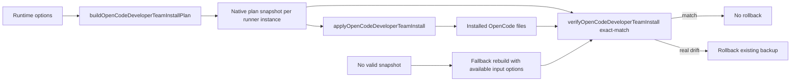

# Design: Reutilizar el plan OpenCode aplicado en verificación

## Source

- Proposal: `reuse-opencode-install-plan-for-verify` proposal artifact
- Capabilities affected: `opencode-install-verification`, `opencode-install-rollback`
- Spec status: not yet available

## Current Architecture Context

- `packages/adapter-opencode/src/developer-team-install.ts`
  - `buildOpenCodeDeveloperTeamInstallPlan(projectRoot, options)` resuelve contenido final con opciones runtime: `personality`, `memoryProvider`/`memoryInjection`, `capabilityInstructions`, modelos/razonamiento y `standaloneSkills`.
  - El plan captura snapshot útil: `capabilityInstructions`, `memoryBundle`, `personality`, `promptGenerationPlan`, `commandGenerationPlan`, `agentEntries`.
  - `applyOpenCodeDeveloperTeamInstall(plan)` escribe skills/prompts/commands de forma idempotente.
  - `verifyOpenCodeDeveloperTeamInstall(plan)` conserva el exact-match: compara `content !== planned.content` y reporta `Content mismatch...`.
- `packages/adapter-opencode/src/runner-adapter.ts`
  - `OpenCodeRunnerAdapterImpl.#lastNativePlan` ya guarda el plan nativo construido por `buildDeveloperTeamInstallPlan()`.
  - `applyDeveloperTeamInstall()` reconstruye desde el plan genérico, pero reaprovecha metadatos de `#lastNativePlan` para config/prompts/memoria/personality.
  - `verifyDeveloperTeamInstall(plan)` ya verifica contra `#lastNativePlan`; esta ruta soporta la arquitectura preferida.
- `packages/adapter-opencode/src/runner-capabilities.ts`
  - `buildTeamInstallPlan()` y `buildTeamInstallPlanFromInput()` construyen un plan nativo y devuelven solo `{ files }`, perdiendo el snapshot nativo.
  - `applyTeamInstall()` / `applyTeamInstallFromPlan()` reconstruyen un plan parcial desde `input.plan.files`.
  - `verifyTeamInstall()` reconstruye con solo `capabilityInstructions`.
  - `verifyTeamInstallFromPlan()` reconstruye con `buildOpenCodeDeveloperTeamInstallPlan(input.projectRoot)` sin opciones, que es la fuente del falso mismatch post-apply.

## Proposed Architecture

Usar el plan OpenCode nativo como snapshot autoritativo por ejecución apply→verify. Mantener el exact-match en `developer-team-install.ts`; corregir la fuente del plan usado por las rutas de verificación.

### Component / Module Boundaries

| Component | Responsibility | Change Type |
|---|---|---|
| `developer-team-install.ts` | Construcción/aplicación/verificación exact-match del plan nativo | unchanged |
| `runner-adapter.ts` | Fachada TUI; conserva `#lastNativePlan` por instancia | minor modify/test-only or unchanged |
| `runner-capabilities.ts` | Facets `teams`/`developerTeam`; debe conservar plan nativo aplicado/construido para verify/backup/rollback | modified |
| `runner-capabilities.test.ts` | Regresión de verify con opciones runtime que cambian contenido | modified |
| `developer-team-install.test.ts` | Mantiene exact-match/drift real | unchanged or small assertion add |

### Data Flow

1. Caller construye plan con opciones runtime (`capabilityInstructions`, personalidad vía config/opción, memoria, modelos, standalone skills).
2. `runner-capabilities.ts` guarda un snapshot nativo por instancia/factory al construir o aplicar el plan.
3. Apply escribe archivos usando ese contenido planeado.
4. Verify usa el mismo snapshot nativo si corresponde a la ejecución actual.
5. Si verify detecta drift real (`installed !== planned.content`), falla y el rollback existente restaura backup.
6. Si no hay snapshot válido, fallback explícito reconstruye con las opciones disponibles en `DeveloperTeamVerifyInput`; debe ser tratado como ruta secundaria y diagnosticable.

### API / Contract Implications

| Endpoint / Interface | Change | Backward Compatible |
|---|---|---|
| `RunnerAdapter.verifyDeveloperTeamInstall(plan: unknown)` | Sigue usando `#lastNativePlan`; sin cambio público | yes |
| `RunnerCapabilities.developerTeam.verifyInstall(input)` | Cambia implementación interna para preferir snapshot nativo aplicado/construido | yes |
| `RunnerCapabilities.teams.verifyDeveloperTeamInstall(input)` | Misma preferencia por snapshot cuando exista; fallback conserva input actual | yes |
| `OpenCodeDeveloperTeamInstallPlan` | Sin cambio requerido; ya contiene snapshot de opciones runtime | yes |

### State / Persistence Implications

- Persistencia en disco: ninguna.
- Estado runtime nuevo: snapshot nativo efímero, por instancia de `createOpenCodeRunnerCapabilities()`, análogo a `OpenCodeRunnerAdapterImpl.#lastNativePlan`.
- Evitar estado global compartido entre instancias para reducir riesgo de plan stale.

### Migration / Backward Compatibility

- No hay migración.
- Rutas existentes que llamen verify sin build/apply previo deben seguir funcionando mediante fallback reconstruido.
- El fallback no debe relajar exact-match; solo define cómo obtener `planned.content` cuando no existe snapshot.

## File Impact Estimate

| File / Path | Action | Rationale |
|---|---|---|
| `packages/adapter-opencode/src/runner-capabilities.ts` | modify | Introducir snapshot nativo por instancia y usarlo en `verifyTeamInstallFromPlan()`/`verifyTeamInstall()`; alinear backup/apply cuando sea posible. |
| `packages/adapter-opencode/src/runner-adapter.ts` | unchanged or modify | Validar que `#lastNativePlan` ya cubre esta ruta; posible refactor menor para compartir helper de snapshot si se decide. |
| `packages/adapter-opencode/src/developer-team-install.ts` | unchanged | Preservar exact-match `planned.content`; no mover el bug al verificador. |
| `packages/adapter-opencode/src/runner-capabilities.test.ts` | modify | Añadir regresión apply→verify con `capabilityInstructions`/runtime content; drift real sigue fallando. |
| `packages/adapter-opencode/src/developer-team-install.test.ts` | unchanged or modify | Mantener test existente `verify fails when installed content differs from planned content`; opcional reforzar que exact-match no se relaja. |

## Testing Strategy

- Unit/regression en `runner-capabilities.test.ts`:
  - Construir plan con runtime option que cambie contenido (`capabilityInstructions` preferido por estar disponible en input).
  - Aplicar plan en config dir aislado/temp.
  - Verificar inmediatamente; debe comparar contra el mismo snapshot y pasar.
  - Corromper un skill instalado después de apply; verify debe fallar por drift real.
- Mantener `developer-team-install.test.ts` exact-match existente (`Content mismatch`).
- Ejecutar foco: `bun test packages/adapter-opencode/src/runner-capabilities.test.ts packages/adapter-opencode/src/developer-team-install.test.ts`.
- Si el repo lo permite, ejecutar suite adapter-opencode completa.

## Observability / Error Handling

- Si verify no encuentra snapshot, usar fallback reconstruido y mantener resultado estructurado; no ocultar mismatch.
- Si snapshot existe pero no corresponde a `projectRoot`/directorios esperados, invalidarlo y usar fallback para evitar stale cache.
- Rollback se activa solo cuando `verifyOpenCodeDeveloperTeamInstall(snapshot)` falla o apply falla.

## Security / Performance / Accessibility Considerations

- Security: no nuevas escrituras fuera del instalador; no parches manuales en `~/.config/opencode`.
- Performance: snapshot evita reconstrucción redundante; memoria efímera pequeña (contenido de skills/prompts actual).
- Accessibility: no aplica.

## Tradeoffs

| Decision | Chosen | Rejected Alternative | Rationale |
|---|---|---|---|
| Fuente esperada para verify | Reusar snapshot nativo aplicado/construido | Reconstruir siempre con opciones idénticas | Evita omitir opciones futuras; el plan ya captura `memoryBundle`, `personality`, `capabilityInstructions`. |
| Alcance del fix | `runner-capabilities.ts` + tests; `developer-team-install.ts` queda exact-match | Relajar `verifyOpenCodeDeveloperTeamInstall()` | Relajar exact-match ocultaría drift real y contradice el cambio previo. |
| Estado del snapshot | Por instancia/factory | Variable global de módulo | Reduce contaminación entre ejecuciones/proyectos y stale plan. |
| Fallback | Reconstrucción explícita solo cuando no hay snapshot válido | Fallar siempre sin snapshot | Conserva compatibilidad para callers que verifican sin apply previo. |

## Risks

| Risk | Likelihood | Impact | Mitigation |
|---|---|---|---|
| Snapshot stale entre proyectos/ejecciones | Medium | High | Guardar por instancia; validar `projectRoot`/config dirs antes de usar; invalidar al construir nuevo plan. |
| Alguna ruta verify no pasa por build/apply | Medium | Medium | Mantener fallback reconstruido con `capabilityInstructions` disponible y tests de verify standalone. |
| Apply reconstruido pierde metadatos si no usa snapshot | Medium | High | En `applyTeamInstallFromPlan()` preferir el snapshot nativo cuando el plan genérico corresponda; no reconstruir planes parciales si hay snapshot. |
| Exact-match se debilita accidentalmente | Low | High | No modificar comparación en `developer-team-install.ts`; mantener test de drift real. |

## Open Decisions

- Confirmar durante implementación si el snapshot se implementa como cierre dentro de `createOpenCodeRunnerCapabilities()` o helper compartido con `runner-adapter.ts`; preferencia: cierre por instancia para mínimo cambio.
- Confirmar si `teams.verifyDeveloperTeamInstall` sigue siendo una ruta activa o legacy; si activa, aplicar la misma política de snapshot/fallback.

## Dependencies

- Cambio previo `installer-sync-opencode-skills` que endureció exact-match contra `planned.content`.
- Contrato actual de `buildOpenCodeDeveloperTeamInstallPlan()` y su captura de opciones runtime.

## Rollback Behavior and Idempotency

- Rollback: sin cambios de contrato; `backupDeveloperTeamFiles()` debe respaldar el mismo conjunto de archivos que apply escribe. Ante verify fallido con snapshot correcto, rollback restaura contenido previo.
- Falso rollback corregido: verify ya no debe fallar por reconstrucción sin opciones runtime.
- Idempotency: re-apply con el mismo snapshot/contenido mantiene `changedCount === 0` para archivos sin cambios.
- Rollback del cambio: revertir modificaciones en `runner-capabilities.ts` y tests; no requiere migraciones ni edición manual de OpenCode global.

## Next Steps

Ready for Task (`deck-developer-task`) to break this design into implementation tasks, combined with Spec.

## Mermaid Summary Source

