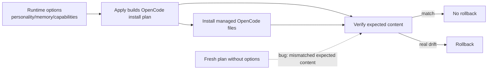

# Proposal: Reutilizar el plan OpenCode aplicado en verificación

## Intent

Tras endurecer `installer-sync-opencode-skills`, la verificación post-apply puede fallar y revertir cambios aunque el apply haya instalado contenido correcto. El apply construye el plan OpenCode con opciones runtime (`personality`, memoria y capability context), pero `verifyTeamInstallFromPlan()` reconstruye un plan fresco sin esas opciones. La comparación exacta termina validando archivos instalados contra contenido planeado distinto y produce errores como: `Verification failed. Changes rolled back. Details: Content mismatch for skill deck-developer-orchestrator...`.

## Goal

Que la verificación post-apply compare los archivos instalados contra el mismo contenido usado por apply, sin editar manualmente `~/.config/opencode`.

## Scope

### In Scope
- Ajustar el flujo OpenCode para que la verificación reuse el plan/contenido aplicado o reconstruya con opciones idénticas.
- Preservar la comparación exacta de `packages/adapter-opencode/src/developer-team-install.ts` como garantía de drift.
- Cubrir el caso con tests/regresión para opciones runtime que modifican contenido instalado.
- Mantener al instalador como dueño de archivos globales OpenCode.

### Out of Scope
- Parches manuales en `~/.config/opencode`.
- Relajar o eliminar la verificación exact-match.
- Cambios funcionales a contenido de skills, personalidad, memoria o capability context.
- Soporte equivalente para otros runners salvo helpers compartidos estrictamente necesarios.

## Affected Capabilities

### New Capabilities
- *(ninguna)*

### Modified Capabilities
- `opencode-install-verification`: la verificación post-apply debe validar contra el mismo plan/contenido que aplicó la instalación.
- `opencode-install-rollback`: el rollback solo debe activarse por drift real o fallo de instalación, no por reconstrucción de plan con opciones incompletas.

### Unchanged Capabilities
- `opencode-skill-sync-validation`: la comparación exacta sigue siendo correcta para detectar drift.
- `opencode-runtime-option-rendering`: las opciones runtime siguen afectando el contenido instalado; cambia cómo se transportan a verificación.

## Approach

- Tratar el plan de instalación OpenCode como artefacto autoritativo de una ejecución apply→verify.
- Preferir que `runner-adapter.ts`/`buildDeveloperTeamInstallPlan()` exponga o conserve el plan ya construido con opciones runtime, aprovechando `#lastNativePlan` si Design lo valida.
- Hacer que `runner-capabilities.ts`/`verifyTeamInstallFromPlan()` verifique contra ese plan, o reconstruya solo si recibe las mismas opciones runtime.
- Mantener `developer-team-install.ts` como verificador exact-match; el bug está en la fuente del plan usado para verificar, no en la comparación.

## Alternatives and Tradeoffs

| Alternative | Why Considered | Why Not Chosen |
|---|---|---|
| Reusar el plan aplicado | Evita divergencia apply/verify y conserva exact-match | Requiere transportar/cachear el plan con cuidado por ejecución. |
| Reconstruir con opciones idénticas | Menos dependencia de cache interna | Riesgo de omitir nuevas opciones futuras si no hay contrato único. |
| Relajar comparación exacta | Evitaría falsos positivos | Ocultaría drift real, contradice el endurecimiento previo. |
| Parchear global OpenCode manualmente | Desbloqueo local rápido | Fuera de alcance; el instalador debe ser la fuente de verdad. |

## Risks

| Risk | Likelihood | Mitigation |
|---|---|---|
| Plan cache stale entre ejecuciones | Medium | Asociar el plan a la ejecución actual o invalidarlo al cambiar opciones/root. |
| Faltan opciones runtime nuevas en rebuild | Medium | Preferir plan aplicado o centralizar el contrato de opciones. |
| Verificación menos estricta por usar plan incorrectamente mutado | Low | Tratar el plan como immutable/snapshot y testear mismatch real. |
| Rollback sigue ocurriendo si apply no guarda plan | Medium | Tests deben cubrir el camino runtime que hoy falla. |

## Rollback Plan

Revertir cambios de la corrección en:
- `packages/adapter-opencode/src/runner-capabilities.ts`
- `packages/adapter-opencode/src/runner-adapter.ts`
- tests OpenCode relacionados

La reversión restaura el comportamiento previo de reconstrucción durante verify. No requiere migraciones; no se deben modificar archivos globales OpenCode manualmente como rollback.

## Dependencies

- Diagnóstico de exploración sobre `verifyTeamInstallFromPlan()` reconstruyendo sin opciones.
- Cambio previo `installer-sync-opencode-skills`, que introdujo/verificó exact-match contra `planned.content`.
- Contrato actual de opciones runtime en `buildDeveloperTeamInstallPlan()`.

## Open Questions

- ¿Design debe preferir snapshot/cache del plan aplicado (`#lastNativePlan`) o reconstrucción con un objeto de opciones compartido?
- ¿Existe más de una ruta de instalación OpenCode que llame verify sin apply previo y necesite fallback explícito?

## Acceptance Direction

- [ ] Apply con opciones runtime y verify posterior usan el mismo contenido esperado.
- [ ] El error de mismatch masivo por plan reconstruido sin opciones deja de reproducirse.
- [ ] Drift real entre archivo instalado y plan aplicado sigue fallando y activando rollback.
- [ ] No se requiere editar `~/.config/opencode` manualmente.

## Next Steps

Ready for Spec (`deck-developer-spec`) and Design (`deck-developer-design`) in parallel.

## Mermaid Summary Source

