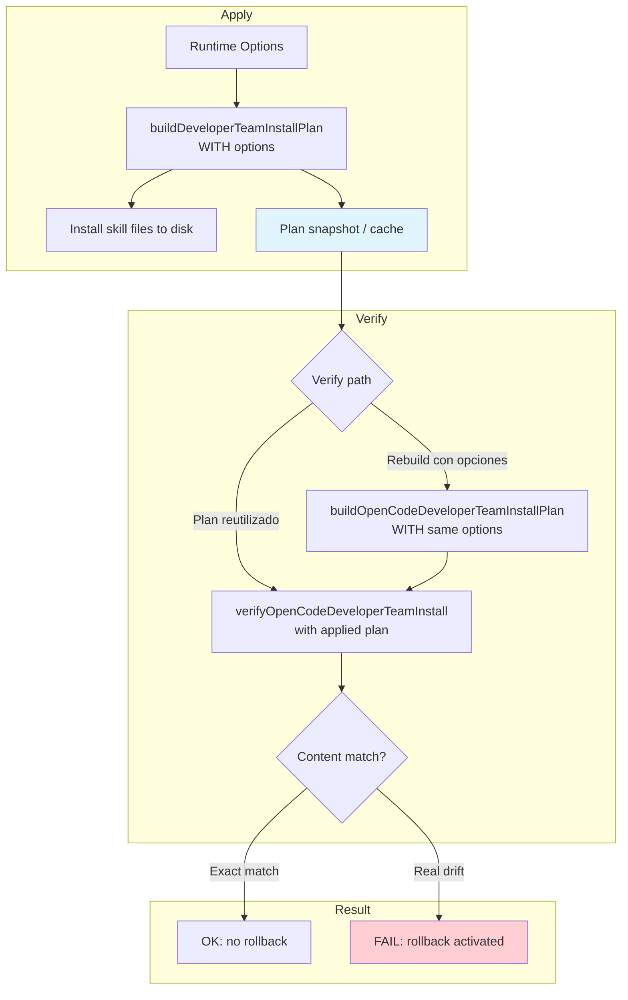

# Spec: Reutilizar el plan OpenCode aplicado en verificación

## Source

- Proposal: `reuse-opencode-install-plan-for-verify` proposal artifact
- Capabilities affected: `opencode-install-verification`, `opencode-install-rollback`

## Requirements

### Capability: opencode-install-verification

REQ-OIV-001: La verificación post-apply OpenCode SHALL comparar los archivos instalados contra el mismo contenido usado por la operación apply de esa ejecución.
  Priority: MUST
  Surface: Integration
  Rationale: Sin contenido idéntico, la comparación exact-match genera falsos positivos cuando las opciones runtime modifican el contenido instalado.

REQ-OIV-002: Cuando la verificación se ejecuta dentro de la misma sesión que apply (apply→verify consecutivo), la verificación SHALL usar el plan nativo construido durante apply — ya sea por reutilización directa del plan o por reconstrucción con opciones runtime idénticas.
  Priority: MUST
  Surface: Integration
  Rationale: El plan ya existe como artefacto de apply; reconstruirlo sin opciones causa divergencia.

REQ-OIV-003: La función de verificación SHALL aceptar las mismas opciones runtime que la función de construcción del plan: `memoryProvider`, `capabilityInstructions`, `personality`, `modelAssignments`, `thinkingAssignments`, `standaloneSkills`.
  Priority: MUST
  Surface: API
  Rationale: Cada opción ausente puede causar diferencia entre contenido planeado y contenido instalado.

REQ-OIV-004: La comparación exact-match byte-for-byte contra `planned.content` SHALL mantenerse como mecanismo de detección de drift.
  Priority: MUST
  Surface: Data
  Rationale: El endurecimiento previo (`installer-sync-opencode-skills`) introdujo esta verificación para detectar drift real. Relajarla ocultaría corrupción o modificación externa.

REQ-OIV-005: La verificación MAY aceptar un plan nativo pre-construido en lugar de reconstruirlo, cuando el llamante lo disponga.
  Priority: MAY
  Surface: API
  Rationale: Preferir snapshot/cache del plan aplicado evita reconstrucción y posible omisión de opciones futuras.

### Capability: opencode-install-rollback

REQ-OIR-001: El rollback automático post-apply SHALL activarse únicamente por drift real o fallo de instalación — no por divergencia entre el plan de verify y el plan de apply.
  Priority: MUST
  Surface: Integration
  Rationale: El bug actual causa rollback de instalaciones correctas porque verify reconstruye sin opciones runtime.

REQ-OIR-002: El sistema SHALL NO requerir edición manual de archivos bajo `~/.config/opencode` como solución o workaround.
  Priority: MUST
  Surface: General
  Rationale: El instalador es dueño de los archivos globales OpenCode; requerir intervención manual contradice este contrato.

### Capability: test-coverage (cross-cutting)

REQ-TC-001: Tests SHALL cubrir verificación exitosa con opciones runtime no-default activas (personality, memoryProvider, capabilityInstructions).
  Priority: MUST
  Surface: General
  Rationale: El bug actual se reproduce solo con opciones runtime activas; tests con valores default no detectan la regresión.

REQ-TC-002: Tests SHALL cubrir que la verificación falla y activa rollback cuando existe drift real entre archivo instalado y plan aplicado.
  Priority: MUST
  Surface: General
  Rationale: Garantizar que la corrección no relaja la detección de drift.

REQ-TC-003: Tests SHALL cubrir el camino donde verify se ejecuta sin apply previo (fallback), documentando el comportamiento esperado.
  Priority: SHOULD
  Surface: General
  Rationale: Existen rutas que llaman verify independientemente; el comportamiento fallback debe ser explícito.

## Acceptance Scenarios

### Capability: opencode-install-verification

#### Scenario: Verificación usa mismo contenido que apply con opciones runtime
**Given** una instalación OpenCode apply completada con opciones runtime no-default (e.g., `personality="strict"`, `memoryProvider="supermemory"`, `capabilityInstructions=["pkg-instr"]`)
**When** la verificación post-apply se ejecuta en la misma sesión
**Then** la verificación compara contra el contenido que apply instaló (incluyendo las secciones generadas por las opciones runtime)
**And** la verificación pasa sin errores de content mismatch
> Covers: REQ-OIV-001, REQ-OIV-002, REQ-OIV-003

#### Variant: Apply sin opciones runtime (defaults)
- **Given** una instalación apply completada sin opciones runtime (todos los valores default)
- **When** la verificación post-apply se ejecuta
- **Then** la verificación pasa sin errores
> Covers: REQ-OIV-001

#### Scenario: Verificación con plan pre-construido
**Given** un plan nativo OpenCode previamente construido con opciones runtime completas
**When** la verificación recibe ese plan directamente
**Then** la verificación usa ese plan para la comparación sin reconstruirlo
> Covers: REQ-OIV-005

#### Scenario: Drift real detectado por verificación exact-match
**Given** una instalación apply completada exitosamente
**And** un archivo skill instalado modificado externamente después del apply (contenido diferente al plan)
**When** la verificación post-apply se ejecuta
**Then** la verificación falla con error de content mismatch
**And** el skill afectado se reporta como inválido
> Covers: REQ-OIV-004, REQ-OIR-001

#### Variant: Skill file eliminado después de apply
- **Given** una instalación apply completada exitosamente
- **And** un archivo skill eliminado después del apply
- **When** la verificación se ejecuta
- **Then** la verificación falla con error "File does not exist"
> Covers: REQ-OIV-004

#### Scenario: Verificación sin apply previo (fallback)
**Given** archivos skill OpenCode instalados por una ejecución anterior
**And** ninguna sesión apply previa con plan cacheado
**When** la verificación se ejecuta independientemente
**Then** la verificación reconstruye el plan con las opciones runtime disponibles o usa defaults
**And** el resultado refleja la validez real de la instalación
> Covers: REQ-OIV-002, REQ-TC-003

### Capability: opencode-install-rollback

#### Scenario: Rollback no se activa por opciones runtime no-default
**Given** una instalación apply completada con `personality="strict"` y `memoryProvider="engram"`
**When** la verificación post-apply usa el mismo plan/contenido que apply
**Then** no se activa rollback
**And** los archivos instalados permanecen en disco
> Covers: REQ-OIR-001, REQ-OIR-002

#### Scenario: Rollback se activa por drift real
**Given** una instalación apply completada exitosamente
**And** un archivo skill modificado externamente (contenido corrompido)
**When** la verificación detecta content mismatch
**Then** se activa rollback
**And** los archivos se restauran al estado previo al apply
> Covers: REQ-OIR-001, REQ-OIV-004

### Capability: test-coverage

#### Scenario: Test de regresión con opciones runtime no-default
**Given** un entorno de test con `memoryProvider`, `capabilityInstructions`, y `personality` configurados a valores no-default
**When** se ejecuta apply seguido de verify
**Then** el test pasa sin errores de content mismatch
> Covers: REQ-TC-001

#### Scenario: Test de drift real sigue fallando
**Given** un entorno de test donde el contenido instalado difiere del plan aplicado
**When** se ejecuta verify
**Then** el test confirma que verify reporta el skill como inválido
**And** el test confirma que rollback se activa
> Covers: REQ-TC-002

## Validation Rules

| Field / Input | Rule | Error Condition | REQ-ID |
|---|---|---|---|
| Opciones runtime en verify | Deben incluir al menos: `memoryProvider`, `capabilityInstructions`, `personality`, `modelAssignments`, `thinkingAssignments`, `standaloneSkills` | Omisión causa false mismatch si la opción afecta contenido generado | REQ-OIV-003 |
| Plan pasado a verify | El plan debe contener `skills[].content` idéntico al usado por apply | Content mismatch → verificación falla | REQ-OIV-004 |
| Archivo instalado | Debe existir y tener contenido byte-for-byte igual a `planned.content` | File missing → "File does not exist"; Content differ → "Content mismatch" | REQ-OIV-004 |

## Error Contracts

| Condition | Error Code / Type | Message | Context |
|---|---|---|---|
| Skill file no existe | verification/file-missing | "File does not exist." | verifyOpenCodeDeveloperTeamInstall |
| Contenido instalado difiere del plan aplicado | verification/content-mismatch | "Content mismatch for skill {skillId}; installed file differs from planned content." | verifyOpenCodeDeveloperTeamInstall |
| Opciones runtime ausentes en rebuild de verify | verification/false-mismatch (bug) | "Content mismatch for skill {skillId}..." — error espurio, no drift real | verifyTeamInstallFromPlan / verifyTeamInstall |

## States and Transitions

> No aplica — la corrección no introduce nuevos estados de lifecycle. Mantiene el flujo apply→verify→rollback existente con corrección en la fuente del plan usado para verificar.

## Open Questions

- ¿Design prefiere reutilizar `#lastNativePlan` del adapter como snapshot, o construir un contrato de opciones compartido entre apply y verify?
- ¿Existen callers de `verifyTeamInstallFromPlan` que no tengan apply previo y necesiten un camino fallback documentado?
- ¿El plan cacheado (`#lastNativePlan`) debe invalidarse entre ejecuciones del CLI o puede persistir dentro de la misma invocación?

## Compliance Matrix

| REQ-ID | Scenario(s) | Status |
|---|---|---|
| REQ-OIV-001 | Verificación usa mismo contenido que apply (con variantes) | Defined |
| REQ-OIV-002 | Verificación usa mismo contenido que apply; Verificación sin apply previo | Defined |
| REQ-OIV-003 | Verificación usa mismo contenido que apply | Defined |
| REQ-OIV-004 | Drift real detectado por verificación exact-match (con variantes); Rollback se activa por drift real | Defined |
| REQ-OIV-005 | Verificación con plan pre-construido | Defined |
| REQ-OIR-001 | Rollback no se activa por opciones runtime; Rollback se activa por drift real | Defined |
| REQ-OIR-002 | Rollback no se activa por opciones runtime | Defined |
| REQ-TC-001 | Test de regresión con opciones runtime no-default | Defined |
| REQ-TC-002 | Test de drift real sigue fallando | Defined |
| REQ-TC-003 | Verificación sin apply previo (fallback) | Defined |

## Mermaid Summary Source

