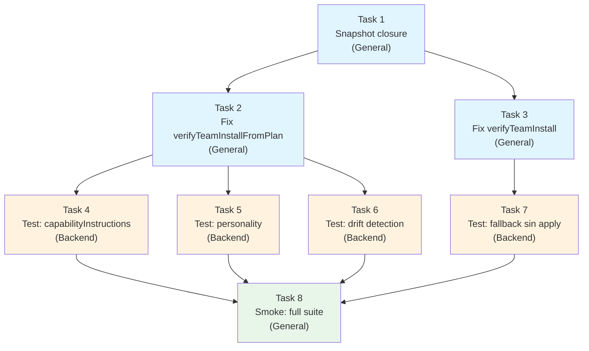

# Tasks: Reutilizar el plan OpenCode aplicado en verificación

## Source

- Spec: `reuse-opencode-install-plan-for-verify` spec artifact
- Design: `reuse-opencode-install-plan-for-verify` design artifact
- Capabilities affected: `opencode-install-verification`, `opencode-install-rollback`

## Task Groups

### Group: Shared / Contracts

#### Task 1: Introducir snapshot nativo por instancia en `createOpenCodeRunnerCapabilities`

**Owner**: General Apply
**Priority**: P0
**Complexity**: Medium
**Parallel**: No — foundation for Tasks 2, 3, 4
**Depends on**: none

**Description**
Refactorizar la factoría `createOpenCodeRunnerCapabilities()` para mantener un snapshot del plan nativo (`OpenCodeDeveloperTeamInstallPlan`) por instancia, análogo a `#lastNativePlan` en `runner-adapter.ts`. Implementar como closure dentro de la factoría: una variable `let lastAppliedNativePlan: OpenCodeDeveloperTeamInstallPlan | undefined` capturada por las funciones `buildTeamInstallPlan`, `buildTeamInstallPlanFromInput`, `applyTeamInstall`, `applyTeamInstallFromPlan`, `verifyTeamInstall`, `verifyTeamInstallFromPlan`. Guardar el plan construido en `lastAppliedNativePlan` cuando se construye o aplica un plan. Invalidar (setear `undefined`) cuando se construye un nuevo plan con `projectRoot` diferente.

**Files**
- `packages/adapter-opencode/src/runner-capabilities.ts` — modify (add snapshot closure + capture in build/apply paths)

**Verification**
- `bun test packages/adapter-opencode/src/runner-capabilities.test.ts` — todos los tests existentes pasan (sin regresión).
- TypeScript compila sin errores.
- El snapshot se captura en `buildTeamInstallPlan`, `buildTeamInstallPlanFromInput`, `applyTeamInstall`, `applyTeamInstallFromPlan`.

---

#### Task 2: `verifyTeamInstallFromPlan` usa snapshot nativo en vez de reconstruir sin opciones

**Owner**: General Apply
**Priority**: P0
**Complexity**: Medium
**Parallel**: No — depends on Task 1
**Depends on**: Task 1

**Description**
Modificar `verifyTeamInstallFromPlan()` para preferir `lastAppliedNativePlan` cuando existe, en lugar de llamar `buildOpenCodeDeveloperTeamInstallPlan(input.projectRoot)` sin opciones. Si el snapshot existe y corresponde al `input.projectRoot`, usarlo directamente con `verifyOpenCodeDeveloperTeamInstall(snapshot)`. Si no existe snapshot válido, fallback a reconstrucción con las opciones disponibles en `input` (`capabilityInstructions`). Este es el fix central del bug: la línea `buildOpenCodeDeveloperTeamInstallPlan(input.projectRoot)` en `verifyTeamInstallFromPlan` (línea ~505) pierde todas las opciones runtime.

**Files**
- `packages/adapter-opencode/src/runner-capabilities.ts` — modify (verifyTeamInstallFromPlan)

**Verification**
- `bun test packages/adapter-opencode/src/runner-capabilities.test.ts` — sin regresión.
- Verificar manualmente que `verifyTeamInstallFromPlan` ya no llama `buildOpenCodeDeveloperTeamInstallPlan` sin opciones cuando hay snapshot.

---

#### Task 3: `verifyTeamInstall` usa snapshot nativo o reconstruye con opciones completas

**Owner**: General Apply
**Priority**: P0
**Complexity**: Low
**Parallel**: No — depends on Task 1
**Depends on**: Task 1

**Description**
Modificar `verifyTeamInstall()` (línea ~327) para preferir `lastAppliedNativePlan` cuando existe. Actualmente reconstruye solo con `capabilityInstructions`. Si el snapshot existe, usarlo directamente. Si no, mantener el comportamiento actual pero mejorar el fallback para pasar todas las opciones disponibles.

**Files**
- `packages/adapter-opencode/src/runner-capabilities.ts` — modify (verifyTeamInstall)

**Verification**
- `bun test packages/adapter-opencode/src/runner-capabilities.test.ts` — sin regresión.
- La ruta de `teams.verifyDeveloperTeamInstall` usa snapshot cuando disponible.

---

### Group: Backend (Tests)

#### Task 4: Test de regresión — verify pasa con opciones runtime no-default (`capabilityInstructions`)

**Owner**: Backend Apply
**Priority**: P0
**Complexity**: Medium
**Parallel**: No — depends on Task 2
**Depends on**: Task 2

**Description**
Añadir test en `runner-capabilities.test.ts` que:
1. Construya un plan con `capabilityInstructions` no-default (p.ej. un bundle con fragmentos que cambien el contenido del skill).
2. Aplique el plan en un config dir temporal.
3. Ejecute verify inmediatamente (misma instancia de capabilities).
4. Assert: verify pasa (`.valid === true`), sin errors de content mismatch.

Cubre REQ-TC-001, REQ-OIV-001, REQ-OIV-002, REQ-OIV-003.

**Files**
- `packages/adapter-opencode/src/runner-capabilities.test.ts` — modify (add regression test)

**Verification**
- `bun test packages/adapter-opencode/src/runner-capabilities.test.ts` — nuevo test pasa.
- El test demuestra que el bug actual (false mismatch con opciones runtime) está corregido.

---

#### Task 5: Test de regresión — verify pasa con opciones runtime no-default (`personality`)

**Owner**: Backend Apply
**Priority**: P1
**Complexity**: Medium
**Parallel**: Yes — independiente de Task 4 (solo necesita Task 2)
**Depends on**: Task 2

**Description**
Añadir test en `runner-capabilities.test.ts` que:
1. Construya un plan con `personality` no-default (p.ej. `"strict"`).
2. Aplique el plan en config dir temporal.
3. Ejecute verify.
4. Assert: verify pasa sin content mismatch.

Refuerza REQ-TC-001 con una opción runtime diferente. Valida que el snapshot captura `personality` correctamente.

**Files**
- `packages/adapter-opencode/src/runner-capabilities.test.ts` — modify (add personality test)

**Verification**
- `bun test packages/adapter-opencode/src/runner-capabilities.test.ts` — nuevo test pasa.

---

#### Task 6: Test — drift real sigue detectado y activa rollback

**Owner**: Backend Apply
**Priority**: P0
**Complexity**: Low
**Parallel**: Yes — independiente (valida exact-match preservado)
**Depends on**: Task 2

**Description**
Añadir test en `runner-capabilities.test.ts` que:
1. Construya y aplique un plan con opciones runtime.
2. Corrompa un skill instalado después del apply.
3. Ejecute verify.
4. Assert: verify falla (`.valid === false`), con "Content mismatch" en issues.

Cubre REQ-TC-002, REQ-OIV-004, REQ-OIR-001. Garantiza que la corrección no relaja la detección de drift.

**Files**
- `packages/adapter-opencode/src/runner-capabilities.test.ts` — modify (add drift detection test)

**Verification**
- `bun test packages/adapter-opencode/src/runner-capabilities.test.ts` — nuevo test pasa.
- El test existente `verify fails when installed content differs from planned content` en `developer-team-install.test.ts` sigue pasando.

---

#### Task 7: Test — fallback de verify sin apply previo

**Owner**: Backend Apply
**Priority**: P1
**Complexity**: Low
**Parallel**: Yes
**Depends on**: Task 3

**Description**
Añadir test que:
1. Cree una instancia nueva de `createOpenCodeRunnerCapabilities()`.
2. Instale archivos manualmente en config dir (sin pasar por build/apply de la instancia).
3. Ejecute verify sin apply previo (sin snapshot).
4. Assert: verify reconstruye con fallback y reporta resultado válido según el contenido instalado.

Cubre REQ-TC-003. Documenta comportamiento esperado del camino fallback.

**Files**
- `packages/adapter-opencode/src/runner-capabilities.test.ts` — modify (add fallback test)

**Verification**
- `bun test packages/adapter-opencode/src/runner-capabilities.test.ts` — nuevo test pasa.

---

### Group: Verification / Smoke

#### Task 8: Suite completa de adapter-opencode sin regresión

**Owner**: General Apply
**Priority**: P0
**Complexity**: Low
**Parallel**: No — depends on Tasks 4-7
**Depends on**: Task 4, Task 5, Task 6, Task 7

**Description**
Ejecutar la suite completa de tests de `packages/adapter-opencode/src/` para confirmar que no hay regresión. Incluye `developer-team-install.test.ts` (exact-match existente debe seguir pasando). Si falla, diagnosticar y reportar.

**Files**
- `packages/adapter-opencode/src/` — unchanged (verification only)

**Verification**
- `bun test packages/adapter-opencode/src/` — todos los tests pasan.
- En particular: `verify fails when installed content differs from planned content` sigue pasando.

---

## Dependency Graph

```
Task 1 (Shared: snapshot closure)
  → Task 2 (Shared: verifyTeamInstallFromPlan fix)
  → Task 4 (Backend: regression test capabilityInstructions)
  → Task 5 (Backend: regression test personality)
  → Task 6 (Backend: drift detection test)
  Task 1 → Task 3 (Shared: verifyTeamInstall fix)
  → Task 7 (Backend: fallback test)
  Task 4 + Task 5 + Task 6 + Task 7 → Task 8 (Smoke: full suite)
```

## Parallelization Plan

| Phase | Tasks | Can Run in Parallel |
|---|---|---|
| Shared foundation | Task 1 | No (foundation) |
| Shared fix | Tasks 2, 3 | Yes (both depend on Task 1, independent of each other) |
| Backend tests | Tasks 4, 5, 6, 7 | Yes (4+5+6 depend on Task 2, 7 depends on Task 3; all independent of each other) |
| Smoke | Task 8 | No (waits for all test tasks) |

## Responsibility Contracts

| Contract / Boundary | Owner | Consumers | Notes |
|---|---|---|---|
| `lastAppliedNativePlan` snapshot closure | General Apply (Task 1) | Tasks 2, 3 (read) | Snapshot capturado por closure dentro de `createOpenCodeRunnerCapabilities()`. Inválido cuando `projectRoot` cambia. |
| `verifyTeamInstallFromPlan` fix | General Apply (Task 2) | Backend Apply (Tasks 4, 5, 6) | verify ahora prefiere snapshot; fallback cuando no existe. |
| Exact-match en `verifyOpenCodeDeveloperTeamInstall` | No cambia (Task 8 solo verifica) | Tasks 6, 8 (tests validan) | `developer-team-install.ts` NO se modifica. La comparación `content !== planned.content` se preserva. |

## Complexity Summary

| Complexity | Count | Task Numbers |
|---|---|---|
| Low | 3 | 3, 6, 8 |
| Medium | 5 | 1, 2, 4, 5, 7 |

## Flagged for Splitting

- None — todas las tareas son atómicas y abarcables en una sesión.

## Review Workload Forecast

| Signal | Value |
|---|---|
| Estimated changed lines | 100-400 |
| 400-line budget risk | Low |
| Scope reduction recommended | No |
| Sequential work slices recommended | No |
| Decision needed before Apply | No |

**Rationale**: El cambio se concentra en `runner-capabilities.ts` (snapshot closure + fixes en verify + guards en build/apply) y `runner-capabilities.test.ts` (4-5 tests nuevos). `developer-team-install.ts` no se modifica. La superficie de cambio es acotada (<300 líneas estimadas entre src y tests), no requiere migración, y no afecta APIs públicas.

## Open Questions / Blockers

None — tasks are ready for Apply.

- **Open Decision del Design** (resuelto en Task 1): "Confirmar durante implementación si el snapshot se implementa como cierre dentro de `createOpenCodeRunnerCapabilities()` o helper compartido con `runner-adapter.ts`" — se resuelve eligiendo closure por instancia (preferencia del design, mínimo cambio).
- **Open Decision del Design** (resuelto en Tasks 2, 3): "Confirmar si `teams.verifyDeveloperTeamInstall` sigue siendo una ruta activa" — sí lo es; se aplica la misma política de snapshot/fallback.

## Mermaid Summary Source


