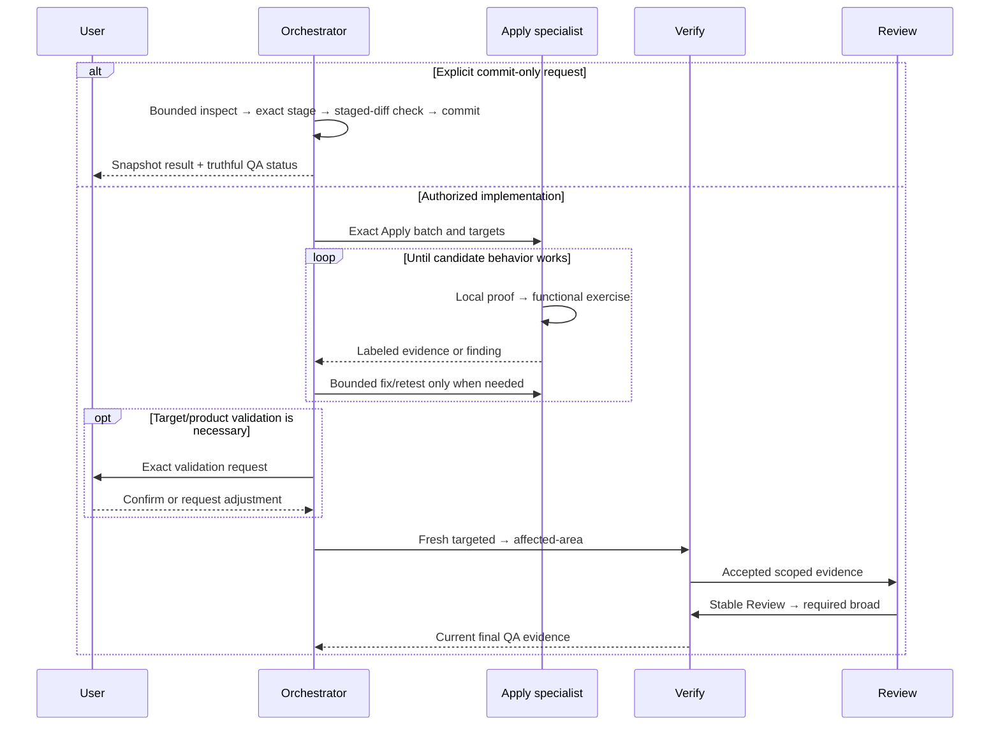

# Design: Streamline Orchestrator Ownership and Pre-QA Candidate Validation

## Decision summary

Implement this change at Deck's runner-neutral content boundary. Retain the `INV-002` identity and critical composition position, but replace its pure-delegator semantics in place with a coordinator-ownership/specialist-judgment boundary. Make the supersession of only the pure-delegator clause of archived `REQ-OIS-002` explicit during Spec/Design reconciliation before Tasks.

Apply remains the implementation owner. It performs minimal local technical proof and proportionate functional exercise, fixes findings, and retests before the Orchestrator starts a fresh independent QA cycle. User validation is conditional on target-environment or product-judgment need; it is not a routine pause, a phase, an artifact, or QA evidence. Explicit commit-only work is a bounded coordinator operation and is reported as an unverified snapshot unless current final QA evidence binds to the exact subject.

No production runtime scheduler, convergence state, registry schema, canonical phase, status, event kind, or acceptance artifact changes are justified by current reachability evidence. The change is **Medium risk**. Any newly proven production scheduler bypass would stop this design for reconciliation and move that runtime slice to the existing High-risk lane.

## Authority and reconciliation boundary

- Approved Proposal: `proposal.md`, SHA-256 `751e6d83fbf71f100d15812f4faa8f8b4d703ec34db3df88da270f55aae419d6`.
- Approval decision: explicit user message `Prosigue`, decision digest `sha256:57251395927e12e35801139b0b59a14b63940b74b6b28a064dac4f45fd2f9b9c`.
- Exploration evidence: `exploration.md`, SHA-256 `3773b87cd3f4bd70ffcee299b61e21c0d1aff6ba146794f1ccfcebedc8ef4c1e`.
- Design was produced independently of the concurrently running Spec and did not read `spec.md`.
- Before Tasks, Spec and Design MUST be reconciled. The reconciled Spec MUST explicitly supersede only archived `persistent-orchestrator-invariants` `REQ-OIS-002` clause `(2) pure delegator — never execute specialist work`; it MUST preserve the invariant schema, ID ordering, injection position, surfaces, idempotency, verification, and runner-neutrality requirements. Missing or contradictory supersession blocks Tasks with `design-spec-supersession-missing`.
- OpenSpec artifacts and registry records are official context. Adaptive memory was loaded only as advisory context and did not alter this design.

## Current architecture and composition

| Boundary | Current evidence | Design consequence |
|---|---|---|
| Runner-neutral content | `@deck/core` owns Developer Team prompts, role skills, invariants, and the content registry. | Change canonical content under `packages/core/src/teams/developer/`; do not encode this policy in an adapter. |
| Invariant precedence | `content-registry.ts` prepends compact invariants and the compact runtime contract by default; legacy composition prepends rendered invariants. | Lower-priority prose cannot safely contradict `INV-002`; change the invariant first and test position zero. |
| Prompt profiles | `compact` is the production default; `legacy` remains an explicit compatibility surface. | Update both profiles and the intentional legacy byte/token/digest fixture. |
| Installed prompts and skills | OpenCode `buildPromptContent()` and `buildSkillFileContent()` consume `getTeamSessionInstructions()` / `getAgentContent()`. Pi consumes the same registry through its profile/install path. | Core edits flow to installed content. Adapter source changes are unnecessary; adapter materialization tests prove propagation. |
| Final QA runtime | `execution-convergence.ts` encodes Apply → targeted → affected-area → Review → broad and invalidates stale evidence. | Preserve it. The pre-QA loop ends before `apply_result_accepted`; that event remains machine evidence acceptance, not user acceptance. |
| Legacy role scheduler | `scheduleExecutionRoleInvocationV1()` / `consumeExecutionRoleResultV1()` remain exported and tested, but graph and LSP references show no non-test production caller; callers are scheduler tests and the convergence fixture. | Do not change runtime scheduling in this change. Record the Review-after-broad compatibility inconsistency as a bounded follow-up. |
| Registry | Specialists return ordered `RegistryIntentV1` values; the central coordinator is the only shared registry writer. | Add no registry fields. Reuse normal Apply status/evidence and current transition notes; stop on digest conflict or recovery-required. |

### Composition path to preserve

1. **Compact session:** compact invariants → compact runtime contract → compact Orchestrator prompt → context authority → language policy → optional active-runner context → capability instructions.
2. **Compact agent/skill:** compact runtime contract (plus compact Orchestrator invariants on the Orchestrator agent) → dedicated compact body → shared composition layers. The compact skill retains its runtime-contract reference.
3. **Legacy session/agent/skill:** rendered critical invariants → legacy body → shared composition layers.
4. **Materialization:** adapters read the composed core content and write runner-native prompt/skill files. Materialized files under runner configuration roots and checked-in generated assets are outputs, never editable targets for this change.

## Architecture decisions

### AD-1 — Revise `INV-002` in place with explicit normative supersession

Keep ID `INV-002`, tier `critical`, all four current surfaces, array position, renderer behavior, and six-invariant count. Rename the TypeScript constant to reflect its new semantics. An additional invariant ID is rejected because retaining the old `INV-002` would leave two critical rules in conflict, while removing it would break identity and composition compatibility. Silent prose-only contradiction is also rejected.

Precedence safety has three parts:

1. the reconciled Spec explicitly supersedes the narrow archived pure-delegator clause;
2. `INV-002` itself becomes the highest-visibility ownership rule; and
3. every compact/legacy surface removes contradictory “delegate everything” or “never execute specialist-capable work” language and gains positive/negative boundary tests.

### AD-2 — Ownership is qualitative, not a file-count shortcut

The Orchestrator directly performs an operation only when all are true:

- it is coordination-owned, bounded, deterministic, and non-destructive;
- explicit user authorization and any runner authorization cover it;
- scope and exact targets are unambiguous;
- it changes no product/system behavior and authors no specialist judgment; and
- it crosses no protected-risk, excluded-target, Full-SDD, registry, repair, or safety floor.

Examples are bounded status/diff/log inspection, deterministic existence/count/digest checks, exact staging and an explicitly requested commit, centralized intent reconciliation, metadata reconciliation, synthesis, user questions, and recording a resolved phase decision.

Specialists retain behavior-changing implementation, specialist phase artifacts and substantive revisions, broad investigation, heavy tests/builds, architecture/domain/security/migration/data-loss/public-interface judgment, Apply execution, independent Verify, and independent Review. Numeric read/write heuristics remain context-budget signals only; they never transfer implementation or judgment to the Orchestrator and never force delegation of an otherwise bounded coordinator operation.

### AD-3 — Candidate validation is normal Apply work before final QA

The normal implementation path is:

1. **Apply-local technical proof:** the assigned Apply specialist runs the smallest relevant implementation checks. This is implementer evidence, not independent QA.
2. **Functional exercise:** the Apply specialist exercises the changed behavior through the proportionate real interface—unit/component behavior, API/integration path, browser interaction, CLI invocation, configuration smoke, deterministic regeneration, or equivalent.
3. **Fix/retest loop:** a finding returns to the applicable Apply owner under the existing authorization and target allowlist. No independent Verify or Review is launched for the discarded candidate.
4. **Conditional target/product validation:** request user action only when automation cannot establish target-environment behavior or product judgment is genuinely required. Automatic mode otherwise continues without a conversational pause.
5. **Fresh final QA:** once the candidate works, launch fresh independent targeted Verify, affected-area Verify, Review, and required broad Verify in the existing order. Any later modification invalidates dependent evidence and requires a fresh cycle.

Apply-local or functional evidence cannot satisfy Verify, Review, broad, Archive, release, or registry commit-readiness. Conversely, “functional testing” MUST NOT be reinterpreted as running the final staged QA plan inside Apply.

### AD-4 — Do not add runtime scheduling or state

The runtime transition to `targeted_pending` occurs only when a caller submits `apply_result_accepted`; no source automatically emits that event after every edit. The content contract will require the Orchestrator to withhold that transition until candidate validation is complete. Therefore a new `awaiting_acceptance` state, event, parser field, scheduler branch, adapter hook, or migration would add compatibility cost without closing a demonstrated production bypass.

The exported legacy role scheduler still requires all staged verification, including broad, before Review, unlike the authoritative convergence path. It does not prevent the approved pre-QA loop because the loop is before role scheduling, and it has no non-test production caller at the indexed HEAD. This design does not claim that every exported compatibility API has identical Review/broad ordering. Reconcile that inconsistency in a separate bounded scheduler-consistency change if the API becomes production-reachable or its public compatibility contract is intentionally revised.

### AD-5 — Commit-only is a truthful snapshot operation

An explicit commit-only request does not create a QA lifecycle. The coordinator performs bounded inspection, resolves staging ambiguity, stages exact pathspecs, checks the staged diff, performs bounded secret/safety checks, commits, and reports evidence status. A protected-risk match or judgment question is delegated or stopped; it is never mechanically waived.

The result may reference existing final QA only when that evidence is current and binds to the exact implementation subject and dependencies. Otherwise it is labeled **unverified snapshot**. Commit-only never implies acceptance, release readiness, Archive readiness, registry commit-readiness, amend, push, branch changes, broad staging, or permission to disturb unrelated WIP.

### AD-6 — Absorb resolved decisions without replaying completed judgment

When the user resolves an already-exposed phase decision and the answer merely selects an existing option or supplies an unambiguous fact within approved scope, the Orchestrator records it in the next existing coordinator-owned result/transition note and advances. It MUST NOT relaunch the completed specialist solely to restate the answer.

If the answer changes requirements, architecture, implementation, a specialist artifact, protected-risk judgment, or an evidence dependency, the correct specialist revises the affected work. This boundary lets the coordinator absorb decisions without becoming the artifact author or silently changing scope.

## Components and responsibilities

| Component | Responsibility after the change |
|---|---|
| Orchestrator invariant/content | Set precedence-safe ownership, coordinate candidate validation, gate final QA, absorb bounded decisions, and handle commit-only snapshots. |
| General Apply skill | Local/shared/config/script/CLI proof plus functional smoke or contract-consumer exercise; deterministic generation checks where relevant. |
| Backend Apply skill | Focused unit/type checks plus actual API/service/persistence/integration/error-path exercise at real trust boundaries. |
| Frontend Apply skill | Focused component/type checks plus actual interaction/browser/integration/accessibility exercise against authoritative contracts. |
| Verify | Fresh independent targeted, affected-area, and required broad evidence only after candidate readiness. |
| Review | Fresh independent architecture/security/maintainability judgment after scoped Verify, before broad. |
| Content registry/adapters | Preserve composition and materialize changed core bytes; no new policy branch. |
| SDD runtime/registry | Preserve authorization, convergence, freshness, lane floors, centralized writes, conflict stops, and recovery behavior unchanged. |

## Supplemental flow



The diagram is supplemental. Existing authorization, stage, freshness, lane, registry, and hard-stop contracts remain authoritative.

## State, evidence, and recovery

### Existing surfaces only

- Keep canonical phase `apply` and existing statuses. Do not add `acceptance`, `awaiting_user`, or equivalent phase/status values.
- Use the existing `apply-progress.md` verification/evidence area and immutable Apply result to distinguish:
  - local technical checks and outcomes;
  - functional exercise, expected behavior, observed behavior, and outcome;
  - target/product validation as `not required`, `required/pending`, or resolved in the normal coordinator handoff; and
  - the current changed-target/subject/dependency references already carried by the result contract.
- If target validation is pending, Apply remains `in_progress` and returns an explicit required user action/blocker. Do not invent a new status or mark final QA complete.
- A successful automated functional exercise allows Automatic mode to proceed directly. A user confirmation, when needed, selects the candidate only and is passed as bounded causal context; it creates no Verify/Review evidence.
- The normal Apply completion intent may be held until required target validation resolves. The coordinator may commit the already valid intent after confirmation without relaunching Apply merely to restate the decision. Any requested adjustment returns to Apply and produces a new candidate.
- `apply_result_accepted` remains the existing machine transition into final QA and is emitted only after the above readiness conditions are satisfied. It is not renamed to user acceptance.

### Recovery algorithm

1. Read `state.yaml`, `events.yaml`, the latest existing phase artifact, and current repository status/digests.
2. If `apply-progress.md` shows current local and functional evidence and no required target validation is pending, resume at fresh final QA.
3. If target validation is pending and the decision is not durably available, ask the user directly once; do not relaunch a completed specialist to reconstruct the question.
4. If candidate identity, changed targets, dependency references, or evidence freshness is ambiguous, do not infer readiness. Delegate the narrowest functional re-exercise or return to Apply as appropriate.
5. Any modification after candidate selection invalidates dependent candidate/final-QA evidence under existing freshness rules.
6. On registry digest conflict, pair-transaction recovery requirement, missing authority, protected risk, excluded target, or exhausted repair governance, stop under the existing hard-stop behavior. No new recovery fallback is introduced.

## Exact editable targets and file estimate

The anticipated implementation slice is **17 files: 5 canonical content sources and 12 tests**. This is a design impact map, not authorization to modify them before approved Tasks/Apply.

### Canonical content sources

1. `packages/core/src/teams/developer/orchestrator-invariants.ts`
2. `packages/core/src/teams/developer/orchestrator-content.ts`
3. `packages/core/src/teams/developer/apply-general-content.ts`
4. `packages/core/src/teams/developer/apply-backend-content.ts`
5. `packages/core/src/teams/developer/apply-frontend-content.ts`

### Focused tests

6. `packages/core/src/teams/developer/orchestrator-invariants.test.ts`
7. `packages/core/src/teams/developer/orchestrator-invariants.task2.test.ts`
8. `packages/core/src/teams/developer/orchestrator-content.test.ts`
9. `packages/core/src/teams/developer/content-registry.test.ts`
10. `packages/core/src/teams/developer/prompt-profile.test.ts`
11. `packages/core/src/teams/developer/manifest.test.ts`
12. `packages/core/src/teams/developer/user-phase-communication.test.ts`
13. `packages/core/src/teams/developer/apply-general-content.test.ts`
14. `packages/core/src/teams/developer/apply-backend-content.test.ts`
15. `packages/core/src/teams/developer/apply-frontend-content.test.ts`
16. `packages/adapter-opencode/src/developer-team-install.test.ts`
17. `packages/adapter-opencode/src/prompt-generation.test.ts`

### Explicit non-targets

- No `packages/sdd-runtime/**` source or test modification.
- No adapter source modification; Pi's existing `registry-consumption.test.ts` is verification-only.
- No `state.yaml`, `events.yaml`, registry schema, generated asset, installed runner file, historical artifact, or `runner-capability-standardization` target.
- Do not edit `packages/core/src/skills/external/content.generated.ts`, `apps/cli/src/runtime/build-info.generated.ts`, runner configuration materializations, or any generated prompt/skill output directly.

## Exact Implementation Instructions

All EIIs below are independently testable. Semantic EIIs define required behavior rather than exact prose. The only byte-verbatim EII is the authorization/Git-critical commit-only block.

### EII-SOA-001 — Automatic-mode invariant

- **Editable source target:** `packages/core/src/teams/developer/orchestrator-invariants.ts`, `INV_001_EXECUTION_MODE_GATE`.
- **Mode:** `semantic-constrained`.
- **Required clauses:** retain mode selection after SDD triage; define Automatic as no routine phase-by-phase or functional-acceptance pause; continue after automated candidate validation; permit a pause only for genuinely required target/product validation or an existing approval/hard stop; retain Interactive phase decisions; state that mode never grants authority or waives safety/QA.
- **Preserved constraints:** ID `INV-001`, critical tier, surfaces, ordering, triage-before-mode behavior, and session caching.
- **Affected assertions:** `orchestrator-invariants*.test.ts`, `orchestrator-content.test.ts`, `user-phase-communication.test.ts`, `prompt-profile.test.ts`.
- **Prohibited reinterpretations:** no unconditional user pause after Apply; no “Automatic means bypass”; no conversion of target validation into a canonical approval gate.
- **Ambiguity stop:** if reconciled Spec defines a different Automatic-mode boundary, stop with `design-instruction-ambiguous`.

### EII-SOA-002 — `INV-002` coordinator ownership

- **Editable source target:** `packages/core/src/teams/developer/orchestrator-invariants.ts`, rename `INV_002_PURE_DELEGATOR` to `INV_002_COORDINATOR_OWNERSHIP` and update its record/reference.
- **Mode:** `semantic-constrained`.
- **Required clauses:** retain ID `INV-002`; direct ownership requires bounded + mechanical + deterministic + authorized + no specialist implementation/judgment; enumerate bounded Git inspection, exact staging/commit, deterministic artifact/digest checks, centralized intent reconciliation, synthesis, and resolved-decision recording as direct examples; reserve behavior changes, specialist artifacts, heavy execution, protected-risk/domain judgment, Verify, and Review to specialists; ambiguity/risk/scope causes clarification, delegation, or stop; ownership never widens authority.
- **Preserved constraints:** critical tier, all current surfaces, invariant count/order/schema/rendering/injection/idempotency, runner-neutral wording, and every permanent authority/quality/hard-stop rule.
- **Affected assertions:** both invariant tests, `content-registry.test.ts`, `manifest.test.ts`, `orchestrator-content.test.ts`, and `user-phase-communication.test.ts`.
- **Prohibited reinterpretations:** remove “Pure Delegator,” “delegate everything,” “never execute any specialist-capable task,” specialist availability as the deciding condition, and file-count-only definitions of “simple.” Do not let the Orchestrator implement behavior or supply independent judgment.
- **Ambiguity stop:** Tasks are blocked with `design-spec-supersession-missing` unless the reconciled Spec explicitly supersedes archived `REQ-OIS-002`'s pure-delegator clause.

### EII-SOA-003 — Compact invariant summaries

- **Editable source target:** `packages/core/src/teams/developer/orchestrator-invariants.ts`, `COMPACT_ORCHESTRATOR_INVARIANT_SUMMARIES_V1` entries for `INV-001` and `INV-002`.
- **Mode:** `semantic-constrained`.
- **Required clauses:** `INV-001` captures no routine Automatic pause plus conditional target/hard-stop interaction; `INV-002` captures direct bounded coordinator operations and specialist ownership of implementation/judgment.
- **Preserved constraints:** all ten entries, order, IDs, immutability, compactness, and permanent authority/quality/hard-stop summaries.
- **Affected assertions:** invariant tests, `content-registry.test.ts`, `prompt-profile.test.ts`, `manifest.test.ts`, `user-phase-communication.test.ts`.
- **Prohibited reinterpretations:** no summary that restores pure delegation, omits authorization, or suggests local/functional evidence replaces QA.
- **Ambiguity stop:** if a concise summary cannot preserve both positive and negative ownership boundaries, stop rather than emit a vague “simple work” rule.

### EII-SOA-004 — Shared ownership guidance

- **Editable source target:** `packages/core/src/teams/developer/orchestrator-content.ts`, new exported prompt fragment `ORCHESTRATOR_OWNERSHIP_BOUNDARY_V1`.
- **Mode:** `semantic-constrained`.
- **Required clauses:** encode AD-2's all-conditions direct boundary; positive direct examples; specialist-only examples; qualitative ownership over file counts; explicit authorization and risk/hard-stop preservation; ambiguity routes to clarify/delegate/stop.
- **Preserved constraints:** triage classifications, registered specialist roles, context-economy guidance, single-writer registry, and Git discard protection.
- **Affected assertions:** `orchestrator-content.test.ts`, `content-registry.test.ts`, `prompt-profile.test.ts`, `manifest.test.ts`, `user-phase-communication.test.ts`, adapter materialization tests.
- **Prohibited reinterpretations:** no permission to author source behavior, specialist phase artifacts, protected judgment, Verify, or Review; no numeric “direct” loophole.
- **Ambiguity stop:** if a placement would be below contradictory pure-delegator prose, remove/rewrite the contradiction first or stop.

### EII-SOA-005 — Shared pre-QA candidate-validation guidance

- **Editable source target:** `packages/core/src/teams/developer/orchestrator-content.ts`, new exported prompt fragment `ORCHESTRATOR_PRE_QA_FUNCTIONAL_LOOP_V1`.
- **Mode:** `semantic-constrained`.
- **Required clauses:** ordered local proof → actual functional exercise → fix/retest → conditional target/product validation → fresh final independent QA; Apply/specialist ownership of execution; no Verify/Review for discarded candidates; Automatic continues when automation suffices; user confirmation selects only a candidate; modifications invalidate dependent evidence; no new phase/status/artifact/event; existing targeted → affected-area → Review → broad order remains.
- **Preserved constraints:** independent identities, freshness, mandatory broad, Full-SDD/protected floors, bounded repair governance after independent failures, and centralized registry readiness.
- **Affected assertions:** `orchestrator-content.test.ts`, `content-registry.test.ts`, `prompt-profile.test.ts`, `user-phase-communication.test.ts`, adapter prompt/materialization tests.
- **Prohibited reinterpretations:** no default conversational acceptance pause; no user confirmation as QA; no staged final QA inside Apply; no final QA before behavior is exercised.
- **Ambiguity stop:** if the changed behavior cannot be identified or target validation need cannot be classified, require a blocker/user action rather than claiming candidate readiness.

### EII-SOA-006 — Shared resolved-decision absorption guidance

- **Editable source target:** `packages/core/src/teams/developer/orchestrator-content.ts`, new exported prompt fragment `ORCHESTRATOR_PHASE_DECISION_ABSORPTION_V1`.
- **Mode:** `semantic-constrained`.
- **Required clauses:** absorb a user's in-scope selection/factual resolution; record it in an existing coordinator-owned result/normal transition note; advance without relaunching a completed specialist solely to restate; relaunch the correct specialist when the answer changes requirements, artifact substance, implementation, protected judgment, or evidence dependencies.
- **Preserved constraints:** explicit authorization, artifact ownership, proposal approval, English-only internal artifacts, centralized registry writes, and conflict stops.
- **Affected assertions:** `orchestrator-content.test.ts`, `content-registry.test.ts`, `user-phase-communication.test.ts`, adapter prompt tests.
- **Prohibited reinterpretations:** no coordinator-authored specialist judgment; no silent artifact rewrite; no decision as modification authority.
- **Ambiguity stop:** if the decision's effect is not purely mechanical/in-scope, stop and route to the owning specialist.

### EII-SOA-007 — Exact commit-only rule

- **Editable source target:** `packages/core/src/teams/developer/orchestrator-content.ts`, new exported prompt fragment `ORCHESTRATOR_EXPLICIT_COMMIT_ONLY_RULE_V1`.
- **Mode:** `byte-verbatim`.
- **Required emitted prompt text:**

```text
## Explicit Commit-Only Requests

Treat an explicit commit-only request as authorization to record the unambiguous intended snapshot, not as acceptance, verification, review, release, Archive, amend, push, branch change, or authority to widen scope.

1. Run bounded `git status`, relevant unstaged and staged `git diff`, and recent `git log` inspection.
2. If unrelated work or intended paths are ambiguous, ask once for the exact path set and stop; never infer permission to include unrelated work.
3. Stage only the explicitly intended paths with exact pathspecs. Never use broad staging that can capture unrelated work. Re-check staged status and `git diff --cached` before committing.
4. Apply bounded, risk-relevant secret and safety checks without exposing sensitive values. A secret match, protected-risk question, excluded target, or unclear safety judgment stops the commit or routes the judgment to the appropriate specialist.
5. Execute only the explicitly requested commit with the requested or repository-consistent message. Do not amend, push, change branches, release, Archive, or perform any destructive Git operation unless separately authorized; destructive operations still require the canonical new-message, exact-command confirmation flow.
6. Do not launch Verify or Review solely because a commit was requested. If current final independent QA evidence does not bind to the exact committed subject and dependencies, report the commit as an **unverified snapshot**. Never imply acceptance, release readiness, Archive readiness, or commit-ready registry evidence.
```

- **Preserved constraints:** the existing `GIT_DISCARD_PROTECTION_RULE` remains byte-for-byte unchanged and continues to supersede all other instructions; post-Archive automatic Git mutation remains forbidden.
- **Affected assertions:** `orchestrator-content.test.ts`, `content-registry.test.ts`, `prompt-profile.test.ts`, `user-phase-communication.test.ts`, OpenCode prompt/install tests, and unchanged `git-safety.test.ts` as a regression gate.
- **Prohibited reinterpretations:** no `git add .`/broad staging inference, unrelated WIP inclusion, amend/push/release, QA claim, secret disclosure, or destructive-command shortcut.
- **Ambiguity stop:** any byte difference, unclear staging set, sensitive match, protected risk, or missing authorization blocks the operation.

### EII-SOA-008 — Legacy Orchestrator session prompt

- **Editable source target:** `packages/core/src/teams/developer/orchestrator-content.ts`, `ORCHESTRATOR_SYSTEM_PROMPT`.
- **Mode:** `semantic-constrained`.
- **Required change:** replace `## Your Identity: Pure Delegator` and contradictory delegation principles with EII-SOA-004 semantics; make numeric triggers advisory to the ownership boundary; narrow the unconditional pre-commit review trigger; compose EII-SOA-005, EII-SOA-006, and the exact EII-SOA-007 block once; update Execution Mode per EII-SOA-001; place candidate validation inside Apply before targeted; keep user communication low-noise and conditional.
- **Preserved constraints:** all triage, initialization, preconditions, authorization, repair, registry, skill discovery, language, final QA order, hard-stop, recovery, and post-Archive no-automatic-mutation text.
- **Affected assertions:** `orchestrator-content.test.ts`, `content-registry.test.ts`, `prompt-profile.test.ts`, `user-phase-communication.test.ts`, OpenCode prompt tests.
- **Prohibited reinterpretations:** no phase removal, unconditional user pause, QA-before-candidate, commit-triggered QA, or coordinator implementation.
- **Ambiguity stop:** conflicting lower-priority wording must be removed or the change stops; do not rely on “the invariant will override it.”

### EII-SOA-009 — Legacy Orchestrator agent body

- **Editable source target:** `packages/core/src/teams/developer/orchestrator-content.ts`, `ORCHESTRATOR_AGENT_BODY`.
- **Mode:** `semantic-constrained`.
- **Required change:** state coordinator direct ownership and specialist boundaries; include the candidate-validation ordering, resolved-decision absorption, and exact commit-only block; revise delegation triggers so commit-only and bounded mechanical coordination do not require a fresh independent role launch.
- **Preserved constraints:** matching-skill load, bounded discovery, no heavy execution, Git safety sentinel, triage, low-noise Apply summary, Verify/Review failure decision gate, and language policy composition.
- **Affected assertions:** `orchestrator-content.test.ts`, `content-registry.test.ts`, `manifest.test.ts`, `user-phase-communication.test.ts`.
- **Prohibited reinterpretations:** no heavy test execution by the Orchestrator and no direct specialist artifact authorship.
- **Ambiguity stop:** if concise agent guidance conflicts with the invariant/shared fragments, stop instead of keeping both.

### EII-SOA-010 — Legacy Orchestrator skill body

- **Editable source target:** `packages/core/src/teams/developer/orchestrator-content.ts`, `ORCHESTRATOR_SKILL_BODY`.
- **Mode:** `semantic-constrained`.
- **Required change:** compose all four new shared fragments exactly once; update Apply Routing and Verify/Review guidance to withhold final QA until candidate readiness; update Execution Mode and Recovery; allow normal Apply intent completion after conditional user validation without specialist restatement; preserve final targeted → affected-area → Review → broad sequence.
- **Preserved constraints:** phase routing/artifact ownership, preconditions, registry-deferred operation, agent configuration, artifact verification, repair governance, language, and post-Archive safety.
- **Affected assertions:** `orchestrator-content.test.ts`, `content-registry.test.ts`, `prompt-profile.test.ts`, `user-phase-communication.test.ts`, OpenCode installed-skill tests.
- **Prohibited reinterpretations:** no new phase/artifact/status, no acceptance-as-QA, no bypass of phase artifacts or registry evidence.
- **Ambiguity stop:** if existing artifact ownership prevents a mechanical decision record, retain the decision in the normal coordinator handoff and stop for reconciliation rather than inventing a new artifact.

### EII-SOA-011 — Compact Orchestrator session prompt

- **Editable source target:** `packages/core/src/teams/developer/orchestrator-content.ts`, `ORCHESTRATOR_SYSTEM_PROMPT_COMPACT`.
- **Mode:** `semantic-constrained`.
- **Required change:** carry concise versions of ownership, pre-QA flow, resolved-decision absorption, Automatic behavior, and exact commit-only instructions; state that final QA starts only for the working candidate; retain the canonical order string used by runtime parity tests.
- **Preserved constraints:** compact authority order, independent quality, hard stops, skill discovery, language behavior, and size advantage over legacy.
- **Affected assertions:** `orchestrator-content.test.ts`, `content-registry.test.ts`, `prompt-profile.test.ts`, `manifest.test.ts`, `user-phase-communication.test.ts`, OpenCode prompt tests.
- **Prohibited reinterpretations:** no compact omission that restores eager delegation or default user acceptance pauses.
- **Ambiguity stop:** if compactness would omit a required boundary, retain the clause and update the intentional size fixture; never weaken semantics to meet a token target.

### EII-SOA-012 — Compact Orchestrator agent body

- **Editable source target:** `packages/core/src/teams/developer/orchestrator-content.ts`, `ORCHESTRATOR_COMPACT_AGENT_BODY`.
- **Mode:** `semantic-constrained`.
- **Required change:** add concise direct/specialist ownership, candidate readiness before final QA, resolved-decision absorption, and exact commit-only behavior; keep heavy execution specialist-owned.
- **Preserved constraints:** runtime/OpenSpec authority, Git safety, hard stops, Full-SDD, excluded WIP, matching skill load, and low-noise synthesis.
- **Affected assertions:** `orchestrator-content.test.ts`, `content-registry.test.ts`, `manifest.test.ts`, `prompt-profile.test.ts`.
- **Prohibited reinterpretations:** no direct implementation, independent judgment, or broad execution.
- **Ambiguity stop:** any mismatch with compact invariant summaries blocks completion.

### EII-SOA-013 — Compact Orchestrator skill body

- **Editable source target:** `packages/core/src/teams/developer/orchestrator-content.ts`, `ORCHESTRATOR_COMPACT_SKILL_BODY`.
- **Mode:** `semantic-constrained`.
- **Required change:** compose the shared ownership, pre-QA, decision-absorption, and exact commit-only rules; update `## Coordinate One Authoritative Flow` so Apply candidate validation precedes step 6 final QA; add recovery handling without a new state.
- **Preserved constraints:** normalized immutable results, failure routing, central intent commitment, skill discovery, user-language communication, freshness, and canonical final order.
- **Affected assertions:** core composition/profile tests and OpenCode installed-skill tests.
- **Prohibited reinterpretations:** no new canonical gate, no routine acceptance question, and no specialist replay solely to repeat a user answer.
- **Ambiguity stop:** if the shared fragments appear more than once in a composed skill, stop and fix composition rather than tolerating duplicate rules.

### EII-SOA-014 — General Apply legacy skill

- **Editable source target:** `packages/core/src/teams/developer/apply-general-content.ts`, `APPLY_GENERAL_SKILL_BODY`.
- **Mode:** `semantic-constrained`.
- **Required clauses:** label minimal local proof separately from functional exercise; exercise shared/config/script/CLI/contract behavior through the relevant interface; fix and rerun both affected local and functional checks; report commands/observations in existing Apply evidence; identify conditional target/user validation; state all evidence is non-independent and cannot satisfy targeted/affected/Review/broad.
- **Preserved constraints:** TDD, EII fidelity, code economy, repair-incident handling, generated-source discipline, artifact/return contract, target allowlist, and centralized registry rules.
- **Affected assertions:** `apply-general-content.test.ts`, `content-registry.test.ts`, `prompt-profile.test.ts`, `user-phase-communication.test.ts`, adapter install/prompt tests.
- **Prohibited reinterpretations:** no mandatory full build/broad suite for every task, no final staged QA claim, no default user pause.
- **Ambiguity stop:** if functional behavior or environment is undefined, return an explicit blocker/required action instead of “ready for QA.”

### EII-SOA-015 — General Apply compact skill

- **Editable source target:** `packages/core/src/teams/developer/apply-general-content.ts`, `APPLY_GENERAL_COMPACT_SKILL_BODY`.
- **Mode:** `semantic-constrained`.
- **Required change:** replace the instruction to run staged targeted/affected/broad checks with minimal local proof plus proportionate actual behavior exercise and fix/retest; label evidence non-independent; report conditional target validation; leave final stages to fresh Verify/Review.
- **Preserved constraints:** skill selection, RED evidence, canonical sources, scope, EII fidelity, immutable result, and registry-intent-only behavior.
- **Affected assertions:** same as EII-SOA-014 plus compact OpenCode installed-skill assertions.
- **Prohibited reinterpretations:** Apply does not own independent staged verification.
- **Ambiguity stop:** missing testability or unavailable required target validation blocks readiness.

### EII-SOA-016 — Backend Apply legacy skill

- **Editable source target:** `packages/core/src/teams/developer/apply-backend-content.ts`, `APPLY_BACKEND_SKILL_BODY`.
- **Mode:** `semantic-constrained`.
- **Required clauses:** separate focused unit/type/build proof from actual endpoint/service/persistence/integration/error-path exercise; test real trust boundaries proportionately; fix/retest findings; report conditional external/target validation; label all evidence non-independent and reserve final stages for Verify/Review.
- **Preserved constraints:** API compatibility/migration, security, transactions, authorization, secrets, EII fidelity, repair evidence, scope, and registry behavior.
- **Affected assertions:** backend content, registry/profile/user-communication, and adapter materialization tests.
- **Prohibited reinterpretations:** no protected-risk adjudication by the Orchestrator, no broad final QA inside Apply, no mock-only claim when a real integration path is required.
- **Ambiguity stop:** unavailable integration dependency or unresolved security/migration judgment is a blocker, not a pass.

### EII-SOA-017 — Backend Apply compact skill

- **Editable source target:** `packages/core/src/teams/developer/apply-backend-content.ts`, `APPLY_BACKEND_COMPACT_SKILL_BODY`.
- **Mode:** `semantic-constrained`.
- **Required change:** replace “scheduled targeted, affected-area, and broad checks” with focused local proof plus proportionate backend functional exercise and fix/retest; require truthful non-independent evidence and conditional target validation; defer final stages to fresh independent QA.
- **Preserved constraints:** trust-boundary validation, canonical sources, compatibility/migration plan, exact batch, EII fidelity, and result contract.
- **Affected assertions:** same as EII-SOA-016 plus compact installed-skill assertions.
- **Prohibited reinterpretations:** no hiding regression failures or claiming independent acceptance.
- **Ambiguity stop:** report unavailable dependencies or uncertain protected risk rather than widening scope.

### EII-SOA-018 — Frontend Apply legacy skill

- **Editable source target:** `packages/core/src/teams/developer/apply-frontend-content.ts`, `APPLY_FRONTEND_SKILL_BODY`.
- **Mode:** `semantic-constrained`.
- **Required clauses:** separate component/type/accessibility proof from actual interaction/browser/integration behavior; exercise keyboard, focus, loading, error, empty, responsive, and contract behavior as applicable; fix/retest findings; identify conditional real-browser/device/product validation; label evidence non-independent and reserve final QA.
- **Preserved constraints:** authoritative backend contracts, no backend invention, design system, accessibility, TDD, EII fidelity, scope, repair, and registry behavior.
- **Affected assertions:** frontend content, registry/profile/user-communication, and adapter materialization tests.
- **Prohibited reinterpretations:** no screenshot-only or mock-only acceptance when interaction is in scope; no staged broad QA inside Apply; no default user pause.
- **Ambiguity stop:** missing authoritative contract or unavailable required target environment blocks readiness.

### EII-SOA-019 — Frontend Apply compact skill

- **Editable source target:** `packages/core/src/teams/developer/apply-frontend-content.ts`, `APPLY_FRONTEND_COMPACT_SKILL_BODY`.
- **Mode:** `semantic-constrained`.
- **Required change:** replace “scheduled component, affected-area, integration, build, and type checks” as a staged bundle with focused local checks plus actual UI behavior exercise and fix/retest; retain relevant integration/build/type checks only when proportionate; require non-independent labeling and conditional target/product validation; leave final stages to Verify/Review.
- **Preserved constraints:** smallest relevant UI skills, accessibility, contracts, canonical sources, EII fidelity, immutable result, and central registry.
- **Affected assertions:** same as EII-SOA-018 plus compact installed-skill assertions.
- **Prohibited reinterpretations:** no independent-QA claim, contract reshaping, or automatic user acceptance ceremony.
- **Ambiguity stop:** report missing contract/environment evidence rather than simulate success.

## Verification strategy

### TDD and focused assertions

1. Add RED assertions for the new `INV-001`/`INV-002` semantics and the absence of pure-delegator phrases before source edits.
2. Assert the ownership, candidate-validation, resolved-decision, and exact commit-only fragments across legacy/compact session, agent, and skill surfaces, including invariant-first composition and exactly-once placement.
3. Assert all three Apply roles distinguish local proof, functional exercise, conditional target validation, and independent final QA in legacy and compact skills.
4. Assert negative behavior: no unconditional post-Apply user question, no Verify/Review launch for a discarded adjustment or commit-only request, no user confirmation as QA, no broad staging, and no coordinator implementation/heavy execution.
5. Update `LEGACY_BYTES`, `LEGACY_LEXICAL_TOKENS`, and `LEGACY_SHA256` only from the deterministic composed legacy output after semantic assertions pass. Preserve the compact size gate.
6. Prove materialization: OpenCode generated prompts and installed skill plans contain the new compact semantics and exact commit block; explicit legacy prompt generation contains equivalent semantics. Run Pi registry-consumption parity unchanged.
7. Run unchanged Git safety, freshness, staged-verification, convergence, scheduler, and adapter bridge tests to prove no weakened floor or runtime drift.

### Scenario matrix

| Scenario | Expected result |
|---|---|
| Bounded status/diff/log or deterministic digest reconciliation | Orchestrator performs it directly within authorization. |
| Behavior-changing edit or heavy test | Routed to the owning Apply specialist. |
| Apply-local check passes but behavior exercise fails | Apply fixes/retests; no independent QA starts. |
| Automated behavior exercise passes in Automatic mode | Fresh final QA starts without a user pause. |
| Real target/product judgment is necessary | Ask the user; confirmation selects the candidate, adjustment returns to Apply. |
| User resolves an existing phase option | Coordinator records/advances; no specialist relaunch solely to restate. |
| Explicit commit-only with unambiguous paths | Exact stage/check/commit; no automatic Verify/Review; report current QA or “unverified snapshot.” |
| Commit-only with unrelated WIP or ambiguous paths | Ask once for exact scope; do not stage or disturb unrelated work. |
| Any post-QA modification | Invalidate dependent evidence and run a fresh final cycle. |
| Protected risk, invalid authority, registry conflict, excluded target | Existing hard stop remains. |

### Commands

Focused content/materialization suite:

```bash
bun test packages/core/src/teams/developer/orchestrator-invariants.test.ts packages/core/src/teams/developer/orchestrator-invariants.task2.test.ts packages/core/src/teams/developer/orchestrator-content.test.ts packages/core/src/teams/developer/content-registry.test.ts packages/core/src/teams/developer/prompt-profile.test.ts packages/core/src/teams/developer/manifest.test.ts packages/core/src/teams/developer/user-phase-communication.test.ts packages/core/src/teams/developer/apply-general-content.test.ts packages/core/src/teams/developer/apply-backend-content.test.ts packages/core/src/teams/developer/apply-frontend-content.test.ts packages/adapter-opencode/src/developer-team-install.test.ts packages/adapter-opencode/src/prompt-generation.test.ts packages/adapter-pi/src/registry-consumption.test.ts
```

Unchanged safety/runtime regressions and broad gates:

```bash
bun test packages/core/src/teams/developer/git-safety.test.ts packages/sdd-runtime/src/contracts/execution-convergence.test.ts packages/sdd-runtime/src/orchestrator/staged-verification.test.ts packages/sdd-runtime/src/orchestrator/freshness-policy.test.ts packages/sdd-runtime/src/execution/execution-role-scheduler.test.ts packages/sdd-runtime/src/execution/developer-team-convergence.e2e.test.ts
bunx tsc --noEmit
bun test --timeout 30000
```

### Product/target validation

The automated minimum is deterministic compact/legacy composition plus OpenCode temporary-directory prompt/skill materialization and Pi parity. Because model compliance with prompt semantics cannot be proven entirely by string assertions, use an isolated real OpenCode session only when the implementation/reviewer determines product behavior remains ambiguous. Such validation must not write a user's normal configuration, use network-dependent CI, or replace independent QA.

## Compatibility, rollout, and rollback

### Compatibility

- Invariant ID/count/order and composition APIs stay stable; only `INV-002` semantics and the internal exported constant name change.
- Compact remains the installation default. Legacy remains readable and intentionally changes bytes; its deterministic fixture is updated.
- Existing `state.yaml`, `events.yaml`, `apply-progress.md`, convergence dossiers, role results, and registry intents remain readable with no migration.
- OpenCode and Pi receive the content through existing core registry calls. Existing loaded sessions keep their already-loaded prompt; the new behavior appears after normal rebuild/install/restart.
- Commit-only behavior changes reporting and orchestration, not Git's object model or the canonical destructive-command rule.

### Rollout

1. Land the coherent core-content and focused-test slice together.
2. Run focused semantic and materialization tests, then unchanged runtime/safety regressions, typecheck, and broad tests.
3. Regenerate/materialize only through normal adapter install/launch paths; do not hand-edit outputs.
4. If conditional product validation is needed, use an isolated target configuration before final independent QA.
5. Release through the existing compact-prompt path; no runtime cohort or schema migration is attached to this change.

### Rollback

Use a normal auditable revert or forward-fix of the coherent 17-file content/test slice, then rerun normal materialization so installed prompts/skills match core. Do not rewrite OpenSpec/registry history, manually patch generated or installed outputs, discard unrelated WIP, or use destructive Git without the permanent confirmation flow. If rollback is triggered by widened authority, skipped QA, unsafe staging, stale evidence, or protected-floor regression, stop progression before further modification or registry commitment.

## Tradeoffs and rejected alternatives

| Alternative | Decision and tradeoff |
|---|---|
| Keep pure delegation and add permissive prose | Rejected: lower-priority prose cannot override critical `INV-002`. |
| Add a new superseding invariant ID while retaining `INV-002` | Rejected: two critical ownership rules would conflict and identity compatibility would worsen. |
| Add `awaiting_user_acceptance` phase/state/artifact | Rejected: no production bypass is proven; it adds schema/migration/user ceremony explicitly excluded by the Proposal. Recovery therefore reruns/asks narrowly when evidence is ambiguous. |
| Make user acceptance mandatory after every Apply | Rejected: blocks Automatic mode and confuses candidate selection with QA. Conditional target/product validation is sufficient. |
| Let the Orchestrator run functional tests | Rejected: actual/heavy execution remains specialist-owned; the Orchestrator coordinates evidence and routing. |
| Run Verify/Review after each adjustment | Rejected: wastes independence on discarded candidates. The tradeoff is that Apply evidence is non-independent until the candidate is selected. |
| Reconcile the legacy scheduler now | Rejected for this change: exported compatibility inconsistency is real but not production-reachable and does not prevent pre-QA validation. Deferral avoids an unjustified High-risk runtime slice. |
| Require final QA before every commit | Rejected: a commit can intentionally preserve an unverified snapshot. Truthful labeling prevents the commit from manufacturing evidence. |

## Risks and mitigations

| Risk | Mitigation |
|---|---|
| “Mechanical” becomes an implementation loophole | All-condition qualitative boundary, negative tests, and protected-risk/ambiguity stops. |
| Compact and legacy drift | Shared fragments, cross-profile assertions, deterministic legacy fixture, adapter materialization tests. |
| Apply under-tests a candidate | Require both minimal local proof and actual behavior exercise; missing testability blocks readiness. |
| Apply recreates independent QA | Explicit non-independent labels and prohibition on owning staged final judgments. |
| User confirmation is treated as QA | Candidate-selection wording and fresh Verify/Review requirements. |
| Commit includes unrelated or sensitive content | Exact pathspec staging, cached-diff review, bounded secret/safety checks, and stop/delegate on ambiguity. |
| Snapshot commit looks release-ready | Mandatory “unverified snapshot” label unless current subject-bound final QA exists. |
| Restart loses conditional validation context | Existing Apply evidence plus conservative recovery; ask user/rerun narrowly rather than infer or add state. |
| Hidden production scheduler bypass appears | Recheck callers before Tasks/Apply; stop and redesign the runtime slice in the High-risk lane if found. |

## Unresolved decisions and follow-up boundary

No product-scope decision remains open in Design. Two bounded reconciliation conditions remain:

1. The parallel Spec must explicitly supersede the pure-delegator clause and remain consistent with these ownership/QA boundaries; otherwise Tasks are blocked.
2. Caller reachability must be rechecked immediately before Tasks/Apply. If the legacy role scheduler gains a non-test production caller, do not silently expand this change; reconcile the High-risk runtime design first.

The pre-existing legacy scheduler Review-after-broad inconsistency is a separate bounded follow-up while it remains compatibility/test-only. Per-change selection of functional test technique and whether target/product validation is needed is implementation evidence classification, not a new architectural decision or phase.
