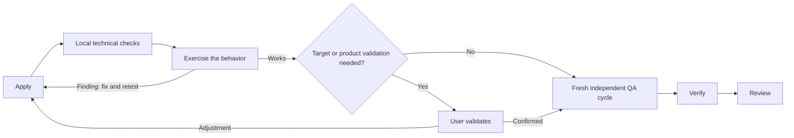

# Draft Proposal: Streamline Orchestrator Ownership and Acceptance

## Proposal status

- **Change ID:** `streamline-orchestrator-ownership-and-acceptance`
- **Mode:** Interactive
- **Status:** Collaborative draft awaiting explicit human approval
- **Risk:** Medium overall; any directly required runtime-scheduler change enters the existing High-risk lane
- **Authoritative inputs:** the system owner's clarified decision and `exploration.md` at SHA-256 `3773b87cd3f4bd70ffcee299b61e21c0d1aff6ba146794f1ccfcebedc8ef4c1e`
- **Approval boundary:** Creating this draft does not approve it. Spec and Design remain blocked until the Orchestrator records explicit human approval.

## Problem and collaborative intent

Deck's critical “pure delegator” rule outweighs narrower guidance that already assigns bounded coordination work to the Orchestrator. This causes avoidable specialist calls for mechanical Git inspection, exact staging and commit work, deterministic reconciliation, and simple phase decisions. At the same time, Apply guidance blurs implementer-local checks with independent QA and can advance a candidate before Deck has actually exercised whether it works.

The system owner wants Deck to behave like an organic development team: the coordinator should own authorized mechanical coordination, implementers should build and test a working candidate, the user should validate in the real target environment when automation or product judgment is insufficient, and independent Verify and Review should judge the final candidate once rather than every discarded adjustment. This change proposes that behavior without expanding authority or adding workflow bureaucracy.

## Measurable outcomes

The change is successful when future Spec, Design, implementation, and independent evidence demonstrate that:

1. The Orchestrator directly completes bounded, deterministic, already-authorized coordinator work without delegating merely because a specialist exists.
2. Product/system implementation, specialist phase artifacts, heavy execution, protected-risk judgment, and independent Verify/Review remain specialist-owned.
3. After Apply-local technical checks, Deck proportionately exercises the changed behavior through practical functional, smoke, integration, browser, CLI, or equivalent testing before independent QA.
4. Pre-QA findings return to Apply for fix and retest without launching independent Verify/Review for each discarded candidate; Automatic execution can continue when automation establishes behavior.
5. The user confirms behavior only where target-environment evidence or product acceptance is needed; that confirmation selects a candidate and never substitutes for engineering QA.
6. A working candidate receives one fresh final independent Verify judgment and one fresh final independent Review judgment in its final QA cycle, preserving required staged/broad checks, risk floors, and freshness. Any later implementation change invalidates dependent evidence and requires a fresh cycle.
7. An explicit commit-only request performs bounded inspection, exact staging, staged-diff confirmation, and commit without automatically launching Verify/Review or implying acceptance, release readiness, or archive readiness.
8. When the user resolves a normal phase decision, the Orchestrator records it and advances without re-delegating the completed Explorer judgment.
9. Default compact and legacy content surfaces express the same ownership and testing model, with focused regression coverage and no weakened authorization or safety control.

## Bounded scope

### Required work

- Supersede the pure-delegator semantics of the existing critical Orchestrator invariant with a precedence-safe coordinator-ownership/specialist-judgment rule while preserving the invariant system's ordering and visibility.
- Align the canonical compact and legacy Orchestrator content, role skill surfaces, and composition tests so lower-priority wording cannot restore eager delegation.
- Align all Apply role guidance and tests around three distinct concerns: minimal implementer-local technical proof, an actual pre-QA functional testing loop, and later independent QA.
- Define proportional automated functional exercise and conditional real-target/user validation as normal implementation work, not a new phase, route, artifact, or approval checkpoint.
- Define commit-only handling, unrelated-WIP protection, risk-relevant secret/safety checks, truthful reporting of unverified snapshots, and unchanged destructive-Git confirmation.
- Let the Orchestrator directly record a user's resolution of a phase decision and continue the approved lifecycle.
- Preserve existing runtime authorization, evidence freshness, staged/broad validation, independent identities, centralized registry writes, conflict stops, and protected-risk floors.
- Update runtime scheduling only if current evidence is revalidated and proves that a supported execution path must change for this behavior to remain coherent.

### Exclusions

- No new canonical SDD phase, user-facing fast route, global status, acceptance artifact, or additional approval checkpoint.
- No transfer of behavior-changing implementation, domain judgment, security/migration/public-API judgment, or independent QA to the Orchestrator.
- No automatic commit, broad staging, amend, push, release, archive, or destructive Git action inferred from a commit-only request.
- No waiver, merge, or reuse of Apply, Verify, or Review judgments; no weakening of Full-SDD, high/critical-risk, security, authorization, migration, data-loss, broad-check, freshness, or hard-stop rules.
- No general scheduler/control-plane redesign, adapter expansion without evidence, direct generated-output edits, registry-schema redesign, or historical artifact rewrite.
- No changes to `runner-capability-standardization` or unrelated work.

## Ownership boundary

| Coordinator-owned mechanical operations | Specialist-owned implementation or judgment |
|---|---|
| Triage, synthesis, user questions, and recording resolved phase decisions | Behavior-changing source/test implementation and specialist phase artifacts |
| Bounded `git status`, `git diff`, and `git log` inspection | Broad investigation, heavy tests/builds, and domain implementation |
| Exact staging and an explicitly requested commit after staged-diff review | Security, migration, data-loss, public-interface, or architecture judgment |
| Deterministic existence, count, digest, metadata, and centralized registry-intent reconciliation | Independent Verify and Review, including evidence whose value depends on role independence |

Direct ownership applies only when the operation is bounded, mechanical, non-destructive, inside explicit user and runner authorization, and needs no specialist implementation or independent judgment. Ambiguous scope, unrelated WIP, a protected risk, or a safety boundary causes clarification, delegation, or a hard stop rather than broader coordinator authority.

## Implementation testing and independent QA

1. **Apply-local technical proof:** the implementer runs the smallest relevant checks needed to establish technical coherence, such as changed-unit tests or focused diagnostics. This evidence is not independent.
2. **Pre-QA functional loop:** Deck actually exercises the behavior with proportionate automation. Findings return to Apply, then the implementation is retested until it works. The user validates in the real target environment only when automation cannot establish behavior or product acceptance is required.
3. **Independent final QA:** only the working candidate proceeds to fresh independent Verify and Review under the existing staged/broad and risk-floor contracts. Local checks, automated functional success, and user confirmation cannot satisfy these judgments.

The loop is normal implementation work, not a conversational pause or lifecycle gate. In Automatic mode, it pauses for the user only when target-environment/product validation or an existing hard stop requires human input.

This diagram is supplemental and non-authoritative; the text and existing mandatory staged/broad contracts govern exact sequencing.

## High-level approach, tradeoffs, and compatibility

- Change the precedence-setting invariant and canonical content at their existing core composition boundary, then prove parity across default compact and legacy surfaces. Prompt/content enforcement is sufficient for coordinator ownership and human interaction unless Design finds a real runtime bypass.
- Keep the ownership rule qualitative—mechanical versus implementation/judgment—rather than relying on a gameable file-count threshold. This requires clearer examples and tests but avoids treating a risky one-file change as “simple.”
- Spend proportionate testing effort inside Apply before independent QA. This avoids repeated independent cycles while accepting that implementer-run evidence is not independent and must be clearly labeled.
- Permit an explicit commit to preserve a snapshot without manufacturing a QA lifecycle. The tradeoff is that repository history may contain unverified work, so the result must say so plainly.
- Preserve existing phase/state/event readers and stored evidence by adding no new canonical state. Existing summaries and artifacts may support session recovery, but no new approval artifact is authorized.
- Explicitly supersede only the pure-delegator requirement from `persistent-orchestrator-invariants`; preserve invariant identity/composition compatibility unless Spec and Design justify a versioned successor.
- Treat core content as canonical and generated/materialized runner outputs as downstream products; never hand-edit generated files.

### Legacy scheduler boundary

The legacy role scheduler and the authoritative convergence path currently disagree about Review versus broad-check ordering. This change includes a narrow reconciliation **only if** Design revalidates that the legacy path is supported and directly prevents coherent implementation of the approved pre-QA/final-QA behavior. If it is compatibility-only or not production-reachable, it remains untouched and must be recorded as a separate scheduler-consistency follow-up. This condition does not authorize a broader scheduler refactor or any change to mandatory broad checks.

## Dependencies

- The completed exploration and the system owner's clarified implementation-testing decision, which supersedes the exploration's earlier conversational-checkpoint wording.
- The archived `persistent-orchestrator-invariants` decision for invariant composition, whose pure-delegator rule this change must explicitly supersede rather than silently contradict.
- The archived `deterministic-apply-verify-review-flow`, `bounded-developer-team-repair-loops`, and `exploration-lifecycle-states` decisions for independent judgment, freshness, bounded repair, centralized registry handling, and anti-bureaucracy boundaries.
- Current canonical Developer Team content/composition tests, Git safety policy, and runtime freshness/staged-verification/convergence contracts identified in `exploration.md`.
- Central Orchestrator validation and atomic serialization of phase registry intents. There is no dependency on `runner-capability-standardization`.

## Risks and mitigations

| Risk | Mitigation |
|---|---|
| “Mechanical” becomes a loophole for coordinator implementation | Define ownership by behavior change and judgment, retain explicit authorization/risk stops, and test positive and negative boundaries. |
| Reduced Apply checks hand an obviously broken candidate forward | Require technical proof plus actual proportionate functional exercise before independent QA. |
| User confirmation is mistaken for Verify/Review approval | Label it as candidate selection only and preserve fresh independent judgments. |
| Compact, legacy, and Apply surfaces drift | Change the precedence-setting source and require cross-profile/content parity tests. |
| A commit snapshot is mistaken for completed work | Report absent QA explicitly and apply completion gates only when completion is requested. |
| A supported scheduler bypasses the pre-QA loop or disagrees on final order | Revalidate production reachability in Design; reconcile narrowly only when directly required, otherwise create the bounded follow-up. |
| Session recovery loses candidate context | Reuse existing authoritative summaries/evidence where sufficient; stop for clarification rather than inventing a new phase or approval artifact. |

## Rollback

Rollback will use a normal auditable revert or forward-fix of the coherent content/test slice, and of any separately justified runtime slice, restoring the prior delegation and Apply choreography while retaining all OpenSpec history and recorded evidence. If a regression can widen authority, bypass QA, mis-stage work, or violate freshness, progression must stop before further modification or registry commit.

Rollback must not rewrite registry history, delete artifacts, discard unrelated WIP, touch `runner-capability-standardization`, or use destructive Git operations without the permanent informed-confirmation flow. Existing readers and previously recorded evidence must remain valid.

## Truly unresolved decisions

No unresolved product-scope decision blocks review of this draft. After approval, Spec and Design must resolve only these bounded technical choices without expanding scope:

1. Whether to revise `INV-002` in place or introduce an explicitly superseding version while preserving composition compatibility.
2. The smallest task-type-specific technical and functional test expectations that prove a candidate works without recreating independent QA inside Apply.
3. Which existing summary/evidence surface is sufficient for recovery of an in-progress testing loop without creating a new approval artifact.
4. Whether revalidated production reachability makes the legacy scheduler reconciliation directly necessary; otherwise the inconsistency becomes the separate follow-up defined above.

## Approval question

**As the client, system owner, domain authority, and active stakeholder, do you approve this proposal's coordinator/specialist ownership boundary, normal pre-QA implementation testing loop, conditional target-environment validation, single fresh final independent QA cycle, commit-only semantics, scope and exclusions, Medium risk classification, compatibility boundary, rollback, and downstream technical decisions so the Orchestrator may record approval and begin Spec and Design?**

Please respond with explicit approval or requested revisions. Draft completion alone is not approval.

## Handoff readiness

After explicit approval is recorded, Spec and Design can proceed in parallel from this shared boundary. Spec should formalize observable ownership, testing, QA, Git, freshness, and safety behavior; Design should select the smallest supported content/runtime surfaces. Implementation remains unauthorized until later lifecycle artifacts approve exact tasks and targets.
