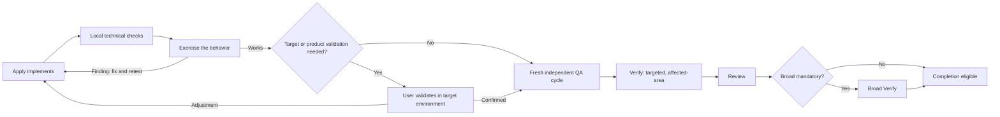

# Spec: Streamline Orchestrator Ownership and Acceptance

## Metadata

- **Change ID:** `streamline-orchestrator-ownership-and-acceptance`
- **Mode:** Interactive
- **Risk:** Medium overall; any directly required runtime-scheduler change enters the existing High-risk lane
- **Approval decision digest:** `sha256:57251395927e12e35801139b0b59a14b63940b74b6b28a064dac4f45fd2f9b9c`
- **Proposal digest:** `sha256:751e6d83fbf71f100d15812f4faa8f8b4d703ec34db3df88da270f55aae419d6`
- **Scope authority:** This Spec defines WHAT observable behavior MUST hold. It does not select data structures, file layouts, public interfaces, libraries, or task routing. Exact contract shapes, state transitions, and source targets belong to Design and Tasks.
- **Excluded target:** `runner-capability-standardization`

## Conventions

- Requirement IDs are stable and of the form `REQ-SOAA-{area}-NN`.
- RFC 2119 keywords are used with their normative meaning: **MUST** (absolute), **SHALL** (absolute), **SHOULD** (strong recommendation), **MAY** (optional).
- "Coordinator" means the Orchestrator role instance.
- "Specialist" means any non-Orchestrator Developer Team role (Explorer, Proposal, Spec, Design, Tasks, Apply, Verify, Review, Archive).
- "Candidate" means the implementation state produced by one Apply pass.
- "Acceptance" means the user confirms a candidate solves the intended problem from their perspective; it is NOT an engineering-quality or compliance verdict.

## Requirement areas

Areas: OWN (Ownership boundary), GIT (Direct Git operations), CMT (Commit-only semantics), TST (Pre-QA implementation testing), FND (Findings return to Apply), QA (Fresh final independent QA), NOB (No new bureaucracy), REC (Direct phase-decision recording), SAF (Safety floors and authorization), CMP (Compatibility, modes, interruption, and failure).

Cross-area dependency: QA depends on TST and FND; CMT depends on GIT and SAF; CMP depends on OWN, QA, and SAF; NOB depends on all areas.

---

## OWN — Ownership boundary

> Supersedes the pure-delegator semantics of `REQ-OIS-002` (item 2) from `persistent-orchestrator-invariants`. The invariant identity, schema, ordering, injection, and verification requirements (REQ-OIS-001, REQ-OIS-003 through REQ-OIS-012) are preserved.

### REQ-SOAA-OWN-01: Coordinator performs bounded mechanical operations directly

The Coordinator MUST perform coordination-owned operations directly when the operation is bounded, mechanical, non-destructive, already authorized, and requires neither specialist implementation nor independent judgment. The Coordinator MUST delegate when the work changes product/system behavior, creates a specialist-owned phase artifact, requires domain implementation, requires independent Verify/Review judgment, runs heavy execution, or crosses an explicit risk/scope floor.

- **Priority:** MUST
- **Supersedes:** The pure-delegator condition of `REQ-OIS-002` (item 2) from `persistent-orchestrator-invariants`

#### Scenario: Bounded Git inspection is direct

- GIVEN an authorized change in progress
- WHEN the Coordinator needs to inspect repository state for coordination purposes
- THEN `git status`, `git diff`, and `git log` (bounded read-only inspection) are performed directly by the Coordinator without delegating to a Specialist

#### Scenario: Deterministic registry reconciliation is direct

- GIVEN parallel Specialists have returned ordered `RegistryIntentV1` values
- WHEN the Coordinator validates existence, count, digest, and metadata
- THEN the Coordinator performs deterministic reconciliation and centralized registry-intent commitment directly

#### Scenario: Behavior-changing implementation is delegated

- GIVEN a task that modifies source or test behavior
- WHEN the Coordinator evaluates ownership
- THEN the task is delegated to the appropriate Apply Specialist

#### Scenario: Independent judgment is delegated

- GIVEN a need for Verify or Review evidence
- WHEN the Coordinator evaluates ownership
- THEN the judgment is delegated to an independent Verify or Review Specialist; the Coordinator does not produce verification or review evidence directly

#### Scenario: Protected-risk judgment is delegated

- GIVEN a change touching security, migration, data-loss, public-API, or architecture concerns
- WHEN the Coordinator evaluates ownership
- THEN the judgment is delegated to the appropriate Specialist; the Coordinator does not make protected-risk determinations

### REQ-SOAA-OWN-02: Ownership rule is qualitative, not numeric

The ownership boundary MUST be defined by whether the operation changes behavior or requires independent judgment, NOT by a file-count or line-count threshold. A single-file change that alters product behavior remains Specialist-owned. A multi-file mechanical reconciliation remains Coordinator-owned.

- **Priority:** MUST

#### Scenario: Single behavior file is delegated

- GIVEN a one-file change that alters product behavior
- WHEN ownership is evaluated
- THEN the change is delegated to Apply despite the small file count

#### Scenario: Multi-file mechanical registry reconciliation is direct

- GIVEN a deterministic registry reconciliation across multiple intent files
- WHEN ownership is evaluated
- THEN the reconciliation is performed directly by the Coordinator because it is mechanical and requires no specialist judgment

### REQ-SOAA-OWN-03: Ambiguous scope causes clarification or delegation

When ownership is ambiguous, the Coordinator MUST ask the user for clarification or delegate to a Specialist rather than broadening its own authority. Ambiguity MUST NOT be resolved in favor of direct Coordinator execution.

- **Priority:** MUST

#### Scenario: Ambiguous operation is clarified or delegated

- GIVEN an operation where it is unclear whether it requires specialist judgment
- WHEN ownership is evaluated
- THEN the Coordinator asks the user or delegates; it does not assume direct ownership

---

## GIT — Direct Git operations

### REQ-SOAA-GIT-01: Coordinator performs bounded Git inspection directly

The Coordinator MUST directly run bounded `git status`, `git diff`, and `git log` inspection to support coordination decisions such as confirming intended staging scope, identifying unrelated WIP, and preparing commit messages.

- **Priority:** MUST

#### Scenario: Status inspection before staging

- GIVEN an explicit commit request
- WHEN the Coordinator prepares to stage files
- THEN it runs `git status` directly to identify modified and untracked files

#### Scenario: Diff inspection before commit

- GIVEN staged files ready for commit
- WHEN the Coordinator needs to confirm the staged diff
- THEN it runs `git diff --cached` directly to verify the intended changes

### REQ-SOAA-GIT-02: Coordinator performs exact staging directly

The Coordinator MUST directly stage only the explicitly intended paths. Staging MUST NOT include unrelated WIP (modified or untracked files not part of the intended commit).

- **Priority:** MUST

#### Scenario: Only intended paths are staged

- GIVEN a commit request for specific files
- WHEN the Coordinator stages changes
- THEN only the explicitly intended paths are staged and unrelated WIP is excluded

#### Scenario: Unrelated WIP is preserved

- GIVEN a working tree containing both intended changes and unrelated WIP
- WHEN the Coordinator stages for commit
- THEN unrelated modified and untracked files remain undisturbed in the working tree

### REQ-SOAA-GIT-03: Destructive Git operations require canonical confirmation

No aspect of this change weakens the permanent Git-discard protection flow. Destructive operations (`git reset --hard`, `git clean -fd`, `git restore`, `git checkout --`, `git stash drop`, `git stash clear`, etc.) MUST still require: (1) an explanation of irreversible effect, (2) a new user message, (3) the exact command repeated by the user, and (4) execution only after explicit confirmation.

- **Priority:** MUST

#### Scenario: Destructive command requires new user message

- GIVEN a request that includes a destructive Git operation
- WHEN the Coordinator evaluates the request
- THEN it explains the irreversible effect and requires a new user message containing the exact command before execution

#### Scenario: Commit-only flow does not trigger destructive operations

- GIVEN an explicit commit-only request
- WHEN the Coordinator executes the commit
- THEN no destructive Git operation is performed; only safe commands (`git add`, `git commit`) are used

---

## CMT — Commit-only semantics

### REQ-SOAA-CMT-01: Commit-only request performs bounded Git preparation and commit

An explicit commit-only request ("commit these changes", "commit this", etc.) MUST be treated as a request to record repository state. The Coordinator MUST directly: (1) inspect status/diff/log, (2) identify unrelated WIP, (3) confirm the intended path set if ambiguous, (4) stage only the intended paths, (5) verify the staged diff, and (6) commit with the requested or repository-consistent message.

- **Priority:** MUST

#### Scenario: Commit-only request completes with bounded operations

- GIVEN an explicit commit request with an unambiguous path set
- WHEN the Coordinator processes the request
- THEN it inspects, stages, verifies the staged diff, and commits without delegating to a Specialist

#### Scenario: Ambiguous commit scope asks for clarification

- GIVEN an explicit commit request where the intended path set is ambiguous due to unrelated WIP
- WHEN the Coordinator inspects the working tree
- THEN it asks the user to confirm the intended paths before staging

### REQ-SOAA-CMT-02: Commit-only request does not automatically invoke Verify or Review

A commit-only request MUST NOT automatically launch independent Verify or Review. The commit operation is a mechanical snapshot, not a quality gate. Verify and Review are launched only when the SDD lifecycle or a completion claim requires them.

- **Priority:** MUST

#### Scenario: Commit does not trigger Verify

- GIVEN an explicit commit-only request
- WHEN the commit completes
- THEN no independent Verify is launched as a consequence of the commit

#### Scenario: Commit does not trigger Review

- GIVEN an explicit commit-only request
- WHEN the commit completes
- THEN no independent Review is launched as a consequence of the commit

### REQ-SOAA-CMT-03: Commit-only does not imply QA, acceptance, merge, release, or deployment readiness

A commit-only result MUST NOT claim or imply that the committed work is verified, reviewed, accepted, releasable, archive-ready, or deployment-ready. The result MUST state plainly when independent QA has not been performed.

- **Priority:** MUST

#### Scenario: Commit result reports absent QA

- GIVEN a commit-only request that completes successfully
- WHEN the Coordinator reports the result
- THEN the report states that independent QA was not performed and the commit is a repository snapshot only

#### Scenario: Commit does not satisfy completion gates

- GIVEN a commit-only request that completes
- WHEN SDD completion is evaluated
- THEN the commit does not satisfy Verify, Review, broad, Archive, or registry commit-ready evidence requirements

### REQ-SOAA-CMT-04: Commit-plus-completion requires mandatory gates

When a commit request also asks to complete, accept, archive, or release the SDD change, the existing mandatory gates (Verify, Review, broad, registry, authorization) still apply. The commit operation is mechanical; the completion claim triggers the required quality lifecycle.

- **Priority:** MUST

#### Scenario: Commit plus archive request runs full gates

- GIVEN a request to commit and archive the SDD change
- WHEN the Coordinator processes the request
- THEN the commit is performed mechanically and the archive claim requires existing mandatory Verify/Review/broad/registry gates

---

## TST — Pre-QA implementation testing

### REQ-SOAA-TST-01: Apply-local technical proof

After implementing authorized changes, the Apply Specialist MUST run the smallest relevant checks needed to establish technical coherence. These checks are implementation-local proof and are NOT independent verification evidence. Examples include changed-unit tests, focused diagnostics, type checks, or formatting checks directly relevant to the changed code.

- **Priority:** MUST

#### Scenario: Apply runs changed-unit tests

- GIVEN Apply has modified source code
- WHEN Apply completes the implementation
- THEN it runs the unit tests directly covering the changed code and records the result as local proof

#### Scenario: Apply-local proof is labeled as non-independent

- GIVEN Apply has completed local checks
- WHEN the result is reported
- THEN the evidence is labeled as Apply-local and not as independent Verify evidence

### REQ-SOAA-TST-02: Pre-QA functional exercise

After Apply-local technical proof, the implementation MUST be exercised with proportionate functional testing before independent QA. The exercise uses the smallest effective method: automated smoke, integration, browser, CLI, or equivalent tests appropriate to the changed behavior. This is normal implementation work, not a new lifecycle phase.

- **Priority:** MUST

#### Scenario: Functional exercise uses proportionate automation

- GIVEN an Apply candidate that passed local technical checks
- WHEN the pre-QA functional exercise runs
- THEN the behavior is exercised using the smallest effective automated method (e.g., running a relevant test suite, invoking a CLI command, loading a page)

#### Scenario: Functional exercise is implementation work

- GIVEN the pre-QA functional exercise is running
- WHEN the lifecycle state is inspected
- THEN no new canonical phase or lifecycle gate exists; the exercise is part of the Apply phase

### REQ-SOAA-TST-03: Correction and retest loop

When the functional exercise discovers a finding, the implementation returns to Apply for correction. The corrected candidate is retested until the behavior works. This loop is normal implementation work and does not launch independent Verify/Review for each discarded candidate.

- **Priority:** MUST

#### Scenario: Finding returns to Apply

- GIVEN a functional exercise that discovers a behavioral finding
- WHEN the finding is processed
- THEN the implementation returns to Apply with the finding context; no independent Verify/Review is launched for the failed candidate

#### Scenario: Corrected candidate is retested

- GIVEN Apply has corrected an implementation based on a functional finding
- WHEN the correction completes
- THEN the functional exercise retests the corrected candidate

### REQ-SOAA-TST-04: Conditional user validation in target environment

When automation cannot establish whether the behavior is correct, or when product judgment is needed, the user MUST validate the candidate in the real target environment. User validation selects a candidate and does NOT substitute for engineering QA (independent Verify/Review).

- **Priority:** MUST

#### Scenario: User validates when automation is insufficient

- GIVEN a candidate where automated functional exercise cannot determine correctness
- WHEN the pre-QA checkpoint is reached
- THEN the user is asked to validate in the target environment

#### Scenario: User validation is candidate selection, not QA

- GIVEN the user has validated a candidate in the target environment
- WHEN the result is recorded
- THEN the validation is labeled as candidate selection and does not satisfy independent Verify/Review evidence

### REQ-SOAA-TST-05: Automatic mode functional exercise behavior

In Automatic mode, the pre-QA functional exercise and correction loop continue automatically when automation can establish behavior. The loop pauses for user input only when target-environment validation, product acceptance, or an existing hard stop requires human input.

- **Priority:** MUST

#### Scenario: Automatic mode continues through automated exercise

- GIVEN Automatic mode and a functional exercise that can be fully automated
- WHEN the exercise runs
- THEN the loop continues without pausing for user input

#### Scenario: Automatic mode pauses for target validation

- GIVEN Automatic mode and a candidate requiring target-environment validation
- WHEN the pre-QA checkpoint is reached
- THEN execution pauses for user validation

---

## FND — Findings return to Apply

### REQ-SOAA-FND-01: Pre-QA findings return to Apply without independent Verify/Review

Findings discovered during the pre-QA functional exercise or user validation MUST return to Apply for correction. Independent Verify and Review are NOT launched for each discarded candidate during the correction loop.

- **Priority:** MUST

#### Scenario: Functional finding does not trigger Verify

- GIVEN a functional exercise finding that requires an Apply correction
- WHEN the finding is processed
- THEN the candidate returns to Apply and no independent Verify is launched

#### Scenario: User-requested adjustment does not trigger Verify/Review

- GIVEN a user who requests an adjustment to the candidate
- WHEN the adjustment is processed
- THEN the candidate returns to Apply and no independent Verify or Review is launched for the discarded candidate

### REQ-SOAA-FND-02: Each adjustment creates a new candidate generation

Each modifying adjustment during the pre-QA loop creates a new candidate generation. Any prior functional-exercise evidence for the discarded candidate is invalidated. Freshness rules apply: a later modification invalidates stale evidence.

- **Priority:** MUST

#### Scenario: Adjustment invalidates prior exercise evidence

- GIVEN a candidate that passed functional exercise and a user-requested adjustment
- WHEN Apply makes the adjustment
- THEN a new candidate generation is created and prior functional-exercise evidence is invalidated

---

## QA — Fresh final independent QA

### REQ-SOAA-QA-01: Exactly one fresh final independent QA sequence for the working candidate

Only the working candidate (the one that passes functional exercise and, where needed, user validation) proceeds to independent final QA. The QA sequence consists of exactly one fresh independent Verify judgment and one fresh final independent Review judgment.

- **Priority:** MUST

#### Scenario: Working candidate reaches independent QA

- GIVEN a candidate that passed functional exercise and user validation (where needed)
- WHEN the pre-QA loop completes
- THEN exactly one fresh independent Verify and one fresh independent Review are launched

#### Scenario: Discarded candidates do not reach independent QA

- GIVEN multiple candidate generations during the pre-QA correction loop
- WHEN the final candidate reaches independent QA
- THEN only the final working candidate is judged; prior discarded candidates are not independently verified or reviewed

### REQ-SOAA-QA-02: Staged ordering is preserved

The independent QA sequence MUST preserve the existing staged ordering: targeted Verify → affected-area Verify → Review → required broad Verify. Targeted MUST precede affected-area; Review MUST follow scoped verification; broad MUST follow Review when mandatory.

- **Priority:** MUST

#### Scenario: Targeted precedes affected-area

- GIVEN the final QA sequence begins
- WHEN Verify runs
- THEN targeted verification runs first, followed by affected-area verification

#### Scenario: Review follows scoped verification

- GIVEN targeted and affected-area verification pass
- WHEN Review scheduling is evaluated
- THEN Review is scheduled

#### Scenario: Broad follows Review when mandatory

- GIVEN Review completes with no unresolved blocking findings and a mandatory broad floor applies
- WHEN the lifecycle selects the next stage
- THEN broad verification runs

### REQ-SOAA-QA-03: Freshness — later modification invalidates evidence

Any modification that occurs after independent QA evidence has been captured MUST invalidate that evidence. A fresh QA cycle is required before completion. This applies to Verify evidence, Review evidence, and broad evidence.

- **Priority:** MUST

#### Scenario: Post-Verify modification invalidates Verify evidence

- GIVEN Verify evidence that passed and a later modification
- WHEN the modification is applied
- THEN the Verify evidence is invalidated and a fresh Verify is required

#### Scenario: Post-Review modification invalidates Review evidence

- GIVEN Review evidence that passed and a later modification
- WHEN the modification is applied
- THEN the Review evidence is invalidated and a fresh Review is required

### REQ-SOAA-QA-04: User acceptance does not substitute for independent QA

User acceptance of a candidate (confirming functional correctness) MUST NOT satisfy Verify, Review, broad, Archive, or registry commit-ready evidence. Independent QA evidence is produced by independent role instances with distinct identities.

- **Priority:** MUST

#### Scenario: User acceptance does not satisfy Verify

- GIVEN a user who accepted a candidate as functionally correct
- WHEN Verify evidence requirements are evaluated
- THEN user acceptance does not count as Verify evidence; an independent Verify must run

#### Scenario: User acceptance does not satisfy Review

- GIVEN a user who accepted a candidate
- WHEN Review evidence requirements are evaluated
- THEN user acceptance does not count as Review evidence; an independent Review must run

---

## NOB — No new bureaucracy

### REQ-SOAA-NOB-01: No new canonical SDD phase

This change MUST NOT introduce a new canonical SDD phase. The pre-QA functional exercise, correction loop, and user validation are phase-internal orchestration within the existing Apply phase, not a new phase.

- **Priority:** MUST

#### Scenario: No new phase in lifecycle

- GIVEN the change is implemented
- WHEN the canonical SDD phase list is inspected
- THEN no new phase has been added; the pre-QA loop is internal to Apply

### REQ-SOAA-NOB-02: No new user-facing fast route

This change MUST NOT introduce a new user-facing fast route, global status, or shortcut that bypasses existing lifecycle requirements.

- **Priority:** MUST

#### Scenario: No fast route added

- GIVEN the change is implemented
- WHEN the available user-facing routes are inspected
- THEN no new fast route exists

### REQ-SOAA-NOB-03: No new acceptance artifact

This change MUST NOT introduce a new acceptance artifact, approval checkpoint, or bureaucratic gate. User acceptance is a conversational checkpoint, not a stored artifact.

- **Priority:** MUST

#### Scenario: No acceptance artifact created

- GIVEN a user acceptance event occurs
- WHEN the artifacts for the change are inspected
- THEN no new acceptance artifact file has been created; the acceptance is recorded in existing artifact surfaces or remains conversational

### REQ-SOAA-NOB-04: No generic numeric threshold for ownership

This change MUST NOT introduce a generic numeric threshold (file count, line count) as a primary ownership discriminator. The ownership rule is qualitative: mechanical versus implementation/judgment.

- **Priority:** MUST

#### Scenario: Ownership is not file-count-based

- GIVEN an operation that is mechanical but touches multiple files
- WHEN ownership is evaluated
- THEN the operation is Coordinator-owned based on its mechanical nature, not rejected based on file count

---

## REC — Direct phase-decision recording

### REQ-SOAA-REC-01: Orchestrator records user-resolved phase decisions directly

When the user resolves a normal phase decision (e.g., accepting a candidate, confirming functional correctness, choosing to proceed), the Orchestrator MUST record the decision and advance the lifecycle directly without re-delegating the completed investigation or decision to a Specialist.

- **Priority:** MUST

#### Scenario: User acceptance is recorded and lifecycle advances

- GIVEN a user who confirms a candidate is functionally correct
- WHEN the Orchestrator processes the confirmation
- THEN it records the acceptance and launches the independent QA sequence without re-delegating to Explorer or another Specialist

#### Scenario: Phase decision does not re-delegate completed work

- GIVEN a completed Explorer investigation with an actionable finding and a user decision to proceed
- WHEN the Orchestrator processes the decision
- THEN it records the decision and advances to the next lifecycle step without re-delegating the Explorer investigation

### REQ-SOAA-REC-02: Recovery uses existing summary surfaces

Session recovery for an in-progress testing loop MUST use existing authoritative summary and evidence surfaces. A new approval artifact or recovery-specific state is NOT created.

- **Priority:** MUST

#### Scenario: Session recovery reads existing artifacts

- GIVEN a session interruption during the pre-QA functional exercise
- WHEN the session resumes
- THEN the recovery uses existing `apply-progress.md`, state notes, or conversation summaries to determine the current candidate state

---

## SAF — Safety floors and authorization

### REQ-SOAA-SAF-01: Existing authorization boundaries are preserved

No aspect of this change weakens existing user modification authorization, immutable target scope, runner authorization, protected-risk floors, or blocked-target rules. Direct Coordinator ownership does not widen modification authority.

- **Priority:** MUST

#### Scenario: Coordinator ownership does not widen authority

- GIVEN a Coordinator-owned mechanical operation
- WHEN the operation is evaluated against authorization boundaries
- THEN the operation is limited to the existing authorization scope; no additional authority is granted by the ownership rule

### REQ-SOAA-SAF-02: Security, data-loss, migration, and public-API floors are preserved

Security, data-loss, migration, destructive, public-API, and architecture judgments MUST remain Specialist-owned. No Coordinator direct operation may override, bypass, or substitute for these protected-risk judgments.

- **Priority:** MUST

#### Scenario: Security judgment remains Specialist-owned

- GIVEN a change touching security-relevant behavior
- WHEN ownership is evaluated
- THEN the security judgment is delegated to a Specialist; the Coordinator does not make the determination

### REQ-SOAA-SAF-03: Independent role identity and freshness are preserved

Apply, Verify, and Review MUST remain independent role instances with distinct identities. Shared evidence MUST NOT transfer agent identity, attempt summaries, or conclusions between roles. The existing freshness policy (`freshness-policy-v1`) is unchanged.

- **Priority:** MUST

#### Scenario: Verify identity is independent of Apply

- GIVEN a Verify invocation for a batch
- WHEN freshness policy validates the role result
- THEN the Verify instance identity is distinct from the Apply instance identity

#### Scenario: Stale evidence is rejected

- GIVEN a Verify result produced before a modification
- WHEN the stale result is presented after the modification
- THEN the stale result is rejected and fresh verification is required

### REQ-SOAA-SAF-04: Registry centralization is preserved

Specialists MUST NOT write `state.yaml` or `events.yaml` directly. The centralized Coordinator remains the sole writer of shared registry state and MUST stop on conflict or recovery-required outcomes.

- **Priority:** MUST

#### Scenario: Specialist emits intents only

- GIVEN a Specialist producing phase evidence
- WHEN registry coordination is evaluated
- THEN the Specialist emits ordered `RegistryIntentV1` values and writes no `state.yaml` or `events.yaml`

#### Scenario: Coordinator stops on conflict

- GIVEN two `RegistryIntentV1` values whose base-state digests conflict
- WHEN the Coordinator attempts serialized commit
- THEN commit stops and no shared state is written

### REQ-SOAA-SAF-05: Full-SDD and mandatory broad floors are preserved

No sequencing change introduced by this change MAY defer or weaken any mandatory broad check, Full-SDD floor, security floor, authorization check, or data-loss floor.

- **Priority:** MUST

#### Scenario: Full-SDD broad remains mandatory

- GIVEN a `full_sdd` lane change and an attempt to skip broad verification
- WHEN completion is evaluated
- THEN broad verification is required and cannot be skipped

### REQ-SOAA-SAF-06: Excluded scope hard stop is preserved

Any target intersection with `runner-capability-standardization` or another existing OpenSpec change MUST hard-stop. No repair, retry, or sequencing rule MAY widen this change into excluded scope.

- **Priority:** MUST

#### Scenario: Excluded target is stopped

- GIVEN a proposed target intersecting `runner-capability-standardization`
- WHEN the effect boundary validates the target
- THEN the operation is rejected with a hard-stop rationale

---

## CMP — Compatibility, modes, interruption, and failure

### REQ-SOAA-CMP-01: Interactive and Automatic mode behavior

In Interactive mode, the pre-QA functional exercise and user validation checkpoint are visible conversational steps. In Automatic mode, the exercise continues automatically when automation can establish behavior; it pauses for user input only when target-environment validation, product acceptance, or an existing hard stop requires human input.

- **Priority:** MUST

#### Scenario: Interactive mode shows checkpoint

- GIVEN Interactive mode and a candidate that passed Apply-local checks
- WHEN the pre-QA checkpoint is reached
- THEN the Orchestrator presents the functional result and asks whether the implementation is functionally correct

#### Scenario: Automatic mode pauses only when needed

- GIVEN Automatic mode and a candidate requiring target-environment validation
- WHEN the pre-QA checkpoint is reached
- THEN execution pauses for user input

### REQ-SOAA-CMP-02: Existing profile surfaces express the same model

Default compact, legacy, and expanded Orchestrator content surfaces MUST express the same ownership, testing, and QA model. No surface may contradict the ownership boundary, the pre-QA testing loop, the single final QA cycle, or the commit-only semantics defined by this spec.

- **Priority:** MUST

#### Scenario: Compact surface contains ownership rule

- GIVEN the default compact Orchestrator session prompt
- WHEN the content is inspected
- THEN it contains the coordinator-ownership/specialist-judgment rule and does not contain the pure-delegator rule

#### Scenario: Legacy surface does not contradict

- GIVEN the legacy Orchestrator content surface
- WHEN the content is inspected
- THEN it does not contradict the ownership boundary, testing model, or commit-only semantics

### REQ-SOAA-CMP-03: Session interruption and recovery

A session interruption during the pre-QA functional exercise loop MUST be recoverable using existing authoritative surfaces (apply-progress, state notes, conversation summaries). Recovery MUST NOT require a new approval artifact or canonical phase state.

- **Priority:** MUST

#### Scenario: Interruption during functional exercise

- GIVEN a session that is interrupted during the pre-QA functional exercise
- WHEN the session resumes
- THEN the recovery determines the current candidate state from existing surfaces and either continues the exercise or restarts it as needed

#### Scenario: Interruption during user validation

- GIVEN a session that is interrupted while awaiting user validation
- WHEN the session resumes
- THEN the recovery identifies the pending user validation and presents it again

### REQ-SOAA-CMP-04: Ambiguous commit scope with unrelated WIP

When a commit request is ambiguous due to unrelated WIP, the Coordinator MUST ask the user to confirm the intended paths. It MUST NOT infer the full staged set when unrelated modifications exist.

- **Priority:** MUST

#### Scenario: Unrelated WIP triggers clarification

- GIVEN a commit request and a working tree containing both intended changes and unrelated modifications
- WHEN the Coordinator inspects the working tree
- THEN it asks the user to confirm which paths should be committed

### REQ-SOAA-CMP-05: Testability boundaries

The pre-QA functional exercise MUST use the smallest effective automated method available. When no automated method can establish behavior (e.g., visual UI, manual product judgment), the exercise falls back to user validation. The exercise MUST NOT attempt to recreate independent Verify inside Apply.

- **Priority:** MUST

#### Scenario: Automated exercise when possible

- GIVEN a change where automated tests can verify the behavior
- WHEN the functional exercise runs
- THEN automated tests are used

#### Scenario: User validation when automation is insufficient

- GIVEN a change where no automated method can verify the behavior
- WHEN the functional exercise runs
- THEN user validation is requested

### REQ-SOAA-CMP-06: Failure behavior

If the pre-QA functional exercise or correction loop fails to produce a working candidate after exhausting the existing repair-loop budgets (per `bounded-developer-team-repair-loops`), the lifecycle MUST produce escalation or stop, not silent continuation.

- **Priority:** MUST

#### Scenario: Exhausted repair budget escalates

- GIVEN a pre-QA correction loop that has exhausted its repair budget
- WHEN the next correction attempt is evaluated
- THEN the lifecycle produces escalation or stop

### REQ-SOAA-CMP-07: Rollback preserves history

Rollback of this change MUST use a normal auditable revert or forward-fix. It MUST NOT rewrite registry history, delete artifacts, discard unrelated WIP, or use destructive Git operations without the canonical confirmation flow.

- **Priority:** MUST

#### Scenario: Rollback preserves prior evidence

- GIVEN a regression that triggers rollback
- WHEN rollback runs
- THEN prior artifacts, registry events, and provenance are preserved

---

## Self-audit

### Stated invariants

- Coordinator ownership is bounded to mechanical, non-destructive, already-authorized operations.
- Specialist ownership covers all behavior-changing implementation and independent judgment.
- Pre-QA testing is implementation work, not a new phase.
- Independent QA runs exactly once for the working candidate.
- Commit-only is a mechanical snapshot, not a quality gate.
- All existing safety, authorization, freshness, and registry floors are preserved.

### Boundaries

- This spec does not prescribe which files are modified, which content strings change, or how the invariant system is versioned.
- The legacy role-scheduler inconsistency (Review-after-broad vs Review-before-broad) is out of scope unless Design proves a production bypass requires reconciliation.

### Ambiguity

- The "smallest relevant checks" for Apply-local proof is intentionally qualitative; Design/Tasks must define task-type-specific minimums.
- The checkpoint surface for durable acceptance evidence (conversational vs minimal state recording) is deferred to Design.

### Risk signals

- The ownership rule could become a loophole if "mechanical" is interpreted too broadly; mitigated by the qualitative definition and explicit delegation for behavior-change and judgment.
- Reduced Apply checks could hand broken candidates forward; mitigated by requiring functional exercise before independent QA.

### Confidence

- High on ownership boundary, commit-only semantics, and safety-floor preservation.
- High on the pre-QA testing loop and single final QA cycle.
- Medium on whether prompt/content enforcement alone is sufficient for the acceptance checkpoint; Design must confirm no production scheduler bypass exists.

---

## Mermaid diagram: Implementation testing and QA flow

This diagram is supplemental and non-authoritative; the text and existing mandatory staged/broad contracts govern exact sequencing.

---

## Open questions for Design

These requirements intentionally do NOT decide the following; Design and Tasks MUST resolve them:

- **OQ-1:** Whether the acceptance checkpoint should be recorded minimally in `apply-progress.md` or an existing human-approval event, or remain conversational until final Verify starts. A new canonical phase is NOT recommended.
- **OQ-2:** The smallest task-type-specific technical and functional test expectations that prove a candidate works without recreating independent Verify inside Apply.
- **OQ-3:** Whether revalidated production reachability makes the legacy role-scheduler reconciliation (`scheduleExecutionRoleInvocationV1` Review-after-broad vs convergence Review-before-broad) directly necessary for this change; otherwise the inconsistency becomes a separate scheduler-consistency follow-up.
- **OQ-4:** Whether to revise `INV-002` in place (preserving ID and schema) or introduce an explicitly superseding version while preserving invariant composition compatibility.
- **OQ-5:** Which existing summary/evidence surface is sufficient for recovery of an in-progress testing loop without creating a new approval artifact.

---

## Compliance matrix

| REQ-ID | Scenario(s) | Status |
|---|---|---|
| REQ-SOAA-OWN-01 | Bounded Git inspection is direct; Deterministic registry reconciliation is direct; Behavior-changing implementation is delegated; Independent judgment is delegated; Protected-risk judgment is delegated | Defined |
| REQ-SOAA-OWN-02 | Single behavior file is delegated; Multi-file mechanical registry reconciliation is direct | Defined |
| REQ-SOAA-OWN-03 | Ambiguous operation is clarified or delegated | Defined |
| REQ-SOAA-GIT-01 | Status inspection before staging; Diff inspection before commit | Defined |
| REQ-SOAA-GIT-02 | Only intended paths are staged; Unrelated WIP is preserved | Defined |
| REQ-SOAA-GIT-03 | Destructive command requires new user message; Commit-only flow does not trigger destructive operations | Defined |
| REQ-SOAA-CMT-01 | Commit-only request completes with bounded operations; Ambiguous commit scope asks for clarification | Defined |
| REQ-SOAA-CMT-02 | Commit does not trigger Verify; Commit does not trigger Review | Defined |
| REQ-SOAA-CMT-03 | Commit result reports absent QA; Commit does not satisfy completion gates | Defined |
| REQ-SOAA-CMT-04 | Commit plus archive request runs full gates | Defined |
| REQ-SOAA-TST-01 | Apply runs changed-unit tests; Apply-local proof is labeled as non-independent | Defined |
| REQ-SOAA-TST-02 | Functional exercise uses proportionate automation; Functional exercise is implementation work | Defined |
| REQ-SOAA-TST-03 | Finding returns to Apply; Corrected candidate is retested | Defined |
| REQ-SOAA-TST-04 | User validates when automation is insufficient; User validation is candidate selection, not QA | Defined |
| REQ-SOAA-TST-05 | Automatic mode continues through automated exercise; Automatic mode pauses for target validation | Defined |
| REQ-SOAA-FND-01 | Functional finding does not trigger Verify; User-requested adjustment does not trigger Verify/Review | Defined |
| REQ-SOAA-FND-02 | Adjustment invalidates prior exercise evidence | Defined |
| REQ-SOAA-QA-01 | Working candidate reaches independent QA; Discarded candidates do not reach independent QA | Defined |
| REQ-SOAA-QA-02 | Targeted precedes affected-area; Review follows scoped verification; Broad follows Review when mandatory | Defined |
| REQ-SOAA-QA-03 | Post-Verify modification invalidates Verify evidence; Post-Review modification invalidates Review evidence | Defined |
| REQ-SOAA-QA-04 | User acceptance does not satisfy Verify; User acceptance does not satisfy Review | Defined |
| REQ-SOAA-NOB-01 | No new phase in lifecycle | Defined |
| REQ-SOAA-NOB-02 | No fast route added | Defined |
| REQ-SOAA-NOB-03 | No acceptance artifact created | Defined |
| REQ-SOAA-NOB-04 | Ownership is not file-count-based | Defined |
| REQ-SOAA-REC-01 | User acceptance is recorded and lifecycle advances; Phase decision does not re-delegate completed work | Defined |
| REQ-SOAA-REC-02 | Session recovery reads existing artifacts | Defined |
| REQ-SOAA-SAF-01 | Coordinator ownership does not widen authority | Defined |
| REQ-SOAA-SAF-02 | Security judgment remains Specialist-owned | Defined |
| REQ-SOAA-SAF-03 | Verify identity is independent of Apply; Stale evidence is rejected | Defined |
| REQ-SOAA-SAF-04 | Specialist emits intents only; Coordinator stops on conflict | Defined |
| REQ-SOAA-SAF-05 | Full-SDD broad remains mandatory | Defined |
| REQ-SOAA-SAF-06 | Excluded target is stopped | Defined |
| REQ-SOAA-CMP-01 | Interactive mode shows checkpoint; Automatic mode pauses only when needed | Defined |
| REQ-SOAA-CMP-02 | Compact surface contains ownership rule; Legacy surface does not contradict | Defined |
| REQ-SOAA-CMP-03 | Interruption during functional exercise; Interruption during user validation | Defined |
| REQ-SOAA-CMP-04 | Unrelated WIP triggers clarification | Defined |
| REQ-SOAA-CMP-05 | Automated exercise when possible; User validation when automation is insufficient | Defined |
| REQ-SOAA-CMP-06 | Exhausted repair budget escalates | Defined |
| REQ-SOAA-CMP-07 | Rollback preserves prior evidence | Defined |

---

## Spec phase result data

- **Status:** `completed`
- **Recommended next action:** Design may proceed in parallel from this shared boundary. Spec does not authorize implementation.
- **Artifact:** `openspec/changes/streamline-orchestrator-ownership-and-acceptance/spec.md`
- **Requirements:** 10 areas, 40 requirements (OWN: 3, GIT: 3, CMT: 4, TST: 5, FND: 2, QA: 4, NOB: 4, REC: 2, SAF: 6, CMP: 7).
- **Scenarios:** 69 Given/When/Then scenarios total.
- **Key IDs:** OWN-01..03, GIT-01..03, CMT-01..04, TST-01..05, FND-01..02, QA-01..04, NOB-01..04, REC-01..02, SAF-01..06, CMP-01..07.
- **Supersedes:** The pure-delegator condition of `REQ-OIS-002` (item 2) from `persistent-orchestrator-invariants`. All other invariant requirements (schema, ordering, injection, verification) are preserved.
- **Dependencies (OFFICIAL CONTEXT):**
  - `openspec/changes/streamline-orchestrator-ownership-and-acceptance/proposal.md` (approved intent and scope)
  - `openspec/changes/streamline-orchestrator-ownership-and-acceptance/exploration.md` (validated gaps, options, and evidence)
  - `openspec/archive/persistent-orchestrator-invariants/spec.md` (invariant composition, REQ-OIS-001 through REQ-OIS-012)
  - `openspec/archive/deterministic-apply-verify-review-flow/spec.md` (independent roles, staged verification, freshness, registry, safety floors)
  - `openspec/archive/bounded-developer-team-repair-loops/spec.md` (repair budgets, staged verification, manifest handoff)
  - `openspec/archive/exploration-lifecycle-states/spec.md` (anti-bureaucracy precedent, no new canonical phase)
  - `openspec/specs/adaptive-quality-control/spec.md` (loop breaker, risk scoring)
  - `openspec/specs/artifact-state-contracts/spec.md` (structured updates, single-writer, stale recovery)
  - `openspec/specs/runner-orchestration-resilience/spec.md` (transport classification, budgets, capability-aware verification)
  - Current runtime contracts (evidence only, not authorization): `packages/core/src/teams/developer/orchestrator-content.ts`, `orchestrator-invariants.ts`, `content-registry.ts`, `git-safety.ts`, `apply-*-content.ts`; `packages/sdd-runtime/src/contracts/execution-convergence.ts`, `freshness-policy.ts`, `staged-verification.ts`, `execution-control-plane.ts`.
- **Dependencies not used:** `runner-capability-standardization` (explicitly excluded).
- **Open questions carried to Design:** OQ-1 through OQ-5 (listed above). They are constrained by spec requirements but not decided at the requirement level.
- **Scope preservation ensured:** This Spec does not design implementation structures beyond requirement-level behavior; it does not select file layouts, public interfaces, libraries, or task routing; it preserves mandatory broad, Full-SDD, security, authorization, and data-loss floors; and it does not lower risk, authority, or destructive-operation controls. It does not modify sources, tests, generated files, `state.yaml`, `events.yaml`, existing changes, or `runner-capability-standardization`.
