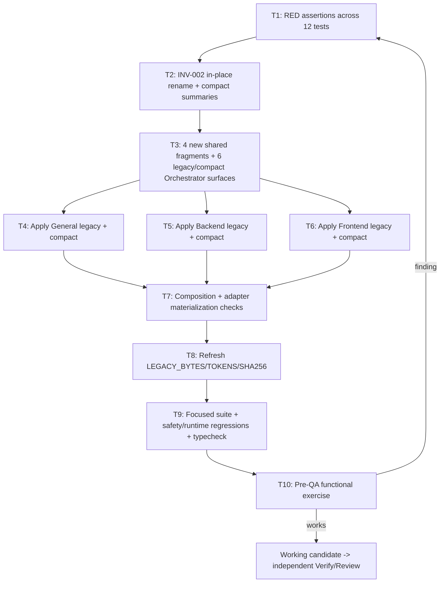

# Tasks: Streamline Orchestrator Ownership and Acceptance

## Scope and authorization

- **Change ID:** `streamline-orchestrator-ownership-and-acceptance`
- **Phase:** tasks
- **Routing:** All tasks route to `deck-developer-apply-general` (content-and-test slice only). No Verify/Review/Archive tasks — independent final QA is a downstream gate.
- **Source allowlist (5 files):** `packages/core/src/teams/developer/orchestrator-invariants.ts`, `packages/core/src/teams/developer/orchestrator-content.ts`, `packages/core/src/teams/developer/apply-general-content.ts`, `packages/core/src/teams/developer/apply-backend-content.ts`, `packages/core/src/teams/developer/apply-frontend-content.ts`.
- **Test allowlist (12 files = 10 core + 2 OpenCode adapter):**
  - Core (10): `packages/core/src/teams/developer/orchestrator-invariants.test.ts`, `packages/core/src/teams/developer/orchestrator-invariants.task2.test.ts`, `packages/core/src/teams/developer/orchestrator-content.test.ts`, `packages/core/src/teams/developer/content-registry.test.ts`, `packages/core/src/teams/developer/prompt-profile.test.ts`, `packages/core/src/teams/developer/manifest.test.ts`, `packages/core/src/teams/developer/user-phase-communication.test.ts`, `packages/core/src/teams/developer/apply-general-content.test.ts`, `packages/core/src/teams/developer/apply-backend-content.test.ts`, `packages/core/src/teams/developer/apply-frontend-content.test.ts`.
  - OpenCode adapter (2): `packages/adapter-opencode/src/developer-team-install.test.ts`, `packages/adapter-opencode/src/prompt-generation.test.ts`.
- **Blocked targets:** generated outputs (`packages/core/src/skills/external/content.generated.ts`, `apps/cli/src/runtime/build-info.generated.ts`, runner-native materialized files), `packages/sdd-runtime/**` source or tests, adapter production sources (`packages/adapter-opencode/src/**` non-test, `packages/adapter-pi/src/**` non-test), registry schemas, historical artifacts, unrelated WIP under `openspec/changes/opencode-package-install-running-binary-regression/`, `runner-capability-standardization`, and any file outside the allowlist.
- **Apply completion signal:** a working candidate ready for functional testing, not final QA approval.

## Complexity summary

- 10 tasks total (T1..T10).
- **Low:** T1, T2, T4, T5, T6, T7, T8, T9, T10.
- **Medium:** T3 (highest-fidelity: 13 EIIs across 12 test files, owns legacy byte/lexical/tokens fixture refresh).
- **Tally check:** 9 Low + 1 Medium = 10. Matches task IDs T1..T10.

## Review Workload Forecast

- The Apply content/test slice touches 5 source targets and 12 tests (10 core + 2 OpenCode adapter), so the eventual independent Review workload is small-to-medium and concentrated on invariant precedence, exact-bytes commit-only block, and cross-profile composition parity.
- **Planned reviewer axes:** architecture (composition and precedent non-widening), security (commit-only safety parity, Git discard rule co-existence), consistency (compact/legacy parity, no contradiction), testability (RED/GREEN evidence and fixture refresh).
- **Risk:** rehearsal of the EII-SOA-007 byte-verbatim block; invariant count/order/idempotency; legacy fixture regeneration. All surface as deterministic tests.
- **Expected Review effort:** medium; focused on the invariant code change and the byte/lexical/tokens refresh.

## Dependency order and parallelism

- **Canonical order:** T1 → T2 → T3 → {T4, T5, T6 in parallel} → T7 → T8 → T9 → T10.
- **T1 (RED assertions) precedes T2 (source edits):** TDD requires failing assertions first.
- **T2 (orchestrator-invariants.ts) precedes T3 (orchestrator-content.ts):** `INV-002` new export must exist before the content fragments reference it.
- **T3 (orchestrator-content.ts) precedes T4, T5, T6 (parallel):** the shared fragments must exist before the apply skills reference them.
- **T4, T5, T6 (parallel):** each touches a different `apply-*-content.ts` file. T4 parallel only with T5/T6; T5 parallel only with T4/T6; T6 parallel only with T4/T5.
- **T7 (composition + adapter materialization) depends on T4, T5, and T6:** T7 is NOT parallel with T4/T5/T6; it consolidates the cross-profile and adapter checks.
- **T8 (legacy fixture refresh) depends on T7:** the lexical/byte/tokens fixture must be recomputed from the updated legacy output after T7's assertions pass.
- **T9 (full focused suite + safety/runtime regressions + typecheck) depends on T8.**
- **T10 (pre-QA functional exercise) depends on T9.** T10 is the final Apply task; it gates handoff to independent Verify/Review.

## Implementation-authorization question

**Do you authorize T1..T10 with the listed owner, order, files, and verification plan so that `deck-developer-apply-general` may begin the content-and-test slice under the existing authorized modification allowlist?**

---

## Tasks

### T1 — Add RED assertions for INV-001/INV-002 semantics and prohibited phrases

- **Owner:** deck-developer-apply-general
- **Priority:** Must
- **Complexity:** Low
- **Parallel:** No. Must precede T2.
- **Depends on:** —
- **Files:** `packages/core/src/teams/developer/orchestrator-invariants.test.ts`, `packages/core/src/teams/developer/orchestrator-invariants.task2.test.ts`, `packages/core/src/teams/developer/orchestrator-content.test.ts`, `packages/core/src/teams/developer/content-registry.test.ts`, `packages/core/src/teams/developer/prompt-profile.test.ts`, `packages/core/src/teams/developer/manifest.test.ts`, `packages/core/src/teams/developer/user-phase-communication.test.ts`, `packages/core/src/teams/developer/apply-general-content.test.ts`, `packages/core/src/teams/developer/apply-backend-content.test.ts`, `packages/core/src/teams/developer/apply-frontend-content.test.ts`, `packages/adapter-opencode/src/developer-team-install.test.ts`, `packages/adapter-opencode/src/prompt-generation.test.ts` (RED assertions added before any source change).
- **Verification:** TDD RED. Each new assertion listed under `Required assertions (RED)` below MUST fail with the current source. All 12 existing focused tests MUST still pass. Run `bun test` against the 12 focused test files.
- **Spec coverage:** REQ-SOAA-OWN-01, REQ-SOAA-OWN-02, REQ-SOAA-OWN-03 (qualitative ownership; behavior-changing and judgment work delegated); REQ-SOAA-CMP-02 (compact/legacy surface parity).
- **Design EII coverage:** EII-SOA-001 (Automatic-mode), EII-SOA-002 (INV-002 ownership), EII-SOA-003 (compact summaries), EII-SOA-004 (ownership fragment), EII-SOA-005 (pre-QA loop), EII-SOA-006 (decision absorption), EII-SOA-007 (byte-verbatim commit-only), EII-SOA-008 / EII-SOA-009 / EII-SOA-010 (legacy surfaces), EII-SOA-011 / EII-SOA-012 / EII-SOA-013 (compact surfaces), EII-SOA-014..EII-SOA-019 (apply surfaces).
- **Required assertions (RED):**
  - `INV_002_PURE_DELEGATOR` is **not** exported from `orchestrator-invariants.ts`; the export name `INV_002_COORDINATOR_OWNERSHIP` exists and keeps ID `INV-002`, tier `critical`, the four surfaces, and is at position 1 of `ORCHESTRATOR_INVARIANTS`.
  - `INV_002_COORDINATOR_OWNERSHIP` `requiredAction` enumerates the bounded direct examples (git status/diff/log, exact staging, deterministic digest/count/existence checks, centralized intent reconciliation, synthesis, resolved-decision recording) and the specialist-only items (behavior changes, specialist artifacts, broad/build execution, protected-risk/architecture/migration/security/data-loss/public-API judgment, Verify, Review).
  - `COMPACT_ORCHESTRATOR_INVARIANT_SUMMARIES_V1` entry for `INV-002` states the new ownership rule; entry for `INV-001` retains no-routine-Automatic-pause plus conditional target/hard-stop behavior; both permanent-authority/quality/hard-stop summaries remain unchanged.
  - Rendered prompt content does **not** contain the byte phrases `Pure Delegator`, `delegate everything`, `never execute any specialist-capable task`, or `never execute specialized agent work itself` in any of `ORCHESTRATOR_SYSTEM_PROMPT`, `ORCHESTRATOR_SYSTEM_PROMPT_COMPACT`, `ORCHESTRATOR_AGENT_BODY`, `ORCHESTRATOR_COMPACT_AGENT_BODY`, `ORCHESTRATOR_SKILL_BODY`, `ORCHESTRATOR_COMPACT_SKILL_BODY`.
  - Composed session/agent/skill content contains the new shared fragments (`ORCHESTRATOR_OWNERSHIP_BOUNDARY_V1`, `ORCHESTRATOR_PRE_QA_FUNCTIONAL_LOOP_V1`, `ORCHESTRATOR_PHASE_DECISION_ABSORPTION_V1`) and the exact byte-verbatim `ORCHESTRATOR_EXPLICIT_COMMIT_ONLY_RULE_V1` block.
  - The four new shared fragments appear exactly once each in the composed compact skill (and once each in the composed legacy skill).
  - No unconditional post-Apply user question; no `git add .` / broad staging language; no `reseed of final QA inside Apply` wording; no promotion of user-acceptance as Verify/Review evidence.
- **Rollback:** revert T1 test additions; no source files changed.

### T2 — Revise `INV-002` in place and update compact summaries

- **Owner:** deck-developer-apply-general
- **Priority:** Must
- **Complexity:** Low
- **Parallel:** No. Must precede T3.
- **Depends on:** T1
- **Files:** `packages/core/src/teams/developer/orchestrator-invariants.ts` (source change; no test changes in this task — T1's assertions turn green).
- **Verification:** TDD GREEN. T1's RED assertions for `INV_002_COORDINATOR_OWNERSHIP`, compact summaries, and the position/count of `INV-002` all pass; existing tests remain green. Run `bun test` against the 12 focused test files.
- **Spec coverage:** REQ-SOAA-OWN-01, REQ-SOAA-OWN-02, REQ-SOAA-OWN-03, REQ-SOAA-CMP-02.
- **Design EII coverage:** EII-SOA-002 (semantic-constrained; rename `INV_002_PURE_DELEGATOR` to `INV_002_COORDINATOR_OWNERSHIP`; preserve ID, tier, surfaces, array position, count, runner-neutral wording; enumerate direct and specialist-only examples; preserve ambiguity/risk/auth routes; ownership never widens authority), EII-SOA-001 (retain Automatic-mode invariant semantics; rewrite summary clause), EII-SOA-003 (compact summaries updated; order preserved).
- **Required changes (semantic-constrained):**
  - Keep ID `INV-002`, tier `critical`, surfaces `["session", "agent", "skill", "manifest"]`, array position 1, and total invariant count of 6 in `ORCHESTRATOR_INVARIANTS`.
  - Rename `INV_002_PURE_DELEGATOR` to `INV_002_COORDINATOR_OWNERSHIP`; update the record title from `"Pure Delegator"` to `"Coordinator Ownership"`; replace `condition`, `requiredAction`, `rationale`, and `violationConsequence` with the qualitative ownership statement that enumerates direct bounded operations and specialist-only items; do not introduce numeric thresholds; preserve the `sourceRefs` location for downstream rendering.
  - Update `COMPACT_ORCHESTRATOR_INVARIANT_SUMMARIES_V1` entries for `INV-001` and `INV-002` to encode the new semantics; keep entries for `INV-003` through `INV-006` and the permanent-authority/quality/hard-stop summaries unchanged.
  - Update `ORCHESTRATOR_INVARIANTS` array export to reference the new constant name.
- **Prohibited:** "Pure Delegator", "delegate everything", "never execute any specialist-capable task", "specialist availability as the deciding condition", file-count-only definitions of "simple".
- **Rollback:** revert `orchestrator-invariants.ts` to the previous export; recompile.

### T3 — Compose new shared fragments and update legacy/compact Orchestrator surfaces

- **Owner:** deck-developer-apply-general
- **Priority:** Must
- **Complexity:** Medium
- **Parallel:** No. Must precede T4, T5, T6.
- **Depends on:** T2
- **Files:** `packages/core/src/teams/developer/orchestrator-content.ts` (source changes); `packages/core/src/teams/developer/orchestrator-content.test.ts`, `packages/core/src/teams/developer/content-registry.test.ts`, `packages/core/src/teams/developer/prompt-profile.test.ts`, `packages/core/src/teams/developer/manifest.test.ts`, `packages/core/src/teams/developer/user-phase-communication.test.ts` (extend assertions; the legacy fixture constants in `prompt-profile.test.ts` are NOT updated here — that is T8).
- **Verification:** TDD GREEN. Extended tests in the five listed test files pass; legacy content still includes the canonical order string and the Git discard rule unchanged; compact content retains its size advantage (existing `LEGACY_BYTES`/`LEGACY_LEXICAL_TOKENS`/`LEGACY_SHA256` deliberately NOT updated yet — that is T8). Run `bun test` against the 12 focused test files.
- **Spec coverage:** REQ-SOAA-OWN-01..03, REQ-SOAA-GIT-01..03, REQ-SOAA-CMT-01..04, REQ-SOAA-TST-01..05, REQ-SOAA-FND-01..02, REQ-SOAA-QA-01..04, REQ-SOAA-NOB-01..04, REQ-SOAA-REC-01..02, REQ-SOAA-SAF-01..06, REQ-SOAA-CMP-01..07.
  - **Per-Spec REQ anchor (developer-facing cross-reference):** REQ-SOAA-GIT-02 (exact staging in commit-only block); REQ-SOAA-GIT-03 (destructive confirmation flow preserved via `GIT_DISCARD_PROTECTION_RULE`); REQ-SOAA-CMT-02 (commit does not trigger Verify/Review — negative assertion in shared fragments); REQ-SOAA-CMT-03 (commit result reports absent QA — "unverified snapshot" in byte-verbatim block); REQ-SOAA-CMT-04 (commit-plus-completion requires full gates — Apply completion intent held); REQ-SOAA-TST-03 (correction/retest loop in `ORCHESTRATOR_PRE_QA_FUNCTIONAL_LOOP_V1`); REQ-SOAA-TST-04 (conditional user validation in same fragment); REQ-SOAA-TST-05 (Automatic-mode behavior in same fragment); REQ-SOAA-FND-02 (modification invalidates prior evidence — same fragment); REQ-SOAA-QA-02 (targeted → affected-area → Review → broad preserved); REQ-SOAA-QA-03 (freshness invalidation preserved); REQ-SOAA-QA-04 (user acceptance ≠ Verify/Review — negative assertion); REQ-SOAA-NOB-02, REQ-SOAA-NOB-03, REQ-SOAA-NOB-04 (no fast route; no new acceptance artifact — recovery uses existing `apply-progress.md`; no numeric threshold — ownership is qualitative per `INV_002_COORDINATOR_OWNERSHIP`); REQ-SOAA-SAF-05 (Full-SDD broad remains mandatory — preserved final order); REQ-SOAA-SAF-06 (excluded target hard stop preserved — `runner-capability-standardization` stop clause); REQ-SOAA-CMP-04 (unrelated WIP triggers clarification — byte-verbatim block).
- **Design EII coverage:** EII-SOA-004 (`ORCHESTRATOR_OWNERSHIP_BOUNDARY_V1`), EII-SOA-005 (`ORCHESTRATOR_PRE_QA_FUNCTIONAL_LOOP_V1`), EII-SOA-006 (`ORCHESTRATOR_PHASE_DECISION_ABSORPTION_V1`), EII-SOA-007 (byte-verbatim `ORCHESTRATOR_EXPLICIT_COMMIT_ONLY_RULE_V1`), EII-SOA-008 (`ORCHESTRATOR_SYSTEM_PROMPT`), EII-SOA-009 (`ORCHESTRATOR_AGENT_BODY`), EII-SOA-010 (`ORCHESTRATOR_SKILL_BODY`), EII-SOA-011 (`ORCHESTRATOR_SYSTEM_PROMPT_COMPACT`), EII-SOA-012 (`ORCHESTRATOR_COMPACT_AGENT_BODY`), EII-SOA-013 (`ORCHESTRATOR_COMPACT_SKILL_BODY`).
- **Required changes (semantic-constrained for the four shared fragments, byte-verbatim for EII-SOA-007):**
  - Add the four new exported prompt fragments in this exact order:
    1. `ORCHESTRATOR_OWNERSHIP_BOUNDARY_V1`
    2. `ORCHESTRATOR_PRE_QA_FUNCTIONAL_LOOP_V1`
    3. `ORCHESTRATOR_PHASE_DECISION_ABSORPTION_V1`
    4. `ORCHESTRATOR_EXPLICIT_COMMIT_ONLY_RULE_V1`
  - The byte-verbatim block for EII-SOA-007 MUST be emitted byte-for-byte as fenced in the Design (heading `## Explicit Commit-Only Requests` through the sixth numbered rule ending `…commit-ready registry evidence.`). The existing `GIT_DISCARD_PROTECTION_RULE` continues to supersede all other instructions and remains byte-for-byte unchanged.
  - Update `ORCHESTRATOR_SYSTEM_PROMPT` (legacy session) to replace `## Your Identity: Pure Delegator` and any `delegate everything` / `never execute any specialist-capable task` clauses with the new ownership semantics; make numeric triggers advisory only; narrow the unconditional pre-commit review trigger; compose the four new shared fragments exactly once; update Execution Mode per EII-SOA-001; place candidate validation inside Apply before targeted; keep user communication low-noise and conditional.
  - Update `ORCHESTRATOR_AGENT_BODY` (legacy agent) to state coordinator direct ownership and specialist boundaries; include the candidate-validation ordering, resolved-decision absorption, and exact commit-only block; revise delegation triggers so commit-only and bounded mechanical coordination do not require a fresh independent role launch.
  - Update `ORCHESTRATOR_SKILL_BODY` (legacy skill) to compose the four new shared fragments exactly once; update Apply routing and Verify/Review guidance to withhold final QA until candidate readiness; update Execution Mode and Recovery; allow normal Apply intent completion after conditional user validation without specialist restatement; preserve the final targeted → affected-area → Review → broad sequence.
  - Update `ORCHESTRATOR_SYSTEM_PROMPT_COMPACT` (compact session) to carry concise versions of ownership, pre-QA flow, resolved-decision absorption, Automatic behavior, and the exact commit-only instructions; state that final QA starts only for the working candidate; retain the canonical order string used by runtime parity tests.
  - Update `ORCHESTRATOR_COMPACT_AGENT_BODY` (compact agent) to add concise direct/specialist ownership, candidate readiness before final QA, resolved-decision absorption, and exact commit-only behavior; keep heavy execution specialist-owned.
  - Update `ORCHESTRATOR_COMPACT_SKILL_BODY` (compact skill) to compose the four new shared fragments exactly once; update `## Coordinate One Authoritative Flow` so Apply candidate validation precedes step 6 final QA; add recovery handling without new state.
  - Preserve: triage classifications, registered specialist roles, context-economy guidance, single-writer registry, Git discard protection, language policy, hard stops, post-Archive no-automatic-mutation, English-only internal artifacts, final staged/broad order.
- **Negative assertions:** the legacy and compact prompts MUST NOT contain `Pure Delegator`, `delegate everything`, `never execute any specialist-capable task`, or `never execute specialized agent work itself`; MUST NOT contain broad staging language; MUST NOT promote user acceptance as Verify/Review evidence; MUST NOT include an unconditional post-Apply user question.
- **Rollback:** revert `orchestrator-content.ts` to the four-fragment-free state; preserve the existing `GIT_DISCARD_PROTECTION_RULE` import.

### T4 — Update Apply General legacy and compact skills

- **Owner:** deck-developer-apply-general
- **Priority:** Must
- **Complexity:** Low
- **Parallel:** Yes with T5 and T6 only (different files). T4 is NOT parallel with T7 or any later task.
- **Depends on:** T3
- **Files:** `packages/core/src/teams/developer/apply-general-content.ts` (source); `packages/core/src/teams/developer/apply-general-content.test.ts` (extend assertions).
- **Verification:** TDD GREEN. `apply-general-content.test.ts` assertions pass; cross-profile parity tests in `prompt-profile.test.ts` and `content-registry.test.ts` continue to pass. Run `bun test` against the 12 focused test files.
- **Spec coverage:** REQ-SOAA-TST-01..05, REQ-SOAA-FND-01..02, REQ-SOAA-QA-01..04, REQ-SOAA-CMP-05, REQ-SOAA-NOB-01..04.
- **Design EII coverage:** EII-SOA-014 (`APPLY_GENERAL_SKILL_BODY`), EII-SOA-015 (`APPLY_GENERAL_COMPACT_SKILL_BODY`).
- **Required changes (semantic-constrained):**
  - Label minimal local proof separately from functional exercise; exercise shared/config/script/CLI/contract behavior through the relevant interface; fix and rerun both affected local and functional checks; report commands/observations in existing Apply evidence; identify conditional target/user validation; state all evidence is non-independent and cannot satisfy targeted/affected/Review/broad.
  - Compact body: replace the instruction to run staged targeted/affected/broad checks with minimal local proof plus proportionate actual behavior exercise and fix/retest; label evidence non-independent; report conditional target validation; leave final stages to fresh Verify/Review.
- **Preserved:** TDD, EII fidelity, code economy, repair-incident handling, generated-source discipline, artifact/return contract, target allowlist, centralized registry rules.
- **Prohibited:** mandatory full build/broad suite for every task, final staged QA claim, default user pause.
- **Rollback:** revert `apply-general-content.ts`; do not touch T3 outputs.

### T5 — Update Apply Backend legacy and compact skills

- **Owner:** deck-developer-apply-general
- **Priority:** Must
- **Complexity:** Low
- **Parallel:** Yes with T4 and T6 only (different files). T5 is NOT parallel with T7 or any later task.
- **Depends on:** T3
- **Files:** `packages/core/src/teams/developer/apply-backend-content.ts` (source); `packages/core/src/teams/developer/apply-backend-content.test.ts` (extend assertions).
- **Verification:** TDD GREEN. `apply-backend-content.test.ts` assertions pass; cross-profile tests continue green. Run `bun test` against the 12 focused test files.
- **Spec coverage:** REQ-SOAA-TST-01..05, REQ-SOAA-FND-01..02, REQ-SOAA-QA-01..04, REQ-SOAA-CMP-05, REQ-SOAA-NOB-01..04, REQ-SOAA-SAF-02 (security/data-loss floors preserved).
- **Design EII coverage:** EII-SOA-016 (`APPLY_BACKEND_SKILL_BODY`), EII-SOA-017 (`APPLY_BACKEND_COMPACT_SKILL_BODY`).
- **Required changes (semantic-constrained):**
  - Separate focused unit/type/build proof from actual endpoint/service/persistence/integration/error-path exercise; test real trust boundaries proportionately; fix/retest findings; report conditional external/target validation; label all evidence non-independent and reserve final stages for Verify/Review.
  - Compact body: replace "scheduled targeted, affected-area, and broad checks" with focused local proof plus proportionate backend functional exercise and fix/retest; require truthful non-independent evidence and conditional target validation; defer final stages to fresh independent QA.
- **Preserved:** API compatibility/migration, security, transactions, authorization, secrets, EII fidelity, repair evidence, scope, registry behavior.
- **Prohibited:** protected-risk adjudication by the Orchestrator, broad final QA inside Apply, mock-only claim when a real integration path is required.
- **Rollback:** revert `apply-backend-content.ts`.

### T6 — Update Apply Frontend legacy and compact skills

- **Owner:** deck-developer-apply-general
- **Priority:** Must
- **Complexity:** Low
- **Parallel:** Yes with T4 and T5 only (different files). T6 is NOT parallel with T7 or any later task.
- **Depends on:** T3
- **Files:** `packages/core/src/teams/developer/apply-frontend-content.ts` (source); `packages/core/src/teams/developer/apply-frontend-content.test.ts` (extend assertions).
- **Verification:** TDD GREEN. `apply-frontend-content.test.ts` assertions pass; cross-profile tests continue green. Run `bun test` against the 12 focused test files.
- **Spec coverage:** REQ-SOAA-TST-01..05, REQ-SOAA-FND-01..02, REQ-SOAA-QA-01..04, REQ-SOAA-CMP-05, REQ-SOAA-NOB-01..04.
- **Design EII coverage:** EII-SOA-018 (`APPLY_FRONTEND_SKILL_BODY`), EII-SOA-019 (`APPLY_FRONTEND_COMPACT_SKILL_BODY`).
- **Required changes (semantic-constrained):**
  - Separate component/type/accessibility proof from actual interaction/browser/integration behavior; exercise keyboard, focus, loading, error, empty, responsive, and contract behavior as applicable; fix/retest findings; identify conditional real-browser/device/product validation; label evidence non-independent and reserve final QA.
  - Compact body: replace "scheduled component, affected-area, integration, build, and type checks" as a staged bundle with focused local checks plus actual UI behavior exercise and fix/retest; retain relevant integration/build/type checks only when proportionate; require non-independent labeling and conditional target/product validation; leave final stages to Verify/Review.
- **Preserved:** authoritative backend contracts, no backend invention, design system, accessibility, TDD, EII fidelity, scope, repair, registry behavior.
- **Prohibited:** screenshot-only or mock-only acceptance when interaction is in scope; staged broad QA inside Apply; default user pause.
- **Rollback:** revert `apply-frontend-content.ts`.

### T7 — Verify cross-profile composition and adapter materialization

- **Owner:** deck-developer-apply-general
- **Priority:** Must
- **Complexity:** Low
- **Parallel:** No. NOT parallel with T4, T5, or T6; depends on all three.
- **Depends on:** T4, T5, T6
- **Files:** `packages/core/src/teams/developer/content-registry.test.ts`, `packages/core/src/teams/developer/prompt-profile.test.ts`, `packages/core/src/teams/developer/manifest.test.ts`, `packages/core/src/teams/developer/user-phase-communication.test.ts`, `packages/adapter-opencode/src/developer-team-install.test.ts`, `packages/adapter-opencode/src/prompt-generation.test.ts` (extend assertions; no source changes).
- **Verification:** TDD GREEN. All 12 focused tests pass; OpenCode adapter materialization tests pass; unchanged Git safety / freshness / staged-verification / convergence / scheduler tests continue to pass. Run `bun test` against the 12 focused tests plus the unchanged-runtime regression suite (`git-safety.test.ts`, `execution-convergence.test.ts`, `staged-verification.test.ts`, `freshness-policy.test.ts`, `execution-role-scheduler.test.ts`, `developer-team-convergence.e2e.test.ts`).
- **Spec coverage:** REQ-SOAA-CMP-02, REQ-SOAA-CMP-03, REQ-SOAA-NOB-01..04, REQ-SOAA-SAF-04, REQ-SOAA-REC-02.
- **Design EII coverage:** EII-SOA-004..EII-SOA-013 (composition), EII-SOA-014..EII-SOA-019 (apply surfaces materialized).
- **Required checks:**
  - Compact session prompt contains the concise ownership + pre-QA + decision + Automatic + commit-only clauses; the canonical order string used by runtime parity tests is preserved.
  - Legacy session prompt contains the full ownership + pre-QA + decision absorption + exact commit-only clauses; numeric triggers are advisory only; pre-commit review trigger is narrowed to non-commit-only mutations.
  - All three apply role skills (legacy + compact) contain the local proof / functional exercise / conditional target validation / non-independent labeling clauses and exclude the prohibited phrases.
  - OpenCode materialized prompts and installed skill plans contain the new compact semantics; the explicit commit-only block is present byte-for-byte in the generated content.
  - `git-safety.test.ts` (unchanged) remains green as the regression gate for the preserved `GIT_DISCARD_PROTECTION_RULE`.
- **Rollback:** revert T7 test additions only; T4..T6 source changes remain until T9 confirms.

### T8 — Refresh deterministic legacy fixture (`LEGACY_BYTES`, `LEGACY_LEXICAL_TOKENS`, `LEGACY_SHA256`)

- **Owner:** deck-developer-apply-general
- **Priority:** Must
- **Complexity:** Low
- **Parallel:** No. Must precede T9's compact size gate.
- **Depends on:** T7
- **Files:** `packages/core/src/teams/developer/prompt-profile.test.ts` (update the three fixture constants in the test file only — no source changes).
- **Verification:** TDD GREEN. `prompt-profile.test.ts` legacy byte/lexical/sha assertions pass with the new constants; compact assertions still pass. Run `bun test` against the 12 focused test files.
- **Spec coverage:** REQ-SOAA-CMP-02 (compact/legacy surface parity).
- **Design EII coverage:** EII-SOA-007 (byte-verbatim commit-only block), EII-SOA-008 (legacy session), EII-SOA-009 (legacy agent), EII-SOA-010 (legacy skill) — the fixture must reflect the new composed legacy output.
- **Required changes:**
  - Compute new `LEGACY_BYTES`, `LEGACY_LEXICAL_TOKENS`, and `LEGACY_SHA256` from the deterministic composed legacy output after T3..T7 pass.
  - Preserve the compact size gate (no regression to the compact compactness advantage).
  - Record the new constants in `prompt-profile.test.ts` with a comment noting the refresh and the EIIs that drive the change.
- **Rollback:** revert the three constants in `prompt-profile.test.ts`; the deterministic composed legacy output remains available through the new content for re-computation.

### T9 — Final focused suite + unchanged safety/runtime regressions + typecheck

- **Owner:** deck-developer-apply-general
- **Priority:** Must
- **Complexity:** Low
- **Parallel:** No. Final Apply pass before pre-QA functional exercise.
- **Depends on:** T8
- **Files:** none (observation only; no source or test edits).
- **Verification:** every command below exits zero. Run (a) the focused content/materialization suite (12 + unchanged Git safety tests), (b) the unchanged runtime/safety regressions `bun test packages/sdd-runtime/src/contracts/execution-convergence.test.ts packages/sdd-runtime/src/orchestrator/staged-verification.test.ts packages/sdd-runtime/src/orchestrator/freshness-policy.test.ts packages/sdd-runtime/src/execution/execution-role-scheduler.test.ts packages/sdd-runtime/src/execution/developer-team-convergence.e2e.test.ts`, (c) `bunx tsc --noEmit`, (d) `bun test --timeout 30000`. The Pi parity test `packages/adapter-pi/src/registry-consumption.test.ts` must remain green without modification (verification-only). This task also proves REQ-SOAA-SAF-03 (independent role identity / freshness) and REQ-SOAA-QA-04 (user acceptance ≠ Verify/Review) by leaving the unchanged runtime regression suite untouched and verifying it stays green.
- **Spec coverage:** all requirements (Apply is responsible for the full requirement set being testable from the changed content/tests).
- **Design EII coverage:** all 19 EIIs validated by the composed content surface.
- **Rollback:** the rollback boundary is the standard auditable revert of the 5 source files and 12 test files; no registry or shared-state changes are involved.

### T10 — Pre-QA functional exercise (proportionate materialization/CLI)

- **Owner:** deck-developer-apply-general
- **Priority:** Must
- **Complexity:** Low
- **Parallel:** No. Final Apply task before handoff to independent Verify/Review.
- **Depends on:** T9
- **Files:** `openspec/changes/streamline-orchestrator-ownership-and-acceptance/apply-progress.md` (evidence recorded; no source or test edits).
- **Verification:** `apply-progress.md` records (a) local technical checks results, (b) functional exercise results, (c) target/product validation status (`not required` or `required/pending`), and (d) the changed targets; the apply completion intent is held if target validation is pending. Run the test commands listed under `Required exercise (Apply-local, non-independent)` below.
- **Spec coverage:** REQ-SOAA-TST-01, REQ-SOAA-TST-02, REQ-SOAA-TST-03 (correction/retest loop exercised), REQ-SOAA-TST-04 (conditional user validation classified), REQ-SOAA-CMP-05 (testability boundaries), REQ-SOAA-CMP-03 (interruption / recovery), REQ-SOAA-CMP-06 (repair-budget escalation if T10 fails to produce a working candidate).
- **Design EII coverage:** the pre-QA functional loop section of EII-SOA-005.
- **Required exercise (Apply-local, non-independent):**
  - Run `bun test` for the 12 focused test files as the smallest effective behavior exercise for the content/test slice.
  - Run `bunx tsc --noEmit` to confirm the type system agrees with the renamed export and added fragments.
  - Run the OpenCode adapter materialization smoke (the existing `developer-team-install.test.ts` and `prompt-generation.test.ts` already exercise this) and record the outcome in `apply-progress.md` under the verification/evidence area.
  - If any exercise step fails, return to the relevant T1..T9 task for correction and re-run T10; do not launch independent Verify/Review.
  - If all steps pass, label the evidence as `non-independent` and `apply-local`; document the residual automation seam (model-level semantic compliance) and the conditional target/product validation requirement.
- **Rollback:** if T10 fails to produce a working candidate for any reason, return to the relevant T1..T9 task under the existing repair-loop budget (REQ-SOAA-CMP-06); do not relaunch independent Verify/Review for a discarded candidate. Any rollback preserves registry history, prior artifacts, and recorded evidence (REQ-SOAA-CMP-07).

---

## Advisory code-economy note

Up to 17 files may be touched (5 source + 12 tests = 5 source + 10 core tests + 2 OpenCode adapter tests). The 5 source files are reduced-by-default edits — minimal new exports, narrow prose replacements, and one new shared fragment per surface. The 12 test files are additive (new assertions or fixture refresh) rather than rewrites. Quality/security/completeness/tests/maintainability are non-negotiable; advisory simplification MAY shorten redundant prose in the legacy surfaces and MAY consolidate cross-profile assertions, but only where semantic parity is preserved and tests still pass. The legacy fixture refresh in T8 is the natural size risk; if the legacy size change is large, prefer scanning the content delta over deleting contract-preserving clauses.

## Supplemental dependency diagram

---

## Open questions / blockers

- None at the requirement/design level. The reconciled Spec and Design answer all OQ-1..OQ-5.
- **Blocker code reservation:** `design-spec-supersession-missing` is reserved for an actual Spec/Design supersession contradiction (e.g., the reconciled Spec fails to explicitly supersede only the pure-delegator clause of archived `REQ-OIS-002`). A future newly discovered non-test production caller of `scheduleExecutionRoleInvocationV1` triggers the distinct blocker code `runtime-scheduler-reachability-changed` and moves the runtime slice to the High-risk lane; it does NOT block this content/test slice's Tasks/Apply beyond the justified runtime reconciliation.
- The pre-existing legacy role-scheduler inconsistency is a separate scheduler-consistency follow-up, explicitly out of scope.
