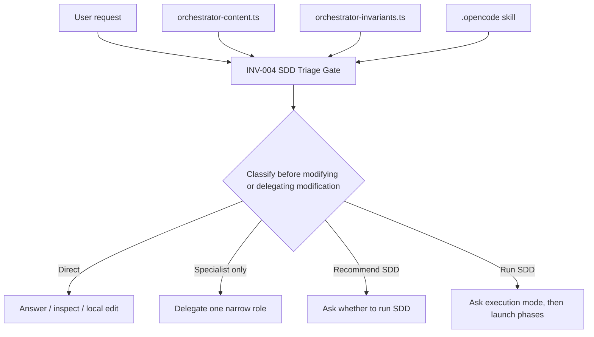

# Design: Strengthen Triage Before Modification

## Source

- Proposal: `strengthen-triage-before-modification` proposal artifact
- Capabilities affected: `orchestrator-triage-gate`, `orchestrator-content-generation`
- Spec status: not yet available

## Current Architecture Context

- Orchestrator guidance is authored in `packages/core/src/teams/developer/orchestrator-content.ts` across three string surfaces:
  - `ORCHESTRATOR_SYSTEM_PROMPT`: session/system prompt, includes `## SDD Triage Gate`.
  - `ORCHESTRATOR_AGENT_BODY`: agent body, includes `## SDD Triage Gate — classify before acting`.
  - `ORCHESTRATOR_SKILL_BODY`: generated skill body, includes `### Triage Gate`.
- Critical orchestrator invariants are separately modeled in `packages/core/src/teams/developer/orchestrator-invariants.ts`; `INV_004_SDD_TRIAGE_GATE` currently gates only “Before asking for Execution Mode or launching SDD phases”.
- `content-registry.ts` prepends rendered orchestrator invariants to orchestrator agent/skill content with `prependOrchestratorInvariants(...)`.
- `.opencode/skills/deck-developer-orchestrator/SKILL.md` is the local installed skill surface and currently mirrors the generated `ORCHESTRATOR_SKILL_BODY` triage wording.
- Existing tests verify invariant presence and prompt wording, especially:
  - `packages/core/src/teams/developer/orchestrator-content.test.ts`
  - `packages/core/src/teams/developer/orchestrator-invariants.test.ts`
  - `packages/core/src/teams/developer/orchestrator-invariants.task2.test.ts`
  - `packages/core/src/teams/developer/content-registry.test.ts`
  - `packages/core/src/teams/developer/manifest.test.ts`
  - `packages/adapter-opencode/src/developer-team-install.test.ts`
  - `packages/adapter-pi/src/developer-team-install.test.ts`

## Proposed Architecture

Strengthen the existing INV-004 triage contract in canonical prompt content, invariant metadata, generated skill content, and the checked-in local installed skill. Do not add `INV-006`: codebase evidence shows `INV-004` already owns SDD triage across all surfaces and is rendered into composed orchestrator outputs.

Recommended core wording:

> Before asking for execution mode, launching SDD phases, or taking/delegating any step that may modify code, configuration, prompts, OpenSpec artifacts, or project files, classify the current user request as Direct, Specialist only, Recommend SDD, or Run SDD. Do not ask Automatic vs Interactive unless triage says Run SDD. Do not modify or delegate modifying work until this classification is made.

Implementation should preserve the existing triage category definitions and examples; only the gate condition/prohibition language needs to change.

### Component / Module Boundaries

| Component | Responsibility | Change Type |
|---|---|---|
| `packages/core/src/teams/developer/orchestrator-content.ts` | Canonical prompt and skill source strings for orchestrator surfaces | modified |
| `packages/core/src/teams/developer/orchestrator-invariants.ts` | Canonical machine-readable invariant definitions rendered into composed outputs | modified |
| `.opencode/skills/deck-developer-orchestrator/SKILL.md` | Checked-in local installed orchestrator skill surface | modified |
| `packages/core/src/teams/developer/orchestrator-content.test.ts` | Prompt/skill wording assertions | modified |
| `packages/core/src/teams/developer/orchestrator-invariants.test.ts` | Invariant metadata/rendering assertions | modified |
| `packages/core/src/teams/developer/orchestrator-invariants.task2.test.ts` | Secondary invariant rendering/verification tests | modified if exact wording coverage is added |
| `packages/core/src/teams/developer/content-registry.test.ts` | Composed agent/skill invariant presence checks | modified if exact wording coverage is added |
| `packages/core/src/teams/developer/manifest.test.ts` | Manifest-composed orchestrator invariant/skill checks | modified if exact wording coverage is added |
| `packages/adapter-opencode/src/developer-team-install.test.ts` | Installed OpenCode skill content checks | modified if exact wording coverage is added |
| `packages/adapter-pi/src/developer-team-install.test.ts` | Installed Pi skill content checks | modified if exact wording coverage is added |

### Data Flow

1. Developer updates canonical text in `orchestrator-content.ts` and `orchestrator-invariants.ts`.
2. `content-registry.ts` composes orchestrator agent/skill content and prepends rendered invariants.
3. Manifest/install builders consume composed content and write adapter-specific installed skill files.
4. Checked-in `.opencode/skills/deck-developer-orchestrator/SKILL.md` is updated to match the strengthened local skill surface.
5. Tests assert the strengthened gate appears where behavior-critical content is generated or installed.

### API / Contract Implications

| Endpoint / Interface | Change | Backward Compatible |
|---|---|---|
| `ORCHESTRATOR_SYSTEM_PROMPT` exported string | Strengthened triage-before-modification instruction | yes |
| `ORCHESTRATOR_AGENT_BODY` exported string | Same strengthened triage gate wording | yes |
| `ORCHESTRATOR_SKILL_BODY` exported string | Same strengthened triage gate wording | yes |
| `INV_004_SDD_TRIAGE_GATE` / `renderOrchestratorInvariants(...)` | Condition/requiredAction includes modifying-step prohibition | yes |
| `.opencode/skills/deck-developer-orchestrator/SKILL.md` | Local installed prompt text changes only | yes |

### State / Persistence Implications

None. No data model, database, runtime state, or registry schema changes.

### Migration / Backward Compatibility

- No runtime migration required.
- Existing consumers of exported strings remain compatible.
- Existing installed skill content should be refreshed by updating the checked-in `.opencode` skill file in the same change to avoid divergence.
- Do not bump `metadata.version` unless maintainers require skill package versioning for prompt-only edits; no codebase evidence requires it.

## File Impact Estimate

| File / Path | Action | Rationale |
|---|---|---|
| `packages/core/src/teams/developer/orchestrator-content.ts` | modify | Canonical system/agent/skill wording for SDD triage gate |
| `packages/core/src/teams/developer/orchestrator-invariants.ts` | modify | Strengthen existing `INV-004` condition/action; avoid new invariant |
| `.opencode/skills/deck-developer-orchestrator/SKILL.md` | modify | Keep local installed skill aligned with generated skill body |
| `packages/core/src/teams/developer/orchestrator-content.test.ts` | modify | Assert triage happens before modifying or delegating modifying work |
| `packages/core/src/teams/developer/orchestrator-invariants.test.ts` | modify | Assert `INV-004` condition/action contains modifying-step gate |
| `packages/core/src/teams/developer/orchestrator-invariants.task2.test.ts` | modify if needed | Add/adjust duplicate invariant rendering coverage only if exact wording assertions live here |
| `packages/core/src/teams/developer/content-registry.test.ts` | modify if needed | Assert composed orchestrator agent/skill content carries strengthened wording |
| `packages/core/src/teams/developer/manifest.test.ts` | modify if needed | Assert manifest-composed skill/instruction includes strengthened INV-004 |
| `packages/adapter-opencode/src/developer-team-install.test.ts` | modify if needed | Assert installed OpenCode skill output includes strengthened wording |
| `packages/adapter-pi/src/developer-team-install.test.ts` | modify if needed | Assert installed Pi skill/agent output includes strengthened wording |

## Testing Strategy

- Unit tests:
  - Update `orchestrator-content.test.ts` to check each relevant surface contains “taking/delegating any step that may modify…” and “Do not modify or delegate modifying work until this classification is made.”
  - Update `orchestrator-invariants.test.ts` to check `INV-004` remains the triage invariant and its rendered `condition`/`requiredAction` include the strengthened gate.
- Composition/install verification:
  - Extend `content-registry.test.ts`, `manifest.test.ts`, and adapter install tests only where needed to prove generated/installed surfaces receive the strengthened text.
- Suggested commands:
  - `bun test packages/core/src/teams/developer/orchestrator-content.test.ts`
  - `bun test packages/core/src/teams/developer/orchestrator-invariants.test.ts`
  - `bun test packages/core/src/teams/developer/content-registry.test.ts packages/core/src/teams/developer/manifest.test.ts`
  - `bun test packages/adapter-opencode/src/developer-team-install.test.ts packages/adapter-pi/src/developer-team-install.test.ts`
  - `bun test` before archive if time allows.

## Observability / Error Handling

None. This is prompt/invariant text only; no runtime logging or error handling paths change.

## Security / Performance / Accessibility Considerations

None specific to this change.

## Tradeoffs

| Decision | Chosen | Rejected Alternative | Rationale |
|---|---|---|---|
| Invariant identity | Strengthen existing `INV-004` | Add `INV-006` | Existing code and tests already model SDD triage as `INV-004`; adding a new invariant would duplicate responsibility and complicate ordering/tests. |
| Enforcement layer | Prompt/invariant wording plus tests | Runtime adapter guard | Scope excludes runtime changes; intent classification is prompt-governed and would require non-trivial intent parsing to enforce in code. |
| Surface alignment | Update canonical source plus local installed skill | Update only `.opencode` skill | Generated installs would drift from local skill and future installs could regress wording. |
| Test depth | Targeted wording assertions on source/composed outputs | No tests because change is text-only | The regression is prompt wording; tests are the cheapest guard against losing the strengthened prohibition. |
| Skill version | Do not bump `metadata.version` by default | Increment version for prompt edit | Proposal default says no bump; no discovered convention requires version changes for local prompt-only edits. |

## Risks

| Risk | Likelihood | Impact | Mitigation |
|---|---|---|---|
| One surface remains with old wording | Medium | Medium | Treat `orchestrator-content.ts`, `orchestrator-invariants.ts`, and `.opencode` skill as one aligned set; add exact-text tests. |
| INV-004 text diverges from SDD Triage Gate prose | Medium | Medium | Update invariant metadata and prose in the same patch; test rendered invariant output. |
| Overly broad wording blocks legitimate direct edits | Low | Medium | Keep Direct category available after classification; only require classification before modification. |
| Brittle exact-string tests fail on harmless phrasing changes | Medium | Low | Assert key clauses rather than the full paragraph where possible. |

## Open Decisions

- Whether maintainers want exact identical wording across all surfaces or equivalent wording with surface-appropriate casing. Recommendation: identical key clauses, surface-appropriate surrounding examples.

## Dependencies

- None.

## Rollback

- Revert changes to:
  - `packages/core/src/teams/developer/orchestrator-content.ts`
  - `packages/core/src/teams/developer/orchestrator-invariants.ts`
  - `.opencode/skills/deck-developer-orchestrator/SKILL.md`
  - any related test assertion updates.
- No data rollback or migration rollback required.

## Next Steps

Ready for Task (`deck-developer-task`) to break this design into implementation tasks, combined with Spec.

## Mermaid Summary Source

