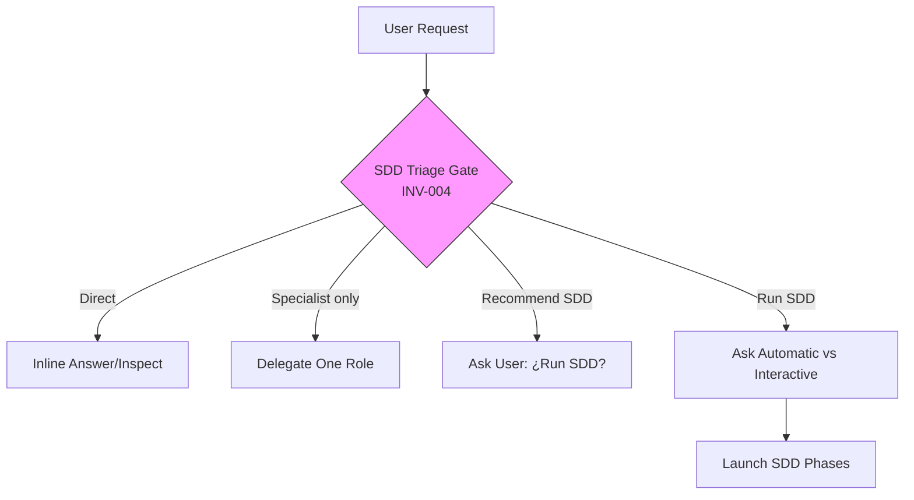

# Proposal: Fortalecer la compuerta de triaje antes de cualquier modificación (INV-004)

## Intent

La invariante INV-004 (SDD Triage Gate) actualmente ordena clasificar la solicitud del usuario *antes de preguntar el modo de ejecución o lanzar fases SDD*. Los ensayos muestran que el orquestador puede saltarse el triaje cuando avanza directamente a modificar archivos o delegar trabajo modificador sin haber lanzado SDD. Se necesita reforzar la redacción para que el triaje sea obligatorio antes de **cualquier** paso que pueda alterar código, configuración, prompts, artefactos OpenSpec o archivos del proyecto.

## Goal

Que el orquestador clasifique **siempre** la solicitud como Direct, Specialist only, Recommend SDD o Run SDD antes de ejecutar o delegar cualquier acción con potencial de modificación.

## Scope

### In Scope
- Actualizar la redacción de la compuerta de triaje en:
  - `packages/core/src/teams/developer/orchestrator-content.ts` (prompts de sistema, agente y skill)
  - `.opencode/skills/deck-developer-orchestrator/SKILL.md`
- Alinear la sección "SDD Triage Gate" / "Triage Gate" en todas las personalidades y superficies de contenido.

### Out of Scope
- Cambios de código de runtime (lógica de adaptador, CLI, etc.).
- Nuevos tests automatizados (salvo que Spec/Design los requieran).
- Modificación de otros agentes o skills.
- Creación de nuevos artefactos OpenSpec fuera de este cambio.

## Affected Capabilities

### New Capabilities
- *(ninguno)*

### Modified Capabilities
- `orchestrator-triage-gate`: se expande la condición de activación para cubrir cualquier paso modificador, no solo "preguntar modo de ejecución o lanzar fases SDD".
- `orchestrator-content-generation`: las cadenas de prompt cambian en `orchestrator-content.ts`.

### Unchanged Capabilities
- Todos los demás agentes del Developer Team: continúan dependiendo de que el orquestador las enrute correctamente tras el triaje.

## Approach

1. Reescribir la sección "SDD Triage Gate" en `orchestrator-content.ts` para las tres superficies (system prompt, agent body, skill body) con la redacción sugerida:
   > "Before asking for execution mode, launching SDD phases, or taking/delegating any step that may modify code, configuration, prompts, OpenSpec artifacts, or project files, classify the current user request as Direct, Specialist only, Recommend SDD, or Run SDD. Do not ask Automatic vs Interactive unless triage says Run SDD. Do not modify or delegate modifying work until this classification is made."
2. Reescribir la sección "Triage Gate" en `deck-developer-orchestrator/SKILL.md` con la misma redacción fortalecida.
3. Preservar el resto del contenido intacto (solo cambio de texto focalizado).

## Alternatives and Tradeoffs

| Alternative | Why Considered | Why Not Chosen |
|---|---|---|
| Agregar validación programática en el adaptador | Garantiza el triaje a nivel de código | Requiere cambios de runtime, parser de intenciones, y aumenta complejidad; el problema actual es de redacción de prompt, no de ausencia de mecanismo técnico. |
| Crear un nuevo agente "Triage" | Separa responsabilidades | Sobrediseño; el triaje es una decisión del orquestador que ya tiene el contexto completo. |
| Mantener redacción actual y solo añadir una nota al pie | Mínimo esfuerzo | No resuelve el bypass observado; la nota sería ignorada fácilmente. |

## Risks

| Risk | Likelihood | Mitigation |
|---|---|---|
| Redacción aún ambigua que permite interpretaciones laxas | Medium | Revisión cruzada en fase Review; iterar wording si Design encuentra ambigüedad. |
| Inconsistencia entre `orchestrator-content.ts` y `SKILL.md` si solo se actualiza uno | Low | El task de Apply debe tocar ambos archivos en un solo batch; Verify revisará diff. |

## Rollback Plan

Revertir los commits (o cambios de archivo) en:
- `packages/core/src/teams/developer/orchestrator-content.ts`
- `.opencode/skills/deck-developer-orchestrator/SKILL.md`

No hay estado de base de datos, migraciones ni dependencias desplegadas.

## Dependencies

Ninguna.

## Open Questions

- ¿Se debe conservar la referencia explícita a "INV-004" en el texto del prompt, o se deja como "SDD Triage Gate"? La referencia numérica ayuda a trazabilidad pero puede quedar obsoleta si se renumeran invariantes.
- ¿Se requiere también actualizar la versión del skill (`metadata.version`) en `SKILL.md` como parte de este cambio?

> Si no hay respuesta, se asume: mantener "SDD Triage Gate" sin número explícito, y no tocar la versión del skill salvo que Design lo indique.

## Acceptance Direction

- [ ] El texto actualizado aparece en `orchestrator-content.ts` (system prompt, agent body, skill body) y en `deck-developer-orchestrator/SKILL.md`.
- [ ] La redacción incluye explícitamente la prohibición de modificar o delegar trabajo modificador antes de clasificar.
- [ ] No se elimina ni altera ninguna otra sección de los archivos afectados.

## Next Steps

Ready for Spec (`deck-developer-spec`) and Design (`deck-developer-design`) in parallel.

## Mermaid Summary Source

