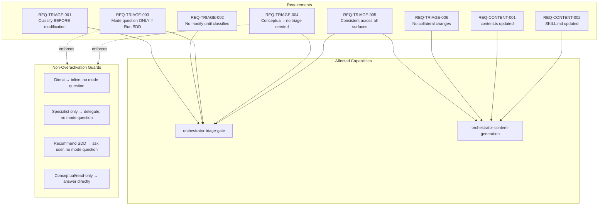

# Spec: Fortalecer la compuerta de triaje antes de cualquier modificación (INV-004)

## Source

- Proposal: `strengthen-triage-before-modification` proposal artifact
- Capabilities affected: `orchestrator-triage-gate` (modified), `orchestrator-content-generation` (modified)

## Requirements

### Capability: orchestrator-triage-gate

REQ-TRIAGE-001: The orchestrator MUST classify every user request into exactly one of four categories — Direct, Specialist only, Recommend SDD, or Run SDD — before executing or delegating any step that may modify code, configuration, prompts, OpenSpec artifacts, or project files.
  Priority: MUST
  Surface: General (behavioral prompt constraint)
  Rationale: The current wording only gates "asking execution mode" and "launching SDD phases," which allows the orchestrator to bypass triage and modify files directly.

REQ-TRIAGE-002: The orchestrator MUST NOT modify, nor delegate modifying work on, code, configuration, prompts, OpenSpec artifacts, or project files until the triage classification has been made.
  Priority: MUST
  Surface: General (behavioral prompt constraint)
  Rationale: Prevents the observed bypass where the orchestrator proceeds to modification without classifying first.

REQ-TRIAGE-003: The orchestrator MUST NOT ask the user to choose between Automatic and Interactive execution modes unless the triage classification is Run SDD.
  Priority: MUST
  Surface: General (non-overactivation)
  Rationale: Premature mode-selection question creates noise and implies an SDD process that may not be needed.

REQ-TRIAGE-004: The orchestrator SHOULD answer conceptual, informational, or analytical requests (questions about architecture, explanations, inspections) without requiring SDD triage, provided the response involves no file modification.
  Priority: SHOULD
  Surface: General (non-overactivation)
  Rationale: Pure read-only or conceptual responses must not be blocked by the triage gate; over-activation would degrade UX.

REQ-TRIAGE-005: The triage gate wording MUST appear consistently in all three prompt surfaces of `orchestrator-content.ts` (system prompt, agent body, skill body) and in `deck-developer-orchestrator/SKILL.md`.
  Priority: MUST
  Surface: General (consistency)
  Rationale: Inconsistent wording between surfaces creates ambiguity and enables bypass on one surface.

REQ-TRIAGE-006: The updated triage gate text MUST NOT alter or remove any other section or instruction in the affected files.
  Priority: MUST
  Surface: General (surgical change)
  Rationale: Scope is limited to the triage gate section only; collateral changes introduce risk.

### Capability: orchestrator-content-generation

REQ-CONTENT-001: The prompt strings in `orchestrator-content.ts` that define the SDD Triage Gate section MUST be updated to include the strengthened wording: prohibition of modification or delegation before classification, and the list of protected artifact types (code, configuration, prompts, OpenSpec artifacts, project files).
  Priority: MUST
  Surface: Data (prompt content)
  Rationale: The content change is the primary delivery mechanism for the behavioral constraint.

REQ-CONTENT-002: The Triage Gate section in `deck-developer-orchestrator/SKILL.md` MUST be updated with the same strengthened wording used in `orchestrator-content.ts`.
  Priority: MUST
  Surface: Data (skill documentation)
  Rationale: The SKILL.md is the surface consumed by the orchestrator agent; must match the content.ts wording.

## Acceptance Scenarios

### Capability: orchestrator-triage-gate

#### Scenario: Modifying request triggers triage before action
**Given** the orchestrator receives a user request that implies file modification (e.g., "refactor the auth module")
**When** the orchestrator begins processing the request
**Then** the orchestrator classifies the request as Direct, Specialist only, Recommend SDD, or Run SDD BEFORE any file is read for modification intent, any delegate is launched, or any write operation is initiated
> Covers: REQ-TRIAGE-001, REQ-TRIAGE-002

#### Scenario: Delegation of modifying work requires prior triage
**Given** the orchestrator identifies that a task requires delegation to a sub-agent
**When** the delegated task involves modifying code, configuration, prompts, OpenSpec artifacts, or project files
**Then** the orchestrator has already produced a triage classification before the delegation occurs
> Covers: REQ-TRIAGE-001, REQ-TRIAGE-002

#### Scenario: Automatic/Interactive question only when Run SDD
**Given** the orchestrator has classified the request as Run SDD
**When** the orchestrator proceeds to execution
**Then** the orchestrator asks Automatic vs Interactive mode
> Covers: REQ-TRIAGE-003

#### Scenario: No mode question for Direct classification
**Given** the orchestrator classifies the request as Direct
**When** the orchestrator responds
**Then** the orchestrator does NOT ask Automatic vs Interactive
**And** the orchestrator provides a direct inline answer or inspection
> Covers: REQ-TRIAGE-003

#### Scenario: No mode question for Specialist only classification
**Given** the orchestrator classifies the request as Specialist only
**When** the orchestrator delegates to the appropriate specialist role
**Then** the orchestrator does NOT ask Automatic vs Interactive
> Covers: REQ-TRIAGE-003

#### Scenario: No mode question for Recommend SDD classification
**Given** the orchestrator classifies the request as Recommend SDD
**When** the orchestrator presents the recommendation to the user
**Then** the orchestrator does NOT ask Automatic vs Interactive
**And** the orchestrator asks whether the user wants to run SDD
> Covers: REQ-TRIAGE-003

#### Scenario: Conceptual analysis does not require SDD triage
**Given** the orchestrator receives a purely informational request (e.g., "explain how the triage gate works" or "what does INV-004 mean")
**When** the response involves no file modification
**Then** the orchestrator answers directly without requiring triage classification or SDD initiation
> Covers: REQ-TRIAGE-004

#### Scenario: Read-only inspection does not trigger triage
**Given** the orchestrator receives a request to inspect or read existing state (e.g., "show me the current architecture")
**When** the response involves no file modification
**Then** the orchestrator performs the inspection and responds without triage classification
> Covers: REQ-TRIAGE-004

#### Scenario: Conceptual request that leads to modification does trigger triage
**Given** the orchestrator receives a request that starts as informational but the response requires file modification (e.g., "analyze the auth module and fix the bug you find")
**When** the orchestrator determines modification is needed
**Then** triage classification MUST occur before any modification
> Covers: REQ-TRIAGE-001, REQ-TRIAGE-002, REQ-TRIAGE-004

### Capability: orchestrator-content-generation

#### Scenario: Consistent wording across all three content.ts surfaces
**Given** the updated `orchestrator-content.ts` file
**When** the triage gate sections of system prompt, agent body, and skill body are compared
**Then** all three surfaces contain the strengthened wording: the prohibition, the four classification categories, the list of protected artifact types, and the mode-question constraint
> Covers: REQ-TRIAGE-005, REQ-CONTENT-001

#### Scenario: SKILL.md matches content.ts wording
**Given** the updated `deck-developer-orchestrator/SKILL.md` file
**When** its Triage Gate section is compared with the updated sections in `orchestrator-content.ts`
**Then** the behavioral constraint wording is substantively identical (same categories, same prohibition, same mode-question rule)
> Covers: REQ-TRIAGE-005, REQ-CONTENT-002

#### Scenario: No collateral changes in affected files
**Given** the updated `orchestrator-content.ts` and `deck-developer-orchestrator/SKILL.md` files
**When** a diff is taken against the pre-change versions
**Then** only the Triage Gate / SDD Triage Gate sections are modified; no other section, instruction, or metadata is altered
> Covers: REQ-TRIAGE-006

## Validation Rules

| Field / Input | Rule | Error Condition | REQ-ID |
|---|---|---|---|
| Triage gate text — prohibited actions list | MUST enumerate at minimum: code, configuration, prompts, OpenSpec artifacts, project files | Text missing any protected type from the list | REQ-TRIAGE-001 |
| Triage gate text — classification categories | MUST enumerate exactly: Direct, Specialist only, Recommend SDD, Run SDD | Missing or extra categories | REQ-TRIAGE-001 |
| Triage gate text — mode constraint | MUST state that Automatic vs Interactive is only asked when triage is Run SDD | Constraint absent or overly broad | REQ-TRIAGE-003 |
| Content surfaces (3 in content.ts + 1 in SKILL.md) | All 4 surfaces MUST contain the strengthened wording | Any surface missing or inconsistent | REQ-TRIAGE-005 |

## Error Contracts

| Condition | Error Type | Observable Behavior | Resolution |
|---|---|---|---|
| Triage gate section missing from any surface | Inconsistency | Diff shows no change to a surface that should have been updated | Re-apply to missing surface |
| Collateral change detected in diff | Scope violation | Diff includes changes outside Triage Gate section | Revert collateral changes |
| Mode question asked without Run SDD classification | Behavioral violation | Orchestrator asks Automatic/Interactive for Direct/Specialist/Recommend request | Wording insufficient; iterate |

## States and Transitions

> Not applicable — this change modifies prompt text, not a stateful component. No lifecycle states or transitions are introduced.

## Open Questions

1. ¿Se debe conservar la referencia explícita a "INV-004" en el texto del prompt, o se deja como "SDD Triage Gate"? (Heredada del proposal; si no hay respuesta, asumir "SDD Triage Gate" sin número.)
2. ¿Se requiere actualizar la versión del skill (`metadata.version`) en `SKILL.md` como parte de este cambio? (Heredada del proposal; si no hay respuesta, asumir que no se toca la versión salvo que Design lo indique.)

## Compliance Matrix

| REQ-ID | Scenario(s) | Status |
|---|---|---|
| REQ-TRIAGE-001 | Modifying request triggers triage; Delegation requires prior triage; Conceptual-to-modification triggers triage; Consistent wording across surfaces | Defined |
| REQ-TRIAGE-002 | Modifying request triggers triage; Delegation requires prior triage; Conceptual-to-modification triggers triage; No collateral changes | Defined |
| REQ-TRIAGE-003 | Automatic/Interactive only when Run SDD; No mode question for Direct; No mode question for Specialist only; No mode question for Recommend SDD; Consistent wording across surfaces | Defined |
| REQ-TRIAGE-004 | Conceptual analysis no SDD triage; Read-only inspection no triage; Conceptual-to-modification triggers triage | Defined |
| REQ-TRIAGE-005 | Consistent wording across surfaces; SKILL.md matches content.ts | Defined |
| REQ-TRIAGE-006 | No collateral changes | Defined |
| REQ-CONTENT-001 | Consistent wording across surfaces; No collateral changes | Defined |
| REQ-CONTENT-002 | SKILL.md matches content.ts; No collateral changes | Defined |

## Mermaid Summary Source

