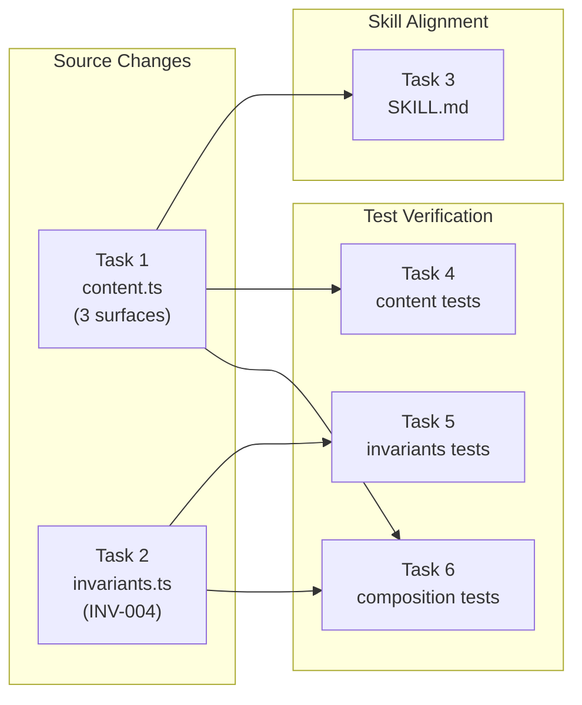

# Tasks: Strengthen Triage Before Modification

## Source

- Spec: `strengthen-triage-before-modification` spec artifact
- Design: `strengthen-triage-before-modification` design artifact
- Capabilities affected: `orchestrator-triage-gate`, `orchestrator-content-generation`

## Task Groups

### Group: Shared / Canonical Source

#### Task 1: Strengthen SDD Triage Gate in orchestrator-content.ts
**Owner**: General Apply
**Priority**: P0
**Complexity**: Medium
**Parallel**: Yes
**Depends on**: none

**Description**
Update the SDD Triage Gate section in all three exported strings (`ORCHESTRATOR_SYSTEM_PROMPT`, `ORCHESTRATOR_AGENT_BODY`, `ORCHESTRATOR_SKILL_BODY`) in `orchestrator-content.ts`. Replace existing triage gate prose with strengthened wording that: (a) prohibits modification or delegation before classification, (b) lists protected artifact types (code, configuration, prompts, OpenSpec artifacts, project files), (c) states mode question is only for Run SDD, (d) preserves existing category definitions and examples. Use identical key clauses across all three surfaces; surrounding examples may be surface-appropriate.

**Files**
- `packages/core/src/teams/developer/orchestrator-content.ts` — modify

**Verification**
- `bun test packages/core/src/teams/developer/orchestrator-content.test.ts`
- Manual diff: only Triage Gate sections changed; no collateral changes.

#### Task 2: Strengthen INV-004 in orchestrator-invariants.ts
**Owner**: General Apply
**Priority**: P0
**Complexity**: Low
**Parallel**: Yes
**Depends on**: none

**Description**
Update `INV_004_SDD_TRIAGE_GATE` in `orchestrator-invariants.ts` to expand the `condition` and `requiredAction` fields to include the prohibition on modification/delegation before classification, and the list of protected artifact types. Do not create a new invariant; strengthen the existing one.

**Files**
- `packages/core/src/teams/developer/orchestrator-invariants.ts` — modify

**Verification**
- `bun test packages/core/src/teams/developer/orchestrator-invariants.test.ts`
- Rendered invariant output contains "modify" and "delegate" in the gate.

### Group: Shared / Skill Alignment

#### Task 3: Align local SKILL.md with strengthened wording
**Owner**: General Apply
**Priority**: P0
**Complexity**: Low
**Parallel**: No — depends on Task 1 wording
**Depends on**: Task 1

**Description**
Update the Triage Gate section in `.opencode/skills/deck-developer-orchestrator/SKILL.md` to match the strengthened wording from Task 1. The key behavioral clauses (prohibition, categories, protected types, mode constraint) must be substantively identical to the content.ts surfaces. Do not bump `metadata.version`. Do not alter other sections.

**Files**
- `.opencode/skills/deck-developer-orchestrator/SKILL.md` — modify

**Verification**
- Manual diff: only Triage Gate section changed.
- Visual comparison with Task 1 wording: key clauses match.

### Group: Shared / Test Verification

#### Task 4: Update orchestrator-content.test.ts assertions
**Owner**: General Apply
**Priority**: P1
**Complexity**: Medium
**Parallel**: No — depends on Task 1
**Depends on**: Task 1

**Description**
Update or add assertions in `orchestrator-content.test.ts` to verify: (a) each surface contains "taking/delegating any step that may modify" or equivalent key clause, (b) each surface lists the four categories, (c) each surface states mode question is only for Run SDD, (d) each surface enumerates protected artifact types. Assert key clauses rather than full paragraphs to avoid brittleness.

**Files**
- `packages/core/src/teams/developer/orchestrator-content.test.ts` — modify

**Verification**
- `bun test packages/core/src/teams/developer/orchestrator-content.test.ts` — all pass.

#### Task 5: Update orchestrator-invariants tests
**Owner**: General Apply
**Priority**: P1
**Complexity**: Low
**Parallel**: No — depends on Task 2
**Depends on**: Task 2

**Description**
Update assertions in `orchestrator-invariants.test.ts` and `orchestrator-invariants.task2.test.ts` to verify INV-004's rendered condition/requiredAction contain the strengthened gate: modification/delegation prohibition and protected artifact types. Adjust only where existing assertions test exact wording that changed.

**Files**
- `packages/core/src/teams/developer/orchestrator-invariants.test.ts` — modify
- `packages/core/src/teams/developer/orchestrator-invariants.task2.test.ts` — modify if needed

**Verification**
- `bun test packages/core/src/teams/developer/orchestrator-invariants.test.ts`
- `bun test packages/core/src/teams/developer/orchestrator-invariants.task2.test.ts` (if exists and was modified)

#### Task 6: Update composition and install tests
**Owner**: General Apply
**Priority**: P1
**Complexity**: Medium
**Parallel**: No — depends on Task 1, Task 2
**Depends on**: Task 1, Task 2

**Description**
Update assertions in `content-registry.test.ts`, `manifest.test.ts`, `packages/adapter-opencode/src/developer-team-install.test.ts`, and `packages/adapter-pi/src/developer-team-install.test.ts` only where existing tests assert exact triage gate wording that changed. Add targeted assertions that composed/installed outputs carry the strengthened key clauses. Do not add new test files; extend existing ones.

**Files**
- `packages/core/src/teams/developer/content-registry.test.ts` — modify if needed
- `packages/core/src/teams/developer/manifest.test.ts` — modify if needed
- `packages/adapter-opencode/src/developer-team-install.test.ts` — modify if needed
- `packages/adapter-pi/src/developer-team-install.test.ts` — modify if needed

**Verification**
- `bun test packages/core/src/teams/developer/content-registry.test.ts packages/core/src/teams/developer/manifest.test.ts`
- `bun test packages/adapter-opencode/src/developer-team-install.test.ts packages/adapter-pi/src/developer-team-install.test.ts`
- Full suite: `bun test` — all pass.

## Dependency Graph

```
Task 1 (content.ts) ──┬──→ Task 3 (SKILL.md)
                       ├──→ Task 4 (content tests)
                       └──→ Task 6 (composition tests)
Task 2 (invariants.ts) ──→ Task 5 (invariants tests)
                          ──→ Task 6 (composition tests)
```

## Parallelization Plan

| Phase | Tasks | Can Run in Parallel |
|---|---|---|
| Source | Task 1, Task 2 | Yes — independent files |
| Skill alignment | Task 3 | No — needs Task 1 wording |
| Tests | Task 4, Task 5 | Yes — independent test files, after their source deps |
| Composition tests | Task 6 | No — needs both Task 1 and Task 2 |

## Responsibility Contracts

| Contract / Boundary | Owner | Consumers | Notes |
|---|---|---|---|
| Strengthened triage gate wording | General Apply (Task 1) | Tasks 3, 4, 6 | Canonical source of truth for key clauses |
| INV-004 invariant metadata | General Apply (Task 2) | Tasks 5, 6 | Rendered into composed outputs via content-registry |
| Local skill alignment | General Apply (Task 3) | End users | Must match content.ts key clauses |

## Complexity Summary

| Complexity | Count | Task Numbers |
|---|---|---|
| Low | 3 | 2, 3, 5 |
| Medium | 3 | 1, 4, 6 |
| High | 0 | — |

## Flagged for Splitting

None — all tasks are scoped for one session.

## Review Workload Forecast

| Signal | Value |
|---|---|
| Estimated changed lines | 100-400 |
| 400-line budget risk | Low |
| Scope reduction recommended | No |
| Sequential work slices recommended | No |
| Decision needed before Apply | No |

**Rationale**: The change is surgical prompt/invariant text updates across ~3 source files plus targeted test assertion updates. The design is well-scoped; no architectural uncertainty. Each task is contained to 1-4 files. Total changed lines should stay under 400. No decisions pending.

## Open Questions / Blockers

- **Wording specificity (allowed-with-placeholder)**: Design recommends "identical key clauses, surface-appropriate surrounding examples." Implementer should use identical prohibition/category/type clauses across surfaces but may adapt surrounding context/examples per surface convention. Does not block implementation.
- No blockers — all tasks are ready for Apply.

## Mermaid Summary Source


