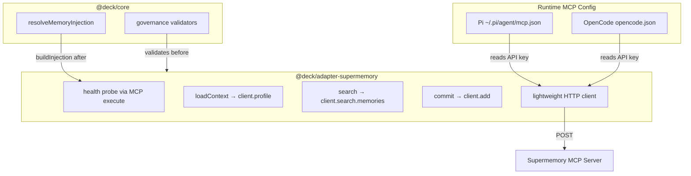

# Proposal: Real Supermemory MCP Integration for Adaptive Memory

## Intent

The `@deck/adapter-supermemory` package is currently a stub that returns empty results for `loadContext` and `search`, discards all `commit` candidates, and reports `degraded` health because `authenticatedRuntimeValidated` is a static boolean. The PRD requires a real integration that loads profiles, searches memories, and commits learnings by calling the Supermemory MCP server (`https://supermemory-new.stlmcp.com`). Without real integration, the adaptive memory system cannot provide cross-device continuity, user preference recall, or project heuristics — core value propositions of the Supermemory provider.

## Goal

Make `@deck/adapter-supermemory` a fully functional adaptive memory provider that performs real HTTP calls to the Supermemory MCP endpoint, while preserving the existing governance layer, container tag scoping, fail-open semantics, and runtime-agnostic design.

## Scope

### In Scope
- Implement real `loadContext`, `search`, `commit`, and `health` methods in `packages/adapter-supermemory/src/index.ts`
- Add a lightweight internal HTTP client to call the Supermemory MCP `execute` and `search_docs` tools
- Resolve Supermemory API credentials from the runtime-specific MCP config file (Pi `~/.pi/agent/mcp.json` or OpenCode `opencode.json`)
- Replace the static `authenticatedRuntimeValidated` boolean with a real read-only health probe against the Supermemory endpoint
- Map internal `AdaptiveMemoryContextRequest` / `AdaptiveMemorySearchRequest` / `AdaptiveMemoryCommitRequest` types to Supermemory SDK operations (`client.profile`, `client.search.memories`, `client.add`, etc.)
- Translate container tags (`u:{userId}`, `p:{projectId}`, etc.) into Supermemory scope filters
- Maintain fail-open behavior: adapter errors must not block OpenSpec or main agent flow
- Update unit tests to verify real integration paths with mocked HTTP/MCP responses
- Update the instruction bundle (`adaptive-memory.ts`) only if new operational constraints are discovered

### Out of Scope
- Modifying Pi or OpenCode MCP config write/validation logic (those adapters already handle credential persistence correctly)
- Building a UI or CLI command for reviewing, promoting, or rejecting `candidate` team memories
- Migrating existing Engram memories into Supermemory
- Adding a full MCP SDK dependency (the adapter only needs two tools; a minimal HTTP POST client is preferred)
- Changes to the adaptive memory governance rules (validation stays in `adaptive-memory-governance.ts`)
- Storing credentials in `.deck/config.json` (tokens remain in runtime MCP config files only)

## Affected Capabilities

### New Capabilities
- `supermemory-mcp-execute-client`: Lightweight internal HTTP client that posts JSON-RPC/tool-call payloads to the Supermemory MCP endpoint.

### Modified Capabilities
- `adaptive-memory-provider-supermemory`: Changes from a pass-through stub to an active caller. The provider now performs real I/O, emits real results, and validates credentials at runtime rather than relying on a config flag.

### Unchanged Capabilities
- `adaptive-memory-governance`: Governance validators (`validateAdaptiveMemoryCommitRequest`, `validateContainerTag`, etc.) remain the source of truth for commit/search validation. The adapter consumes them but does not modify them.
- `adaptive-memory-composition`: `resolveMemoryInjection` and `composeAdaptiveMemory` in `@deck/core` remain provider-neutral; they already support any provider that implements `AdaptiveMemoryProvider`.
- `pi-mcp-config` / `opencode-mcp-config`: Runtime-specific credential management and config validation stay unchanged. The adapter will read from the same files.

## Approach

1. **Credential Resolution**: Extend `SupermemoryMemoryProviderConfig` with an optional `getApiKey?: () => Promise<string | undefined>` or similar credential resolver. At instantiation, the adapter attempts to read the Pi or OpenCode MCP config file (based on an optional `runtimeHint` or by probing standard paths) to extract the `x-supermemory-api-key` header value. If no credential is found, the adapter still instantiates but remains in `degraded` mode and all operations fail open with diagnostics.

2. **HTTP Transport Layer**: Implement a small internal `SupermemoryMcpClient` class in `packages/adapter-supermemory/src/mcp-client.ts` that:
   - Sends JSON POST requests to `https://supermemory-new.stlmcp.com`
   - Includes the `x-supermemory-api-key` header
   - Calls the `execute` tool with structured payloads like `{ method: "client.search.memories", params: { query, containerTags, filters } }`
   - Calls `search_docs` only when SDK documentation lookup is needed (likely unused in the adapter itself, but reserved)
   - Handles HTTP errors, timeouts, and malformed responses gracefully

3. **Adapter Method Implementation**:
   - `health()`: Perform a lightweight read-only probe via `execute` (e.g., `client.profile` or a minimal search). On success, set internal `authenticatedRuntimeValidated = true` and return `status: "available"`. On failure, return `degraded` with a recoverable diagnostic.
   - `loadContext(request)`: After governance validation, call `execute` with `client.profile` or container-scoped context retrieval. Transform Supermemory response items into `AdaptiveMemoryContextItem[]` with proper metadata.
   - `search(request)`: After governance validation, call `execute` with `client.search.memories`, passing the query, derived container tags from `request.scopes`, and metadata filters. Transform results into `AdaptiveMemorySearchResult`.
   - `commit(request)`: After governance validation, iterate over candidates. For each accepted candidate, call `execute` with `client.add` (or `client.memories.updateMemory` if an ID exists). Return `AdaptiveMemoryCommitResult` with per-candidate decisions and diagnostics. Continue processing remaining candidates even if one MCP call fails.

4. **Container Tag Mapping**: Reuse existing helper functions (`personalContainer`, `validatedContainer`) to map `AdaptiveMemoryScopeRef` entries to Supermemory container tags. The mapping logic stays in the adapter; the core contract remains provider-neutral.

5. **Fail-Open and Diagnostics**: Every MCP call is wrapped in try/catch. On any error, the adapter returns an empty `items` array (or `savedCount: 0`) plus a recoverable `AdaptiveMemoryDiagnostic` with code `ADAPTIVE_MEMORY_PROVIDER_UNAVAILABLE`. The runner and instruction bundle already state that memory must never block agent work.

6. **buildInjection**: Once `health()` succeeds and `authenticatedRuntimeValidated` is true, `buildInjection` continues to emit the same `execute`/`search_docs` tool bindings and instruction fragments it does today. No change to the injection contract is required.

## Alternatives and Tradeoffs

| Alternative | Why Considered | Why Not Chosen |
|---|---|---|
| Add `@modelcontextprotocol/sdk` as a dependency | Full protocol compliance, automatic tool discovery, stdio/HTTP transport abstraction | Adds significant dependency weight for only two tools (`execute`, `search_docs`). The Supermemory endpoint is a single HTTP URL with a simple JSON payload shape. A minimal custom client keeps the adapter lightweight and avoids MCP SDK version churn. |
| Keep the stub and let Pi/OpenCode runtime make all MCP calls | Zero adapter complexity, matches current design | The PRD explicitly requires the adapter to encapsulate operations behind the common contract (FR2). Relying on the runtime means `loadContext`/`search`/`commit` cannot be used programmatically by other runners or test harnesses. It also prevents real health probes in the adapter. |
| Store API key directly in `.deck/config.json` | Simpler credential access for the adapter | Violates the explicit security requirement that tokens must be handed off through MCP config, not Deck config. The Pi and OpenCode adapters already enforce this separation. |
| Use a separate credential-provider package | Cleaner separation between runtime config and adapter | Over-engineering for a single provider. The adapter can read standard MCP config paths directly; if a second provider needs similar logic, we can extract a shared module later. |

## Risks

| Risk | Likelihood | Mitigation |
|---|---|---|
| Supermemory cloud endpoint unavailable or slow | Medium | All calls are wrapped with timeouts and fail open. Health probe failures degrade the adapter but do not block the runner. |
| MCP protocol or payload shape changes on Supermemory side | Low/Medium | Isolate HTTP transport and payload serialization in `mcp-client.ts`. Changes are localized. Add a version-check or health probe that validates expected response structure. |
| Credential file path differences between Pi, OpenCode, and future runtimes | Medium | Support a `credentialSource` hint in config and fallback to probing standard paths. If no credential is found, degrade gracefully rather than crash. |
| Latency in `loadContext`/`search` delays prompt assembly | Medium | Use aggressive timeouts (e.g., 3–5s) for adaptive memory calls. The instruction bundle already says memory is advisory and non-blocking. |
| Sensitive content leakage to Supermemory cloud | Low | The existing governance layer (`validateForbiddenMemoryContent`, metadata requirements) runs before any MCP call. The adapter only sends candidates that passed validation. |
| Team-scope memory committed without `candidate` status | Low | Governance validator `validateTeamCandidatePromotion` already enforces this. The adapter must not bypass it. |

## Rollback Plan

1. If the new adapter causes failures in health checks, prompt assembly, or commit operations, revert `packages/adapter-supermemory/src/index.ts` to the previous stub implementation.
2. The stub safely returns empty results and diagnostics, which the runner already treats as non-blocking.
3. To force fallback without a code revert, set `authenticatedRuntimeValidated: false` in the provider config; `buildInjection` will throw, causing the runner to skip adaptive memory injection entirely.
4. Tests for the stub behavior are already in `packages/adapter-supermemory/src/index.test.ts`; preserving or tagging them as regression tests ensures rollback validation.

## Dependencies

- The Pi (`adapter-pi`) and OpenCode (`adapter-opencode`) MCP config files must exist and contain a valid `x-supermemory-api-key` header for the adapter to reach `available` status. These files are managed by the respective runtime adapters and are not modified by this change.
- No new npm dependencies are strictly required if we use the built-in `fetch` API (Node 18+ / Bun). If the project targets Node 16, a polyfill or lightweight HTTP client (e.g., `undici`) would be needed.

## Open Questions

1. Does the Supermemory `execute` tool accept raw JSON-RPC, or does it use a custom payload envelope? The exact POST body shape and response format need to be confirmed against the live endpoint or documentation before finalizing the HTTP client.
2. Should the adapter cache the API key in memory after the first read, or re-read the MCP config file on every operation? Credential rotation vs. file I/O cost needs a design decision.
3. Are there existing Supermemory SDK method names beyond `client.profile`, `client.search.memories`, `client.add`, and `client.memories.updateMemory` that we should map? The exact method catalog needs verification.
4. Should `health()` cache its result for a short TTL (e.g., 30s) to avoid hammering the endpoint on every prompt assembly, or should it probe every time?

## Acceptance Direction

- [ ] `health()` returns `available` when the Supermemory endpoint is reachable and credentials are valid.
- [ ] `health()` returns `degraded` with a recoverable diagnostic when credentials are missing or the endpoint is unreachable.
- [ ] `loadContext` returns real `AdaptiveMemoryContextItem` objects (not an empty array) when the endpoint returns profile/context data.
- [ ] `search` returns real results mapped from `client.search.memories` responses.
- [ ] `commit` sends accepted candidates to Supermemory via `client.add` and returns `savedCount > 0` for valid, high-signal candidates.
- [ ] Forbidden content, invalid metadata, or scope mismatches are rejected by governance before any MCP call is attempted.
- [ ] All MCP failures are caught and surfaced as recoverable diagnostics; the runner/agent flow is never blocked.
- [ ] Unit tests cover: successful health probe, failed health probe, successful search, successful commit, commit rejection by governance, and HTTP timeout handling.
- [ ] No credentials are stored in `.deck/config.json`; tokens continue to live in Pi/OpenCode MCP config only.

## Next Steps

Ready for Spec (`deck-developer-spec`) and Design (`deck-developer-design`) in parallel.

## Mermaid Summary Source

