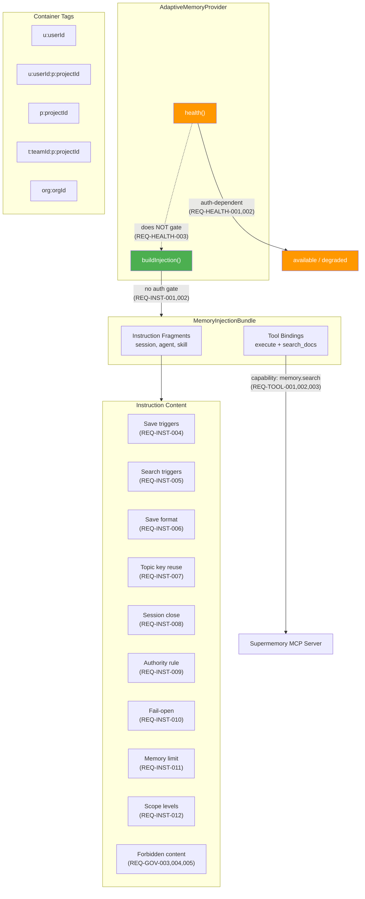

# Spec: Supermemory MCP Integration Fix

## Source

- Proposal: supermemory-mcp-integration (proposal phase completed with revision note)
- PRD: `docs/prd-supermemory-mcp-adaptive-memory.md`
- Current implementation: `packages/adapter-supermemory/src/index.ts`
- Capabilities affected: instruction generation, tool binding, health probe, container tag scoping, governance

## Correct Model

The adapter `@deck/adapter-supermemory` generates instruction content (markdown) that tells agents HOW/WHEN/WHY to use Supermemory MCP tools. The agent makes MCP calls directly to the Supermemory server based on injected instructions. The adapter does **NOT** make HTTP calls itself.

## Requirements

### Capability: Instruction Generation (FR1)

REQ-INST-001: `buildInjection()` MUST return a `MemoryInjectionBundle` containing instruction fragments and tool bindings regardless of the value of `authenticatedRuntimeValidated`.
  Priority: MUST
  Surface: Integration
  Rationale: Instruction generation is a static content operation — it produces markdown guidance for the agent. It does not contact any external service and therefore must not depend on runtime auth validation.

REQ-INST-002: `buildInjection()` MUST NOT throw an error when `authenticatedRuntimeValidated` is `false` or `undefined`.
  Priority: MUST
  Surface: Integration
  Rationale: The current implementation throws on line 99-101 of `index.ts`, which causes `resolveMemoryInjection()` in core to catch the error and produce a `memory_provider_unavailable` diagnostic — blocking the entire memory injection pipeline even though the content could be generated.

REQ-INST-003: `buildInjection()` MUST emit instruction fragments for all three surfaces: `session`, `agent`, and `skill`.
  Priority: MUST
  Surface: Integration
  Rationale: All three surfaces must receive the same adaptive memory guidance so behavior is consistent regardless of which composition context is used.

### Capability: Instruction Content (FR2)

REQ-INST-004: The generated markdown fragments MUST contain guidance on when to save to Supermemory, including at minimum: proactive save triggers (architecture decisions, bug fixes with root cause, non-obvious discoveries, configuration changes, established patterns, user preferences, gotchas/edge cases).
  Priority: MUST
  Surface: Data
  Rationale: Without explicit save triggers, agents will not know when to proactively persist learnings.

REQ-INST-005: The generated markdown fragments MUST contain guidance on when to search Supermemory, including at minimum: reactive triggers (user says "remember", "recall", "what did we do") and proactive triggers (starting work that may overlap with past sessions).
  Priority: MUST
  Surface: Data
  Rationale: Without explicit search triggers, agents will only search when explicitly asked and miss proactive context recovery opportunities.

REQ-INST-006: The generated markdown fragments MUST specify the save format: What (one sentence), Why (motivation), Where (file paths affected), Learned (gotchas/edge cases).
  Priority: MUST
  Surface: Data
  Rationale: Structured save format ensures memories are useful and searchable rather than unstructured noise.

REQ-INST-007: The generated markdown fragments MUST specify topic key reuse rules: same topic key updates a single memory instead of creating duplicates; different topics must never overwrite each other.
  Priority: MUST
  Surface: Data
  Rationale: Without key reuse rules, agents create duplicate memories on the same topic across sessions.

REQ-INST-008: The generated markdown fragments MUST specify session close summary requirements: Goal, Instructions (user preferences/constraints), Discoveries (technical findings/gotchas), Accomplished (completed items), Next Steps (remaining work), Relevant Files (paths and purpose).
  Priority: SHOULD
  Surface: Data
  Rationale: Session summaries provide the highest-value cross-session context but may not apply to all adapter use patterns.

REQ-INST-009: The generated markdown fragments MUST declare the authority rule: OpenSpec artifacts and Spec Registry entries are always authoritative; adaptive memory is advisory and must never override specs, requirements, designs, tasks, or approved change history.
  Priority: MUST
  Surface: Security
  Rationale: This is the core governance principle from the PRD — "OpenSpec manda. Supermemory aconseja."

REQ-INST-010: The generated markdown fragments MUST declare fail-open behavior: if Supermemory is unavailable, tools are missing, or operations error, agents must continue working normally and never block agent work or surface errors to the user for memory issues.
  Priority: MUST
  Surface: Integration
  Rationale: Memory is advisory — it must never block the primary workflow.

REQ-INST-011: The generated markdown fragments MUST specify a soft maximum of 7 memories per session and prefer fewer high-quality observations over many low-value ones.
  Priority: SHOULD
  Surface: Data
  Rationale: Controls noise; the current implementation already emits this value but the spec makes it a formal requirement.

REQ-INST-012: The generated markdown fragments MUST specify the four scope levels: `personal` (individual preferences), `project` (project-specific decisions), `team` (shared team decisions), `org` (organization-wide patterns).
  Priority: MUST
  Surface: Data
  Rationale: Scope awareness is essential for correct container tag selection and authority levels.

### Capability: Tool Bindings (FR3)

REQ-TOOL-001: The tool bindings in the returned `MemoryInjectionBundle` MUST expose tool names `execute` and `search_docs` from the Supermemory MCP server.
  Priority: MUST
  Surface: Integration
  Rationale: These are the only two validated MCP tools the agent should use to interact with Supermemory.

REQ-TOOL-002: The tool binding `capability` field MUST be `memory.search`.
  Priority: MUST
  Surface: Integration
  Rationale: Matches the `MemoryCapability` type used by the composition pipeline.

REQ-TOOL-003: The tool binding `serverName` MUST match the configured `mcpServerName` (default: `"supermemory"`).
  Priority: MUST
  Surface: Integration
  Rationale: The composition pipeline routes tool calls by server name.

REQ-TOOL-004: The tool binding metadata MUST include `endpoint`, `requiresAuthenticatedExecuteProbe`, and `serverQualifiedToolNamesRequired` fields.
  Priority: SHOULD
  Surface: Integration
  Rationale: These metadata fields inform the runtime about tool routing requirements, but the exact metadata shape may evolve.

REQ-TOOL-005: The tool binding metadata MUST reflect the actual `authenticatedRuntimeValidated` state (true or false) at the time of generation, not hardcoded to `true`.
  Priority: MUST
  Surface: Integration
  Rationale: Currently line 102 hardcodes `authenticatedRuntimeValidated: true` in metadata even when the actual value is `false`. The metadata must be truthful so downstream consumers know the auth state.

### Capability: Health Probe (FR4)

REQ-HEALTH-001: `health()` MUST return `"available"` when `authenticatedRuntimeValidated` is `true`.
  Priority: MUST
  Surface: Integration
  Rationale: Authenticated state indicates the Supermemory MCP server is reachable and validated.

REQ-HEALTH-002: `health()` MUST return `"degraded"` when `authenticatedRuntimeValidated` is `false` or `undefined`.
  Priority: MUST
  Surface: Integration
  Rationale: Without auth validation, the health probe cannot confirm server reachability, so it reports degraded rather than unavailable (instruction content is still generated).

REQ-HEALTH-003: The health status MUST NOT gate `buildInjection()` — instruction generation must succeed regardless of health status.
  Priority: MUST
  Surface: Integration
  Rationale: This is the core fix. Health and content generation are independent concerns.

REQ-HEALTH-004: When returning `"degraded"`, `health()` MUST include a diagnostic explaining that the Supermemory MCP server requires authenticated runtime validation before full availability.
  Priority: SHOULD
  Surface: Integration
  Rationale: Helps operators diagnose why health is degraded.

### Capability: Container Tag Scoping (FR5)

REQ-SCOPE-001: The adapter MUST generate and validate container tags using the following format:
  - Personal global: `u:{userId}`
  - Personal per-project: `u:{userId}:p:{projectId}` (when `projectId` is provided, derived from repository name)
  - Project: `p:{projectId}` (when `projectId` is provided, derived from repository name)
  - Team per-project: `t:{teamId}:p:{projectId}` (when both `teamId` and `projectId` are provided)
  - Organization: `org:{orgId}` (when `orgId` is provided)
  Priority: MUST
  Surface: Data
  Rationale: Container tag prefix for team is `t:` per user confirmation. projectId is sourced from the repository name; if the working directory is not a repository, no project-level container tags are generated.

REQ-SCOPE-002: The default personal container tag MUST be `u:{userId}` and MUST be validated at provider creation time.
  Priority: MUST
  Surface: Integration
  Rationale: Ensures early failure if `userId` is missing or produces an invalid container tag.

REQ-SCOPE-003: Container tags MUST comply with the governance validation rules: maximum 100 characters, allowed characters `A-Za-z0-9_:-`.
  Priority: MUST
  Surface: Security
  Rationale: Prevents injection or malformed tags from reaching the Supermemory API.

REQ-SCOPE-004: The instruction content MUST include the default personal container tag and any optional scoped containers applicable to the current configuration.
  Priority: MUST
  Surface: Data
  Rationale: Agents need to know which containers to target for reads and writes.

### Capability: Governance (FR6)

REQ-GOV-001: The adapter MUST validate container tags using `validateContainerTag` from the governance module at provider creation time.
  Priority: MUST
  Surface: Security
  Rationale: Catches invalid configuration early before any instructions are generated.

REQ-GOV-002: The adapter MUST validate commit candidates using `validateAdaptiveMemoryCommitRequest` before generating commit guidance.
  Priority: MUST
  Surface: Security
  Rationale: Ensures governance compliance even though the adapter delegates actual persistence to the agent.

REQ-GOV-003: The instruction content MUST instruct agents to reject forbidden content: secrets, credentials, raw chats, active specs/tasks, sensitive code, unapproved requirements, experimental deltas, and Engram migration payloads.
  Priority: MUST
  Surface: Security
  Rationale: Prevents sensitive data from being stored in Supermemory.

REQ-GOV-004: The instruction content MUST instruct agents that team-scoped writes must use `promotionStatus: "candidate"` unless an explicit future approval flow marks them approved.
  Priority: MUST
  Surface: Security
  Rationale: Prevents individual preferences from being promoted to team conventions without approval.

REQ-GOV-005: The instruction content MUST instruct agents not to call or reference provisional MCP tools named `context`, `recall`, or `memory` — only the validated `execute` and `search_docs` tools.
  Priority: MUST
  Surface: Security
  Rationale: Prevents agents from using unvalidated tool endpoints that may have different behavior or security properties.

## Acceptance Scenarios

### Capability: Instruction Generation

#### Scenario: buildInjection succeeds without auth validation
**Given** a SupermemoryMemoryProviderConfig with `authenticatedRuntimeValidated` set to `false`
**When** `buildInjection()` is called
**Then** a `MemoryInjectionBundle` is returned containing non-empty instruction fragments and tool bindings
**And** no error is thrown
> Covers: REQ-INST-001, REQ-INST-002

#### Scenario: buildInjection succeeds without authenticatedRuntimeValidated field
**Given** a SupermemoryMemoryProviderConfig with no `authenticatedRuntimeValidated` field (undefined)
**When** `buildInjection()` is called
**Then** a `MemoryInjectionBundle` is returned containing non-empty instruction fragments and tool bindings
**And** no error is thrown
> Covers: REQ-INST-001, REQ-INST-002

#### Scenario: buildInjection succeeds with auth validation
**Given** a SupermemoryMemoryProviderConfig with `authenticatedRuntimeValidated` set to `true`
**When** `buildInjection()` is called
**Then** a `MemoryInjectionBundle` is returned containing non-empty instruction fragments and tool bindings
> Covers: REQ-INST-001

#### Scenario: Three surfaces receive instruction fragments
**Given** a valid SupermemoryMemoryProviderConfig
**When** `buildInjection()` is called
**Then** the returned instructions array contains exactly three fragments with surfaces `session`, `agent`, and `skill`
**And** each fragment's markdown is non-empty and identical in content
> Covers: REQ-INST-003

### Capability: Instruction Content

#### Scenario: Instruction content includes proactive save triggers
**Given** a valid SupermemoryMemoryProviderConfig
**When** `buildInjection()` is called
**Then** the instruction markdown contains guidance mentioning at least: architecture decisions, bug fixes, discoveries, patterns, preferences, and gotchas/edge cases as proactive save triggers
> Covers: REQ-INST-004

#### Scenario: Instruction content includes search triggers
**Given** a valid SupermemoryMemoryProviderConfig
**When** `buildInjection()` is called
**Then** the instruction markdown contains guidance mentioning reactive triggers (e.g., "remember", "recall") and proactive triggers (e.g., overlapping past sessions)
> Covers: REQ-INST-005

#### Scenario: Instruction content specifies save format
**Given** a valid SupermemoryMemoryProviderConfig
**When** `buildInjection()` is called
**Then** the instruction markdown specifies a structured save format with What, Why, Where, and Learned fields
> Covers: REQ-INST-006

#### Scenario: Instruction content specifies topic key reuse
**Given** a valid SupermemoryMemoryProviderConfig
**When** `buildInjection()` is called
**Then** the instruction markdown specifies that same topic keys update existing memories and different topics must not overwrite each other
> Covers: REQ-INST-007

#### Scenario: Instruction content includes session close summary requirements
**Given** a valid SupermemoryMemoryProviderConfig
**When** `buildInjection()` is called
**Then** the instruction markdown specifies session close summary fields: Goal, Instructions, Discoveries, Accomplished, Next Steps, Relevant Files
> Covers: REQ-INST-008

#### Scenario: Instruction content declares authority rule
**Given** a valid SupermemoryMemoryProviderConfig
**When** `buildInjection()` is called
**Then** the instruction markdown declares that OpenSpec is authoritative and adaptive memory is advisory
**And** specifies that memory must not override specs, requirements, designs, tasks, or approved change history
> Covers: REQ-INST-009

#### Scenario: Instruction content declares fail-open behavior
**Given** a valid SupermemoryMemoryProviderConfig
**When** `buildInjection()` is called
**Then** the instruction markdown declares that agents must continue working normally if Supermemory is unavailable
**And** specifies that memory errors must not be surfaced to the user or block agent work
> Covers: REQ-INST-010

#### Scenario: Instruction content specifies session memory limit
**Given** a valid SupermemoryMemoryProviderConfig with default `maxMemoriesPerSession` (7)
**When** `buildInjection()` is called
**Then** the instruction markdown mentions a soft maximum of 7 memories per session with preference for quality over quantity
> Covers: REQ-INST-011

#### Scenario: Instruction content specifies scope levels
**Given** a valid SupermemoryMemoryProviderConfig
**When** `buildInjection()` is called
**Then** the instruction markdown describes the four scope levels: personal, project, team, org
> Covers: REQ-INST-012

### Capability: Tool Bindings

#### Scenario: Tool bindings expose execute and search_docs
**Given** a valid SupermemoryMemoryProviderConfig
**When** `buildInjection()` is called
**Then** the returned tool bindings contain exactly one binding with toolNames `["execute", "search_docs"]`
> Covers: REQ-TOOL-001

#### Scenario: Tool binding uses memory.search capability
**Given** a valid SupermemoryMemoryProviderConfig
**When** `buildInjection()` is called
**Then** the tool binding capability is `"memory.search"`
> Covers: REQ-TOOL-002

#### Scenario: Tool binding uses configured server name
**Given** a SupermemoryMemoryProviderConfig with `mcpServerName` set to `"custom-server"`
**When** `buildInjection()` is called
**Then** the tool binding `serverName` is `"custom-server"`
> Covers: REQ-TOOL-003

#### Scenario: Tool binding uses default server name
**Given** a SupermemoryMemoryProviderConfig with no `mcpServerName` specified
**When** `buildInjection()` is called
**Then** the tool binding `serverName` is `"supermemory"`
> Covers: REQ-TOOL-003

#### Scenario: Tool binding metadata reflects actual auth state when false
**Given** a SupermemoryMemoryProviderConfig with `authenticatedRuntimeValidated` set to `false`
**When** `buildInjection()` is called
**Then** the tool binding metadata includes `authenticatedRuntimeValidated: false`
> Covers: REQ-TOOL-005

#### Scenario: Tool binding metadata reflects actual auth state when true
**Given** a SupermemoryMemoryProviderConfig with `authenticatedRuntimeValidated` set to `true`
**When** `buildInjection()` is called
**Then** the tool binding metadata includes `authenticatedRuntimeValidated: true`
> Covers: REQ-TOOL-005

### Capability: Health Probe

#### Scenario: Health returns available when authenticated
**Given** a SupermemoryMemoryProviderConfig with `authenticatedRuntimeValidated` set to `true`
**When** `health()` is called
**Then** the result status is `"available"`
**And** the diagnostics array is empty
> Covers: REQ-HEALTH-001

#### Scenario: Health returns degraded when not authenticated
**Given** a SupermemoryMemoryProviderConfig with `authenticatedRuntimeValidated` set to `false`
**When** `health()` is called
**Then** the result status is `"degraded"`
**And** the diagnostics array contains at least one entry explaining the auth validation requirement
> Covers: REQ-HEALTH-002, REQ-HEALTH-004

#### Scenario: Health does not gate buildInjection
**Given** a SupermemoryMemoryProviderConfig with `authenticatedRuntimeValidated` set to `false`
**And** `health()` returns status `"degraded"`
**When** `buildInjection()` is called
**Then** a valid `MemoryInjectionBundle` is returned without error
> Covers: REQ-HEALTH-003

### Capability: Container Tag Scoping

#### Scenario: Personal container tag is generated correctly
**Given** a SupermemoryMemoryProviderConfig with `userId` set to `"user123"`
**When** `buildInjection()` is called
**Then** the instruction markdown references default container tag `u:user123`
> Covers: REQ-SCOPE-001, REQ-SCOPE-002

#### Scenario: Team container tag uses correct prefix
**Given** a SupermemoryMemoryProviderConfig with `teamId` set to `"teamA"`
**When** the adapter processes the configuration
**Then** the team container tag uses prefix `t:`
> Covers: REQ-SCOPE-001

#### Scenario: Invalid userId fails at provider creation
**Given** a SupermemoryMemoryProviderConfig with `userId` set to empty string
**When** `createSupermemoryMemoryProvider(config)` is called
**Then** an error is thrown indicating that userId is required
> Covers: REQ-SCOPE-002

#### Scenario: Container tag with invalid characters fails validation
**Given** a SupermemoryMemoryProviderConfig with `userId` containing characters outside `A-Za-z0-9_:-`
**When** `createSupermemoryMemoryProvider(config)` is called
**Then** an error is thrown indicating the container tag is invalid
> Covers: REQ-SCOPE-003

#### Scenario: Instruction content references configured containers
**Given** a SupermemoryMemoryProviderConfig with `userId` set to `"user1"` and `teamId` set to `"team1"`
**When** `buildInjection()` is called
**Then** the instruction markdown mentions the personal container tag `u:user1`
**And** mentions the team container in optional scoped containers
> Covers: REQ-SCOPE-004

### Capability: Governance

#### Scenario: Invalid container tag rejected at creation
**Given** a SupermemoryMemoryProviderConfig with `teamId` set to a value that would produce a container tag exceeding 100 characters
**When** `createSupermemoryMemoryProvider(config)` is called
**Then** an error is thrown from container tag validation
> Covers: REQ-GOV-001

#### Scenario: Commit validation runs before guidance
**Given** a commit request with candidates that contain forbidden content patterns
**When** `commit()` is called on the adapter
**Then** the result has `savedCount: 0` and `discardedCount` equals the number of candidates
**And** each decision includes a reason referencing governance rejection
> Covers: REQ-GOV-002

#### Scenario: Instruction content forbids secrets and sensitive data
**Given** a valid SupermemoryMemoryProviderConfig
**When** `buildInjection()` is called
**Then** the instruction markdown explicitly lists forbidden content: secrets, credentials, raw chats, active specs/tasks, sensitive code, unapproved requirements, experimental deltas
> Covers: REQ-GOV-003

#### Scenario: Instruction content requires team candidate status
**Given** a valid SupermemoryMemoryProviderConfig
**When** `buildInjection()` is called
**Then** the instruction markdown specifies that team-scoped writes must use `candidate` promotion status
> Covers: REQ-GOV-004

#### Scenario: Instruction content rejects provisional tools
**Given** a valid SupermemoryMemoryProviderConfig
**When** `buildInjection()` is called
**Then** the instruction markdown instructs agents not to call tools named `context`, `recall`, or `memory`
**And** instructs agents to use only `execute` and `search_docs`
> Covers: REQ-GOV-005

## Validation Rules

| Field / Input | Rule | Error Message | REQ-ID |
|---|---|---|---|
| `config.userId` | Must be non-empty after trim | "Supermemory userId is required." | REQ-SCOPE-002 |
| `config.mcpServerName` | Default to `"supermemory"` if empty/undefined | N/A (normalization) | REQ-TOOL-003 |
| `config.maxMemoriesPerSession` | Default to `7` if undefined | N/A (normalization) | REQ-INST-011 |
| Container tag `u:{userId}` | Must pass `validateContainerTag` | Governance validation error | REQ-SCOPE-002, REQ-SCOPE-003 |
| Container tag `team:{teamId}` | Must pass `validateContainerTag` if `teamId` provided | Governance validation error | REQ-GOV-001 |
| Container tag `org:{orgId}` | Must pass `validateContainerTag` if `orgId` provided | Governance validation error | REQ-GOV-001 |
| Commit candidates | Must pass `validateAdaptiveMemoryCommitRequest` | Governance rejection | REQ-GOV-002 |

## Error Contracts

| Condition | Error Code | Message | Behavior |
|---|---|---|---|
| `userId` is empty/missing | Thrown Error | "Supermemory userId is required." | Provider creation fails |
| Container tag fails validation | Thrown Error | Governance validation messages joined | Provider creation fails |
| `buildInjection()` called without auth | N/A | N/A | Returns valid bundle (no error) |
| Commit candidates fail governance | `ADAPTIVE_MEMORY_GOVERNANCE_REJECTED` | "Supermemory commit candidates failed governance validation." | Returns result with `savedCount: 0` |
| Search/load context called | `ADAPTIVE_MEMORY_OPERATION_UNSUPPORTED` | "Runtime context/search is performed by Pi MCP tool bindings." | Returns empty items with diagnostic |
| Health called without auth | `ADAPTIVE_MEMORY_HEALTH_UNKNOWN` | "Supermemory requires authenticated runtime validation..." | Returns status `"degraded"` |

## States and Transitions

### Provider Auth State

| State | Description | Entry Criteria |
|---|---|---|
| `unvalidated` | Auth validation has not been performed or failed | `authenticatedRuntimeValidated` is `false` or `undefined` |
| `validated` | Auth validation has succeeded | `authenticatedRuntimeValidated` is `true` |

### Transitions

| From | To | Trigger | Side Effects |
|---|---|---|---|
| `unvalidated` | `validated` | External auth validation sets flag to `true` | Health returns `"available"`, metadata reflects true |
| `validated` | `unvalidated` | Config reload or session restart | Health returns `"degraded"`, metadata reflects false |

**Key invariant**: Instruction generation (buildInjection) is stateless with respect to auth state — it produces the same content quality regardless of auth validation.

## Open Questions

All resolved:
- **Container tag prefix for team**: `t:` (user confirmed)
- **projectId source**: repository name (user confirmed); if not a git repository, no project-level scoping
- **Instruction content language**: English only (user confirmed)

## Compliance Matrix

| REQ-ID | Scenario(s) | Status |
|---|---|---|
| REQ-INST-001 | buildInjection succeeds without auth validation, buildInjection succeeds without field, buildInjection succeeds with auth | Defined |
| REQ-INST-002 | buildInjection succeeds without auth validation, buildInjection succeeds without field | Defined |
| REQ-INST-003 | Three surfaces receive instruction fragments | Defined |
| REQ-INST-004 | Instruction content includes proactive save triggers | Defined |
| REQ-INST-005 | Instruction content includes search triggers | Defined |
| REQ-INST-006 | Instruction content specifies save format | Defined |
| REQ-INST-007 | Instruction content specifies topic key reuse | Defined |
| REQ-INST-008 | Instruction content includes session close summary requirements | Defined |
| REQ-INST-009 | Instruction content declares authority rule | Defined |
| REQ-INST-010 | Instruction content declares fail-open behavior | Defined |
| REQ-INST-011 | Instruction content specifies session memory limit | Defined |
| REQ-INST-012 | Instruction content specifies scope levels | Defined |
| REQ-TOOL-001 | Tool bindings expose execute and search_docs | Defined |
| REQ-TOOL-002 | Tool binding uses memory.search capability | Defined |
| REQ-TOOL-003 | Tool binding uses configured server name, Tool binding uses default server name | Defined |
| REQ-TOOL-004 | Tool binding metadata reflects actual auth state when false, when true | Defined |
| REQ-TOOL-005 | Tool binding metadata reflects actual auth state when false, when true | Defined |
| REQ-HEALTH-001 | Health returns available when authenticated | Defined |
| REQ-HEALTH-002 | Health returns degraded when not authenticated | Defined |
| REQ-HEALTH-003 | Health does not gate buildInjection | Defined |
| REQ-HEALTH-004 | Health returns degraded when not authenticated | Defined |
| REQ-SCOPE-001 | Personal container tag, Team container tag | Defined |
| REQ-SCOPE-002 | Personal container tag, Invalid userId fails | Defined |
| REQ-SCOPE-003 | Container tag with invalid characters fails | Defined |
| REQ-SCOPE-004 | Instruction content references configured containers | Defined |
| REQ-GOV-001 | Invalid container tag rejected at creation | Defined |
| REQ-GOV-002 | Commit validation runs before guidance | Defined |
| REQ-GOV-003 | Instruction content forbids secrets and sensitive data | Defined |
| REQ-GOV-004 | Instruction content requires team candidate status | Defined |
| REQ-GOV-005 | Instruction content rejects provisional tools | Defined |

## Mermaid Summary Source

