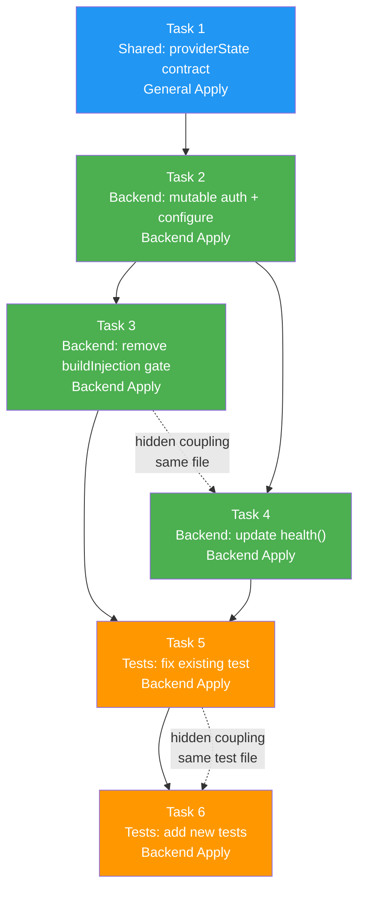

# Tasks: Fix Supermemory Adaptive Memory Adapter

## Source

- Spec: supermemory-mcp-integration spec artifact
- Design: supermemory-mcp-integration design artifact
- Capabilities affected: Instruction Generation (FR1), Tool Bindings (FR3), Health Probe (FR4)

## Task Groups

### Group: Shared / Contracts

#### Task 1: Extend AdaptiveMemoryConfigureRequest with providerState bag

**Owner**: General Apply
**Priority**: P0 (blocking)
**Complexity**: Low
**Parallel**: Yes
**Depends on**: none

**Description**
Add an optional `providerState?: Record<string, unknown>` field to `AdaptiveMemoryConfigureRequest` in the core contract. This is the extension point that allows the Supermemory adapter (and future adapters) to receive provider-specific state updates through the standard `configure()` interface without polluting the core type. No other types need changes — the field is purely additive and backward compatible.

**Files**
- `packages/core/src/memory/adaptive-memory-contract.ts` — modify (add field to `AdaptiveMemoryConfigureRequest` type, lines 157–164)

**Verification**
- TypeScript compiles without errors: `bunx tsc --noEmit` in `packages/core`
- Existing code that calls `configure()` without `providerState` still type-checks (backward compatible)

---

### Group: Backend

#### Task 2: Add mutable auth state and implement configure()

**Owner**: Backend Apply
**Priority**: P0 (blocking)
**Complexity**: Medium
**Parallel**: No — depends on Task 1
**Depends on**: Task 1

**Description**
Refactor the adapter closure in `packages/adapter-supermemory/src/index.ts` so that `authenticatedRuntimeValidated` is a mutable private field rather than a read-only config snapshot. In `createAdapter()`:
1. Initialize `let _authenticatedRuntimeValidated = config.authenticatedRuntimeValidated ?? false` at the top of the closure.
2. Implement `configure(request)` to read `request.providerState?.authenticatedRuntimeValidated` and update `_authenticatedRuntimeValidated` when the value is a boolean.
3. The config type `SupermemoryMemoryProviderConfig.authenticatedRuntimeValidated` remains as an initial value only — it seeds `_authenticatedRuntimeValidated` at creation time.

**Files**
- `packages/adapter-supermemory/src/index.ts` — modify (closure mutable field + `configure()` body)

**Verification**
- TypeScript compiles: `bunx tsc --noEmit` in `packages/adapter-supermemory`
- Manual check: `configure({ providerId: "supermemory", providerState: { authenticatedRuntimeValidated: true } })` is callable without error

---

#### Task 3: Remove auth gate from buildInjection and fix metadata

**Owner**: Backend Apply
**Priority**: P0 (blocking)
**Complexity**: Medium
**Parallel**: No — depends on Task 2 (same file, reads mutable field)
**Depends on**: Task 2

**Description**
In `packages/adapter-supermemory/src/index.ts`, inside `buildInjection()`:
1. **Remove the throw** on lines 99–101 that blocks execution when `!normalized.authenticatedRuntimeValidated`. The function must always return a valid `MemoryInjectionBundle` for any config that passed creation-time validation.
2. **Fix tool binding metadata** on line 102: change the hardcoded `authenticatedRuntimeValidated: true` to reflect the actual mutable closure value `_authenticatedRuntimeValidated` instead. This makes metadata truthful so downstream consumers (like `hasAuthenticatedSupermemoryToolBindings()`) see the real auth state.
3. The `createFragments()` call and all instruction content generation remain unchanged — they are already correct.
4. Add `serverQualifiedToolNames` to the metadata object: `[normalized.mcpServerName + ".execute", normalized.mcpServerName + ".search_docs"]` per the design data flow (section 2, step 2).

Note: `_authenticatedRuntimeValidated` must be accessible from `buildInjection()`. Since `createSupermemoryMemoryProvider` and `createAdapter` are separate closures, the mutable field should be declared in `createSupermemoryMemoryProvider` (which owns `buildInjection`) and shared with `createAdapter` via parameter or by restructuring to a single closure.

**Files**
- `packages/adapter-supermemory/src/index.ts` — modify (remove throw in `buildInjection`, fix metadata, restructure closure if needed)

**Verification**
- `createSupermemoryMemoryProvider({ userId: "test" }).buildInjection({})` returns a bundle without throwing (no `authenticatedRuntimeValidated` set)
- `createSupermemoryMemoryProvider({ userId: "test", authenticatedRuntimeValidated: false }).buildInjection({})` returns a bundle without throwing
- Returned bundle has non-empty `instructions` and `toolBindings`
- Tool binding metadata has `authenticatedRuntimeValidated: false` (not hardcoded `true`)
- Tool binding metadata includes `serverQualifiedToolNames` array

---

#### Task 4: Update health() to use mutable closure state

**Owner**: Backend Apply
**Priority**: P0 (blocking)
**Complexity**: Low
**Parallel**: No — depends on Task 2 (same file, reads same mutable field); hidden coupling with Task 3 (same file)
**Depends on**: Task 2

**Description**
In `createAdapter()` within `packages/adapter-supermemory/src/index.ts`, update the `health()` method (lines 80–83) to read from `_authenticatedRuntimeValidated` (the mutable closure field introduced in Task 2) instead of from the static `config.authenticatedRuntimeValidated`. The logic remains the same — `"available"` when true, `"degraded"` with diagnostic when false — but now reflects state updated via `configure()`.

**Files**
- `packages/adapter-supermemory/src/index.ts` — modify (health() body, lines 80–83)

**Verification**
- After `configure({ providerState: { authenticatedRuntimeValidated: true } })`, `health()` returns `{ status: "available" }` with empty diagnostics
- After creation without auth, `health()` returns `{ status: "degraded" }` with `ADAPTIVE_MEMORY_HEALTH_UNKNOWN` diagnostic
- After `configure({ providerState: { authenticatedRuntimeValidated: false } })`, `health()` returns `"degraded"` again

---

### Group: Tests

#### Task 5: Update existing failing test

**Owner**: Backend Apply
**Priority**: P0 (blocking)
**Complexity**: Low
**Parallel**: No — depends on Tasks 3 and 4
**Depends on**: Task 3, Task 4

**Description**
In `packages/adapter-supermemory/src/index.test.ts`, update the test "health and injection fail closed until authenticated runtime validation is known" (lines 32–38):
1. Change the name to reflect new behavior, e.g., "health returns degraded and injection succeeds when auth validation is not yet known".
2. Keep the `health()` assertions: `status: "degraded"`, diagnostic code `ADAPTIVE_MEMORY_HEALTH_UNKNOWN`.
3. **Replace** the `expect(...).toThrow(/authenticated runtime validation/)` assertion with an assertion that `buildInjection()` succeeds and returns a valid bundle (non-empty instructions, non-empty toolBindings).
4. Add assertion that the returned tool binding metadata has `authenticatedRuntimeValidated: false`.

**Files**
- `packages/adapter-supermemory/src/index.test.ts` — modify (lines 32–38)

**Verification**
- `bun test` in `packages/adapter-supermemory` passes with the updated test

---

#### Task 6: Add new unit tests for configure, buildInjection, and health

**Owner**: Backend Apply
**Priority**: P0 (blocking)
**Complexity**: Medium
**Parallel**: No — depends on Task 5 (same test file); hidden coupling with Task 5
**Depends on**: Task 5

**Description**
Add the following new tests to `packages/adapter-supermemory/src/index.test.ts`:

1. **"buildInjection succeeds without authenticatedRuntimeValidated"** — create provider with `{ userId: "test" }` (no auth field), call `buildInjection({})`, assert bundle has 3 instruction fragments (surfaces: session, agent, skill) and tool bindings with `authenticatedRuntimeValidated: false`.

2. **"buildInjection succeeds with authenticatedRuntimeValidated false"** — create provider with `{ userId: "test", authenticatedRuntimeValidated: false }`, call `buildInjection({})`, assert bundle returned without throw, tool binding metadata has `authenticatedRuntimeValidated: false`.

3. **"configure updates auth state and health reflects it"** — create provider without auth, assert `health()` is `"degraded"`, call `adapter.configure({ providerId: "supermemory", providerState: { authenticatedRuntimeValidated: true } })`, assert `health()` returns `"available"` with empty diagnostics.

4. **"tool binding metadata includes serverQualifiedToolNames"** — create provider, call `buildInjection({})`, assert metadata includes `serverQualifiedToolNames: ["supermemory.execute", "supermemory.search_docs"]`.

5. **"buildInjection with custom server name"** — create provider with `mcpServerName: "custom"`, call `buildInjection({})`, assert tool binding `serverName` is `"custom"` and `serverQualifiedToolNames` uses `"custom.execute"`, `"custom.search_docs"`.

**Files**
- `packages/adapter-supermemory/src/index.test.ts` — modify (append new tests)

**Verification**
- `bun test` in `packages/adapter-supermemory` — all tests pass
- Test count increases by at least 5 new tests

---

## Dependency Graph

```
Task 1 (Shared: providerState contract)
  → Task 2 (Backend: mutable auth state + configure)
    → Task 3 (Backend: remove buildInjection gate + fix metadata)
    → Task 4 (Backend: update health to use mutable state)
      → Task 5 (Tests: update existing failing test)
        → Task 6 (Tests: add new unit tests)
```

## Parallelization Plan

| Phase | Tasks | Can Run in Parallel |
|---|---|---|
| Shared / Contracts | Task 1 | Yes (independent of all others) |
| Backend — Foundation | Task 2 | No — depends on Task 1 |
| Backend — Gate Removal | Task 3 | No — depends on Task 2, hidden coupling with Task 4 (same file) |
| Backend — Health Update | Task 4 | No — depends on Task 2, hidden coupling with Task 3 (same file, same mutable field) |
| Tests — Fix Existing | Task 5 | No — depends on Tasks 3 and 4 |
| Tests — Add New | Task 6 | No — depends on Task 5 (same file) |

**Recommended execution**: Tasks 3 and 4 can be merged by a single Backend Apply session since they share the same file and mutable field. After Task 2, one agent can do Tasks 3+4 sequentially, then one agent does Tasks 5+6.

## Responsibility Contracts

| Contract / Boundary | Owner | Consumers | Notes |
|---|---|---|---|
| `AdaptiveMemoryConfigureRequest.providerState` | General Apply (Task 1) | Backend Apply (Task 2) | New optional field; backward compatible. Adapter reads `providerState.authenticatedRuntimeValidated` as boolean. |
| Mutable `_authenticatedRuntimeValidated` closure field | Backend Apply (Task 2) | Backend Apply (Tasks 3, 4) | Shared mutable state in adapter closure. Must be accessible from both `buildInjection` and `health`. |
| Tool binding metadata shape | Backend Apply (Task 3) | Downstream consumers (`hasAuthenticatedSupermemoryToolBindings`) | Adds `serverQualifiedToolNames`; `authenticatedRuntimeValidated` becomes dynamic. |

## Complexity Summary

| Complexity | Count | Task Numbers |
|---|---|---|
| Low | 3 | Task 1, Task 4, Task 5 |
| Medium | 3 | Task 2, Task 3, Task 6 |
| High | 0 | — |

## Flagged for Splitting

None — all tasks are scoped for a single session. Tasks 3+4 are recommended to be handled by one agent session due to hidden coupling (same file, same mutable field).

## Review Workload Forecast

| Signal | Value |
|---|---|
| Estimated changed lines | 100–400 |
| 400-line budget risk | Low |
| Scope reduction recommended | No |
| Sequential work slices recommended | Yes — Tasks 3+4 and Tasks 5+6 should each be done by a single agent session |
| Decision needed before Apply | No |

**Rationale**: Two files are modified in production code (~80 lines in `index.ts`, ~5 lines in `adaptive-memory-contract.ts`) plus ~100 lines of new/updated tests. Total changed lines estimated at 150–200. The 400-line budget is not at risk. The main risk is hidden coupling between Tasks 3 and 4 (same mutable field, same file), which is mitigated by recommending they be done sequentially by one agent.

## Open Questions / Blockers

- **Probe orchestrator responsibility** (from Design): Which runner component performs the initial MCP `execute` probe and calls `adapter.configure()` with the success result? This is outside adapter scope but required for end-to-end auth flow. **Classification**: non-blocking for adapter fix — the adapter correctly exposes `configure()` and `health()`; the orchestrator integration is a separate concern.

> No implementation-blocking questions remain for these tasks. Ready for Apply.

## Mermaid Summary Source


