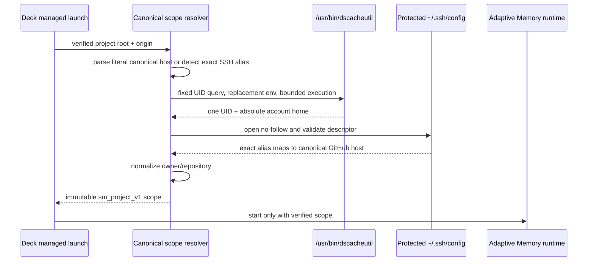

# Design: Support macOS SSH Alias Project Identity

## Decision

Extend `@deck/core`'s canonical project resolver with a Darwin-only trusted account-home strategy. Use `/usr/bin/dscacheutil -q user -a uid <effective-uid>` through a no-shell process API with a replacement locale-only environment, fixed working directory, and strict resource bounds. Parse and validate exactly one matching account record, then reuse the existing SSH configuration descriptor and parser unchanged.

The account utility is a narrow OS identity dependency, not repository identity authority. The verified Git top-level, canonical `origin`, exact protected SSH mapping, and owner/repository path remain the inputs that determine scope.

## Rationale

- `os.homedir()` and Bun's `os.userInfo().homedir` can reflect hostile startup environment values and are not trusted identity sources.
- macOS `/etc/passwd` is not the authoritative complete account database.
- Native FFI to `getpwuid_r` would add ABI, pointer-lifetime, loader, packaging, and cross-architecture risk.
- A fixed system account query can be constrained with an absolute path, executable validation, fixed arguments, replacement environment, timeout, and bounded output.

## Security boundary

Deck validates the effective UID once and binds it to:

1. the fixed account query,
2. the returned UID field,
3. the ownership check for the direct SSH configuration.

Before execution, the fixed utility path must resolve to a regular root-owned file that is not group/world writable. The child receives no inherited environment. The parser rejects invalid encoding, controls, duplicate records or fields, mismatched UID, non-absolute homes, and oversized or truncated output. The resolved home must canonicalize to an existing directory.

The existing SSH rules remain authoritative: direct `~/.ssh/config` only, `O_NOFOLLOW`, same validated descriptor, bounded size, effective-user ownership, no group/world write access, exact host block, one canonical `HostName`, and no unsupported or command-capable directives.

## Flow

Any failure returns unresolved identity; Deck does not call the memory provider and does not block the coding session.

## Compatibility

Linux retains its descriptor-validated `/etc/passwd` path. Literal `github.com` and `ssh.github.com` remotes retain their existing behavior. Non-Darwin/non-Linux aliases remain unsupported. No Git, SSH, runner, provider, or persisted configuration format changes.
